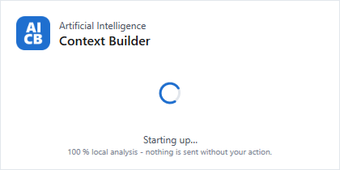
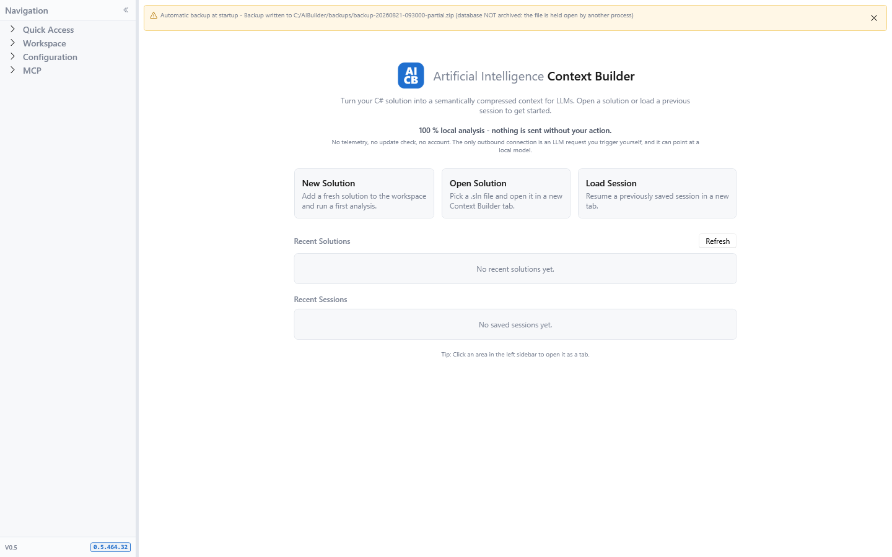
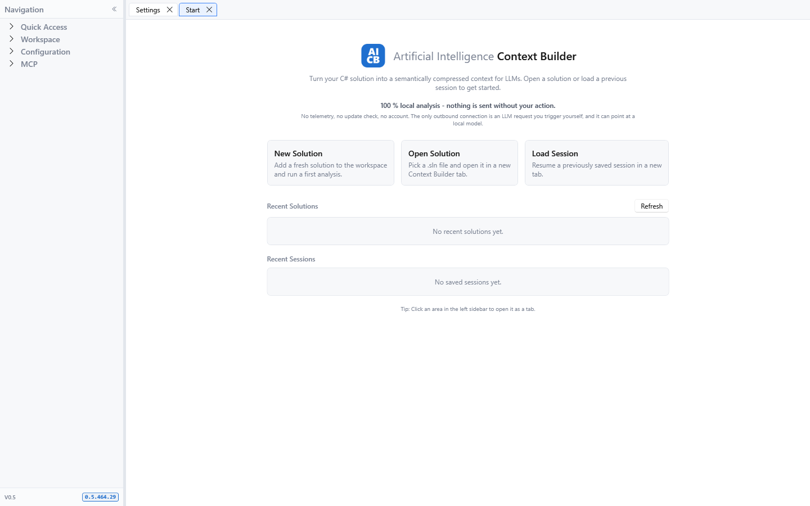
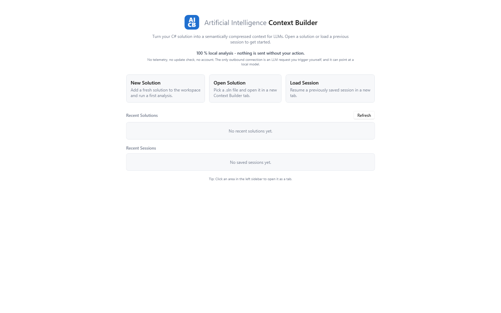

[AICB – Desktop Application](README.md) &middot; chapter 1 of 11

# 1 Startup, window and navigation

This chapter describes what happens when you start AICB, how the main window is built, how you move between its areas, and which keys are available everywhere. It also fixes the vocabulary this manual uses for the parts of the interface.

## 1.1 Starting AICB

### The splash window

As soon as you launch AICB, a small frameless window appears in the center of the screen while the application prepares itself. It shows the AICB logo, the product name in two tones, a turning ring and the line `Starting up…`, followed by the note `100 % local analysis - nothing is sent without your action.`

The splash runs on its own thread, so the ring keeps turning even while the main window is still being built. It closes as soon as the main window is shown. If startup fails, the splash closes too and AICB reports the problem.

Note: The splash follows the Windows system theme, read directly from Windows. If you have pinned AICB to the opposite theme of your Windows installation, the splash still appears in the system theme for the few seconds it is up; the main window then switches to the theme you chose.

### The startup sequence

AICB works through the following steps before you see the main window. Each of them can end the start:

| Step | What happens |
|---|---|
| 1 | The splash window appears. |
| 2 | AICB looks for an MSBuild installation (Visual Studio, `vswhere.exe` or a .NET SDK). Without one, no C# solution can be loaded: the dialog `MSBuild not found` appears and the application exits. |
| 3 | The application settings file is read. If it cannot be read, AICB continues on defaults and reports this in the startup notice line. |
| 4 | The database schema is checked and, if necessary, migrated. A database written by a newer AICB version or a failed migration stops the start (see the table below). |
| 5 | Runs that were still marked as running when the previous session ended are offered for recovery. |
| 6 | An automatic backup is written if one is due. |
| 7 | The shell is initialized. On a large database this is the step that takes most of the startup time. |
| 8 | Your theme, font size and UI zoom are applied. |
| 9 | The main window appears, and the splash closes. |

The startup time depends mainly on the size of your database. The splash makes the wait visible, but it does not shorten it.

Note: If automatic backup is enabled and the backup interval has elapsed, AICB writes the backup during startup, before any window is visible. Startup stalls for the duration of that archive. A backup that fails does not advance the last-run time, so the stall repeats on every start until the cause is fixed; the startup notice line reports it.

### Messages during startup

| Message | When it appears | What you can do |
|---|---|---|
| `MSBuild not found` | No MSBuild installation was found. | Install Visual Studio or the .NET SDK and start AICB again. AICB exits. |
| `Database is newer than this build` | The database was written by a newer AICB version than the one you started. AICB refuses to write to it so that an older version cannot silently save the outdated data shape back. The dialog names both schema versions. | Update AICB, or point the database path under Settings › Storage at a different file. AICB exits. |
| `Database migration failed` | The database schema could not be updated. | Make sure the database path under Settings › Storage is reachable and writable, then start AICB again. AICB exits. |
| `Unfinished runs from previous session` | Runs were still marked as running when the previous session ended - typically after a crash, a hard kill or a power loss. The dialog lists up to five of them and adds `... and N more` for the rest. | `Yes` marks them as cancelled, `No` pauses them for a later resume, `Cancel` leaves them unchanged so you can decide later. |
| `Crash recovery` (warning) | The recovery check itself failed. | AICB starts anyway; the unfinished runs remain marked as running and can be offered again on the next start. |
| `Application settings` in the startup notice line | The settings file could not be read. AICB then runs on defaults - including the database path, which may make your sessions, solutions and runs appear to be gone. | Fix or replace the settings file, then restart AICB. |
| `Automatic backup at startup` in the startup notice line | The backup archive is incomplete (`Partial`), could not be written at all (`Failed`), or was written but its completion could not be recorded. | Check the backup folder and its free space, then restart AICB. |

Note: The `On startup` option under Settings › General currently has no effect. Session restore is a planned feature; AICB always opens on the `Start` page with no tab open.

### The startup notice line

Some outcomes happen before any window exists, so AICB parks them and shows them in a tinted notice line at the very top of the right-hand area, above the `Start` page or the tab strip. The line appears only when there is something to say; on a normal start it takes no space at all. It reports:

| Source | Text prefix | When |
|---|---|---|
| Automatic backup | `Automatic backup at startup - ` | The archive is incomplete or failed, or was written while its completion record could not be saved. A clean backup, and a start on which none was due, stay silent. |
| Application settings | `Application settings - ` | The settings file could not be read. |

If both occur on the same start, the line shows both, one per line. The `x` button on the right closes the line. Nothing is saved: if the problem is still there on the next start, the line reports it again. The tooltip of the line explains what it covers.

## 1.2 The main window

### Frame, size and backdrop

AICB starts maximized, on a 900 × 500 restore size, centered on the screen. The window uses the Windows 11 Mica backdrop; on Windows 10 it falls back to a solid color.

Note: The window size, position and state are not remembered. A window you restore and resize during a session is maximized again on the next start.

### The title bar

The title bar shows the AICB icon and the product name in two tones: `Artificial Intelligence` in a muted tone, followed by `Context Builder` in semibold. The full name `Artificial Intelligence Context Builder` is the window title that the taskbar and Alt+Tab display.

The version number is deliberately not in the title bar. It sits in the footer of the navigation sidebar, at the bottom left: the major-line label `V0.5` on the left, and a pill with the exact four-part build version on the right. The version is read from the program file at runtime; if it cannot be determined, the pill shows `0.0.0.0`.

### Theme

AICB ships three theme values, set under Settings › General in the group `Application`:

| Value | Meaning |
|---|---|
| `Light` | Always uses the light palette. |
| `Dark` | Always uses the dark palette. |
| `System Default` | Follows the Windows app theme. This is the default. |

The theme switch is live: the Fluent controls, the window backdrop and the application's own color tokens all change without a restart, and both palettes are complete, so no area keeps the old colors. The change applies when you save the settings.

Note: An already-open dropdown popup may keep the colors it was opened with until you close and reopen it.

### Font size and UI zoom

`Font size` under Settings › General is a zoom over the whole interface - text, controls and spacing together - not just the base font. It has exactly three steps:

| Value | Factor |
|---|---|
| `Small` | 0.90 |
| `Medium` | 1.00 (default) |
| `Large` | 1.15 |

The checkbox `Scale with window size` (on by default) adds a gentle responsive component: the zoom follows the window width relative to 1920 px, limited to the range 0.92 to 1.12. The combined factor is finally limited to 0.80 to 1.35, so nothing becomes extreme. The title bar is deliberately not scaled; everything below it is.

The `Font family` dropdown sets the UI font. Only a plain family name is honored; a value that looks like a file path or a URI is rejected and the system UI font is used instead.

Keyboard zoom works on top of the saved size and applies for the current run of the application only:

- `Ctrl+Plus` or `Ctrl+Add` scales the window up one step.
- `Ctrl+Minus` or `Ctrl+Subtract` scales it down one step.
- `Ctrl+0` or `Ctrl+NumPad0` returns to the size saved under Settings › General, which is not necessarily 100 %.

The zoom uses the same three tiers as the setting (`Small`, `Medium`, `Large`). At the smallest or largest tier, further presses in that direction change nothing. Choosing a size in the settings discards a zoom that is currently in effect, so the setting always wins.

### Remembered layout sizes

AICB remembers the positions of its splitters, so you do not have to rebuild your layout on every start. There is one shared layout; positions saved by older versions are carried over once.

The sidebar is the value you will notice most in this chapter: its width, and whether it is collapsed, are both remembered, as is the width of the solutions list on the Snapshots sub-tab. Nine layout values are actively stored across the application: the shell-sidebar width and collapsed state, the Settings sub-sidebar width, the Context Builder tree-sidebar width, collapsed state and toolbar state, the Sessions detail-column width, the Snapshots solutions-column width and the Run Templates master-column width.

Note: A splitter position is written when you release the splitter, but it is only read when the view loads. A change therefore takes effect the next time that view is opened, not immediately.

## 1.3 Global error handling

If an error escapes a command, an event handler or a background task, AICB does not close. It logs the error and shows the dialog `Unexpected error` with the text:

> `An unexpected error occurred.`
>
> `The application is still running, but its state may be inconsistent. Save any open sessions and restart.`
>
> `Details: …`

The reason AICB stays open is your work: several Context Builder tabs can hold unsaved sessions in memory, and terminating would discard them without asking. After such a message, save your sessions and restart the application.

Two rules keep the dialogs from taking over the screen:

- At most three error dialogs are shown per run of the application. After that, further errors are only logged.
- Each distinct error is shown only once. Two different errors that happen to carry the same message are still treated as different errors.

Errors that the runtime reports while it is already shutting down, and unobserved background-task exceptions, are logged but cannot be recovered.

## 1.4 Closing AICB

When you close the main window, AICB checks every Context Builder sub-tab for unsaved changes:

1. If no sub-tab has unsaved changes, AICB closes without a prompt.
2. Otherwise the dialog `Unsaved tabs` appears with one card per affected tab, listing what would be lost. Its subtitle names the number of tabs, for example `2 tabs have unsaved changes. …`.
3. Choose one of the three buttons:

| Button | Effect |
|---|---|
| `Save and close` | Saves all unsaved changes and closes. Existing sessions are updated silently; only a session without a saved record asks for its name. If you cancel one of those name dialogs, the application stays open. |
| `Discard and close` | Closes without saving. This cannot be undone. |
| `Cancel` | Cancels the close; you are back in the application with everything still there. |

The footer of the dialog repeats the rule: `Save and close stores all unsaved changes; discard and close drops them.`

Note: Closing the whole application always asks, regardless of the `Tab-close confirmation` setting under Settings › General. That setting only controls the confirmation for closing an individual tab.

If the check for unsaved changes itself fails, AICB cancels the close and shows the error dialog `Close Application`, so that no work is lost silently. Save your sessions manually and close again.

## 1.5 Drag and drop a solution

You can open a solution by dropping it onto the AICB window. The whole window is a drop target.

1. Drag a file onto the window. AICB accepts exactly one file with the extension `.sln`, `.slnx` or `.slnf` that exists on disk. Anything else shows no drop cursor.
2. Drop the file. AICB accepts the drop only while that `.sln`, `.slnx` or `.slnf` file still exists at the dropped path. The recovery flow for a moved file is available from `Open Solution` and Recent Solutions, not from drag and drop.

If the drop fails, the error dialog `Open Solution` appears with the message `Could not open solution:` followed by the technical detail.

## 1.6 How this manual names the parts of the interface

AICB's interface has several nested levels. This manual uses one word per level:

| Level | Term | What it is | Examples |
|---|---|---|---|
| 1 | window | the application window | the main window |
| 2 | tab | an entry in the top tab strip | `Start`, `Settings`, a solution tab |
| 3 | page | a whole surface with its own header, reached from the sidebar | `Layer Profiles`, `General`, `MCP Usage` |
| 4 | sub-tab | a tab inside a page or surface | `Facets` in the MCP profile editor, `Details` in the Semantic Context surface |
| 5 | panel | a delimited block inside a page, with its own heading | `Prompt`, `Sections`, `Graph Selection` |
| 6 | group | a group inside a panel, without a heading of its own class | the `Export content` group in the template editor |

The product itself uses the word `area` for a sidebar entry: the tip at the bottom of the `Start` page reads `Tip: Click an area in the left sidebar to open it as a tab.` An area is a page in the table above, and the result of clicking it is a tab.

The large working surface of the Context Builder is called the **Semantic Context surface** in this manual. It is too large to be a page and is not a tab; the name is a documentation term, not a label on screen.

## 1.7 The shell

The shell is the frame around every page. It consists of three columns - the navigation sidebar on the left, a narrow splitter, and the content area on the right - plus the startup notice line above the content:

- The sidebar is 220 px wide by default, with a minimum of 160 px. It can be resized with the splitter.
- The splitter is 4 px wide.
- The content area has a minimum width of 320 px.
- The right-hand side has two rows: the startup notice line (see "Starting AICB"), and below it either the `Start` page - when no tab is open - or the tab strip with the tab content.

### Sidebar groups and entries

The sidebar is a tree with four groups and eight entries. Group rows are labels, not buttons; only the entries open a tab. Clicking an entry that is already open activates its tab instead of opening a second one.

| Group | Entry | What it opens |
|---|---|---|
| `Quick Access` | `Start` | The Start page: open actions, recent solutions and recent sessions. |
| `Workspace` | `Context Builder` | The Context Builder, where solutions are loaded and worked on. |
| `Workspace` | `Workspace` | The Workspace page, where all known solutions are managed. |
| `Workspace` | `Run Templates` | The run templates, the working material of the Workspace. |
| `Configuration` | `Templates` | The context templates. |
| `Configuration` | `Settings` | The application settings. |
| `MCP` | `MCP Profiles` | The MCP profiles. |
| `MCP` | `MCP Usage` | The MCP tool-call telemetry. |

The tooltip of the tree explains the click behavior: `Click an entry to open the matching area as a tab (or activate it if already open).`

The header of the sidebar carries the label `Navigation` and a button that collapses the sidebar. Its footer shows the version, as described under "The main window".

### Collapsing the sidebar

Press `Ctrl+B`, or use one of the two icon buttons, to collapse and expand the sidebar. Collapsed, the column shrinks to a 36 px rail that contains an expand button and the word `Menu`, turned by 90 degrees. The splitter is hidden while the rail is shown, so the rail cannot be dragged wider.

Expanding restores the width you last dragged (the default is 220 px, the minimum 160 px). Both the width and the collapsed state are remembered.

### The tab strip and the tab content

AICB has two tab levels:

- **Tabs** in the top strip. There is at most one tab per sidebar entry, managed by the shell.
- **Sub-tabs** inside a page. Only the Context Builder has a second level.

Every tab carries a close button on its right-hand side. The tooltip of a tab reads `Switch to this area's tab. The close button on the right closes it.`; the close button's tooltip is `Close tab (Ctrl+W)`.

Page content is long-lived: closing a top-level tab keeps its page view model, so reopening it preserves application state such as the current selection and expanded tree nodes. The view itself is recreated, however, so its scroll position is not restored. The Context Builder is the exception: closing its top-level tab disposes its solution sub-tabs and releases the loaded solutions.

Three pages refresh when you activate them, so what you see is current:

| Tab | What happens on activation |
|---|---|
| `Start` | The recent solutions and recent sessions lists are reloaded. |
| `Workspace` | The solutions list and the embedded sessions and snapshots are reloaded. |
| `MCP Usage` | The telemetry is reloaded, because the MCP server writes into the same database while the application runs. |

When you navigate from outside the tab strip - a sidebar entry or a keyboard shortcut - AICB moves the keyboard focus into the newly activated tab. Without that, a sequence like "click `Context Builder` in the sidebar, then press `Ctrl+S`" would not work, because the focus would still sit on the sidebar. Switching between tabs inside the strip does not move the focus.

### Sub-tabs in the Context Builder

The Context Builder keeps one sub-tab per loaded solution. Its strip sits at the top of the page and contains:

- the sub-tabs themselves, each with a close button (`Close tab (Ctrl+W)`),
- the `+` button, `New Solution tab (Ctrl+N)`, which adds an empty solution tab,
- the `Save Session` button, `Save the current tab as a Session (Ctrl+S)`.

A sub-tab is labelled `(no solution)` while it is empty and shows the solution's file name once a solution is loaded. Unsaved changes add a ` *` to the label.

While a model request is running, the sub-tab strip is locked, so you cannot switch away and lose the run state.

### Opening, activating and closing tabs

To open a page:

1. Click the entry in the sidebar. If no tab for it exists, AICB opens one and activates it.
2. If a tab for that entry already exists, AICB activates it instead.

To close a tab, use its close button, or `Ctrl+W`. `Ctrl+W` works in three steps, from the inside out:

1. In the code editor it closes the open file.
2. In the Context Builder it closes the frontmost solution sub-tab. When no sub-tab is left, it closes the whole Context Builder tab.
3. Elsewhere it closes the frontmost top-level tab.

When you close the last open tab, the `Start` page appears and its recent lists are reloaded. When other tabs remain, the last tab in the strip becomes active.

### Unsaved changes

A Context Builder sub-tab is considered to have unsaved changes when you modify:

- the solution tree selection: include and exclude, detail level, and manual overrides;
- one of the five prompt fields;
- the run-template selection.

Per-slot editors in the Details panel are not tracked this way.

The two close paths use different messages. Closing one dirty solution sub-tab opens `Close Tab`, says `Tab "<label>" has unsaved changes.`, lists the changes and asks `Save before closing?`. Closing the whole Context Builder tab instead names the number of dirty sessions, for example `The tab "Context Builder" contains 2 sessions with unsaved changes.` In either case, choose `Yes` to save first, `No` to discard, or `Cancel` to keep the tab open. If you cancel one of the save dialogs that `Yes` opens, the tab stays open.

This confirmation is controlled by `Tab-close confirmation` under Settings › General (on by default). If you clear it, a dirty tab closes immediately and its unsaved changes are discarded.

## 1.8 The Start page

The `Start` page is what you see while no tab is open. The same page is also available at any time as a regular tab through `Quick Access` → `Start`.

From top to bottom it shows:

1. The hero: the AICB logo, the product name in two tones, and the sentence `Turn your C# solution into a semantically compressed context for LLMs. Open a solution or load a previous session to get started.` Below it stand the claims `100 % local analysis - nothing is sent without your action.` and `No outbound telemetry, no update check, no account. The desktop app contacts only an LLM endpoint you configure - for manual sends, connection tests or armed first-load proposals - and it can point at a local model.`
2. Three action cards:

| Card | Subtitle | What it does |
|---|---|---|
| `New Solution` | `Add a fresh solution to the workspace and run a first analysis.` | Opens the solution file picker and loads the selected file into a new Context Builder tab. |
| `Open Solution` | `Pick a .sln file and open it in a new Context Builder tab.` | Opens the same file picker and loads the selected file the same way. |
| `Load Session` | `Resume a previously saved session in a new tab.` | Opens the `Workspace` page, where you pick the session to resume. |

Note: `New Solution` and `Open Solution` currently open the same file picker and load the chosen solution identically. The conceptual difference between them is planned.

3. `Recent Solutions`, with a `Refresh` button on the right that reloads both recent lists. The list shows at most eight recently opened solutions in most-recently-used order. Each row has a colored dot, the solution name and the full `.sln` path. A warning icon appears when the file is missing on this machine; its tooltip reads `Solution file not found at saved path. Open to relocate.`, and opening the row starts the relocate flow. Double-click a row or use its `Open` button to load the solution in a new Context Builder tab. The empty state reads `No recent solutions yet.`
4. `Recent Sessions`: the same row layout, at most five entries, sorted by their last update. The subtitle of a row reads `<Solution> · <relative time>`, where the relative time is `just now`, `N min ago`, `N h ago`, `N d ago`, or a date in the form `yyyy-MM-dd` for anything older than seven days. If the solution behind a session is unknown, the row shows `(unknown solution)`. A warning icon marks a session whose solution file is missing. Double-click a row or use its `Open` button to resume the session. The empty state reads `No saved sessions yet.`
5. The footnote `Tip: Click an area in the left sidebar to open it as a tab.`

Both lists are refreshed when the page becomes visible - after you close the last tab or activate the `Start` tab - and after every open action.

### The bundled sample solution

AICB ships a small sample solution named `ColorMixer.SelectionLab` with five projects (Contracts, Core, Application, Infrastructure and a console application). It is copied next to the program file and can be loaded for a trial run without a solution of your own.

To open it:

1. Open the `Context Builder` and go to the `Insights` tab. If no solution has been analyzed yet, the first-run card is shown.
2. Click `Open sample Solution`. AICB loads `ColorMixer.SelectionLab.sln` from the `SampleSolutions` folder next to the program file, read-only, and the insights producers run once on the first solution load after a fresh installation, so the tab is not empty.

The tooltip of the button names the file: `Loads the bundled ColorMixer.SelectionLab.sln (read-only sample) for a trial Insights run.` If the file is missing, the dialog `Sample not found` appears and points to `{exe}/SampleSolutions/`.

The sample is loaded in place from the application folder. Copy it to a writable folder first if you want to change it; a `copy into sandbox` command is planned.

## 1.9 Global controls

### The F1 keyboard shortcut overview

AICB has no menu bar, so `F1` is the place to look up a key. The overview is a window titled `Keyboard shortcuts`, 760 × 660 px (minimum 520 × 360), centered over the main window, without a taskbar entry and without minimize or maximize buttons.

Under the title stands this explanation:

> `A shortcut applies to the surface you are working in. Where the same key appears more than once, the innermost surface wins. Ctrl+S saves the open file when the cursor is in the editor, and the session everywhere else in the Context Builder.`

Below it the shortcuts are grouped by scope, each as a monospace pill for the gesture, a bold action name and a muted description. The `Close` button at the bottom is the default button and the cancel button at once, so both Enter and Esc close the window.

### Keyboard shortcuts reference

**Anywhere**

| Gesture | Action | What it does |
|---|---|---|
| `Ctrl+O` | Open a solution | Picks a `.sln`, `.slnx` or `.slnf` file and loads it into a new Context Builder tab. |
| `Ctrl+W` | Close the current tab | Closes the frontmost tab. Inner tabs go first: an open file before its solution tab, a solution tab before the area tab. |
| `Ctrl+PageDown`, `Ctrl+Tab` | Next tab | Moves one tab to the right along the top strip and wraps around at the end. |
| `Ctrl+PageUp`, `Ctrl+Shift+Tab` | Previous tab | Moves one tab to the left along the top strip and wraps around at the start. |
| `Ctrl+1` … `Ctrl+9` | Jump to a tab by position | Activates the first, second, … ninth open tab. Nothing happens when fewer tabs are open. |
| `Ctrl+B` | Show or hide the navigation menu | Collapses the left sidebar to a slim rail and back. The choice is remembered. |
| `Ctrl+Plus`, `Ctrl+Add` | Zoom in | Scales the whole window up one step, for this session only. The size saved under Settings › General is left alone. |
| `Ctrl+Minus`, `Ctrl+Subtract` | Zoom out | Scales the whole window down one step, for this session only. |
| `Ctrl+0`, `Ctrl+NumPad0` | Reset the zoom | Returns to the size saved under Settings › General, which is not necessarily 100 %. |
| `Alt+1` … `Alt+5` | Turn a layout mode on or off | Adds or removes `Selection`, `Format`, `LLM`, `Review` or `Run`, the same five chips as in the Context Builder header. Several can be on at once; what they show adds up. |
| `Alt+0` | Minimal view | Turns every layout mode off, leaving the tree, Details and the generated document - the minimal view. Any chip or its Alt+digit brings the rest back. |
| `F1` | Keyboard shortcuts | Opens this overview. |

**Context Builder**

| Gesture | Action | What it does |
|---|---|---|
| `Ctrl+S` | Save the session | Opens the pre-filled `Save Session` dialog for the active solution tab, including when the session already has a name. The key does nothing until a solution is loaded in the active sub-tab. |
| `Ctrl+N` | New solution tab | Adds an empty solution tab at the end of the strip and activates it. |
| `Ctrl+M` | Create the Markdown context | Builds the context document from the current tree selection, the same as the Create MD button. |
| `Ctrl+Enter` | Generate and send | Builds the context and sends it to the configured model in one step. |
| `Ctrl+Shift+C` | Copy the model response | Copies the response text. Plain `Ctrl+C` keeps its usual meaning inside text fields. |
| `F5` | Reload the solution | Re-reads the solution from disk and rebuilds the tree. |
| `Ctrl+F` | Filter the solution tree | Puts the cursor in the tree's search box and selects what is already there. |
| `Ctrl+Shift+A` | Analyze the solution | Runs all insight producers over the active solution, the same as the Analyze Solution button, from any sub-tab. |

**Code editor**

| Gesture | Action | What it does |
|---|---|---|
| `Ctrl+S` | Save the file | Writes the open source file back to disk, keeping its original encoding and line endings. |
| `Ctrl+W` | Close the file | Closes the open source file. Unsaved edits are confirmed first. |

**Settings and master data**

| Gesture | Action | What it does |
|---|---|---|
| `Ctrl+S` | Save the entry | Persists the editor on the right. Editing a built-in marks it as overridden. |
| `Ctrl+N` | New entry | Adds a custom entry to the list on the left. |
| `Ctrl+D` | Duplicate the entry | Creates a custom copy of the selected entry as a starting point. |
| `F5` | Reload | Re-reads the list from the database and discards unsaved editor changes. |

**Lists**

| Gesture | Action | What it does |
|---|---|---|
| `F5` | Refresh | Re-reads the list currently shown. |
| `Ctrl+F` | Filter the list | Puts the cursor in the surface's filter box, where it has one. |
| `Escape` | Clear the filter | Empties the filter box while the cursor is inside it. |

Note: `Ctrl+S` and `Ctrl+W` appear in more than one scope. The innermost surface wins, exactly as the overview's subtitle says. `Ctrl+Tab` is paired with `Ctrl+PageDown` and `Ctrl+Shift+Tab` with `Ctrl+PageUp` because some controls use `Ctrl+Tab` for focus navigation and would otherwise swallow it; the zoom keys are paired with their numeric-keypad counterparts for the same reason.

### Conventions used throughout the interface

A few display rules are the same everywhere, so you can read any list in AICB the same way:

- Counts are grammatically correct and use `-` when a number has not been measured yet, for example `1 session` rather than `1 sessions`.
- Enum values are shown as words: `System Default` rather than `SystemDefault`.
- In lists that use the path-elision converter, long paths are shortened to `beginning … file name` and the full path is in the tooltip. Recent Solutions on the Welcome page is an exception: it displays the raw path, trims its end when space runs out and uses a fixed action tooltip rather than the full path.
- Every solution carries a stable color from a six-color palette, so the same solution is recognizable across all lists. The dot is never empty.
- Nodes in the Solution Tree carry a colored chip for their detail level: Compact (blue), Normal (green), Detailed (orange) and Source (red); a neutral gray marks no level.
- Times are shown relative to now: `just now`, `N min ago`, `N h ago`, `N d ago`, and a date (`yyyy-MM-dd`) for anything older than seven days.
- Numeric fields accept digits only; spaces and letters are blocked. While the field is focused the value is plain, and when it loses focus it is grouped with the thousands separator of your regional settings (up to two decimal places for decimal fields). A pasted value such as `4,000` is cleaned up automatically.

---

[Contents](README.md) &middot; [2 Workspace, sessions and snapshots &rarr;](02-workspace-sessions-and-snapshots.md)
