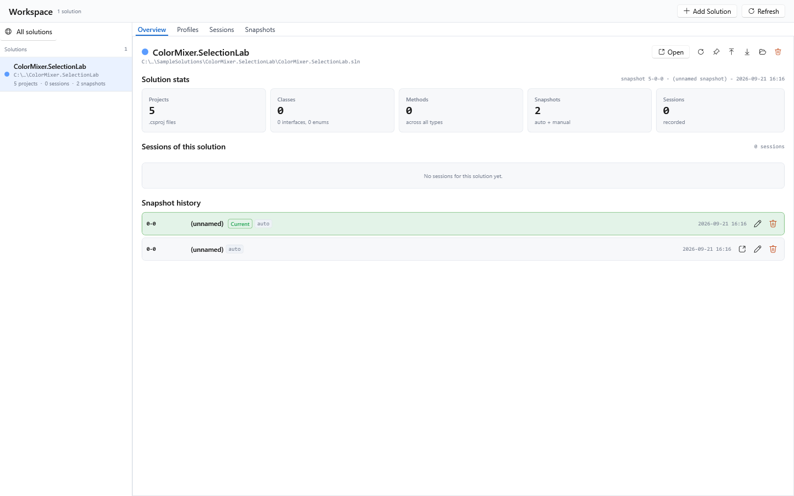
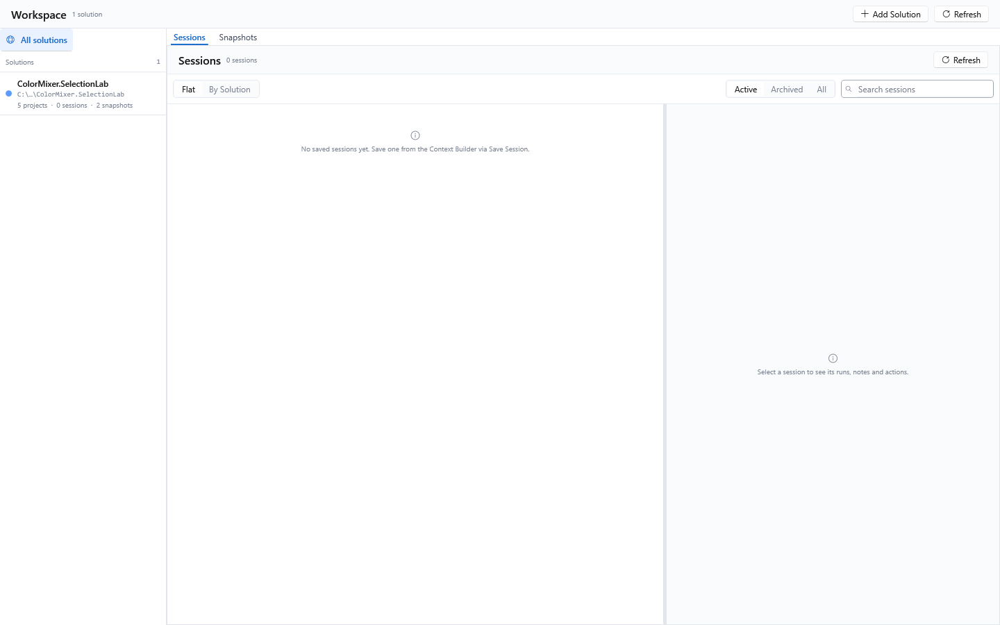
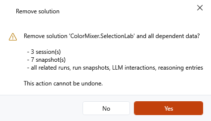
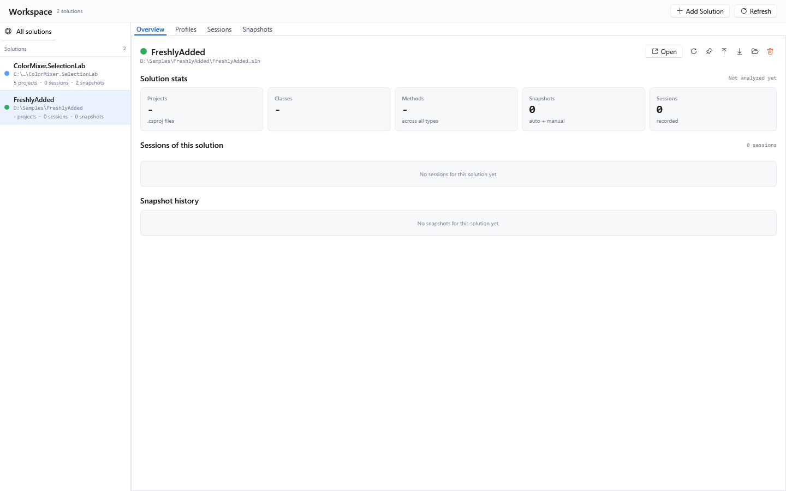
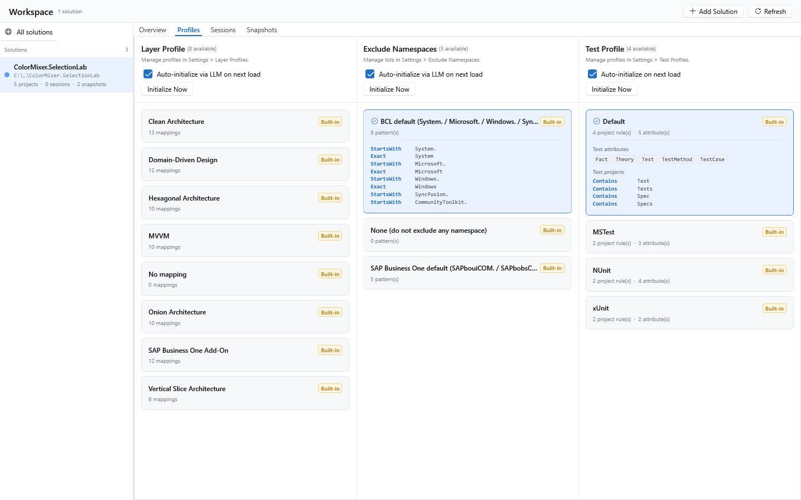
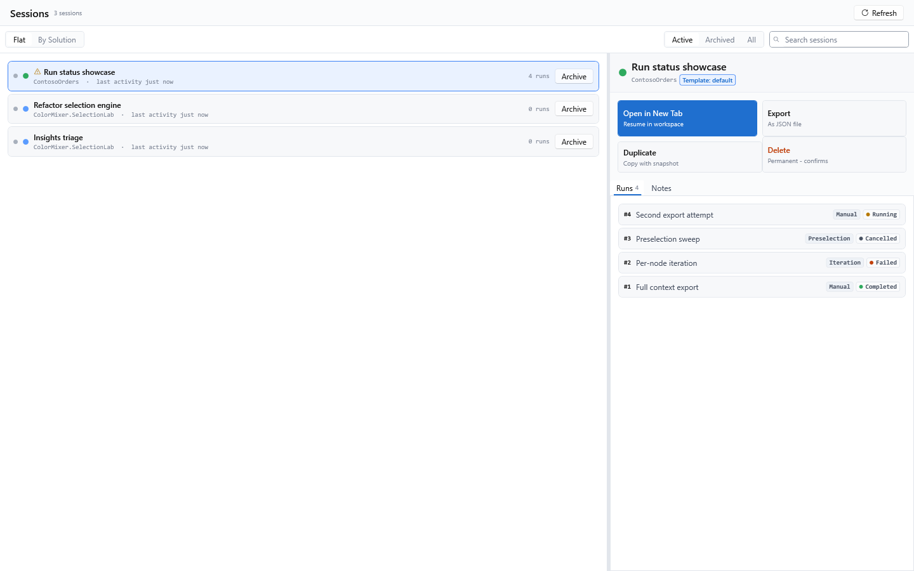
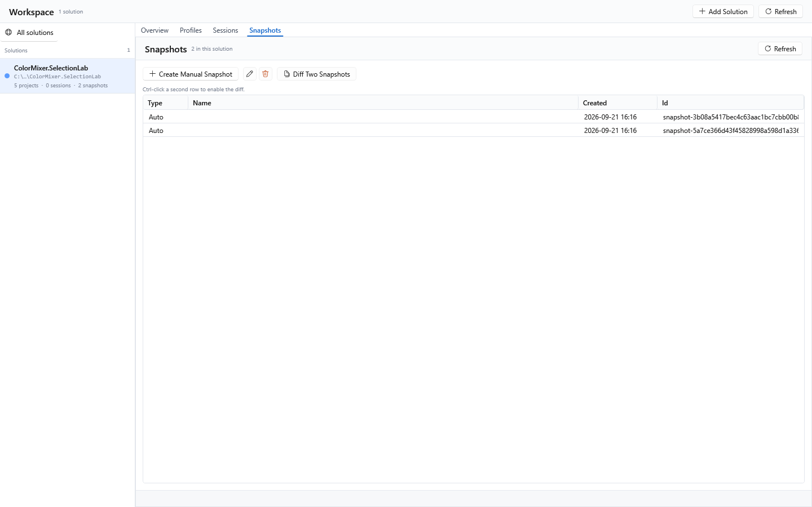
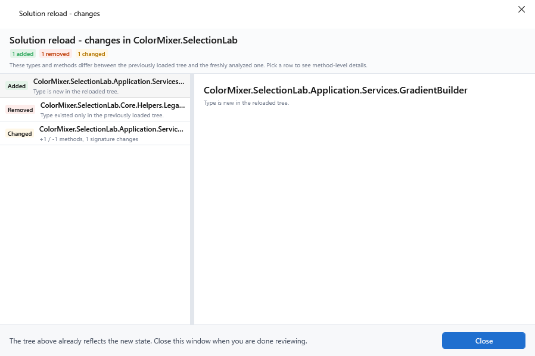

[AICB – Desktop Application](README.md) &middot; chapter 2 of 11

# 2 Workspace, sessions and snapshots

The Workspace page is where solutions, sessions and snapshots are managed. It is the page behind the sidebar entry `Workspace` in the `Workspace` group. A solution is the primary object here; sessions and snapshots are always tied to exactly one solution and are shown as detail regions of the page. Everything on this page is stored in the application database, so sessions and snapshots survive a restart even though open tabs do not.

Open the page from the sidebar: `Workspace` → `Workspace`. The header shows the title `Workspace`, the number of registered solutions (for example `3 solutions`), and two buttons:

| Control | Tooltip | What it does |
|---|---|---|
| `Add Solution` | `Pick a new .sln file and add it to the workspace. Triggers the first analysis.` | Opens the `Open solution` file dialog (filter `Solution files (*.sln;*.slnx;*.slnf)`) and registers the chosen solution. |
| `Refresh` | `Reload the Solutions list from the DB. (F5)` | Reloads the solution list from the database. |

The page is split into two columns: the solution list on the left (240 px wide) and the detail area on the right. The detail area has four tabs: `Overview`, `Profiles`, `Sessions` and `Snapshots`. `Overview` and `Profiles` are per solution and are hidden while the global view is active.



The page refreshes itself when you switch to it: the solution list and the embedded `Sessions`/`Snapshots` lists are reloaded in the background, so freshly saved entries appear without a manual refresh. If nothing has changed, the refresh is a no-op and your selection stays where it was.

## 2.1 The solution list

At the top of the left column is the button `All solutions` (globe icon, tooltip `Show sessions and snapshots across all solutions (global view).`). It switches to the global view:

- No solution is selected.
- `Overview` and `Profiles` are hidden.
- `Sessions` and `Snapshots` show all solutions instead of one.
- The active state of the button is highlighted.



Below it is a row `Solutions` with the total count. Each list row shows:

| Element | Meaning |
|---|---|
| Color dot (9 px) | The solution's color, used consistently in the session and snapshot lists. |
| Name (bold) | The solution's display name. |
| `Loaded` pill (green) | The solution is currently open in a Context Builder tab. |
| Directory path | The folder of the `.sln`, shortened in the middle so the file name stays visible; hover for the full path. |
| Mini statistics | `N projects · M sessions · K snapshots`. The project count comes from the latest snapshot's analysis; until it has been read (or if the solution was never analyzed) it reads `- projects`. |

The selected row gets a 3 px accent bar on its left edge. Double-click a row to open the solution live in a new Context Builder tab; the row tooltip says `Double-click to open this solution live (or select it and click Open).`

If no solution is registered yet, the column shows an empty state: `No solutions yet. Use Add Solution above to register a .sln file - it stays in this list with its sessions and snapshots.`

Selecting a solution also switches the embedded `Sessions` and `Snapshots` regions to that solution and jumps back to the `Overview` tab.

## 2.2 Overview

The `Overview` tab shows everything about the selected solution. Without a selection it shows `Select a solution on the left to view details.`

The header carries a 12 px color dot, the solution name and the solution path (shortened to about 80 characters, full path in the tooltip). On the right is one labeled primary action and six icon buttons whose labels live in their tooltips:

| Button | Tooltip | What it does |
|---|---|---|
| `Open` | `Open this solution live in a new Context Builder tab.` | Opens the solution and runs the analysis. |
| Re-Analyze | `Re-Analyze: re-run the open-solution workflow on this solution (creates a fresh snapshot).` | Runs the open workflow again, which produces a fresh analysis and a new automatic snapshot. Afterwards an info dialog says `Re-Analyze started - a new snapshot will appear in the snapshot history.` If the `.sln` is missing, a warning says `The .sln file was not found at the given path.` |
| Pin Snapshot | `Pin Snapshot: promote the newest snapshot to a named manual snapshot (manual ones are kept longer).` | Promotes the newest snapshot to a named manual snapshot (see "Snapshots"). |
| Export Config | `Export Config: write the active layer profile + exclusion list to a git-tracked <Solution>.aicb.json sidecar next to the .sln. The headless MCP server / CLI auto-discover and apply it (no --db-path needed).` | Writes the solution configuration to the sidecar file. The tooltip summarizes the original layer/exclusion behavior; the file now carries additional axes whose consumers differ (see "Exporting and importing the solution configuration"). |
| Import Config | `Import Config: read a .aicb.json sidecar and apply it to this solution - creates + activates a layer profile and an exclusion list in the DB.` | Reads a sidecar file and applies it to this solution. |
| Show in Explorer | `Show in Explorer: open the Solution folder in Windows Explorer.` | Opens Windows Explorer with the `.sln` selected. If the file is missing, a warning appears. |
| Remove (red) | `Remove: take the Solution out of the workspace - the files on disk are kept.` | Removes the solution and its dependent data after a confirmation that lists everything that is deleted with it. |



### Solution statistics

Five cards show the state of the latest analysis:

| Card | Main value | Sub-line | Tooltip |
|---|---|---|---|
| `Projects` | Number of projects | `.csproj files` | `Number of .csproj files (projects) in the Solution. The Roslyn workspace counts every MSBuild project entry in the .sln file.` |
| `Classes` | Number of all types (classes + interfaces + enums) | `N interfaces, M enums` | `Number of class declarations in the Solution (all projects). Interfaces + enums are listed separately below the main value.` |
| `Methods` | Number of methods | `across all types` | `Number of method declarations across all types (class + interface + record + struct). Property getters/setters are counted too.` |
| `Snapshots` | Number of snapshots | `auto + manual` | `Number of saved Solution Snapshots (automatic + manual). Snapshots are point-in-time captures for diff comparisons.` |
| `Sessions` | Number of sessions | `recorded` | `Number of saved user Sessions (Selection + tree state + optional LLM run history) for this Solution.` |

The four analysis-derived values (`Projects`, `Classes`, `Methods` and the interfaces/enums split) come from the newest snapshot's analysis. If there is no snapshot yet, or it contains no analysis, the card shows an em dash (`-`) instead of a number - a `0` would wrongly say the solution contains no code. The `Snapshots` and `Sessions` counts come straight from the database and are always real numbers. The `N interfaces, M enums` line is hidden while nothing has been measured.

The section header `Solution stats` carries a status line on the right in the form `snapshot <projects>-<types>-<methods> · <name> - yyyy-MM-dd HH:mm`. Possible messages instead of that line are:

- `Not analyzed yet` - no snapshot, or no analysis stored in it.
- `Snapshot history could not be read` - the snapshot metadata could not be read.
- `Statistics could not be read` - the stored analysis could not be read.

The cards are filled in the background, so the numbers may appear a moment after the solution name.



### Sessions of this solution

The section `Sessions of this solution` lists the solution's sessions, most recently used first. A card shows the solution color dot, the session name, the creation date (`created yyyy-MM-dd`) and the last activity (`last activity just now` / `N min ago` / `N h ago` / `N d ago` / a date). Click a card to open the session in a new workspace tab (tooltip: `Open this Session in a new workspace tab.`). Empty state: `No sessions for this solution yet.`

### Snapshot history

The section `Snapshot history` lists all snapshots of the solution, newest first. Each row shows:

| Element | Meaning |
|---|---|
| Short number | `<types>-<methods>` from the snapshot's quality stamp; for older snapshots without one, the first eight characters of the snapshot ID. |
| Name | The snapshot name, or `(unnamed)` for an automatic snapshot that was never named. |
| `Current` pill | Marks the newest snapshot. |
| Type pill | `auto` or `manual` (lower case). |
| Created | Local creation time as `yyyy-MM-dd HH:mm`. |
| `Load` | Opens the snapshot's captured analysis in a new Context Builder tab (read-only). Hidden on the current snapshot. |
| Rename | Prompts `Rename snapshot` / `New snapshot name:`. |
| Delete (red) | Asks `Delete snapshot '<name>'?` before deleting. |

Empty state: `No snapshots for this solution yet.`

## 2.3 Profiles

The `Profiles` tab holds three pickers side by side: `Layer Profile`, `Exclude Namespaces` and `Test Profile`. Each one chooses which entry of a library applies to the selected solution:

- The **layer profile** controls how namespaces are mapped to architecture layers.
- The **exclusion list** controls which namespaces the analyzer skips.
- The **test profile** defines which projects and attributes count as tests.

Note: this tab only *selects*. Creating, editing, deleting and importing library entries happens in `Settings` (see "Settings"); the picker texts point there as `Manage profiles in Settings > Layer Profiles.`, `Manage lists in Settings > Exclude Namespaces.` and `Manage profiles in Settings > Test Profiles.`

Without a selected solution all three pickers are inert and explain why: `Select a solution to choose its active profile.` - the exclusion picker says `Select a solution to choose its active list.`

Each picker shows its title with the number of available entries in parentheses, for example `(7 available)`, and contains:

| Element | What it does |
|---|---|
| `Auto-initialize via LLM on next load` | Checkbox. A freshly registered solution starts with all three auto-init flags enabled. On its next load in the Context Builder, the app uses the default model profile to request one proposal for the still-unconfigured layer and exclusion axes, then asks whether to apply it. The request therefore precedes the confirmation. The test profile's checkbox is labeled `Auto-initialize on next load`, because its detection is local and needs no language model. Missing model settings, no detected tests or a declined proposal can leave an axis unconfigured. Existing choices are not overwritten. |
| `Initialize Now` | Restores this axis from the solution's `<Solution>.aicb.json` sidecar immediately - no LLM, no analysis. On success a dialog reports `Restored + activated for this solution (from the sidecar):` with the restored name and rule count, and the checkbox is cleared because the pending intent is fulfilled. If there is nothing to restore, a dialog explains that the axis is already configured or the sidecar is missing or does not cover the axis. |
| Card list | One card per library entry with the name, a `Built-in` pill for built-in entries and a checkmark on the selected card. The meta line under the name shows the size of the entry (`N mappings`, `N pattern(s)`, or `N project rule(s) · N attribute(s)`). The selected card additionally unfolds a preview of its rules: `Pattern > Layer` for layer profiles, `MatchType Pattern` for exclusion lists, and for test profiles the attribute chips under `Test attributes` plus the project rules under `Test projects`. |

Selecting a card persists the choice for that solution only. The resolution order is always: **per solution → global default (Settings) → built-in default**. If no solution has its own choice, the global default applies.

Selecting a different layer profile takes effect from the next analysis run; selecting a different exclusion list takes effect from the next run as well. The test profile is resolved freshly for every analysis run.

Auto-initialization writes the resulting per-solution choices to the local database only. It does not create the sidecar automatically; use `Export Config` after reviewing the three axes if the configuration should be versioned with the repository.



### Exporting and importing the solution configuration

`Export Config` writes the solution's active configuration into a git-tracked file named `<SolutionName>.aicb.json` next to the `.sln`. The location is not freely choosable, because the headless MCP server and the CLI look for exactly this file. The file contains:

- the active layer profile's rules,
- the active exclusion list's rules,
- the active test profile's project rules and test attribute names (only when it has any),
- suppressed findings (triage decisions),
- the auto-initialize opt-ins of the three axes,
- the analysis-scope setting `analyzePreferredTfmOnly` (multi-targeted projects), which has no control in the GUI and is carried over from the existing file.

If the solution has none of these, a warning appears instead of an empty file: `This solution has nothing to export: no active layer profile, exclusion list or test profile, and no suppressed findings. Pick a per-solution profile in the right-hand panels first.` If the file already exists, an overwrite confirmation appears first. The success dialog names the counts and reminds you to commit the file:

```text
Exported solution config to:
<path>

Layer rules: N   Exclusions: M   Test rules: K   Suppressed findings: L

Commit the .aicb.json next to the .sln - the MCP server / CLI then apply it headless (no --db-path needed).
```

That sentence is the application's confirmation text. “Apply it” is not one uniform precedence rule: database-free headless analysis uses the sidecar's layer/exclusion fallback and analysis scope, while test detection resolves from the database or built-in default. Suppression-aware reading tools handle sidecar suppressions separately.

`Import Config` opens a file dialog (`Import solution config (sidecar)`, filters `AICB sidecar (*.aicb.json)`, `JSON files (*.json)`, `All files (*.*)`), reads the file and applies it to the selected solution: it creates and activates a layer profile named `Imported layer profile (<Solution>)` and an exclusion list named `Imported exclusions (<Solution>)`, and marks both axes as initialized. A file without layer rules and without exclusions is rejected with `The file contains no layer rules or exclusions to import.` GUI import covers the layer and exclusion axes only. The sidecar's test definition, suppressions, auto-init flags and analysis-scope key remain in the file, but each has its own reading path; they are not all applied by one generic headless-profile resolver.

## 2.4 Sessions

A session is a named, saved working state of one solution in the Context Builder. It stores the tree selection, the per-node detail-level overrides, the prompt text, the active context template, an optional pinned snapshot, free-text notes and the per-picker overrides of the configuration panels - plus the history of the runs that were started from it. A session always belongs to exactly one solution.

The region is the embedded `Sessions` tab of the Workspace page. It is scoped to the selected solution, or unscoped while `All solutions` is active.

### Controls

The header shows `Sessions` and the total number of sessions in the database, not the number in the current solution scope or filtered result. `Refresh` (`F5`) reloads the list from the database.



Two segmented switches and a search field control the list:

| Group | Values | Default | Tooltips |
|---|---|---|---|
| List shape | `Flat` · `By Solution` | `Flat` | `Show all Sessions as a flat list.` / `Group Sessions by Solution - one section header per Solution.` |
| Archive scope | `Active` · `Archived` · `All` | `Active` | `Show only non-archived Sessions.` / `Show only archived Sessions (old/completed work).` / `Show all Sessions (active + archived).` |

The search field carries the placeholder `Search sessions`. It filters live and case-insensitively over both the session name and the solution name. `Ctrl+F` focuses the field and selects its content, `Escape` clears it.

The filters are applied in this order: solution scope, then archive scope, then search text. The flat list is sorted by last activity, newest first. The grouped list sorts the groups alphabetically by solution name and sorts the sessions inside each group by last activity, newest first.

### The session list

Each row shows:

| Element | Meaning |
|---|---|
| Small dot (left) | Green when the session (or at least its solution) is currently open in a Context Builder tab; gray otherwise. |
| Color dot | The solution's color. |
| Warning icon | The saved solution file no longer exists at its path. Tooltip: `Solution file not found at saved path. Open to relocate.` |
| Name | The session name. |
| Second line | The solution name and the last activity. |
| `N runs` | Number of saved runs of this session; `- runs` when the count could not be read. |
| `Archive` / `Activate` | Toggles the archived flag (flat list only). Tooltip: `Archive / activate session`. |

Archiving is non-destructive: runs and snapshots stay, the session simply disappears from the default `Active` filter. The toggle saves immediately. If the row drops out of the active filter, the selection advances to the next visible session. If saving fails, the flag is reverted so list and database stay consistent.

Empty state: `No saved sessions yet. Save one from the Context Builder via Save Session.` Like the header counter, this state is based on all sessions in the database; a solution-scoped list can therefore be empty while this global empty state remains hidden.

Note: the header count and the empty state refer to all sessions in the database, not to the current solution scope or the filtered list. A scope or filter that hides every row therefore does not replace the list with the empty-state hint.

### The detail pane

Without a selection the pane says `Select a session to see its runs, notes and actions.`

With a selection, the header shows the color dot, the session name, the solution name and an accent pill `Template: <template id>`. Below it are four action cards in a 2×2 grid:

| Card | Subtitle | What it does |
|---|---|---|
| `Open in New Tab` (accent) | `Resume in workspace` | Opens the session in a new Context Builder tab and restores its state (see "Opening a session"). |
| `Export` | `As JSON file` | Opens a save dialog (`JSON files (*.json)`) and writes the complete session - including the resolved template snapshot, the tree selection, the prompt and the notes - as indented JSON. The suggested file name is derived from the session name with characters that are invalid in file names replaced by `_`; an unnamed session suggests `session-<id>.json`. Note: there is no import counterpart; the export is meant for backup and for passing a session on. |
| `Duplicate` | `Copy with snapshot` | Creates a copy with a new ID. The name becomes `<Name> (Copy)`, and on a name collision `<Name> (Copy 2)`, `<Name> (Copy 3)`, and so on. The copy keeps the solution, the pinned snapshot, the active template, the resolved template snapshot, the tree selection, the prompt and the notes, and is selected afterwards. |
| `Delete` (red) | `Permanent - confirms` | Asks `Delete session "<name>"?` and then deletes the session. |

Below the cards are two sub-tabs:

- **`Runs`** - one card per run with `#<number>`, the run name (or `(unnamed run)`), a run-type pill and a status pill with a colored dot. Empty state: `No runs in this session yet. Open the session and start a run - it is recorded here when it finishes.`
- **`Notes`** - a multi-line text field (tooltip `Free-text notes about this Session. Use Save Notes below to persist changes.`) and the button `Save Notes` (tooltip `Save the notes text in the DB.`). Saving updates the session's last-activity timestamp and confirms with `Notes saved.`

### Opening a session

`Open in New Tab` (or clicking a session card in the `Overview` region) runs the following steps:

1. If the session no longer exists, a warning says `Session no longer exists.` If its solution record is missing, it says `The associated solution could not be found.`
2. If the saved `.sln` path no longer exists, a relocate dialog appears so you can pick the new location. Cancelling ends the flow.
3. If the session is already open in a Context Builder sub-tab, the app simply switches to that tab.
4. Otherwise a new sub-tab is created. The session's pinned snapshot is used, but only while it still matches the code on disk: if the snapshot is still current, the tab is promoted to a full live load, is editable and shows no read-only banner. Only when the code has changed since the snapshot does the tab stay read-only, and then the banner is accurate. A session without a pinned snapshot (an auto-session created before the first send) always loads live.
5. The tree selection, the detail-level overrides, the active template, your prompt, the session ID and the overrides of the configuration pickers are restored. The tab is then marked as unmodified.
6. Nodes referenced by the session that no longer exist in the solution are collected and reported in a dedicated window titled `Session opened - missing nodes`:

```text
This session references N node(s) that no longer exist in the current solution - they were skipped. M node(s) of the selection were restored.
```

Each entry shows `Type.Method`, a path hint line (project / folder / file), and the full node key on hover (`Hover an entry to see the full node key.`). The orphaned nodes are removed from the session on the next save.


### Saving and auto-saving

Sessions are created from the Context Builder with `Save Session` (tooltip `Save the current tab as a Session (Ctrl+S)`), which asks for a session name and optional notes. Every tab starts unmodified after a save.


If `Auto-save enabled` is on in `Settings` → `General` → `Session & Analysis`, a timer saves all modified tabs every `Auto-save interval (minutes)` minutes (default: on, every 5 minutes). Changes to either setting take effect after the next application start. Two rules matter:

- Auto-save skips only tabs that have no session ID. A session created automatically as `Untitled ...` by the first send does have an ID and is included even if you never opened `Save Session`.
- The first time you send a prompt from a tab that has no session yet, the app creates one automatically. It is named `Untitled - <solution file name> - yyyy-MM-dd HH:mm`, pins the current snapshot, and from then on is a regular session you can rename in the `Sessions` region.

## 2.5 Snapshots

A snapshot is a point-in-time capture of a solution's analysis (the analyzed structure plus quality and debt metrics). Snapshots are used to compare two states and to reopen an older state in a read-only view. There are two kinds:

| Type | Created by |
|---|---|
| `auto` | Automatically on every fresh analysis, for example when you open or re-analyze a solution. Automatic snapshots are unnamed. |
| `manual` | Through `Create Manual Snapshot` in the `Snapshots` region, or by pinning the newest snapshot in the `Overview` region. Manual snapshots are named and are kept longer. |

Every snapshot is stamped with a quality aggregate (debt total and rating, code metrics) computed against the active quality profile - the same stamp used by the CLI and by automatic snapshots. The stamp supplies the short number shown in the `Overview` snapshot history.

The `Snapshots` region is the embedded `Snapshots` tab of the Workspace page. In the solution-scoped view its own solution list is hidden; in the global view (`All solutions`) it shows a solution list on the left with a splitter.

### Controls

The header shows `Snapshots`, the number of snapshots as `N in this solution`, and `Refresh` (`F5`, tooltip `Reload the Snapshot list from the DB. (F5)`). While a refresh or a diff is running, the refresh button is disabled so that holding `F5` cannot stack up overlapping reads.

The action bar contains:

| Button | Tooltip | Enabled when |
|---|---|---|
| `Create Manual Snapshot` | `Save a new manual Snapshot of this Solution's current analysis data structure (name + optional notes).` | Always clickable; the precondition is checked after the click. |
| Rename (icon) | `Rename the selected Snapshot.` | A snapshot is selected. |
| Delete (icon, red) | `Permanently delete the selected Snapshot (cannot be undone).` | A snapshot is selected. |
| `Diff Two Snapshots` | `With two Snapshots selected (Ctrl-click) - show the Diff window with structural changes (Added/Removed/Changed per type).` | Two different snapshots are selected. |

Below the buttons a hint line reads `Ctrl-click a second row to enable the diff.`

The snapshot table is read-only and allows multiple selection. Its columns are `Type` (`Auto` or `Manual`), `Name`, `Created` (local time) and `Id` (the full snapshot ID). Rows are listed newest first. Select a single row to rename or delete it; Ctrl-click a second row to enable the diff.

Empty state: `No snapshots yet for the selected solution. Use 'Create Manual Snapshot' above, or enable auto-snapshots in Settings > General > Session & Analysis.` Note: every fresh analysis writes an automatic snapshot; the setting `Max snapshots per solution` under `Settings` → `General` → `Session & Analysis` controls how many automatic snapshots are kept, not whether they are written.

A status line at the bottom of the region reports the result of the last action.



### Creating a manual snapshot

A manual snapshot needs the live analysis, so the solution must be open in the Context Builder right now. The button is always clickable; if the selected solution is not the one that is open, a dialog explains: `Manual snapshots can only be created for the solution currently open in the Context Builder. Open the selected solution there first.` Without any selected solution the status line says `Select a solution first.`

1. Select the solution in the Workspace list and make sure it is open in the Context Builder.
2. Click `Create Manual Snapshot`.
3. Enter a name in the `Create Manual Snapshot` dialog (`Name for the snapshot:`). The button tooltip mentions a name plus optional notes, but the dialog itself asks only for the name; its input tooltip merely explains Enter and Escape.
4. The status line confirms `Manual snapshot "<name>" created.`

### Renaming and deleting

Select a row and use the rename icon: the prompt is `Rename Snapshot` / `New name:`; on success the status line says `Snapshot renamed.` The rename in the `Overview` snapshot history uses the prompt `Rename snapshot` / `New snapshot name:` instead.

Deleting asks for confirmation and warns about the consequence:

```text
Delete snapshot "<name>"?
Runs that reference this snapshot keep their RunSnapshot reproducibility, but the original code state will no longer be available.
```

On success the status line says `Snapshot deleted.`

### Comparing two snapshots

1. Click the first snapshot row.
2. Ctrl-click the second row. The button `Diff Two Snapshots` becomes enabled.
3. Click `Diff Two Snapshots`. Both snapshots are loaded and compared in the background (a spinner overlays the region); then the diff window opens and the status line reports `Diff: N changes.`

If one of the two snapshots has no stored analysis, the diff is refused with `At least one of the selected snapshots has no complete solution analysis - diff not possible.`

The diff window is titled `Snapshot Diff: <left> → <right>`, where each side is labeled `<name or first 8 characters of the ID> (yyyy-MM-dd HH:mm)`. It shows three count badges - `N added`, `N removed`, `N changed` - and a list of the changed types. Selecting a row shows its method-level details in the detail pane: `Added methods` (prefixed `+`), `Removed methods` (prefixed `-`) and `Changed signatures` (previous signature as `-`, new signature as `+`). If both snapshots have the same class/method structure, the window says `Both snapshots have identical class/method structure.`

The comparison is structural: it covers types, methods and method signatures. A line-by-line body diff is not available (it would require storing the source text; it is planned but not released). The window's footer states this: `Body diff requires source persistence (backlog).`


### Opening a snapshot read-only

The `Load` button in the `Overview` snapshot history opens the snapshot's captured analysis in a new Context Builder tab. The tab is read-only; it shows the state that was captured, not the current code. The button is hidden on the current (newest) snapshot. Loading a snapshot is not the same as switching to it - see the note below.

Note: a snapshot is **not a restore point**. There is no way to write a snapshot back onto a solution, and none is planned. What you can do is open it read-only, compare snapshots, or reload the live code.

### Retention of automatic snapshots

`Max snapshots per solution` (default 10) caps the number of automatic snapshots per solution. When the cap is exceeded, the oldest automatic snapshots are deleted. Manual snapshots are never deleted by this rule and do not count towards the cap. A snapshot that a completed run references is also kept even when it is beyond the cap, because the run's reproducibility depends on it; a snapshot referenced only by a saved session can be removed by the cap.

## 2.6 Working over time

The following workflows cover the situations that change after the first successful run: the code changes, the session no longer matches the code, you want to compare two states, the solution or the database moves, or the app is updated.

### When the code has changed: Reload solution

Use `Reload solution` in the Context Builder's persistent left Solution Tree sidebar, which remains visible on every top-level Context Builder tab (tooltip `Re-analyze the Solution from disk and show the structural delta against the previously loaded Tree as a diff window. (F5)`; the same command is on `F5` while the Context Builder is active).

1. Click `Reload solution`. If no source file has been touched since the last load, a dialog asks `No code changes detected since the last reload (same file-set hash).\n\nRe-analyze anyway?` Answer `No` to skip the analysis; the app stays as it is.
2. The analysis runs again against the code on disk. A live reload is performed, so a new automatic snapshot is created and the tab leaves read-only snapshot mode.
3. Your tree selection and your detail-level overrides are collected before the reload and re-applied to the freshly built tree. Keys that no longer exist are dropped here; they show up in the diff instead.
4. If the structure changed, the diff window opens (`Solution reload - changes in <solution>`); if nothing changed, an info dialog says `No structural changes detected. The reloaded tree is identical to the previously loaded one.`

The reload diff window compares the previously loaded tree with the freshly analyzed one. It has the same layout as the snapshot diff, with `Added`/`Removed`/`Changed` entries and method-level details. Its footer reminds you that the tree already shows the new state: `The tree above already reflects the new state. Close this window when you are done reviewing.`



### Reopening a session against changed code

If a session's pinned snapshot no longer matches the code on disk, the reopened tab is read-only and shows a banner explaining why. The wording depends on the cause:

| Banner text | Cause |
|---|---|
| `Read-only - the code changed since this session was saved. Use 'Reload solution' to re-analyze the live code.` | The source changed after the snapshot was taken. |
| `Read-only - this snapshot was saved by a different version of the tool, so it cannot be reused directly. This says nothing about your code. Use 'Reload solution' to re-analyze.` | The snapshot's payload format differs from the current app version. |
| `Read-only - this snapshot was produced by different analyzer code, so it cannot be reused directly. This says nothing about your code. Use 'Reload solution' to re-analyze.` | The snapshot was produced by a different analyzer build. |
| `Read-only - could not determine whether the code still matches this snapshot. Use 'Reload solution' to re-analyze the live code.` | The staleness check could not decide. |
| `Read-only - Original snapshot loaded. Use 'Reload solution' to re-analyze the live code.` | A snapshot was opened deliberately, for example through `Load`. |

In every case, `Reload solution` re-analyzes the live code and makes the tab editable again. The nodes the session can no longer restore are listed in the `Session opened - missing nodes` window described above.

### Comparing two states

Two comparison paths exist and should not be confused:

| Path | Compares | Where |
|---|---|---|
| `Reload solution` | the previously loaded tree with the freshly analyzed one | Context Builder, automatically after the reload |
| `Diff Two Snapshots` | two stored snapshots with each other | Workspace, `Snapshots` region |

### When the solution has moved

Opening a solution whose `.sln` no longer exists at the saved path triggers the relocation flow. This applies to all three open paths: opening a solution directly, opening a session, and loading a snapshot with a pinned ID.

- If the path is unknown (for example a typo when opening a fresh file), a plain error appears: `Solution file not found:\n<path>`, with the title `Open solution`. No relocation is offered because there is nothing to relocate.
- If the path belongs to a registered solution, a relocation dialog appears. Pick the new `.sln` location and the app updates the stored path and retries. The pinned snapshot of a session is carried through the relocation, so the reopening attempt keeps its pin.
- If relocation itself fails, its message appears under the title `Relocate solution`.
- If the freshly picked file disappears between confirmation and loading, the app shows `Solution file still not accessible at:\n<path>` instead of asking again.


### When the app version changes

The database carries a schema version, and the direction decides what happens:

- **Newer app, older database** - the migration runs automatically at startup, without asking. This affects the shared database immediately: parallel MCP hosts and a second GUI instance see the migrated schema from that moment on. Older binaries then report drift.
- **Older app, newer database** - the GUI does not start. It shows a dialog explaining that the database was written by a newer version, names both schema versions, and exits rather than writing to it. The two ways out are updating the app or pointing `Storage` at a different database file.

### When the database moves

`Settings` → `Storage` offers several ways to change the active database: edit `BasePath` and save, use `Switch Database…` for an existing file, create a new database, or pick a recent database from the list. All of them run the same checks:

1. While a background run is active, the change is refused with `Cannot {action} while N background task(s) are active.`
2. The target database is checked for compatibility with this app build. An incompatible file is rejected with `Not saved - the database under the new BasePath is not compatible.`
3. A confirmation dialog `Change data directory?` names the new path, whether the file already exists and how many migrations will be applied. It states the important point: the current database file stays untouched, and its content does **not** move - settings, sessions and solutions are read from the new file from now on. Cancelling reports `Not saved - the data-directory change was cancelled.`

The application database file is named `aicb.acb`; the app accepts no other extension for it. The explicit database paths of CLI and MCP calls are not affected by this rule.

### Moving usage numbers between machines

The `MCP Usage` region can move its report from one machine to another:

1. On machine A, click `Export`. It writes the same JSON that the `usage_report` MCP tool returns.
2. On machine B, click `Import` and pick the exported file. Tooltip: `Import an exported usage report as a named snapshot beside the live data. Imported sets are never merged into the live numbers.`
3. The imported report then sits in the `Snapshots` region of that page, next to the live numbers, as a named set. Empty state: `No imported reports yet. Import an exported usage-report JSON to keep it here as a named set.`
4. The `Tools`, `Errors` and `Clients` regions always show the live database; the import does not change them. Tooltip: `Tools, Errors and Clients always show the live database. Imported snapshots sit beside it in the Snapshots region.`

See "MCP Profiles, MCP Usage and Templates" for the full description of that page.

### What survives a restart

Sessions and snapshots are stored in the shared application database and are still there after a restart. Open tabs are not restored: the app always starts on its start page, and the last used solutions and sessions are offered there. Saving a session is therefore the way to keep work across restarts.

---

[&larr; 1 Startup, window and navigation](01-startup-window-and-navigation.md) &middot; [Contents](README.md) &middot; [3 The Context Builder: layout and solution tree &rarr;](03-the-context-builder-layout-and-solution-tree.md)
