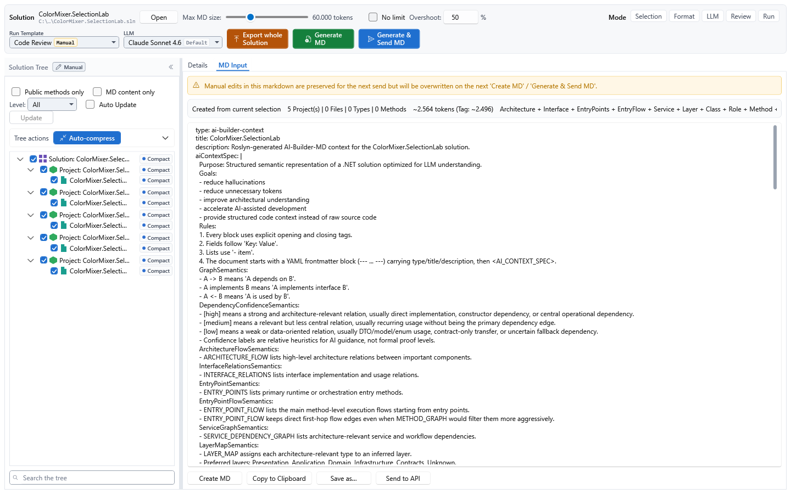
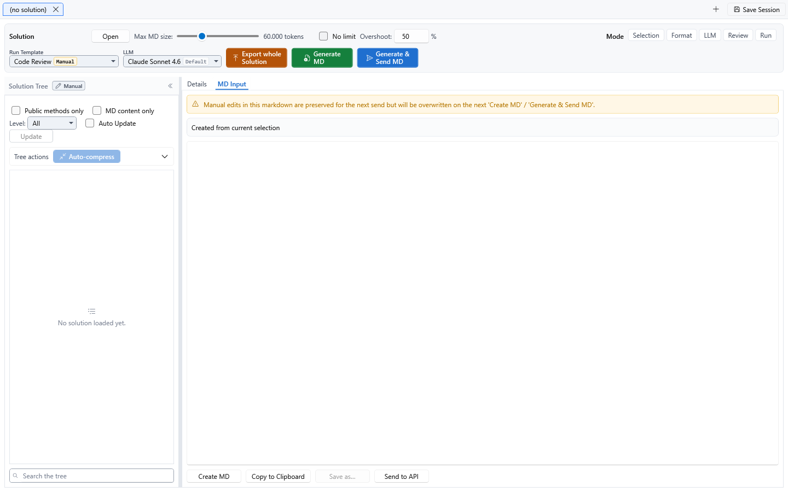
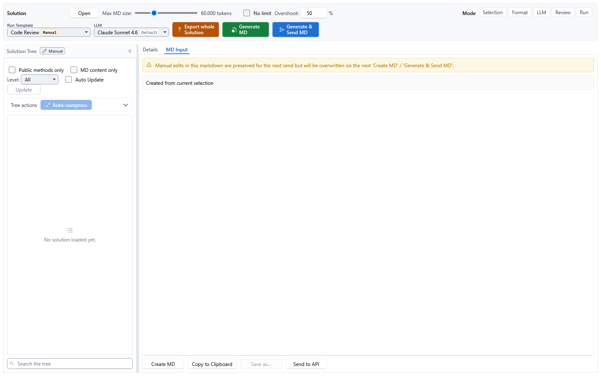
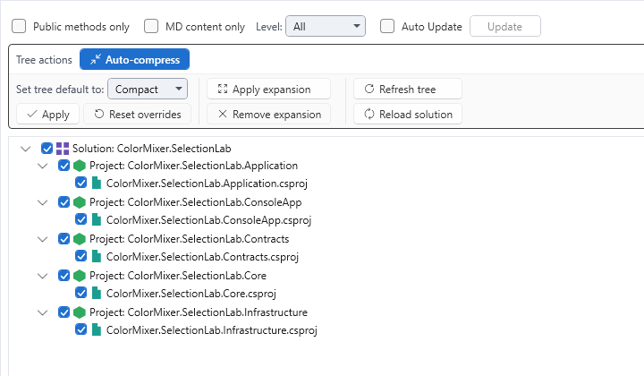
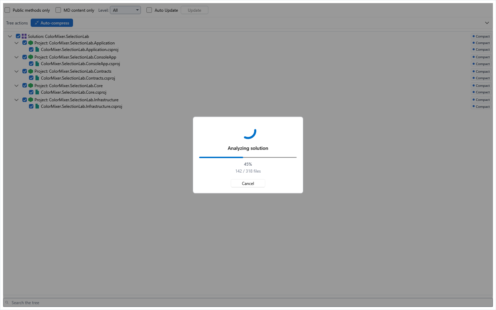

[AICB – Desktop Application](README.md) &middot; chapter 3 of 11

# 3 The Context Builder: layout and solution tree

The Context Builder is the workspace where a C# solution becomes a curated context document. You open a solution, decide in the solution tree which parts of it belong in the document, optionally refine how the document is shaped, and then render it - either for copying into an external LLM tool or for sending directly to a configured model. Everything on this surface serves that one chain; the layout is built around it, not around a feature list.

## 3.1 From opening a solution to the exported document

The typical path through the workspace:

1. **Open a solution.** Use the `Open` button in the header of the Context Builder, or press `Ctrl+O` anywhere in the application. The file picker accepts `.sln`, `.slnx` and `.slnf` files. The solution is analyzed, and a modal loading overlay with a progress bar and a `Cancel` button covers the tree while it is being built.
2. **Select in the solution tree.** Every row carries a three-state checkbox (`Include` / `Exclude` / `Inherit`). This is the workspace's multi-selection mechanism - the row selection itself is single-select and only drives the detail view.
3. **Optionally refine.** Set a detail level per node with the chip at the end of the row, or use the bulk actions in the tree toolbar (`Auto-compress`, `Apply expansion`, `Refresh tree`, `Reload solution`).
4. **Optionally configure.** The six panels on the `Main` tab (`Prompt`, `Sections`, `Graph Selection`, `Selection Engine`, `Test Description`, `Export Output`) each have a usable default; none of them is mandatory.
5. **Render.** The header offers three buttons, deliberately ordered from the widest to the narrowest scope: `Export whole Solution` (ignores the selection), `Generate MD` (builds the document from the current selection, no model call, `Ctrl+M`) and `Generate & Send MD` (builds it and sends it, `Ctrl+Enter`).
6. **Review the result.** The document lands in the `MD Input` tab. The text is editable, and the header above it summarizes what it was created from: the selection, a token estimate, the active graphs and the code mode.
7. **Hand it over.** Use `Copy to Clipboard` or `Send to API`. A model answer appears in the `LLM Response` tab; `Use as MD input` copies it back into `MD Input` for a follow-up round.

Only a handful of controls are strictly necessary for this: opening a solution, the tree rows, the export checkboxes, `Generate MD`, and the document with its copy button. Everything else is optional refinement.

## 3.2 Solution tabs

The Context Builder itself is a tab area at the top of the workspace, one tab per solution you have open.

- A fresh tab is labelled `(no solution)` until a solution is loaded. A loaded tab is labelled with the solution file name (for example `MyApp.sln`), and a ` *` suffix marks unsaved changes.
- `+` (`Ctrl+N`) adds another empty solution tab.
- `Save Session` (`Ctrl+S`) saves the active tab as a session. The button stays disabled until a solution is loaded in the tab. It always opens the dialog; for an existing session, the current name and notes are pre-filled. Auto-save and the non-interactive save-before-close path can update an existing record silently.
- Each tab has a close button; `Ctrl+W` closes the frontmost tab.
- While a run is in progress, the tab strip is locked so you cannot switch away from the tab that is working. The lock is lifted as soon as the run finishes.
- Closing a tab with unsaved changes asks `Save before closing?` and offers `Yes` / `No` / `Cancel`, provided the `Tab-close confirmation` option under Settings › General is on.
- A background auto-save runs at the interval configured under Settings › General (`Auto-save enabled`, `Auto-save interval (minutes)`, default 5 minutes); setting changes take effect after the next application start. It skips only tabs with no session ID; an `Untitled ...` session created automatically by the first send is included. If one save fails, a generic warning says that one of the open sessions could not be saved and points you to `Save Session`; the session ID is written only to the log, and other tabs continue to auto-save.

When you save, two safeguards apply. If the current state is identical to the last saved state of the session, the app asks whether to overwrite anyway. And if the chosen name already exists for the same solution (case-insensitive), a dialog names the conflicting session and its last modification date and offers to pick another name. A successful save confirms with the session name and the number of selected nodes.

## 3.3 Layout modes: the surface starts minimal

The Context Builder starts with a deliberately small set of controls. Five chips under the label `Mode`, at the right edge of the header, add the areas you need. The chips are additive: selecting several shows the union of their areas, and selecting none leaves the minimal view.

| Chip | What it adds | Fallback tab |
|---|---|---|
| `Selection` | The `Graph Selection` and `Selection Engine` panels inside `Main` | `Main` |
| `Format` | The `Sections` and `Export Output` panels inside `Main`, including the document notation | `Main` |
| `LLM` | The `Prompt` panel inside `Main` and the `LLM Response` tab | `Main` |
| `Review` | The `Test Description` panel inside `Main` and the `Insights` tab | `Insights` |
| `Run` | The `Active Run` and `Reasoning` tabs | `Active Run` |

The tooltips of the chips read:

- `Selection` - "Selection - what goes into the document. Adds the Graph Selection and Selection Engine panels. (Alt+1)"
- `Format` - "Format - how the document is shaped. Adds the Sections and Export Output panels, including the notation. (Alt+2)"
- `LLM` - "LLM - authoring the prompt and reading the answer. Adds the Prompt panel and the LLM Response tab. (Alt+3)"
- `Review` - "Review - walking through quality findings. Adds the Insights tab and the Test Description panel. (Alt+4)"
- `Run` - "Run - watching a run step through. Adds the Active Run and Reasoning tabs. (Alt+5)"

Two tabs are always visible and cannot be hidden by any mode: `Details` and `MD Input`. `Main` is derived - it appears exactly when the selected modes reveal at least one of its panels. That keeps the minimal view meaningful: a tree click has to land somewhere, and `MD Input` carries the document the application exists to produce.

The chip order follows the workflow (select, shape, send, review, run). The keyboard twins are `Alt+1` to `Alt+5`, which toggle one mode each, and `Alt+0`, which turns all modes off and returns to the minimal view. Both the chips and the keys write the same state, so they can never disagree.

A mode change only moves the active tab when the tab you are on has just been hidden; it then falls back to the mode's home tab, or to the first visible tab. If the change leaves your current tab visible, nothing moves.

Two properties of the mode selection are worth knowing:

- It applies to the whole application, not per solution tab, and it is remembered between sessions.
- A stored selection that this version does not recognize is ignored; the workspace opens in the minimal view instead of guessing.

Note: `Run` reveals the `Active Run` and `Reasoning` tabs, but their content comes from iteration and preselection runs. Those run types are not released yet (see the `Run Template` selector below), so with a released template these two tabs stay empty.

## 3.4 The workspace layout

The workspace consists of a header card spanning the full width, and below it a left sidebar with the solution tree, a splitter, and the tab area on the right.

### The global header

The header card is persistent across all sub-tabs (`Main`, `Details`, `MD Input`, and so on) and holds four groups. It is responsive: while the window is wide, the solution identity, the token budget and the mode chips share the top row and the run-template group sits below it; when the window narrows, the groups stack and the mode chips get a row of their own.

**Solution.** The label `Solution`, the name of the loaded solution and a shortened path (the full path is in the tooltip), with the `Open` button on the right. `Open` loads a solution into this tab - if one is already loaded, it is replaced.

**Max MD size.** One home for the token budget that applies to every rendered document (`Create MD`, `Generate & Send MD`, `Export whole Solution`, and the send-selected-lines path of the Insights tab).

| Control | Meaning |
|---|---|
| Slider | Target token count for every render. Range 8,000 (floor) to 200,000, snapping in steps of 1,000. Default 60,000. |
| Readout | The current value, for example `60,000 tokens`, or `No limit`. |
| `No limit` | Removes the cap and renders the entire solution - the tooltip says: "Render the entire solution with no size cap (former behavior - can be very large)." The slider is disabled while this is checked. |
| `Overshoot:` | The maximum headroom above `Max MD size`, as a whole number from 0 to 1000. The ceiling is the target plus this percentage; the renderer still aims at the target and does not deliberately spend the allowance. The default comes from the active pipeline profile (50 unless changed); edit the saved default under Settings › Pipeline Profiles. |
| Warning readout (right) | How far the last generated document actually exceeded the budget, measured against `Max MD size`. Empty when the render stayed within budget. |

The renderer converges on the target by lowering detail and pruning the least relevant content; it never cuts text in the middle of a block.

Note: when a tree was restored from a stored snapshot (read-only snapshot mode), `Create MD`, `Generate & Send MD` and the MD-content preview bypass the budget and render the stored analysis verbatim. `Export whole Solution` and the Insights path for sending selected lines still apply the slider budget and can trim that snapshot render.

**Run Template and LLM.** Two selectors side by side, each with its caption above it.

- **`Run Template`** lists every available template with its name and a coloured run-type pill. The tooltip lists the active graphs in addition. Only templates of type `Manual` can be selected; the tooltip states: "All run-template types are listed, but only type "Manual" can be selected. Iteration and Preselection runs are wired end to end and simply not finished, so they are not released yet. Pipeline is a placeholder: it is accepted by the stored data and the repositories, but nothing executes it. Both will follow in a future version." An already-selected entry remains selectable regardless of its type, so you can always switch back to it.
- **`LLM`** selects the model-profile override for subsequent sends from this tab. The first entry shows the resolved default model with a `Default` badge and keeps the normal resolution chain. The choice remains active until you select another entry, close the tab or restart the application.

**The three run actions.** All three buttons are the width of the widest label and each has its own colour.

| Button | Colour | Shortcut | Effect |
|---|---|---|---|
| `Export whole Solution` | Warning | - | Renders the entire solution into the `MD Input` tab. It ignores the tree selection and needs no producer run; the size is capped by `Max MD size`. |
| `Generate MD` | Success | `Ctrl+M` | Builds the document from the current selection without calling an API, and switches to the `MD Input` tab. |
| `Generate & Send MD` | Accent | `Ctrl+Enter` | Builds the document and sends it directly to the active model (or the model chosen in the `LLM` override). |

`Export whole Solution` needs an active context template; if none is selected, a status message is shown and nothing is rendered. A second click while a whole-solution render is already running is ignored.

**Test display.** When a test description is set in the `Test Description` panel, the header shows `Test:` followed by its text. The whole pair is hidden while the description is empty.

**`Recent runs:`** appears only when there are runs to show. Each run is a pill with its number, its name (shortened with an ellipsis), its run type, a status with a coloured dot, and a timestamp.

### The solution tree sidebar

The left sidebar holds the solution tree and stays in place across all sub-tabs, so the tree is always the central navigation point.

- The default width is 320 px, the minimum 220 px; drag the splitter to change it. The width is remembered.
- The sidebar can be collapsed to a 36 px rail with a reopen button and a rotated `Tree` label. The collapse button's tooltip is "Collapse the Solution Tree - a slim rail stays to reopen it.", the rail's button says "Expand the Solution Tree." The collapsed state is remembered too.
- The header strip of the sidebar carries the title `Solution Tree`, the selection chip bar (see "The selection chip bar") and the collapse button.
- Changing layout modes never touches the sidebar: your width and collapse choice survive every mode change.

### The tab area

The right-hand tab area hosts up to seven sub-tabs:

| Tab | Purpose |
|---|---|
| `Main` | The six configuration panels. Visible as soon as a mode reveals at least one of them. |
| `Details` | The source files of the classes and methods selected in the tree - a syntax-highlighted editor plus a metadata inspector. Always visible. |
| `Insights` | Code-quality insights for the loaded solution. The header reads `Insights (N)` while there are unseen insights, otherwise `Insights`. |
| `MD Input` | The generated markdown document - review or edit it, then send it. Always visible. |
| `LLM Response` | The model's answer to the last send. |
| `Reasoning` | Per-branch reasoning of the last run: output, thinking, tool calls, findings and evaluation. |
| `Active Run` | Live progress of a running iteration: steps, status and token counts. |

The six panels inside `Main` are shown one at a time, and only those a selected mode reveals. When the active panel is hidden by a mode change, the selection moves to the first visible panel.

| Panel | Purpose |
|---|---|
| `Prompt` | The five prompt fields (system role, instructions, goal, constraints, context). |
| `Sections` | A tag schema per output section for this run - a per-run override of the MD profile. |
| `Graph Selection` | Which dependency and relation graphs to include in the output. |
| `Selection Engine` | Per detail level: the detail preset and the expansion strategy for this run. |
| `Test Description` | The test-description fields used for evaluation runs. |
| `Export Output` | The inner notation of the generated document (`Tag` or `YAML`). |

Note: the `Test Description` labels mark two fields as required for evaluation runs, but nothing blocks `Generate MD` or `Generate & Send MD` while they are empty.

### The whole-solution export overlay

While `Export whole Solution` renders, a dimming scrim covers the entire workspace with an indeterminate ring and the text `Rendering whole solution...`. The render runs off the UI thread, so the window stays responsive although the workspace is blocked. A second export started during a running one is ignored.

## 3.5 The Solution Tree in detail

### Levels

The tree has seven node kinds: `Solution`, `Project`, `Folder`, `File`, `Type` and `Method`, plus an unknown fallback. Every kind has its own icon with its own colour; hovering the icon shows the kind name. After a solution loads, the solution row and its project rows are expanded, deeper rows are collapsed.

### Row layout and markers

Each row has five cells, left to right:

`[checkbox] [icon] name ...................... [markers] [detail-level chip]`

1. **Export checkbox**, 13 px, tooltip "Include in AI context". It has three visual states:
   - checked, filled in the accent colour with a tick - the node is effectively included;
   - unchecked with a warning-coloured fill - the node's children are a mix of included and excluded (the fill is visible while the box itself is unchecked);
   - unchecked, plain - the node is effectively excluded.
2. **Kind icon** of the node.
3. **Name** - the only elastic cell. Long names are shortened with an ellipsis; the full name is in the tooltip. A node that is explicitly excluded is greyed out.
4. **Marker cluster.** All four markers can appear together:
   - a small accent dot - "Detail differs from the parent";
   - an `A` badge - "Comes into the export via Auto-Expansion (read-only)";
   - an `M` badge - "Manual Override (Include/Exclude explicitly set by the user)";
   - a red dot - "Per-Node Override set - right-click the node to open the editor." Hovering shows the resolved override values.
5. **Detail-level chip**, right-aligned and always visible. It shows the *effective* level of the row and its colour dot carries the level: Compact (blue), Normal (green), Detailed (orange), Source (red). Clicking it opens a popup with `Inherit` plus the four levels. The closed chip shows the resolved level; the open list shows whether the node currently inherits. `Source` can be disabled for a node type when the active MD profile does not allow it; the entry then explains "Source level is locked for this node type in the active MD profile."

### Selection and multi-selection

- Every node is in one of three export states: `Inherit` (the default), `Include` or `Exclude`. A node inherits its effective state from its parent; an explicitly set state is marked with the `M` badge.
- Clicking a checkbox sets `Include` or `Exclude` for that node **and for every descendant that does not have an explicit state of its own**. Explicitly set descendants are preserved.
- On a freshly loaded solution everything inherits, and the inherited default is included - so the whole solution is in context until you change something.
- The row selection is separate from the export selection: clicking a row selects that one node (single selection) and drives the `Details` view. The export is decided by the checkboxes alone.
- A single click on a `Type` or `Method` node opens its source file in the `Details` tab and scrolls to the symbol. Whether the workspace also switches to the `Details` tab depends on the setting `Reveal Details tab on tree click` under Settings › General (on by default). Folder, project, solution and file nodes never switch.

### Filters and search

The filter row sits above the tree and wraps onto several lines when the sidebar is narrow.

| Control | Effect |
|---|---|
| `Public methods only` | Hides non-public methods. Off shows all methods. |
| `MD content only` | Shows only the symbols that actually enter the generated document - the exact set after the `Max MD size` trimming, with the hierarchy kept. Off shows the full tree. The set is computed when you toggle the option and after `Create MD`; with `Auto Update` off, the tree applies it when you press `Update`. |
| `Level:` | Shows only rows whose effective detail level matches the choice, plus their parent chain. `All` clears the filter. |
| `Auto Update` | Off by default. While off, filter and view changes do not recompute the tree immediately; they arm the `Update` button instead. |
| `Update` | Applies the pending tree update. It turns red while a deferred change is waiting. |

The search box sits at the bottom of the panel, below the tree, and reads as the tree's find bar. It matches a substring of the node name, case-insensitively, and is always live - even when `Auto Update` is off. Its tooltip: "Filter tree (substring match on node name) - Ctrl+F, Esc clears". `Ctrl+F` puts the cursor in the box and selects the existing text; `Esc` clears the box while the cursor is in it.

When a filter actually hides something, the ancestors of the matches are expanded automatically. A filter that every node satisfies does not expand the whole tree - otherwise a default level filter would unfold tens of thousands of rows for no benefit.

Note: expanding a very large tree fully (tens of thousands of rows) makes scrolling sluggish, because the view only realizes the rows it shows. The tree is virtualized, so the cost stays proportional to the visible part - but a fully expanded huge solution is a lot of visible part.

### The `Tree actions` bar

The action bar is a collapsible drawer, folded by default; its state is remembered. One button stays outside the fold so it is always one click away:

- **`Auto-compress`** (accent). It sets a detail level (Compact / Normal / Detailed) for every method, based on caller count and role. Manual overrides are preserved. Its tooltip names the active profile and points to where the profiles are edited: "Profiles are editable under Settings > Compression > Compression Rules > Section 'Auto-Compression heuristic'." Below the button, a status line reports the last run, for example how many methods were set to each level and how many existing overrides were preserved.

Inside the drawer are three groups:

| Group | Controls | Effect |
|---|---|---|
| Detail level | `Set tree default to:` + `Apply` + `Reset overrides` | `Apply` sets the chosen level across the entire tree (not just the selection). Nodes can still override it afterwards with their own chip. `Reset overrides` clears all detail-level overrides; it is disabled while there are none, and its tooltip shows the current count. From 10 overrides on, a confirmation dialog asks first. |
| Expansion | `Apply expansion` + `Remove expansion` + status | `Apply expansion` marks, read-only, which additional nodes the active expansion strategy would pull into the export, starting from your checkbox selection. Your selection stays unchanged; the added nodes get the `A` marker. `Remove expansion` clears only those markers - neither your selection nor the export changes. The status line reports how many nodes were marked, or that the selection already matches the expansion. |
| Solution | `Refresh tree` + `Reload solution` | `Refresh tree` re-reads the `AllowSourceLevel` setting from the active MD profile - useful after a template change when the `Source` level does not update. `Reload solution` re-analyzes the solution from disk and shows the structural difference to the previously loaded tree as a diff window (`F5`). |

### The node context menu

Right-clicking a tree row opens a menu with a single entry: `Set Node Override…`. Its tooltip: "Set the per-node overrides (detail preset, expansion strategy, tag schema) for this node. Needs a saved session, because node overrides are stored per session." If no session is saved yet, an information dialog explains that you need to save a session first; the detail level can still be set with the row's chip.

### Read-only snapshot mode

If the tree was rebuilt from a stored analysis instead of a live one, a yellow banner appears above the tree: "Read-only snapshot mode - Auto-Compress + Tree mutations are disabled." It offers the link `Reload solution now` ("Re-analyze the Solution from disk and switch to live mode.") and, below it, the checkbox `Allow Reload + Apply in one click`. With that option enabled, `Auto-compress` becomes active even in the snapshot tab and triggers a reload first, then applies the compression.

### Empty state

While no solution is loaded, the tree area shows a muted icon and the sentence `No solution loaded yet.`

## 3.6 The selection chip bar

The header strip of the tree sidebar shows where the current selection came from and how many detail overrides exist.

The left pill is a read-only indicator with three states:

| State | Text | Icon | Colour |
|---|---|---|---|
| `Manual` | `Manual` | Pencil | neutral |
| `Insights` | `Insights` | Light bulb | accent |
| `InsightsModified` | `Insights · edited` | Light bulb | warning |

Its tooltip: "Where the current tree selection came from. Manual = you picked it; Insights = set by adopting an insight; Insights · edited = adopted, then changed by you." The third state exists because the indicator must stop claiming a selection is purely the insight's once you have edited it. This state is display-only and is never persisted.

The right pill shows `{n} overrides` and appears only when at least one detail-level override exists. Clicking it jumps to the first node with a detail-level override, selects it and expands its parent chain. Tooltip: "Click to jump to the first node with a detail-level override."

When the selection comes from an insight, a row above the tree names it as `from: <insight name>` and offers two actions:

- `Manual` - "Detach this selection from the insight and edit it as a manual one. Your current checkboxes are kept unchanged."
- `Re-apply` - "Restore the original insight selection, discarding your manual changes."

## 3.7 The loading overlay

While a solution is being loaded, a modal overlay covers the tree sidebar: a dimming scrim that blocks interaction with the half-built tree, and a centered card with

- an indeterminate spinner,
- the current phase text,
- a progress bar that switches from indeterminate to determinate once per-file progress is known,
- a percentage that is shown only in the determinate state,
- a detail line such as `142 / 318 files`, which disappears when there is nothing to report,
- a `Cancel` button, enabled only while the load can still be cancelled ("Abort the running Solution analysis / load.").

The overlay appears only after a short delay (about 150 ms), so fast loads do not flash it. The phases include `Opening workspace`, `Analyzing code`, `Saving snapshot` and `Done`; restoring a stored snapshot reports `Restoring snapshot`. When you press `Cancel`, the phase reads `Cancelling...`, the load is aborted, and the tab returns to its empty state.

Note: this overlay belongs to the solution tree. The whole-solution export has its own overlay covering the entire workspace.

## 3.8 Keyboard shortcuts of this surface

The complete overview is available in the application via `F1`. The shortcuts that matter in the Context Builder:

| Shortcut | Action |
|---|---|
| `Ctrl+O` | Open a solution (`.sln`, `.slnx`, `.slnf`). |
| `Ctrl+N` | New solution tab. |
| `Ctrl+S` | Save the session of the active solution tab. Inside the code editor, `Ctrl+S` saves the open file instead. |
| `Ctrl+W` | Close the frontmost thing: the open file first, then the solution tab, then the workspace tab. |
| `Ctrl+M` | Build the context document from the current selection - the same as `Generate MD`. |
| `Ctrl+Enter` | Build the context document and send it - the same as `Generate & Send MD`. |
| `Ctrl+Shift+C` | Copy the model response. Plain `Ctrl+C` keeps its usual meaning inside text fields. |
| `Ctrl+Shift+A` | Run all insight producers over the active solution, from any sub-tab. |
| `F5` | Reload the solution from disk and rebuild the tree. |
| `Ctrl+F` | Put the cursor in the tree's search box and select what is already there. |
| `Esc` | Clear the tree search box while the cursor is in it. |
| `Alt+1` … `Alt+5` | Toggle a layout mode: Selection, Format, LLM, Review, Run. |
| `Alt+0` | Turn every layout mode off - the minimal view. |

Note: `Ctrl+S` and `Ctrl+W` are deliberately layered. The innermost surface that handles the key wins: with the cursor in the code editor, `Ctrl+S` saves the file and `Ctrl+W` closes the file; everywhere else in the Context Builder the same keys act on the session or the solution tab.

---

[&larr; 2 Workspace, sessions and snapshots](02-workspace-sessions-and-snapshots.md) &middot; [Contents](README.md) &middot; [4 The Context Builder: configuration panels and code editor &rarr;](04-the-context-builder-configuration-panels-and-code-editor.md)
