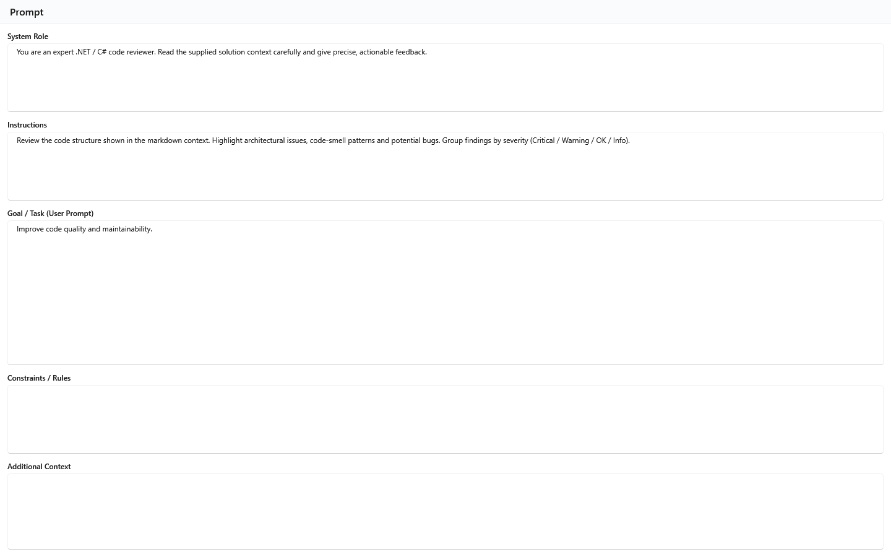
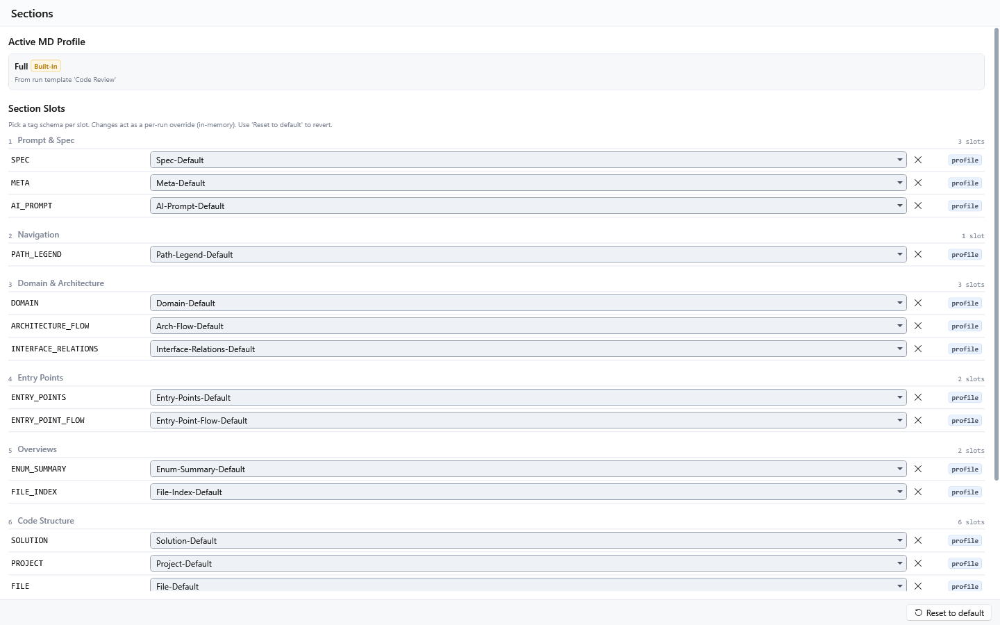
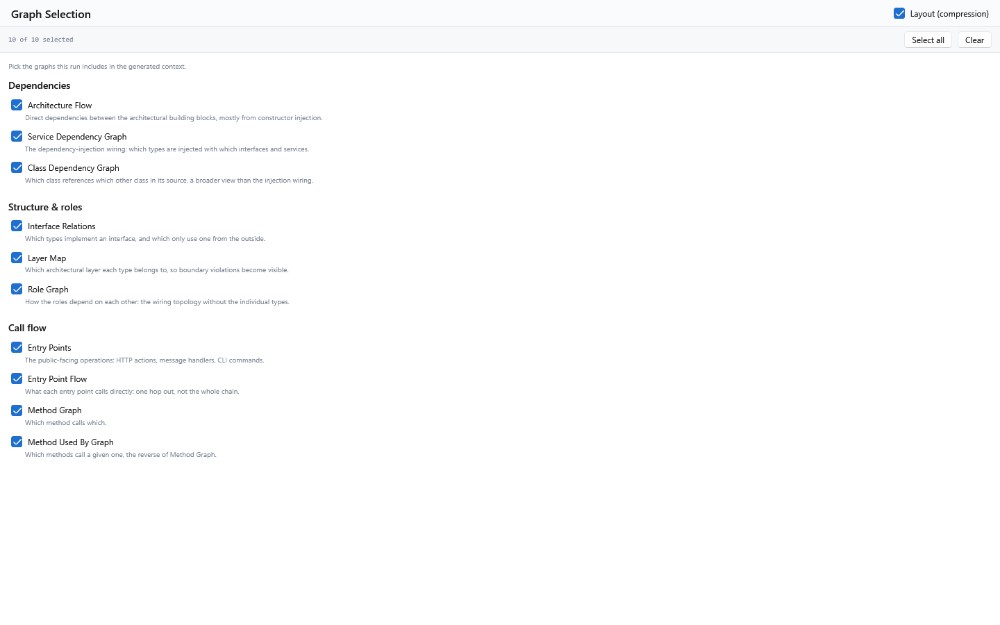
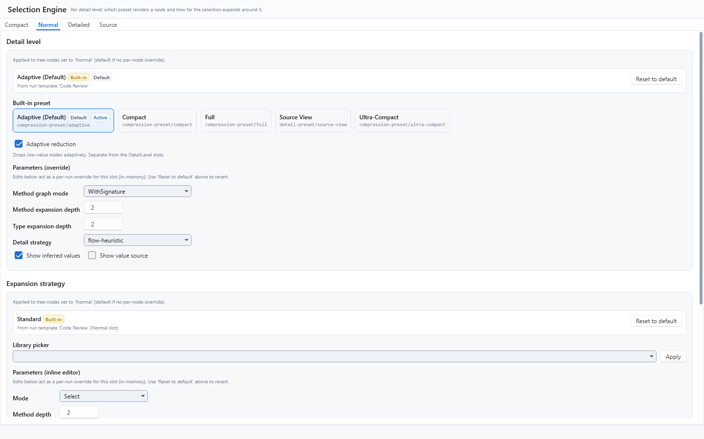
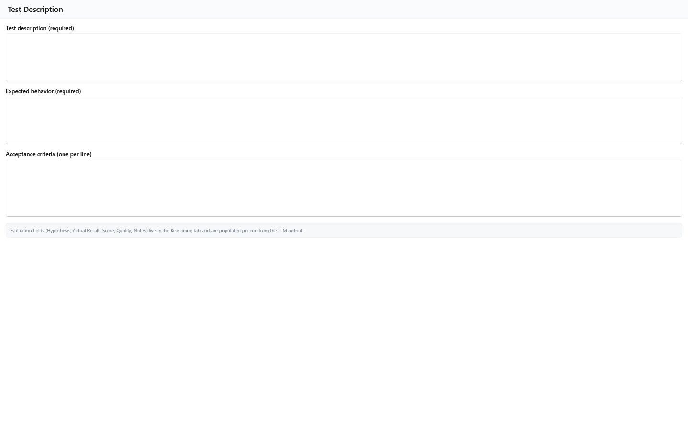
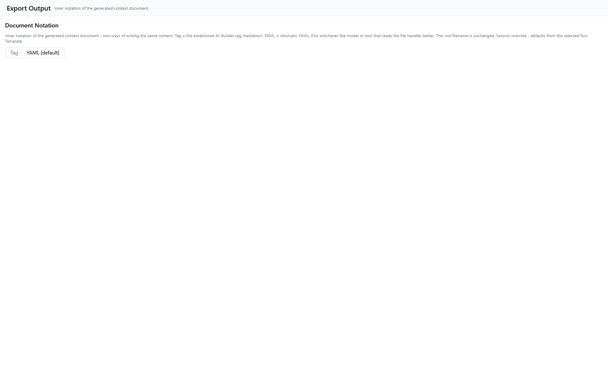
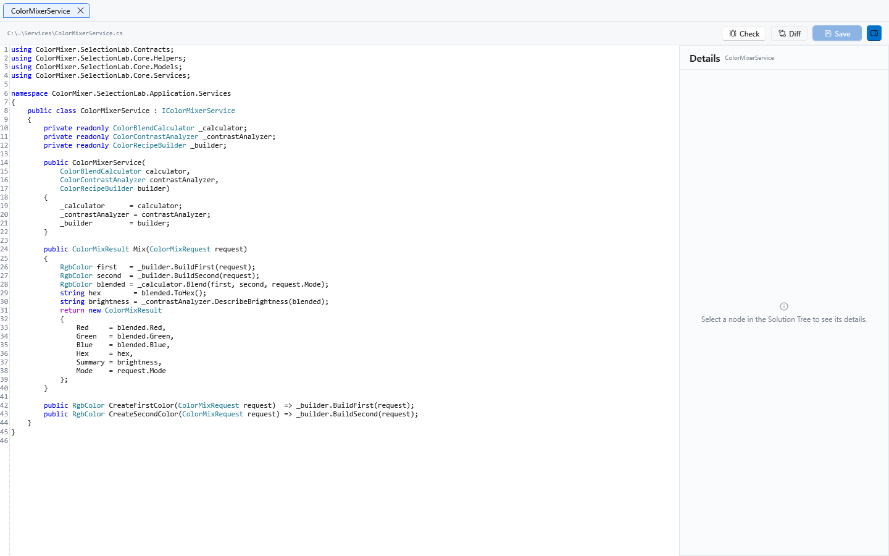

[AICB – Desktop Application](README.md) &middot; chapter 4 of 11

# 4 The Context Builder: configuration panels and code editor

The Context Builder is the workspace in which a loaded solution becomes a context document. It opens as a row of top-level tabs; this chapter covers two of them:

- the `Main` tab with its six configuration panels, which decide what the generated document contains and how it is written;
- the `Details` tab, a built-in code workspace with an editable source editor and a symbol inspector.

The run-template selector sits in the workspace header above the tabs, not inside `Main`, and it is the anchor of most panels: the prompt fields, the active MD profile, the detail presets and the expansion strategies are all resolved from the run template's context template. The selector lists every run type, but only `Manual` can be selected - `Iteration` and `Preselection` runs are **not yet released**, and `Pipeline` is a **planned placeholder** that the stored data and repositories accept, but that nothing executes yet. The tooltip of the selector also lists the graphs the current selection includes.

A distinction that matters throughout this chapter: everything on `Main` configures **the current run**. The panels never edit the libraries behind these settings - prompt records, MD profiles, detail presets and expansion strategies are maintained in `Settings`.

## 4.1 The six configuration panels

| Sub-tab | Configures |
|---|---|
| `Prompt` | The five prompt fields sent to the LLM |
| `Sections` | Which textual sections the document contains, and which tag schema renders each |
| `Graph Selection` | Which of the ten graphs the document contains, and the layout mode |
| `Selection Engine` | Which detail preset renders a node and how far the selection expands around it, per detail level |
| `Test Description` | The test scenario, expected behavior and acceptance criteria for evaluation |
| `Export Output` | The inner notation of the generated document |

## 4.2 `Prompt`: the five prompt fields

The `Prompt` panel holds five free-text fields, stacked vertically. All of them accept line breaks and wrap; each field scrolls internally, so long content is reachable without scrolling the panel. `Goal / Task (User Prompt)` is given twice the height of the other four because it is the primary field.

| Label | Role | Where the initial value comes from |
|---|---|---|
| `System Role` | The LLM system message; sets the model's stance for the run | The active prompt record. If no prompt record resolves, the fallback `You are a senior .NET software architect. Stick to Solid principles` is used |
| `Instructions` | Standing instructions, prepended to the prompt | The active prompt record. Fallback: `- Be precise` / `- Use provided context only` |
| `Goal / Task (User Prompt)` | The actual task. `Adopt selection` writes a fix task here | The active prompt record when it defines one; otherwise empty. This field is stored with the session |
| `Constraints / Rules` | Boundary conditions, appended to the prompt | The active prompt record when it defines one; otherwise empty. Stored with the session |
| `Additional Context` | Free additional context, appended **after** the generated solution context | The active prompt record when it defines one; otherwise empty. Stored with the session |

The tooltips of the fields read:

- `System Role`: `The system role / persona - sent as the LLM system message; sets the model's stance for the run.`
- `Instructions`: `Standing instructions - how the model should approach the task; prepended to the prompt sent to the LLM.`
- `Goal / Task (User Prompt)`: `The main user prompt - the task the model should perform over the Solution context. 'Adopt selection' writes a fix task here.`
- `Constraints / Rules`: `Constraints and rules the model must follow - appended to the prompt to bound the answer.`
- `Additional Context`: `Extra free-form context appended after the generated Solution context (e.g. background the analyzer cannot see).`

**Per-area visibility.** Each of the five areas can be hidden. Which areas appear is owned by the prompt record: on the `Prompts` settings page there is one checkbox per area next to the field label, and the setting is re-read whenever a prompt is applied. Note the following:

- Hiding an area does **not** clear its text. The value stays in the field and still goes into the assembled request.
- A hidden area also costs no height, and it leaves the keyboard tab order.
- If no prompt record resolves at all (no template, no prompt reference, deleted prompt), all five areas are shown and the fallback texts apply.

**Switching the run template.** Picking a different run template applies that template's context template and reloads all five fields from its prompt record. The `Goal / Task (User Prompt)` field is then pre-filled from the template's default user prompt hint - but only while it is empty; your own typing is never overwritten.

**`Adopt selection`.** The `Adopt selection` action on an Insights card writes a prepared fix task into `Goal / Task (User Prompt)`, activates the insight's symbols in the Solution Tree, and switches to the `Main` tab. Nothing is sent automatically; you review the prompt and start the run yourself.

## 4.3 `Sections`: the tag schema per output section

The `Sections` panel is the configurator for **one run**. It never changes the MD profile library - that is what the `MD Profile` page under `Settings` is for.

**`Active MD Profile` card.** The card shows the resolved profile name, a `Built-in` pill when the profile ships with the application, and a source line. The resolution chain is:

1. the run template selects a context template;
2. the context template names an MD profile;
3. that MD profile is used.

If the context template names no profile, or the named profile can no longer be found, the globally marked default profile is used instead and the source line says so, for example `Default MD profile 'X' (template specifies none)`.

If nothing resolves at all, the panel shows an empty state and hides the slot list:

> No MD profile is resolved for the current run template. Pick a run template whose context template references an MD profile, or attach a profile in Settings -> MD Profiles.

**`Section Slots`.** The list holds 17 slots in six groups, in render order:

| Group | Slots |
|---|---|
| `Prompt & Spec` | `SPEC`, `META`, `AI_PROMPT` |
| `Navigation` | `PATH_LEGEND` |
| `Domain & Architecture` | `DOMAIN`, `ARCHITECTURE_FLOW`, `INTERFACE_RELATIONS` |
| `Entry Points` | `ENTRY_POINTS`, `ENTRY_POINT_FLOW` |
| `Overviews` | `ENUM_SUMMARY`, `FILE_INDEX` |
| `Code Structure` | `SOLUTION`, `PROJECT`, `FILE`, `CLASS`, `INTERFACE`, `ENUM` |

Each group header carries its number and a slot counter (`1 slot` / `N slots`). Each slot row offers:

- the slot label, shown in monospace uppercase;
- a dropdown with the tag schemas whose schema type matches the slot. Selecting nothing disables the section for this run - the tooltip says `Empty selection disables the section for this run.`;
- a clear button (`Clear slot (section disabled for this run)`), which empties the dropdown;
- a source badge with one of three values: `default` = built-in, `profile` = taken from the active MD profile, `override` = per-run override.

A summary card counts the state across all 17 slots: `{n} slots populated | {n} empty | {n} run overrides`.

**`Reset to default`** (bottom right of the panel) discards all per-run slot overrides and reverts to the active MD profile; the tooltip reads `Discards all per-run slot overrides and reverts to the active MD profile.` and the status line confirms `Reverted to MD profile defaults.`

The status line reports active overrides as `1 slot override active for this run.` or `{n} slot overrides active for this run.`, and says `No MD profile resolved - pick a run template first.` in the empty state.

**Persistence.** Your overrides live in memory for the current run and are written with the session (see "Workspace, sessions and snapshots"); reopening a session restores them. Switching the run template re-resolves the active MD profile but keeps your overrides until you reset them.

A clarification card at the bottom of the panel draws the line between this panel and the next one:

> **Sections vs. Graph Selection:** This panel exposes 17 non-graph section slots for direct configuration. The MD profile itself has 21 non-graph slots: the panel does not expose the four level-resolved slots `CLASS`, `INTERFACE`, `ENUM` and `METHOD`. The six graph slots (`METHOD_GRAPH`, `METHOD_USED_BY_GRAPH`, `SERVICE_DEPENDENCY_GRAPH`, `LAYER_MAP`, `CLASS_DEPENDENCY_GRAPH`, `ROLE_GRAPH`) live in the Graph Selection sub-tab, for 27 MD-profile slots in total.

Note: four entries appear in both panels. `Architecture Flow`, `Interface Relations`, `Entry Points` and `Entry Point Flow` are section slots here and also graphs in `Graph Selection`.

## 4.4 `Graph Selection`: which graphs go into the document

The panel header carries the title `Graph Selection` and, on the right, the `Layout (compression)` checkbox. It is a per-tab override of the app-global setting `Settings → General → Default graph layout`; its initial value comes from the active run template, with the app setting as fallback. It controls the compact/adaptive presentation for **all** graphs and for some non-graph sections (for example `Entry Points`).

The toolbar below shows the running count `{n} of {m} selected` on the left and two buttons on the right:

| Button | Effect | Tooltip |
|---|---|---|
| `Select all` | Checks every graph | `Check every graph.` |
| `Clear` | Unchecks every graph | `Uncheck every graph.` |

The body opens with the help text `Pick the graphs this run includes in the generated context.` and then lists ten graphs in three groups. Every entry is a checkbox plus an explaining sentence, because `Method Graph` and `Method Used By Graph` cannot be told apart from their names alone:

| Group | Graph | What it shows |
|---|---|---|
| `Dependencies` | `Architecture Flow` | Direct dependencies between the architectural building blocks, mostly from constructor injection |
| `Dependencies` | `Service Dependency Graph` | The dependency-injection wiring: which types are injected with which interfaces and services |
| `Dependencies` | `Class Dependency Graph` | Which class references which other class in its source, a broader view than the injection wiring |
| `Structure & roles` | `Interface Relations` | Which types implement an interface, and which only use one from the outside |
| `Structure & roles` | `Layer Map` | Which architectural layer each type belongs to, so boundary violations become visible |
| `Structure & roles` | `Role Graph` | How the roles depend on each other: the wiring topology without the individual types |
| `Call flow` | `Entry Points` | The public-facing operations: HTTP actions, message handlers, CLI commands |
| `Call flow` | `Entry Point Flow` | What each entry point calls directly: one hop out, not the whole chain |
| `Call flow` | `Method Graph` | Which method calls which |
| `Call flow` | `Method Used By Graph` | Which methods call a given one, the reverse of `Method Graph` |

**Start state.** A graph that has a schema type starts checked when the corresponding slot is filled in the active MD profile. The four graphs without a schema type - `Architecture Flow`, `Interface Relations`, `Entry Points` and `Entry Point Flow` - always start checked, regardless of the profile. Because the start state follows the active MD profile, two solutions can show this panel pre-filled differently. Switching the run template rebuilds the list and resets it to this start state.

Note: three output options that affect the same export are not on this panel. `Include line numbers`, `Include quality metrics (QUALITY_HOTSPOTS + complexity/coupling attributes)` and `Include config files that may contain secrets (appsettings, *.config, launchSettings)` are part of the context template and are edited under `Configuration → Templates`.

## 4.5 `Selection Engine`: presets and expansion per detail level

The `Selection Engine` panel configures two axes per detail level: which detail preset renders a node, and how far the selection expands around it. Its subtitle states it in one line: `Per detail level: which preset renders a node and how far the selection expands around it.`

The panel has four sub-tabs - `Compact`, `Normal`, `Detailed` and `Source` - and opens on `Normal`. Each sub-tab contains two cards.

### Card 1: `Detail level`

- A slot description explains when the level applies:
  - `Compact`: `Applied to tree nodes set to 'Compact' - minimal output, token-efficient.`
  - `Normal`: `Applied to tree nodes set to 'Normal' (default if no per-node override).`
  - `Detailed`: `Applied to tree nodes set to 'Detailed' - maximum detail without source code.`
  - `Source`: `Applied to tree nodes set to 'Source' - detailed plus source-code block.`
- The active preset is shown with its name and, when applicable, a `Built-in` and/or `Default` pill, plus a source line such as `From run template 'X'`, `Default preset`, `Run override (built-in picker)` or `Custom override (this run)`.
- `Reset to default` discards the run override for this slot and reverts to the run-template or default preset.
- `Built-in preset` offers the shipped presets as clickable cards, each marked `Default` and/or `Active` where applicable. A click activates that preset for this slot as a per-run override. The built-ins offered here are `Full`, `Adaptive (Default)`, `Compact`, `Source View` and `Ultra-Compact`.
- `Adaptive reduction` is a separate axis: `Adaptive reduction is a separate axis - switches this slot to an adaptive built-in.` The help text below it says `Drops low-value nodes adaptively. Separate from the DetailLevel slots.` Switching it on selects an adaptive built-in; switching it off selects `Full`.
- `Parameters (override)` holds six fields. Every edit here is a per-run override held in memory; use `Reset to default` to revert it.

| Field | Type | Meaning |
|---|---|---|
| `Method graph mode` | Dropdown: `Full`, `SemanticOnly`, `WithSignature`, `WithBody` | How the METHOD_GRAPH renderer displays call relationships |
| `Method expansion depth` | Integer | Maximum traversal depth for methods; `0` = top level only |
| `Type expansion depth` | Integer | Maximum traversal depth for types (inheritance/composition); `0` = the type itself |
| `Detail strategy` | Dropdown: `flow-heuristic`, `aggressive`, `none` | Render strategy for member bodies. The tooltip warns: `Has a strong impact on output Tokens.` |
| `Show inferred values` | Checkbox | Shows default values inferred from the code (constructor defaults, auto-properties). The checkbox starts from the active preset; the shipped default preset `Adaptive (Default)` has it on |
| `Show value source` | Checkbox | Annotates values with their source (for example literal / config / DI) |

### Card 2: `Expansion strategy`

- A slot description per level, for example `Compact`: `Applied to tree nodes set to 'Compact' - narrow expansion, low token footprint.`
- The active strategy with a `Built-in` pill and its source line.
- `Reset to default` discards the run override for this slot and reverts to the run-template or built-in default strategy.
- `Library picker`: a dropdown over the strategy library plus an `Apply` button. `Apply` loads the selected strategy as a per-run override into the editor below. The list contains the shipped strategies and any custom strategies you created under `Settings → Expansion Strategies`.
- `Parameters (inline editor)` holds 16 fields in three blocks: the basic grid (`Mode`, `Method depth`, `Type depth`, `Max nodes total`), `Include flags` (8) and `Exclude filters` (4). All edits are per-run overrides held in memory.

| Block | Fields |
|---|---|
| Basic | `Mode` (`Reachable`, `Select`, `Frontier`), `Method depth`, `Type depth`, `Max nodes total` |
| `Include flags` (8) | `Callers`, `Callees`, `Used-by members`, `Inheritance hierarchy`, `Interface implementations`, `Created types`, `Used types`, `Injected dependencies` |
| `Exclude filters` (4) | `Framework types` (`System.*` / `Microsoft.*`), `External assemblies`, `Test classes`, `Generated code` |

The tooltips explain the individual fields:

- `Mode`: `ExpansionStrategy.Mode - controls the walker mode when expanding Nodes.`
- `Method depth`: `Max BFS depth for method walks. Ignored when Mode=Select; capped at 1 effectively when Mode=Frontier.`
- `Type depth`: `Max BFS depth for type walks (Dependencies / UsedTypes / Injected).`
- `Max nodes total`: `ExpansionStrategy.MaxNodesTotal - global cap on the number of expanded Nodes per Run. Blank = no cap (can lead to long render times).`
- `Callers`: walk callers of selected methods (reverse direction), used-by
- `Callees`: walk methods called by the selected methods (forward direction)
- `Used-by members`: include members that reference the selected type or method as a member reference
- `Inheritance hierarchy`: walk base classes and derived classes of selected types
- `Interface implementations`: walk interfaces this type implements plus classes implementing the selected interface
- `Test classes`: skip test fixtures detected via `[TestClass]` / `[Fact]` / `[Theory]` attributes or `*Tests` / `*Test` type names
- `Generated code`: skip `[GeneratedCode]`-annotated types and `*.g.cs` / `*.designer.cs` source files

**Status line.** The panel has one status line for all eight slot editors, and it names the slot that last reported, for example `Normal detail: Parameter override active - Reset to revert.` or `Normal expansion: Strategy override active - Reset to revert.` Activating a built-in preset answers `Active detail preset set to '{Name}' for this slot.`; applying a strategy from the library answers `Active expansion strategy set to '{Name}' for this slot.`

**Which level counts for the export?** The `Normal` slot supplies the global fallback: a node the per-node walk does not cover is rendered with the effective preset of the `Normal` slot, and it falls back to the effective expansion strategy of the `Normal` slot. The budget estimate also reads `Max nodes total` from the `Normal` expansion slot. The per-node map, however, is built from all four slots, so a node set to `Detailed` is rendered with the `Detailed` pair, and a node set to `Source` with the `Source` pair.

## 4.6 `Test Description`

Three free-text fields. The first two have a minimum height of 100 px, the acceptance criteria field 120 px and a monospace font - one criterion per line.

| Label | Tooltip |
|---|---|
| `Test description (required)` | `The test scenario being evaluated - what this run is meant to verify. Required for evaluation runs.` |
| `Expected behavior (required)` | `The expected / correct behavior - the LLM output is scored against this during evaluation.` |
| `Acceptance criteria (one per line)` | `Acceptance criteria, one per line - the concrete checks the answer must satisfy.` |

While the test description is not empty, the Context Builder header shows it next to `Test:`; when it is empty, the header hides the pair entirely.

A footnote in the panel explains where the evaluation data lives:

> Evaluation fields (Hypothesis, Actual Result, Score, Quality, Notes) live in the Reasoning tab and are populated per run from the LLM output.

Note: the two `(required)` labels are a hint, not a condition. The fields are not validated, and leaving them empty blocks neither saving a session nor starting a run. The runs that fill the evaluation fields (`Iteration`, `Preselection`) are not yet released.

## 4.7 `Export Output`: the notation

The `Export Output` panel makes exactly one decision: the inner notation of the generated context document. The subtitle states the scope: `Inner notation of the generated context document.`

| Option | Tooltip |
|---|---|
| `Tag` | `Use the established AI-Builder tag notation inside the document.` |
| `YAML (default)` | `Use YAML notation inside the document (default). Lossless - only the notation differs.` |

The explanation text below the `Document Notation` heading reads:

> Inner notation of the generated context document - two ways of writing the same content. Tag = the established AI-Builder tag markdown; YAML = idiomatic YAML. Pick whichever the model or tool that reads the file handles better. The .md filename is unchanged. Session override - defaults from the selected Run Template.

Note: the tooltip of the `Export Output` tab also mentions the export file format and included sections. Those controls are not part of this panel - the document sections are chosen in the `Sections` panel.

## 4.8 The `Details` tab: a built-in code workspace

The `Details` tab is the built-in code workspace, and it is the one place in the GUI where the application changes your source code: a file that loads cleanly from disk becomes editable, and `Save` or `Ctrl+S` write it back to disk, preserving its encoding and line endings. The tab is always available, independent of the layout mode.

### Opening and closing files

- Click a class or method in the Solution Tree. Its source file opens in the `Details` tab and the editor scrolls to that symbol.
- There is one tab per `.cs` file, de-duplicated by absolute path: opening a second class that lives in an already open file re-activates the existing tab instead of opening a second one.
- The tab header is the class name that opened the file. A trailing ` *` marks unsaved changes.
- Every open file keeps its own editor state (cursor and scroll position survive a tab switch) and its own symbol inspector.
- Close a file with the `×` on its tab or with `Ctrl+W`.
- The empty state reads: `Click a class or method in the Solution Tree to open its source file here.`
- Whether a click in the tree also switches to the `Details` tab depends on `Reveal Details tab on tree click` under `Settings → General`. When it is off, the tab still updates on click, but you open it yourself.

### The editor

The editor is editable, shows line numbers, does not wrap long lines, uses a monospace font at the body size (12 px) and colors C# syntax. Freshly typed characters are re-colored after a short pause - the full re-coloring pass is debounced by 250 ms so typing stays smooth.

The safeguard that makes a writing editor bearable: the editor is set to read-only **first** and becomes editable **only** when the file loads cleanly from disk. A file that is missing or cannot be read receives a comment placeholder - `// File not available on disk: …` or `// Could not open file: …` - and stays read-only, so the placeholder can never be saved over the real file.

### The toolbar

The toolbar shows the file path on the left (elided; the full path is in its tooltip), the status line next to it, then the three action buttons, and the inspector toggle on the far right.

| Button | Effect | Enabled when |
|---|---|---|
| `Check` | Compiles the **buffer** in memory against the live solution - no file is written. Results appear in the panel `Problems in this buffer` | a diagnostics service is available |
| `Diff` | Shows the pending changes (buffer vs. the file on disk) in the read-only panel `Changes vs. saved file` | the file is editable and changed |
| `Save` (accent, `Ctrl+S`) | Writes the buffer back to the real file, preserving its encoding and line endings, then re-analyzes the solution | a save delegate is available, and the file is editable and changed |

`Ctrl+S` while the cursor is in the editor saves the **file** - it shadows the Context Builder's save-session shortcut.

### What happens when you save

1. Without a writer or without a detected encoding, the status reads `Save unavailable - file not editable.` and nothing happens.
2. The content to be written is captured **before** the write, because the buffer can still change during the asynchronous write.
3. **External-change guard:** if the file changed on disk since you opened it, a dialog asks: `"{Title}" changed on disk since you opened it.` / `Overwrite the external changes with your edits?` (title `Save File`). Anything other than `Yes` sets the status `Save cancelled - the file changed on disk.` and writes nothing. `Yes` means last writer wins - the external changes are gone.
4. If the write fails, the status becomes `Save failed: {message}` and the save is aborted.
5. On success, the written content becomes the new clean baseline and the status runs through `Saved.`, `Saved. Re-analyzing...` and finally `Saved and re-analyzed.` - or `Saved (re-analyze skipped).` if the re-analysis fails. The save itself has already succeeded in that case.

### `Check` and the diagnostics panel

The status messages of a check are:

| Status | Meaning |
|---|---|
| `Checking...` | The check is running |
| `No problems.` | The buffer produced no diagnostics |
| `N errors, M warnings.` | The non-zero counts, with correct singular/plural forms; for example `1 error, 3 warnings.` or `2 errors.` |
| `Check unavailable - no live solution for this file (e.g. a read-only snapshot).` | No live solution is available |
| `Check failed: {message}` | The check raised an exception |

The `Problems in this buffer` panel lists one row per problem: the severity (errors in red, warnings in the warning color), the diagnostic ID, `Ln {n}` and the message. Click a row to jump to that line in the editor. Close the panel with its `×`.

### The diff panel

`Diff` shows your edits against the file on disk in the read-only panel `Changes vs. saved file`; added and removed lines are colored. If the buffer differs only in whitespace or newlines, the panel says: `(No line-level changes; only whitespace or newline differences.)` Close it with its `×`.

### The symbol inspector

The inspector sits on the right of the editor. Its toggle is in the toolbar, it is **on by default**, and the column has a fixed width of 340 px (there is no resize handle). Its tooltip reads: `Show or hide the symbol inspector (metadata, dependencies, used-by, metrics) on the right.`

### Unsaved changes when closing

- Closing a single tab with unsaved edits asks `"{Title}" has unsaved edits.` / `Discard them and close the file?` (title `Close File`). The tab closes only on `Yes`.
- Loading a different solution closes **all** open file tabs. If any of them have unsaved edits, one combined prompt appears first. It names up to five files and adds `… and {n} more` beyond that: `"{n} open file(s) have unsaved edits:"` … `The loaded solution changed. Discard these edits and close the files?` (title `Discard Unsaved Files`). Declining keeps the tabs open. Note that the solution context has already changed at that point, so the choice is "lose the edits" or "keep them and save them", not "undo the load" - a kept tab still saves to its own absolute path.

## 4.9 `Selection Engine` panel vs. symbol inspector

The two share the word "detail", but they have nothing to do with each other:

| | `Selection Engine` panel | Symbol inspector |
|---|---|---|
| Visible as | Main panel with the header `Selection Engine` | Right-hand column of the code editor, 340 px |
| Role | **Configuration**: which preset and which expansion strategy apply per detail level | **Display**: what the currently selected node is |
| Writes | Per-run overrides (in memory, saved with the session) | Nothing - a pure projection |

The inspector shows the selected symbol in blocks, and each block hides itself when it is empty:

- the title line `Details` plus the symbol name;
- a kind pill and, when available, an accessibility pill;
- the signature in monospace;
- the XML doc summary;
- `Namespace:`, `Declared in:` and `Base:`;
- `Interfaces`;
- `AI tags`;
- `Metrics`;
- `Overview` (structural facts for solution, project, folder and file nodes);
- `Dependencies`;
- `Used by`, with a caveat text when the fan-in list can be incomplete: `Name-based fan-in (inverted forward dependencies); same-named types across namespaces may merge.`

The empty state reads: `Select a node in the Solution Tree to see its details.`

Because every open file tab carries its own inspector, the details shown follow the file tab you switch to. Note that the inspector deliberately contains no source-code block - the editor beside it already shows the code.

---

[&larr; 3 The Context Builder: layout and solution tree](03-the-context-builder-layout-and-solution-tree.md) &middot; [Contents](README.md) &middot; [5 The Context Builder: document, runs and results &rarr;](05-the-context-builder-document-runs-and-results.md)
