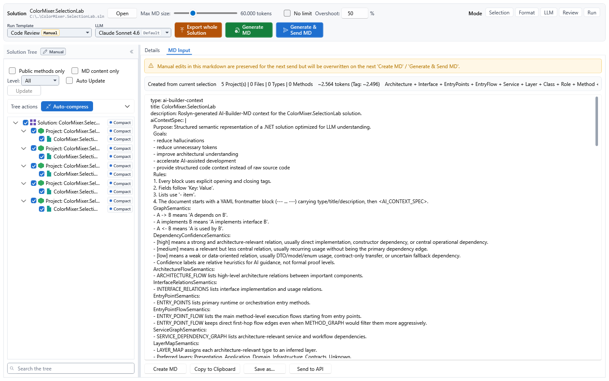
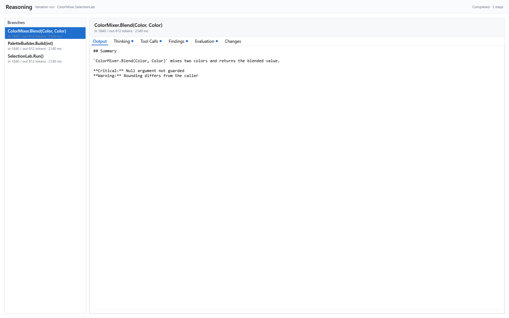
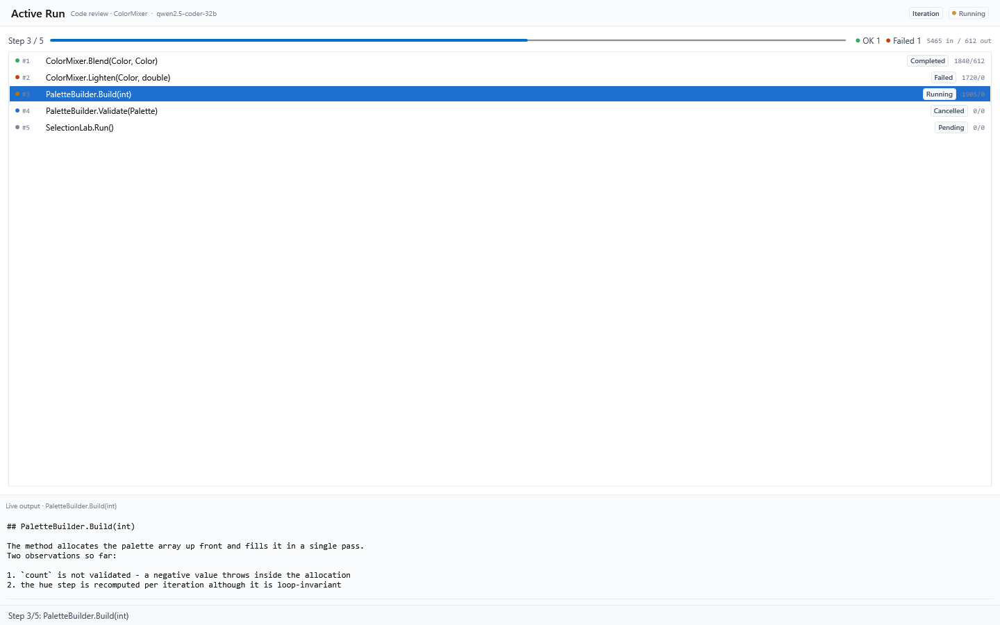

[AICB – Desktop Application](README.md) &middot; chapter 5 of 11

# 5 The Context Builder: document, runs and results

The Context Builder is the workspace in which a loaded solution becomes a context document. It is where you decide what goes into the document, how the document is shaped and where you send it to a model — and where you read what the model answered. Each solution you open gets its own tab; the tab header shows the solution file name and appends ` *` while there are unsaved changes.

The workspace has three fixed parts:

- the **global header** above everything: solution identity with `Open`, the `Max MD size` budget, the mode chips, and the run-template group with the run actions;
- the **Solution Tree** in the left sidebar — the scope selector for everything you render. It can be collapsed to a slim rail; its width is remembered;
- the **tab area** on the right: the configuration panels, the document, the model response and the run views.

## 5.1 Finding your way

Which tabs and panels are visible depends on the five mode chips in the header (`Selection`, `Format`, `LLM`, `Review`, `Run`); they are described in "The Context Builder: layout and solution tree". `Details` and `MD Input` are always visible. `Reasoning` and `Active Run`, described below, need the `Run` chip.

## 5.2 The run template and the run actions

The run-template group of the header carries two selectors and three actions.

- `Run Template` — selects the run template for this tab. Picking one switches the active context template, reloads the prompt fields from it and fills `Goal / Task (User Prompt)` from the template — but only while that field is still empty; text you have typed is never overwritten. The current view shows no confirmation message for this switch.
- `LLM` — selects the model-profile override for subsequent sends from this tab. The first entry carries a `Default` badge and stands for the standard resolution order (model pinned by the run template → profile marked as default → first profile). The choice remains active until you select another entry, close the tab or restart the application.

| Action | What it does | Shortcut |
|---|---|---|
| `Export whole Solution` | Renders the entire solution into `MD Input`, ignoring the tree selection. | — |
| `Generate MD` | Renders the current tree selection into `MD Input` — the same action as `Create MD` on the `MD Input` tab. | Ctrl+M |
| `Generate & Send MD` | Renders the current selection and sends it immediately. | Ctrl+Enter |

Below the actions, `Recent runs:` shows up to three chips for the most recent runs of the current session (run number, name, run type, status, time). The row is hidden while there are none.

## 5.3 The `MD Input` tab — the generated document

This is where every render lands. Its tooltip reads `The generated markdown context - review or edit it, then send it to the LLM.`

A permanently visible warning banner sits above the document: `Manual edits in this markdown are preserved for the next send but will be overwritten on the next 'Create MD' / 'Generate & Send MD'.`

Below the banner a card reports what the document contains:

| Field | Content |
|---|---|
| `Created from current selection` | fixed label |
| selection summary | `N Project(s) | N Files | N Types | N Methods` |
| token estimate | `~12,400 tokens` — measured with the tokenizer of the resolved model profile (fallback: the default tokenizer). When the notation rewrite produced a different size than the tag baseline, the baseline is added: `~12,400 tokens (Tag: ~10,900)` |
| graphs | the graph sections actually present in the document, as short labels joined with ` + ` (for example `Architecture + Service + Layer`); `-` when the document contains none |
| code mode | `Enabled` or `None` — whether any node contributed source code |

The document itself is an editable text box with a permanently visible scrollbar. Your edits are taken over when the box loses focus, not on every keystroke, so a large whole-solution document stays responsive.

### The buttons under the document

| Button | Action |
|---|---|
| `Create MD` | Regenerates the document from the current tree selection and the panel settings — no API call. Tooltip: `Generates the MD output from the current Tree selection + Template settings - no API call. The text can then be edited and 'Send to API' pressed. (Ctrl+M)` |
| `Copy to Clipboard` | `Copies the current MD input text to the clipboard (e.g. for manual pasting into an external LLM tool).` |
| `Save as…` | `Writes the current MD input text to a .md file you pick. Disabled while there is nothing to save.` |
| `Send to API` | `Sends the current MD input to the active LLM (or the Override-selected one). The response appears in the 'LLM Response' tab.` |
| `Cancel` | Visible while a request is running: `Aborts the running LLM request - the server may still finish computing, but the response is discarded.` |
| `Pause` | Visible while a request is running: `Pauses the iterative Run after the current step (Iteration Run Templates only).` |
| `Resume` | Visible while a run is paused: `Resumes a paused iterative Run.` |

To the right of the buttons the status line reports the progress and the result of the last action.

`Save as…` opens a save dialog titled `Save context document` with the filter `Markdown files (*.md)|*.md|All files (*.*)|*.*`. The suggested name is derived from the loaded solution — `<SolutionName>-context.md` — so a folder of saved documents does not end up as a pile of files all called `context.md`. On success the status line reads `Context document saved to <path>`; on failure it reads `Save failed: <message>`.

### The `LLM Response` tab

The response to the last send. The text box is editable, and the buttons below it are:

- `Copy to Clipboard` — `Copies the LLM output to the clipboard. (Ctrl+Shift+C)`.
- `Use as MD input` — `Copies the LLM output into the markdown input (tab 'MD Input') so a follow-up run can iterate on the previous answer.` The view switches to `MD Input` and the status line confirms with `LLM output copied to MD input.` The button is disabled while the response is empty.

### What happens when you press `Send to API`

A send runs in phases, and each phase has a visible outcome in the status line.

**Preflight.** The send is validated before anything is transmitted. A failed preflight writes `Send failed: ` plus the reason:

| Situation | Message |
|---|---|
| the document is empty | `no markdown to send. Run Create MD first.` |
| no model profile exists | `no model profiles defined. Settings > Model Profiles.` |
| an API profile has no key | `API key for model '<name>' is missing. Settings > Model Profiles.` |
| no executor for the run type | `RunType '<type>' is not supported. Only Manual, Iteration and Preselection runs can be started.` |
| an iterative run without a loaded solution | `no solution loaded.` |
| an iterative run without selected nodes | `no <granularity>-nodes selected in the tree. Mark some nodes first.` |

**Budget confirmation.** For `Iteration` and `Preselection` runs (not yet released, see "Run types: what is released") a cost estimate runs before the send and a dialog can warn that the configured node cap would be exceeded. If you decline that dialog, nothing happens — no request is sent and no status message is written.

**Auto-session.** When a solution is loaded, every run is stored with a session. If the tab has no session yet, one named `Untitled` is created automatically so the run is persisted; the status line appends ` · Auto-session 'Untitled ...' created - rename it via the Sessions tab.` You can rename it later on the `Sessions` tab (see "Workspace, sessions and snapshots"). Without a loaded solution, the run can still execute, but no auto-session or snapshot is created and the status reports `(not persisted - open a solution first)`.

**Execution with streaming.** The status line shows `Sending to <model> ...`. For a manual run the answer streams live into `LLM Response`, and the view switches there with the first chunk.

**Completion.** On success the status line reads `Done. <model> · <ok>/<total> nodes · in <n> / out <m> tokens`, followed by the auto-session note when one was created. A manual run leaves you on `LLM Response`. On failure it reads `Send failed: <reason>`.

**Post-processing.** The answer is then examined for thinking blocks, tool calls, findings and an evaluation; the `Reasoning` tab is reloaded for the finished run and the `Recent runs:` row is refreshed.

While a request is running, `Cancel` and `Pause` are available. `Cancel` writes `Cancelling ...`, `Pause` writes `Pausing at next step boundary ...`. `Resume` continues a paused iterative run and reports `Resumed run completed. <ok>/<total> nodes.` (or `Paused again at step boundary.` / `Resume failed: <reason>`).

Note: A `Manual` run has no pre-flight cost estimate — it starts as soon as you press the button. The confirmation dialog exists only for `Iteration` and `Preselection`.

## 5.4 The `Reasoning` tab — what the model did

The `Reasoning` tab shows a finished run branch by branch. It requires the `Run` mode chip.

The header shows the run's name and its status. On the left, `Branches` lists the steps the run was split into; each entry shows the branch name and, as a subtitle, its token usage and latency (`in <n> / out <m> tokens · <ms> ms`) or the error message if the branch failed. Empty state: `No run analyzed yet. Branches appear after a run completes.`

For the selected branch there are six sub-tabs. A small dot in a tab header marks that the selected branch has content for that sub-tab.

| Sub-tab | Content | Empty state |
|---|---|---|
| `Output` | the raw model output, read-only | — |
| `Thinking` | the model's thinking blocks | `No thinking blocks in this step. Thinking is requested through the system prompt, and the model answers with <thinking>...</thinking> tags - a model that does not use them produces no blocks here.` |
| `Tool Calls` | the tool-use calls parsed from the answer | `No tool calls in this step. Tool calls are read from <tool_use>...</tool_use> tags in the model's answer.` |
| `Findings` | findings parsed from the answer, filterable by severity | `No findings to show. Either this step produced none, or the severity filters above are hiding them.` |
| `Evaluation` | `Hypothesis`, `Actual result`, `Score`, `Quality` and `Notes` | `No evaluation in this run. The parser looks for Hypothesis / Result / Score / Quality sections in the LLM output.` |
| `Changes` | files the answer proposed a new state for, diffed against the working tree | `No diff to show. A diff appears when the answer states the full content of a file it changed and that file is found in the loaded solution - which is what the Code Change prompt asks for.` |

**Findings here are not the Insights.** The `Findings` sub-tab shows what the model itself reported in its answer, sorted into the four severity categories `Critical`, `Warning`, `OK` and `Info` (the answer marks them as `**Critical:**`, `**Warning:**`, `**OK:**` and `**Info:**`). All four filters are on when the tab opens; clear a filter to hide that severity. The separate `Insights` tab (mode chip `Review`) is about your code, not about the answer — it holds the application's own code-quality heuristics for the loaded solution. Two different sources, two different tabs.

### `Changes` — the proposed file states

Above the file list a summary line states how many files the answer proposed and how many were resolved against the working tree: `<n> file(s) proposed, <m> resolved against the working tree.` If the answer did not use the expected block form, the summary says so instead: `This answer states no file content in the applicable form. The Code Change prompt is the one that asks for it.`

A proposed path that cannot be shown as a diff is named together with its reason:

| State | Displayed text |
|---|---|
| no solution loaded | `No solution loaded - the path cannot be resolved.` |
| resolved | the absolute path |
| ambiguous | `Ambiguous - <n> files of this solution match this path.` |
| found, unreadable | `Found but unreadable: <path>` |
| too large | `Too large to show as a diff: <path>` |
| not found | `No file of this solution matches this path.` |

Selecting a file shows a unified diff between the file on disk and the state the answer proposed. When the two are identical, the diff pane says `(No line-level changes; the proposed content matches the file on disk.)` Malformed blocks are reported in warning color above the list — for example an unterminated block (usually the answer hit its output limit mid-file), a block without a path, empty content, a path named twice, a stray closing marker, or content wrapped in a Markdown fence (stripped, so the file is still usable).

Note: The `Changes` sub-tab is a view only. There is no button that applies a proposed change; to edit a file and write it back, use the `Details` tab.

## 5.5 The `Active Run` tab — progress while a run is running

The `Active Run` tab requires the `Run` mode chip. Its header carries the title `Active Run`, the run name and the model, a run-type pill and a status pill that switches between `Running` and `Complete`.

| Display | Meaning |
|---|---|
| `Step <n> / <m>` with a progress bar | the current step of the run |
| `OK <n>` | successfully completed steps |
| `Failed <n>` | failed steps |
| `<n> in / <m> out` | input and output tokens of the whole run |

The step list shows one row per step: its number (`#1`), its name, a status pill (`Pending`, `Running`, `Completed`, `Failed`, `Cancelled`, `Skipped`) and the step's own token count as `<in>/<out>` (tooltip `Input / output tokens of this step.`). The status is also color-coded on the dot in front of each row.

Select a step to read what it streamed: a pane under the list titled `Live output · <step>` shows the model output that step produced, with the tooltip `Model output streamed by this step. Select text to copy.` The first output of a run opens this pane automatically; after that your own selection decides.

Empty state: `No run started yet. Steps appear here as soon as a run is running.`

Note: Only `Manual` runs are released, and a manual run is a single request — it appears here as one step named after the run. The multi-step view is what an iterative run will show once it is released.

## 5.6 Token, cost and progress displays

| Where | Display | Updated by |
|---|---|---|
| Header | `Max MD size` (target tokens) and `Overshoot %` | your input |
| Header | `+X% over budget` — how far the last document actually exceeded the target; empty when within budget | the last render |
| `MD Input` header | token estimate, selection summary, active graphs, code mode | the last render |
| `MD Input` status line | `Done. <model> · <ok>/<total> nodes · in <n> / out <m> tokens` | the end of a send |
| `Active Run` | step counter, OK/Failed, tokens in total and per step | live progress |
| Load overlay | a percentage plus a detail line such as `142 / 318 files` | solution analysis progress |
| Export overlay | an indeterminate ring plus `Rendering whole solution...` | a whole-solution render |
| `Sections` panel | `<n> slots populated | <n> empty | <n> run overrides` | slot changes |
| `Graph Selection` panel | `<n> of <m> selected` | checkbox changes |
| Tree sidebar | selection provenance and `<n> overrides` | your tree edits |

Note: Token counts are always available. A pre-flight dialog also shows `Estimated cost: $X.XX USD` when input and output prices have been entered on the selected model profile; without those prices, no cost is shown.

## 5.7 From solution to context document, step by step

The following walkthrough follows the five decision points that measurably change the result: scope, detail and sections, prompt, budget, and the way the document leaves the application.

### 1. Choose the scope

Check the nodes that belong in the document in the Solution Tree and, where needed, set a detail level with the chip at the end of a row. `Auto-compress` in the tree toolbar sets a sensible level for every method in one click; `MD content only` shows exactly what will end up in the document. Details: "The Context Builder: layout and solution tree".

### 2. Shape detail, sections and graphs

With the `Selection` and `Format` chips on, the `Main` tab offers the `Selection Engine` (detail preset and expansion strategy per detail level), `Sections` (a tag schema per text section, or none), `Graph Selection` (which of the ten graphs to include) and `Export Output` (`Tag` or `YAML` notation). All of them have usable defaults from the run template. Selection Engine and Sections overrides are stored with the session; Graph Selection and the Tag/YAML choice are reloaded from the run template when the session is opened or the template changes and are not session-persisted. Details: "The Context Builder: configuration panels and code editor".

### 3. Write the prompt

With the `LLM` chip on, the `Prompt` panel holds the five fields that are sent with the document: `System Role` and `Instructions` come from the context template's prompt record, `Goal / Task (User Prompt)`, `Constraints / Rules` and `Additional Context` are yours and are stored with the session. The goal is the one field you normally fill in.

### 4. Set the budget

`Max MD size` in the header caps the document (8,000 to 200,000 tokens, default 60,000 from the active pipeline profile); `No limit` switches the cap off, and `Overshoot:` sets the tolerated headroom above the target. The renderer converges on the target by lowering detail and dropping the least relevant content, never by cutting a block in half; `+X% over budget` reports what the last render actually used.

### 5. Render the document

| Action | Scope | Shortcut |
|---|---|---|
| `Create MD` (on `MD Input`) | the current tree selection plus all panel settings | Ctrl+M |
| `Generate MD` (in the header) | the same render, from the same selection | Ctrl+M |
| `Export whole Solution` (in the header) | the entire solution, ignoring the tree selection and needing no analysis run | — |
| `Generate & Send MD` (in the header) | renders the current selection and sends it immediately | Ctrl+Enter |

All of them write their result to the same place: the document in `MD Input`, and the view switches there.

Details of `Export whole Solution`:

- The heavy render runs off the UI thread. A dimmed overlay with a spinner and the text `Rendering whole solution...` blocks the workspace until it is done, and the window stays responsive.
- The solution is already analyzed, so this does not analyze it again.
- A second click while a render is running is ignored.
- The button has no disabled state: a missing solution or a missing context template is reported in the status line instead — `No solution loaded - open a solution first.` or `No active context template - cannot render the whole solution.` A render error is reported as `Export failed: <message>`.
- It does not change your tree selection.

### 6. Get the document out

You have three ways out of the application:

- **`Save as…`** on the `MD Input` tab writes the document to the `.md` file you choose.
- **`Copy to Clipboard`** copies it for pasting into another tool.
- **`Send to API`** (or `Generate & Send MD`) sends it to the configured model and shows the answer in `LLM Response`.

### 7. Save your work

The tree state is expensive to reconstruct, so the workspace tracks unsaved changes and marks the tab header with ` *` while there are any. Three situations ask you to save: the explicit save command, closing a tab, and closing the window.

- **`Save Session`** in the tab bar (Ctrl+S) saves the current tab as a session. The dialog is pre-filled with a name of the form `<SolutionName> - <date> <time>` and the notes of an existing session. If the state is unchanged since the last save, a dialog asks whether to overwrite anyway. If the chosen name already exists for this solution, a dialog offers to save anyway or to go back and pick another name. On success a message confirms `Session "<name>" saved.` (or `updated.`) together with the number of selected nodes and the active template.
- **Closing a tab** (Ctrl+W, or the close button on the tab) with unsaved changes asks `Save before closing?`. `Yes` saves all unsaved sessions in the tab — if one save fails or is cancelled, the tab stays open. `No` discards the changes. `Cancel` aborts the close. The question can be switched off with the `Tab-close confirmation` setting under Settings → General; clearing that setting makes such a tab close straight away and discard its unsaved edits.
- **Closing the application** always asks, whatever the `Tab-close confirmation` setting says, because one unasked confirmation would discard every unsaved session at once.

**Auto-save** persists your work in the background. It is on by default and saves every 5 minutes; `Auto-save enabled` and `Auto-save interval (minutes)` under Settings → General configure the timer (values below one minute are raised to one), but changes take effect only after the next application start. Auto-save skips only tabs without a session ID; the `Untitled ...` session created by a first send is included even if it was never named through the dialog. If an auto-save fails, a warning appears once per session: `Auto-save could not save one of your open sessions. Your changes remain unsaved, and other tabs will continue to auto-save. Use Save Session to retry and see any detailed error.`

**Two access points and one lock.** The `+` button in the tab bar opens another solution tab (`New Solution tab (Ctrl+N)`), and `Save Session` sits next to it. The host carries three shortcuts: Ctrl+S saves the session, Ctrl+N opens a new tab, Ctrl+W closes the current tab. While a run is active in any tab, the whole tab bar is disabled so you cannot switch tabs and lose the run state — clicks on it simply do nothing until the run has finished.

## 5.8 Run types: what is released

| Run type | Status |
|---|---|
| `Manual` | Released. One request over the current document. This is the type you select in the workspace. |
| `Iteration` | Not yet released. One request per selected node; the executors are wired, but the type cannot be selected yet. |
| `Preselection` | Not yet released, same as `Iteration`. |
| `Pipeline` | Planned. It is accepted by the stored data, but nothing executes it. |

The `Run Template` selector lists every template, but only templates of type `Manual` can be chosen; the other entries are shown disabled with a tooltip explaining that they are not released yet. The entry that is already selected stays selectable regardless of its type, so you can always return to it.

Because only `Manual` runs are released, the `Active Run` tab normally shows a single step. Manual runs do not use the cost-threshold confirmation, but a pre-flight dialog can still appear when the selected model profile defines a context window and the request would exceed it.

---

[&larr; 4 The Context Builder: configuration panels and code editor](04-the-context-builder-configuration-panels-and-code-editor.md) &middot; [Contents](README.md) &middot; [6 Insights in the desktop app &rarr;](06-insights-in-the-desktop-app.md)
