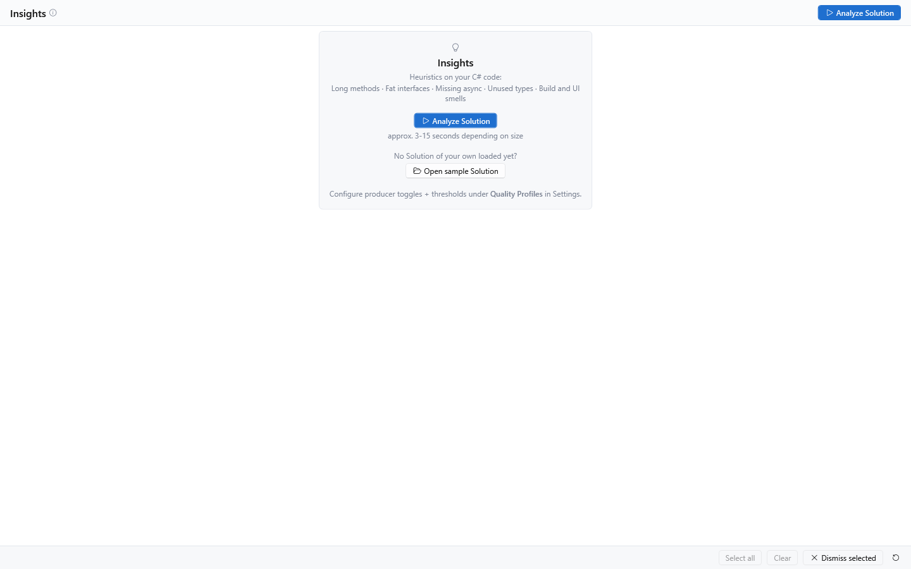

[AICB – Desktop Application](README.md) &middot; chapter 6 of 11

# 6 Insights in the desktop app

The Insights tab is the app's own quality-review surface. It runs a set of heuristics (the *producers*) over the C# solution currently loaded in the Context Builder and reports what they find as individual findings: long methods, fat interfaces, missing async conventions, unused types, design smells, architecture problems, security-sensitive calls, and more. Each finding tells you what was detected, where it was detected, how expensive a fix is estimated to be, and — for many rules — a recommended approach. The complete rule catalog is described in "Insights: the code quality catalog" in the General manual.

Use the tab before a code review, after a larger refactoring, or whenever you want to hand a concrete, pre-selected slice of a problem to your LLM.

## 6.1 Where the Insights tab lives

Insights is not an entry of the main navigation; it is a sub-tab of the Context Builder and appears when the `Review` mode is active:

- `Review` is one of the mode chips in the Context Builder header. Its tooltip reads `Review - walking through quality findings. Adds the Insights tab and the Test Description panel. (Alt+4)`.
- Modes combine (their areas are added together), so you can keep `Review` active alongside other modes.
- The tab sits between `Details` and `MD Input` in the Context Builder's tab strip.
- The tab header reads `Insights`, or `Insights (N)` while N findings are loaded. The number falls as you dismiss findings and comes back when you restore them.
- An info icon next to the page title summarizes the surface: heuristic hints for the currently loaded solution, pick a category on the left, read the findings on the right, and click `Analyze Solution` to re-evaluate.

The heuristics are not part of the solution-load pipeline itself — the tab triggers them (see "Running the analysis").

## 6.2 Categories, principles and severities

Findings are classified on three independent axes: category, SOLID principle and severity. All three are visible and filterable on the tab.

### Categories

The left column is a single-select category navigator titled `Categories`. `All` is always the first row and is selected by default; it shows the findings of every category, sorted worst-first.

Six categories are always listed, even at count 0: `Code Quality`, `Security`, `Async`, `Design`, `Architecture` and `Other`. A `Compression` row appears only if a finding maps to it — the shipped heuristics do not produce one.

| Category | What typically lands there |
|---|---|
| `Code Quality` | Complexity hotspots, long methods, dead private methods, fat interfaces, large classes, anti-patterns, deprecated APIs, LINQ in a loop, reflection usage, multi-concern hotspots, findings from the latest LLM run |
| `Security` | Methods that call security-sensitive external APIs, such as insecure deserializers, process execution or dynamic assembly loading |
| `Async` | Missing `Async` suffix on task-returning methods, async methods without a cancellation token |
| `Design` | Unused types, public mutable fields, methods with many parameters, layer violations, event-subscription concentration, unresolved XAML bindings |
| `Architecture` | Circular namespace dependencies, breaking changes to the public contract |
| `Other` | The catch-all row for findings that do not map to a named category (for example build/UI hints); the shipped heuristics do not currently produce one |
| `Compression` | Only shown if a finding maps to it; not produced by the shipped heuristics |

The number next to each category is a live filtered count: it reflects the active principle and severity filters, so it changes while the category selection stays. The category itself is not part of that count.

Each row has the tooltip `Show only this category's insights in the pane on the right.`

### Principles (SOLID)

The first filter row is labeled `Principle`. It contains an `All` chip plus one chip per principle: `S`, `O`, `L`, `I`, `D` and `·` (Other).

Each finding carries one or more SOLID badges in its card header, derived from the rule that produced it. The badge is neutral (a letter in a pill); hover it to see the principle name and explanation.

| Chip | Principle | Meaning (badge tooltip) |
|---|---|---|
| `S` | Single Responsibility | A type or method should have exactly one responsibility — a single reason to change. Long methods, large classes, many parameters, or mixed side effects bundle several concerns. |
| `O` | Open/Closed | Code should be open for extension but closed for modification. Exposed, mutable state breaks invariants and forces modification instead of extension. |
| `L` | Liskov Substitution | Subtypes must be usable in place of their base type without breaking its contract. A divergent member of a type family (pattern drift) violates substitutability. |
| `I` | Interface Segregation | Clients should not depend on methods they do not use. A fat interface forces unnecessary coupling — split it into smaller, role-based contracts. |
| `D` | Dependency Inversion | Modules should depend on abstractions, not on concrete implementations — and inner layers never on outer ones. Layer violations and circular dependencies break this direction. |
| `·` | Other | Convention/maintainability hint without a clear SOLID mapping (e.g. async convention, dead code, unused type, correctness smell, build hint). |

How the row filters:

- It is multi-select: several principles can be active at once.
- No active chip means "all principles". The `All` chip (tooltip `Clear all SOLID filters.`) clears the row.
- A finding without a clear SOLID mapping matches only the `·` chip.
- Otherwise one matching principle is enough for the finding to be shown.

### Severities

The second filter row is labeled `Severity`. It contains an `All` chip plus `Critical`, `Warning`, `Info` and `Ok`, each with a colored dot and a count (tooltip `Toggle this severity (multiple can be active).`).

Every finding has exactly one severity. Internally the levels are ranked Critical (10) > Warning (3) > Info (0.5) > Ok (0) — deliberately not the order in which the levels are declared, so that sorting is worst-first.

The row is multi-select; no active chip means "all severities". The `All` chip (tooltip `Clear the severity filter.`) clears the row.

### How the three axes combine

- Category, principle and severity are combined with AND: a card must pass all active filters.
- A chip whose count is 0 is disabled — an empty bucket cannot be selected.
- Both filter rows are hidden until the tab has run at least once; the first-run card is shown instead.
- Sorting is fixed and cannot be changed: severity (worst first), then category, then title. Within the right pane the findings are grouped by severity; each group header shows a colored dot, the level name and the number of cards.
- The tab has no free-text search. Use the category, principle and severity filters.

## 6.3 Running the analysis

1. Make sure a solution is loaded in the Context Builder.
2. Click `Analyze Solution` in the page header, or press `Ctrl+Shift+A`. The shortcut works from any Context Builder sub-tab. The button tooltip reads `Runs all producers over the active Solution. (Ctrl+Shift+A)`.
3. While the run is in flight the whole tab is dimmed by a translucent scrim and shows a progress ring. The run happens off the UI thread, so the rest of the app stays usable.
4. Depending on solution size the run takes roughly 3–15 seconds. The first-run card names the same range: `approx. 3-15 seconds depending on size`.
5. The results replace the previous list, grouped by severity. The tab header now shows the count.

A run evaluates the 24 analyzer rules in the shipped configuration. The active Quality Profile can switch individual exposed rules off, so the effective set depends on your profile. The rule catalog and the profile options are described in "Insights: the code quality catalog" in the General manual; the profile itself is edited under `Settings` → `Quality Profiles`. The first-run card points there as well: `Configure producer toggles + thresholds under Quality Profiles in Settings.` LLM findings are promoted from a model run rather than evaluated by this analysis run.



Re-running does not undo your triage: dismissals and intentional markings are applied to the new result again.

### Automatic runs

- **Setting.** `Auto-trigger insights on solution load` (`Settings` → `General` → `Session & Analysis`) is off by default. Its tooltip: `When on, analyzer insights run automatically after every solution load. When off, use the 'Analyze Solution' button in the Insights tab to run them manually.`
- **First-run exception.** On the first solution load after a fresh installation, the heuristics run once even when the setting is off, so that a new user does not sit in front of an empty tab. This happens once per installation.
- **Background recomputation.** In the normal case the tab shows the last stored result for the solution (if there is one) and recomputes the heuristics in the background. When that background run is ready, the panel adopts the fresh result by itself, so what you read matches the current code — which is also what `Adopt selection` needs to resolve its symbols. A `Ready - N insights precomputed.` banner with a `Show` button belongs to this state; because the panel adopts the result as soon as it is ready, the banner is normally not seen.
- A background run that finishes after you switched to another solution is discarded.

Note: if you trigger the analysis with no solution loaded, the run cannot produce findings; the tab still leaves the first-run view, and the right pane then shows the empty hint described below.

Note: if a single heuristic fails during a run, its findings are simply missing from the result. The tab does not show a separate error message for it. Re-run the analysis if a category looks unexpectedly empty.

## 6.4 The health strip

As soon as at least one finding is loaded, a summary strip appears above the filters. It is computed over all loaded findings and is **not** affected by the filters.

| Element | Meaning | Tooltip |
|---|---|---|
| `Debt` pill with a colored dot | Coarse technical-debt grade from `A` (best) to `E` (worst), estimated from the summed remediation minutes of all loaded findings. The dot is green for A/B, amber for C, red for D/E | `Coarse technical-debt grade (A best ... E worst), estimated from summed remediation minutes.` |
| `~… min` / `~… h` / `~… d` | Estimated total remediation effort, order of magnitude (never exact). Under one hour it is shown in minutes, under one working day in hours, above that in working days (one working day = 480 minutes) | `Estimated total remediation effort (order-of-magnitude).` |
| Trend chip | Change in the debt of the two most recent snapshots that carry a debt measurement: an upward amber arrow for worse, a downward green arrow for better, a flat muted arrow for unchanged. The label is signed, for example `+45 min` or `-1.5 h`, or `no change`. The chip is hidden until at least two such snapshots exist | `Technical debt decreased since your previous analysis (lower is better).` / `Technical debt increased since your previous analysis.` / `Technical debt is unchanged since your previous analysis.` |
| `N Critical` | Number of critical findings | `Critical-severity insights` |
| `N Warning` | Number of warning findings | `Warning-severity insights` |
| `N Info` | Number of info findings | `Info-severity insights` |

Each severity pill is hidden when its count is 0. The strip as a whole is hidden while no findings are loaded.

The debt grade is a rough order-of-magnitude estimate; it sums the per-finding remediation estimates. The grade thresholds are: `A` below 30 minutes, `B` from 30 minutes, `C` from 2 hours, `D` from one working day, `E` from three working days.

## 6.5 The finding cards


The right pane lists the findings of the selected category as accordion cards, grouped by severity. Cards are collapsed by default.

Each card has:

- a 4-pixel severity ribbon on the left edge: red for Critical, amber for Warning, blue for Info, green for Ok;
- a checkbox that selects the card for the batch action `Dismiss selected` (tooltip `Select for a batch action (Dismiss selected).`);
- a one-line header with a chevron, the severity pill (colored dot + level name), the SOLID badges, the finding title and the estimated remediation cost (for example `~15 min`, hidden when the rule gives no estimate). The title is truncated in the row; hover it to see the full title;
- a dismiss icon at the top right (tooltip `Dismiss - marks the finding as seen; it will not come back`), hidden for findings that cannot be dismissed.

Clicking the header expands the card; an expanded card gets an accent-colored border. The header tooltip is `Expand or collapse this insight - shows its description, affected code, and fix actions.`

An expanded card contains:

- the description of the finding;
- a `Fix:` line with the recommended approach, shown only when the rule provides one;
- the list of affected items (see below);
- an optional prompt box (see "The optional prompt box");
- an action row with `Send selected lines to LLM`, `Adopt selection` and `Ignore selected`.

### Affected items

Each affected item is one monospaced line with its own checkbox (tooltip `Select this line for 'Send selected lines to LLM'.`).

- Every affected item is listed.
- The list is height-capped (about 260 pixels) and scrolls; long lists are virtualized, so they stay responsive.
- Note: other consumers of the same analysis (for example the MCP tools) may cap their output. The app itself shows the full list.

A line can carry a lifecycle badge and up to five icon buttons. Only the buttons that apply to the line are shown:

| Icon | Action | Visible when | Tooltip |
|---|---|---|---|
| Tree/list icon | Reveal the symbol in the Solution Tree | the line resolves to a symbol | `Reveal this symbol in the Solution Tree.` |
| Clipboard | Queue as work | the line resolves to a symbol and nothing is queued on it yet | `Queue as work - record this line as something to fix, with a run template of your choice. Nothing is started; the line stays visible and reports 'In progress'.` |
| Checkmark in a circle | Mark the queued work as done | work is queued on the line | `Mark the queued work as done. It records your claim - nothing re-scans to confirm it - and the line stays visible so a later run can contradict it.` |
| Crossed-out eye | Mark this finding as intentional (suppress) | the line resolves to a symbol | `Mark this finding as intentional - it stops being reported here and to the MCP. The quality gate (--fail-on / solution_metrics) still counts it. Export the solution config to share the decision via the .aicb.json sidecar.` |
| Dismiss (×) | Dismiss just this line | the line resolves to a symbol and belongs to a dismissable finding | `Dismiss just this line - it stops being reported here and to the MCP until you restore dismissed findings. Use 'Intentional here' instead when the hit is by design and the team should see the decision.` |

`Reveal` selects and expands the matching node in the Solution Tree (the persistent sidebar) and deliberately does not switch the active tab. A symbol that cannot be found in the loaded tree is ignored silently.

Marker and relation lines that carry no symbol cannot be revealed, queued, suppressed or dismissed on their own — there is nothing stable to key them on.

### Card actions

| Button | What it does | Visible when |
|---|---|---|
| `Send selected lines to LLM` | Sends the checked affected items, together with the full solution context, to the active LLM (see below) | the finding has affected items |
| `Adopt selection` | Replaces the tree selection with the checked symbols (plus their relevant neighbors) and writes a fix task into the prompt; nothing is sent | the finding has affected items |
| `Ignore selected` | Dismisses the whole finding — the same as the dismiss icon at the top right. Tooltip: `Marks this insight as seen (dismisses it) - same as the dismiss button top-right.` | the finding can be dismissed |

A secondary action button can exist next to these (`Runs the secondary action + optionally sends the prompt text plus the full Solution context to the active LLM.`). It is only shown when the finding defines a secondary action; the shipped heuristics do not, so it does not appear in normal use.

## 6.6 Sending findings to your LLM

### Send selected lines to LLM

1. Expand a finding card.
2. Check the affected items you want to work on.
3. Click `Send selected lines to LLM`.

The app renders the entire solution into the `MD Input` tab, writes a prompt into the prompt's goal field, and sends it to the active LLM with the full solution context. The prompt is built from the checked lines:

```text
Please review the following items from the analysis:
- <checked line 1>
- <checked line 2>
```

If no line is checked, nothing is sent and the status line reads `No detail lines selected.`

### Adopt selection

`Adopt selection` prepares the work instead of sending it:

1. Expand a finding card and check the affected items you want to fix.
2. Click `Adopt selection`.
3. The app replaces the tree selection with the checked symbols, pulls in their relevant neighbors, writes a fix task into the prompt's goal field, and switches to the `Main` tab. The tree selection is now marked as insight-driven.

Nothing is sent. Review the prepared prompt and use `Generate & Send MD` when you are ready. The written task text looks like this:

```text
Resolve the following <category> finding in this C# solution.

Finding: <title>
<description>
Recommended approach: <suggestion>

Affected items (their code - and their relevant neighbors - are selected in the context):
- <checked line 1>
…

Implement the fix directly in the code. Preserve the existing public behavior,
keep the build and tests green, and briefly summarize what you changed and why.
```

The status line reports `Adopted the insight's symbols + their context as the selection (checked = generated context); prompt prepared.` or, when no tree symbol matched, `Prompt prepared; no matching tree symbols to select.`

### The unreleased optional prompt path

The card view contains support for an optional prompt box and a secondary action such as `Apply + send to LLM`, but only the unregistered auto-compression producer supplies those fields. No finding in the shipped application displays this box or secondary button. Use `Send selected lines to LLM` or `Adopt selection` instead.

## 6.7 Dismissing, marking as intentional, and restoring

The tab distinguishes two kinds of triage:

- **Dismiss** means "I have seen this". It is a local decision for the current solution.
- **Mark as intentional** (suppress) means "this hit is by design". It is a decision you can share with your team.

### Dismiss

You can dismiss at three levels:

- a single card, via the dismiss icon at its top right or the `Ignore selected` button;
- a single affected item, via the dismiss icon on the line;
- a batch, via `Dismiss selected` in the action bar over all checked cards.

A dismissed finding stops being reported in the panel and to the MCP tools until you restore it. Dismissals are stored per solution, so they survive a restart and the next load of the same solution.

The action bar shows a `N selected` pill while cards are checked. `Select all` checks every card currently shown on the right (disabled while the pane is empty); `Clear` unchecks all. `Dismiss selected` is enabled while at least one checked card can actually be dismissed — it stays enabled for a mixed selection and reports the rest on the status line: `N finding(s) cannot be dismissed - they are re-reported on every run.` Cards that cannot be dismissed stay checked on purpose, because the dismissal is exactly what did not happen to them.

Dismissing is a triage decision, not a fix: it does not change your code. `Restore` brings the findings back.

### Mark as intentional (suppress)

The crossed-out-eye icon on an affected item records a permanent suppression for that item's symbol and rule. The item disappears from the panel and from the MCP tools, but the quality gate (`--fail-on` / `solution_metrics`) still counts it.

Suppressions are stored in the app's database for the current solution. To share the decision with your team, export the solution configuration — the `.aicb.json` file next to your solution — from the Solutions workspace. Suppressions declared in that committed file also apply, and they survive `Restore` (see below).

The button appears only on items that resolve to a symbol; marker and relation lines cannot be marked.

### Restore

The counter-clockwise arrow button in the action bar restores everything you hid. Its tooltip: `Reset what you hid - dismissed Insights and findings you marked intentional become visible again, and all sections are re-evaluated immediately. Suppressions declared in the committed .aicb.json sidecar stay in force.`

`Restore` has no confirmation step. It clears the dismissals and the database-side intentional markings for the current solution and immediately re-runs all heuristics. Two things are deliberately not affected:

- Suppressions declared in the solution's `.aicb.json` file stay in force — they are a committed team decision, not a local one.
- Queued work items are not cleared. `In progress` and `Done` badges stay as they are.

### Findings that cannot be dismissed

Some findings are persistent: the dismiss affordances are hidden for them and they are reported on every run. This happens in two cases:

- The active Quality Profile has the option `Insights are dismissable (persist hidden per solution)` switched off (`Settings` → `Quality Profiles`, section `Behaviour`). The help text next to it reads: `Default ON. When enabled, a dismissed insight stays dismissed for that solution. When OFF, insights reappear after dismissing until the heuristic itself stops reporting them.`
- Findings promoted from the latest LLM run are always persistent. Their detail lines carry no symbol, so the panel offers neither per-line `Mark as intentional` nor dismiss controls for them. To keep model output off this surface, suppress the producer as a whole, for example through the committed `.aicb.json` sidecar.

### If a write fails

Note: if a triage write to the local database fails, the panel still updates, but the change may not survive the next refresh. If a state does not stick, run `Analyze Solution` again and retry.

## 6.8 Queuing a finding as work

You can record an affected item as something to fix, together with the run template you want to handle it with. This is a note to yourself — **nothing is started**.

1. Expand a finding card.
2. Click the clipboard icon on an affected item. If no run templates are stored, no dialog opens and the status line reports `No run templates are available to queue against.`
3. In the dialog `Queue as work` you see the finding title, the text of the affected item, a `Run template` picker and the note `The finding is marked as in progress. Nothing runs until you start it yourself.` The picker lists all stored run templates, without filtering by run type. It is pre-filled with the run template configured for the active quality profile, if there is one; otherwise the first stored template.
4. Click `Queue` to record the item, or `Cancel` to close without queueing (Escape also cancels). `Queue` is disabled while no template is selected.
5. The item stays visible and now carries the badge `In progress`. Hover it to see the tooltip: `Queued as work to do, with the run template "…".`
6. When you are done, click the checkmark icon on the line. The badge changes to `Done`, with the tooltip `Marked as done. It is your claim, not a re-scan - the line stays visible so a later run can contradict it.`

The line stays visible in both states on purpose: a line that vanished because somebody started work on it would hide the state it is supposed to report, and a later analysis can contradict your "Done" claim.


The action reports itself on the status line:

| Situation | Status line |
|---|---|
| Item queued | `Queued as work to do.` |
| An item is already queued on this line | `Work is already queued for this line.` |
| Queueing failed | `Could not queue the work item.` |
| Item closed | `Marked as done.` |
| No queued item on this line | `There was no queued work on this line.` |
| Closing failed | `Could not close the work item.` |

## 6.9 Where the state is stored

- **Findings** are stored per solution, not per session, despite the setting name. `Persist insights with session` (`Settings` → `General` → `Session & Analysis`, on by default) stores the last analysis result with the solution and restores it on the next load, so you see the last state immediately without re-analyzing. When the setting is off, nothing is stored and the tab recomputes on every load.
- **Dismissals** are stored per solution and survive a restart.
- **Intentional markings** are stored in the local database for the solution and can be shared through the `.aicb.json` solution configuration file.
- **Queued work items** are stored per solution and survive a restart.

All writes are best-effort: a failure never blocks the panel, and a failed write may mean the state is not there after the next refresh.

## 6.10 Empty and loading states

| State | What you see |
|---|---|
| An analysis is running | A translucent scrim over the whole tab with a progress ring |
| The tab has never run (first start) | The filter rows and the body are hidden. In the middle sits a card with a lightbulb icon, the title `Insights`, the line `Heuristics on your C# code:`, the examples `Long methods · Fat interfaces · Missing async · Unused types · Build and UI smells`, the accent button `Analyze Solution`, the hint `approx. 3-15 seconds depending on size`, the question `No Solution of your own loaded yet?` with the button `Open sample Solution`, and the pointer `Configure producer toggles + thresholds under Quality Profiles in Settings.` |
| The selected category has nothing to show | A lightbulb icon and the hint `No insights to show here - pick a category on the left, or relax the principle/severity filters.` |
| No findings at all | The health strip is hidden, all category rows show 0, and the right pane shows the hint above |
| A background computation is ready | The green banner `Ready - N insights precomputed.` with a `Show` button. Because the panel adopts the result as soon as it is ready, the banner is normally not seen |

### The sample solution

`Open sample Solution` loads the bundled `ColorMixer.SelectionLab.sln` — a read-only sample — for a trial run (tooltip: `Loads the bundled ColorMixer.SelectionLab.sln (read-only sample) for a trial Insights run.`). The app opens it in the Context Builder; the usual load behavior then applies (first-run analysis or background recomputation). This button is the entry to the sample solution; if the file is missing, an info dialog titled `Sample not found` explains that it normally lives in the `SampleSolutions` folder next to the application.

## 6.11 Defaults and limits

| Behavior | Default / limit |
|---|---|
| Automatic analysis on solution load | Off; one exception: the first solution load after a fresh installation runs the analysis once |
| Background recomputation after a solution load | Always runs for the loaded solution and replaces the shown state when ready |
| Principle filter | No chip active (all principles) |
| Severity filter | No chip active (all severities) |
| Selected category | `All` |
| Sort order | Fixed: severity (worst first), then category, then title |
| Cards | Collapsed by default; no limit on the number of cards |
| Affected items per finding | No limit; the list is height-capped at about 260 pixels and scrolls |
| Debt trend | Hidden until at least two snapshots with a debt measurement exist |
| Chips at count 0 | Disabled |
| Free-text search | Not available |

Note: the `Max MD size` budget in the Context Builder header also caps `Send selected lines to LLM`; it is described in "The Context Builder: layout and solution tree".

---

[&larr; 5 The Context Builder: document, runs and results](05-the-context-builder-document-runs-and-results.md) &middot; [Contents](README.md) &middot; [7 Runs and language models &rarr;](07-runs-and-language-models.md)
