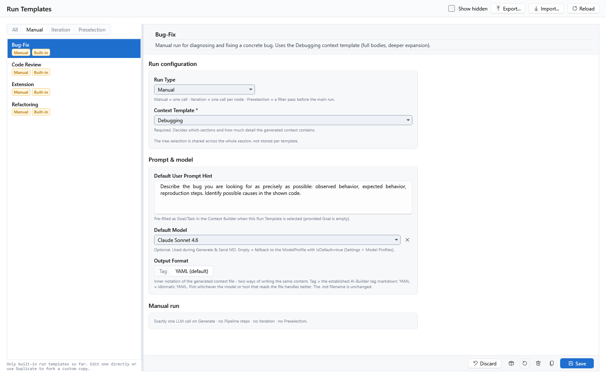
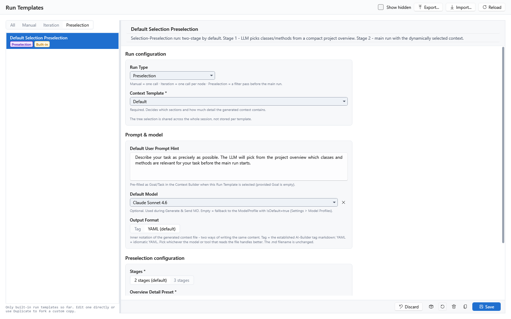

[AICB – Desktop Application](README.md) &middot; chapter 7 of 11

# 7 Runs and language models

AICB never contacts a language model on its own. Every request belongs to a **run** that you start in the Context Builder: the context document you generated, together with your prompt fields, is sent to the model profile you selected, and the answer is displayed and recorded. This chapter describes the run types, the pre-flight checks, how a prompt is assembled, how model profiles are configured and tested, and how to watch and review a run.

## 7.1 What a run is

A run is one executed LLM request, or a chain of such requests, against the context you assembled. Which kind of chain it is follows from the **run type** stored in the selected run template:

- A **Manual** run sends exactly one request.
- An **Iteration** run sends one request per node of your tree selection.
- A **Preselection** run sends a small selection request first and the main request afterwards.

A run is recorded in the database when it has a session and a snapshot to attach to. In the Context Builder this happens automatically: the first send creates a session for you if necessary (see "Sending a context document" below). If no solution is loaded, a Manual run still runs, but it is not persisted.

## 7.2 Run types

The run type is a property of the run template. The Context Builder's run-template picker in the workspace header lists every template, but in the current release only templates of type `Manual` can be selected. Iteration and Preselection runs are implemented end to end but are not released yet; the `Pipeline` type is a placeholder that stored data and repositories already accept, but nothing executes it.

Note: **Iteration** and **Preselection** are **not yet released** and cannot be started from the interface. The description below documents their intended behavior so you know what the configuration fields mean; it is not an invitation to use them. **Pipeline** is **planned**.

| Run type | Requests per run | Status |
|---|---|---|
| `Manual` | one | Released |
| `Iteration` | one per selected tree node | Not yet released |
| `Preselection` | two or three (selection, optional refinement, main run) | Not yet released |
| `Pipeline` | multi-step with optional loops and splits | Planned |



### Manual

A Manual run is the simplest case: the generated context document plus your prompt fields go to the model in a single call, and the answer comes back as Markdown. Use it for anything that fits into one request - "explain this architecture", "summarize this", "find the bug in this excerpt".

A Manual run has no step boundary at which it could be interrupted cleanly, so **Pause aborts it** (see "Pause, resume and cancel"). It cannot be resumed.

### Iteration (not yet released)

An Iteration run walks your tree selection node by node and sends one request per node; the individual answers are concatenated into one Markdown document. It is meant for uniform work in many places, for example "write an XML doc comment for every method". The advantage over Manual is that every node gets the model's full attention; the price is one request per node.

| Setting | UI label | Values | Meaning |
|---|---|---|---|
| Granularity | `Per method` / `Per class` | `Method` (default), `Class` | One request per method node, or one request per type (all its methods in a single call). |
| On error | `Continue on error` / `Abort on first error` | continue (default), abort | With `Continue on error`, a failed node is recorded and the run continues; with `Abort on first error`, the first failure ends the whole run. |

The node list is built from the current tree selection and de-duplicated by node key. The order always follows the solution tree.

For every node the app appends a short block to the request that names the step, the node key and, if known, the containing type, and asks the model to focus on that single node. Each step is stored individually, including its node key and display name, so a failed step is visible in the run history.

The result document contains one third-level heading per node - `Method: <name>` or `Class: <name>` - followed by either the answer or `**Error:** <message>`, separated by a horizontal rule. If the tree selection yields no nodes, the run stops immediately with the message `No nodes to iterate. Check tree selection and granularity.`

A run in which individual nodes failed is recorded with the status `Completed`; only the live progress message distinguishes it with `Completed with N failed node(s).` (there is no separate "completed with errors" status).

### Preselection (not yet released)



A Preselection run is a two- or three-stage flow. In stage 1 the model receives a compact overview of the solution and answers with a JSON selection of the classes and methods it considers relevant for your task. The main run then works on the filtered code block only. It is meant for solutions that are too large for the context window, or for models that are distracted by too much unrelated content.

| Setting | UI label | Values | Meaning |
|---|---|---|---|
| Stages | `2 stages (default)` / `3 stages` | `Two` (default), `Three` | Stage 1 selects; stage 2 is the main run. With three stages, stage 2 refines the selection before the main run. |
| Overview Detail Preset | `Overview Detail Preset *` | a detail preset | Detail preset for the compact stage-1 overview. The recommended value is the built-in `Preselection Overview`. |
| Classification Prompt | `Classification Prompt *` | a prompt with a selection-format block | Prompt that tells the model how to return its picks. Only prompts with a non-empty selection-format block are listed. The recommended value is the built-in `Selection Classifier`. |

The three fields marked with `*` are required. If one is missing, the run stops with a plain message, for example `Preselection: OverviewDetailId is required.` or `Preselection: Classification prompt '<id>' not found.`

The app is deliberately lenient when parsing the model's selection: it first tries to parse the raw answer as JSON, then the content of a ```` ```json ```` code block, and finally everything between the first `{` and the last `}`. If all attempts fail, the main run receives the unfiltered context document instead - a broken selection never leaves the main run with an empty context.

Pausing is checked between the stages, not within them. Resuming a preselection run is not supported: it restarts from stage 1 and notes that in the result document.

### Pipeline (planned)

`Pipeline` is reserved for future multi-step runs with optional loops and splits. It is accepted by the stored data, but there is no executor and the run-template editor does not offer it. Nothing in the interface can start it.

## 7.3 Sending a context document

Two commands in the Context Builder send a run. Both are disabled while a request is pending.

| Command | Where | What it does |
|---|---|---|
| `Send to API` | `MD Input` tab, button row | Sends the Markdown currently in the MD Input. |
| `Generate & Send MD` | workspace header, and Ctrl+Enter | Calls `Create MD` first and then sends the freshly generated document. |

In the workspace header you also choose the **run template** (the run type and the context template it uses) and, in the `LLM` list next to it, an optional **model override** for subsequent sends from this tab. The first entry of the `LLM` list is not a profile but the resolved default model; it carries a `Default` badge and keeps the standard resolution chain. An override remains active for every following send until you choose another entry, close the tab or restart the app.

If no override is selected, the model is resolved in this order:

1. the `Default Model` of the selected run template, if set,
2. the model profile marked as default (`Apply as Active` in the Model Profiles panel),
3. the first profile in the list.

Note: If a run template points to a model profile that no longer exists, the app falls back to the default profile. The `LLM` list shows this in the label of the default entry, so you can see that the template's pin is dangling.

### Pre-flight checks

Before anything is sent, the app runs five checks in a fixed order. Each failure is shown as a status message with the prefix `Send failed: `, and nothing is sent or stored.

| # | Check | Message |
|---|---|---|
| 1 | The MD Input is not empty | `no markdown to send. Run Create MD first.` |
| 2 | A model profile can be resolved | `no model profile available.` or `no model profiles defined. Settings > Model Profiles.` |
| 3 | An API key is set for a profile with `Kind` = `Api` | `API key for model '{Name}' is missing. Settings > Model Profiles.` |
| 4 | An executor exists for the run type | `RunType '{Type}' is not supported. Only Manual, Iteration and Preselection runs can be started.` |
| 5 | For Iteration only: a solution is loaded and at least one node is materialized | `no solution loaded.` or `no Method-nodes selected in the tree. Mark some nodes first.` (with `Class` for the class granularity) |

### The budget confirmation

Before the request is sent, the app estimates the token consumption and, when a trigger fires, asks for confirmation.

There are two independent triggers; either one is enough to show the dialog:

1. **Token threshold.** The estimated total number of tokens (input plus worst-case output) is greater than or equal to the configured threshold. The default is 50,000 tokens; you change it in Settings > General, section `Run Confirmation`, field `Confirm threshold (tokens)`. The value is read fresh on every send, so a change takes effect immediately, without a restart.
2. **Context window overflow.** The input of one single request plus its maximum response would exceed the context window of the model profile. This is a correctness check and applies to all run types, independently of the threshold.

The comparison for the threshold is "greater than or equal". A threshold of **0 therefore means: ask for every run**. There is no value that means "never ask"; to switch the confirmation off in practice, enter a number that no run will reach.

Note: The help text below the field currently says that `0` sends without asking. In practice `0` asks on every run. Use a very high value if you do not want to be asked.

The dialog has the title `Pre-flight budget check` and offers OK and Cancel. Its content looks like this:

```text
Iteration over <N> nodes will send approximately:
  Input:  ~<N> tokens
  Output: ~<N> tokens (worst case)
  Total:  ~<N> tokens
Estimated cost: $<x.xx> USD

Model: <model name>

Note: Walker will stop at <N> nodes (ExpansionStrategy.MaxNodesTotal cap). Actual cost may be lower.

WARNING - Context window: one request (~<N> input + <N> response, ~<N> tokens)
exceeds the model's context window (<N>). The request may be rejected or truncated -
lower the token budget or pick a model with a larger window.

Continue?
```

- The **cost line** appears only when at least one of the two price fields of the model profile is filled in.
- The **cap note** appears only when the walker is expected to stop early because of the `ExpansionStrategy.MaxNodesTotal` limit of the active expansion strategy.
- The **context-window warning** appears only when the overflow trigger fired.

If you cancel the dialog, the send path ends silently: no request is sent, no status message appears, and no run is recorded.

In the current release, only Manual runs can be started. A Manual run has no cost pre-flight - it is the fast single shot - so the threshold does not come into play today. What can still appear for a Manual send is the context-window warning, and only when the selected model profile has a context window set: a single send with a large document can exceed the window of a small model.

### How the estimate is calculated

The estimate is produced per node (for a Preselection run, per stage, counted as one node-equivalent per stage):

```text
input  = tokens(System prompt) + tokens(Context document) + tokens(User prompt) + 50
output = Max tokens (worst case: the model uses its maximum output length)
```

The fixed 50 tokens cover the step instruction and the node key that the app appends for an iteration step. Tokens are counted with a tokenizer chosen by the model name (see "Token counting and prices"); the numbers are an estimate, not a bill.

The cost estimate is calculated only when prices are configured:

```text
cost = (total input tokens / 1,000,000) × input price
     + (total output tokens / 1,000,000) × output price
```

A missing price field counts as 0. If neither field is set, no cost is shown at all.

The context window comes from the `Context window` field of the model profile. If it is empty, no overflow check takes place.

### Pause, resume and cancel

While a request is pending, the `MD Input` button row shows `Cancel` and `Pause`; after a paused iterative run it also shows `Resume`.

| Command | Behavior |
|---|---|
| `Cancel` | Aborts the running request. The server may still finish computing, but the response is discarded. The run is recorded as `Cancelled`. |
| `Pause` | Pauses an iterative run after the current step. The run is stored as `Paused` and can be resumed. |
| `Resume` | Continues a paused iterative run from the next step. |

Notes:

- `Pause` applies to iterative runs only. A Manual run has no step boundary, so pressing `Pause` while a Manual run is pending aborts it and records it as cancelled; it cannot be resumed.
- `Resume` appears only for a run that was paused in the current app session. It is not offered for a run that was still paused when you closed the app.
- Resuming rebuilds the request from the current interface state: the system prompt, context document and user prompt are taken from your current fields, the tree selection and detail overrides from the current tree, and the iteration nodes are materialized again. Only the model profile and run template come from the stored run.
- The result document of a resumed run is rebuilt from the already-stored answers, so the earlier steps are still visible. The next step number is derived from the highest stored step.

### While a run is active

- The `Active Run` tab shows the run name and model, a `Running` pill, a step counter with progress bar, the `OK` and `Failed` counters, the accumulated input/output tokens, and the step list. Selecting a step shows the text the model has streamed so far.
- The `Send to API` command is disabled; `Cancel` and `Pause` are visible.
- The app registers the run as an active activity. While it is active, the database cannot be switched and `Backup now` is refused with `Cannot {action} while {N} background task(s) are active.`
- On completion, the status line reports the outcome, for example `Done. <model> · 1/1 nodes · in 1234 / out 567 tokens`.

### If something goes wrong

The app turns provider errors into a structured result instead of an exception, and always writes an end state for the run:

| Situation | What you see |
|---|---|
| You cancel | The run is recorded as `Cancelled`; the response text is discarded. |
| HTTP error from the provider | A message with the provider name and the status code, for example `OpenAI HTTP 401: ...`, `Anthropic HTTP 429: ...` or `Local HTTP 503: ...`. |
| Network error | `<Provider> network error: <details>` |
| Client timeout | `<Provider> timeout: HttpClient default timeout exceeded.` |
| Error in the middle of a stream | The text received so far is kept; the run is reported as failed with the partial content. |
| Failure in one step of an iterative run | With `Continue on error`, the step is marked failed and the run continues; with `Abort on first error`, the run ends. |

Rate limits and transient server errors are retried automatically (see "Automatic retries" below). If the app was closed while a run was still active, the next start offers a dialog `Unfinished runs from previous session`: `Yes` marks them as cancelled, `No` marks them as paused, `Cancel` leaves them unchanged.

## 7.4 What a prompt contains

Internally a request is assembled from four blocks:

| Block | Comes from |
|---|---|
| System prompt | the `System Role` and `Instructions` fields on the Prompt tab, plus an optional hint about the active layer profile |
| Code block | the context document in the `MD Input` tab |
| User prompt | the `Goal/Task`, `Constraints` and `Additional Context` fields on the Prompt tab |
| Response format | the step instruction appended by an iterative run; empty for a Manual run |

The provider receives two strings:

```text
system prompt = System prompt
user message  = Code block + "\n\n" + User prompt + "\n\n" + Response format
```

Each part is included only when it is not empty. Constraints and additional context are preceded by the headers `Constraints:` and `Additional context:` respectively.

Before sending, every block is normalized: line endings are converted to LF, trailing spaces and tabs at the end of a line are removed, and trailing blank lines at the end of the block are removed. Blank lines inside the text are preserved. This keeps the system-prompt and code-block prefix byte-identical across calls, which is what provider-side prompt caching relies on.

If the active layer profile carries namespace rules, the app appends a sentence to the system prompt naming the profile and asking the model to flag cross-layer dependency violations as `**Critical:**` (strict policy) or `**Warning:**` (advisory policy). Profiles without rules produce no such hint.

## 7.5 Model profiles

A model profile describes one LLM endpoint: where it is, which model to call, how to authenticate, and the generation limits. Model profiles are master data; run templates point to them, and the `LLM` list in the Context Builder can override the choice for all subsequent sends from that tab until the selection changes or the tab closes.

Open Settings > `Model Profiles`. The panel is a master-detail editor: the list on the left, the editor on the right.


The page header offers `Add` (create a custom profile), `Show hidden` (also list built-ins that were deleted), `Export...`, `Import...` and `Reload` (F5). The action bar at the bottom offers `Apply as Active`, `Export as Built-In`, `Restore Built-In`, `Delete`, `Duplicate` and `Save`.

- `Apply as Active` marks the profile as the default model - the one used when a run template does not pin a profile.
- `Duplicate` creates a copy named `<name> (Copy)`. The API key is deliberately not copied; enter it again in the copy.
- `Delete` removes a custom profile permanently. A built-in is only hidden and can be brought back with `Show hidden` and `Restore Built-In`.
- `Save` persists your edits. Editing a built-in marks it as `Overridden`; `Restore Built-In` resets it to its shipped values.

### Profile fields

| Field | Meaning | Default / range |
|---|---|---|
| Name | Display name, shown in the pickers. | - |
| Description | Optional short text shown under the name. | empty |
| `Kind` | `Api` for a remote cloud endpoint, `Local` for a local OpenAI-compatible server. Decides which fields are required and how the connection test runs. | `Api` |
| `Provider` | `Anthropic`, `OpenAI` or `Custom`. Selects the client implementation (request format, authentication header, streaming protocol). | `Anthropic` |
| `Endpoint URL` | HTTP endpoint of the API. | empty; for `Local`/`Custom` it is required |
| `Model name` | Provider-specific model identifier sent in the request. | empty; required |
| API key | Secret sent as `x-api-key` or `Bearer` header. Stored in the Windows Credential Manager. | empty |
| `Max tokens` | Maximum number of output tokens per request. Whole numbers only; minimum 1. Provider hard limits apply. | 8000 |
| `Temperature (0.0-2.0)` | Sampling temperature, up to two decimals. `0.0` = deterministic, `1.0` = balanced, `2.0` = creative. | 0.7; values are clamped to 0.0-2.0 |
| `Context window (optional)` | Total window (input plus output) the model can handle. Used by the pre-flight check. Whole numbers only. Leave empty to skip the check. | empty |
| `Pricing per 1M tokens (optional)` - `Input` / `Output` | Your price in USD per one million tokens, up to two decimals. Used for the cost estimate and the recorded cost. | empty |

For a profile with `Kind` = `Local`, a context window is expected, because it is the value the pre-flight check uses to protect a small local model from an oversized request.

Note: The `Provider` field has no effect on a `Local` profile. Every profile with `Kind` = `Local` is sent through the OpenAI-compatible client, whatever `Provider` says. The shipped local profiles show the default value `Anthropic` there; you can leave it as it is.

### Built-in profiles

Nine profiles are shipped. `Claude Sonnet 4.6` is the default.

| Profile | Kind | Provider | Endpoint | Model name | Context window | Max tokens | Temp. |
|---|---|---|---|---|---|---|---|
| Claude Opus 4.7 | Api | Anthropic | `https://api.anthropic.com/v1/messages` | `claude-opus-4-7` | 1,000,000 | 8000 | 0.7 |
| Claude Sonnet 4.6 (default) | Api | Anthropic | `https://api.anthropic.com/v1/messages` | `claude-sonnet-4-6` | 200,000 | 8000 | 0.7 |
| Claude Haiku 4.5 | Api | Anthropic | `https://api.anthropic.com/v1/messages` | `claude-haiku-4-5-20251001` | 200,000 | 4000 | 0.7 |
| OpenAI GPT-5 | Api | OpenAI | `https://api.openai.com/v1/chat/completions` | `gpt-5` | 400,000 | 8000 | 0.7 |
| OpenAI o3-Reasoning | Api | OpenAI | `https://api.openai.com/v1/chat/completions` | `o3` | 200,000 | 8000 | 0.7 |
| Google Gemini 2.x Pro | Api | Custom | `https://generativelanguage.googleapis.com/v1beta` | `gemini-2.0-pro` | 1,000,000 | 8000 | 0.7 |
| Local Ollama | Local | - | `http://localhost:11434/v1` | empty | 32,768 | 4000 | 0.2 |
| LM-Studio Local | Local | - | `http://localhost:1234/v1` | empty | 32,768 | 4000 | 0.2 |
| OpenRouter | Api | OpenAI | `https://openrouter.ai/api/v1` | empty | 200,000 | 8000 | 0.7 |

Four of these are **templates** that you adapt rather than ready-to-run entries:

- `Local Ollama` and `LM-Studio Local`: enter the name of the model your local server has loaded, for example `qwen2.5-coder-32b`. Without a model name the call is refused with `Local: ModelName is required.`
- `Google Gemini 2.x Pro`: set the endpoint and model name to match your Google API access. The profile uses the generic OpenAI-compatible client, so the endpoint must be the OpenAI-compatible base path of your provider.
- `OpenRouter`: enter the model slug, for example `anthropic/claude-opus-4.7` or `openai/gpt-5`.

Note: No built-in profile carries prices. The cost line in the pre-flight dialog and the recorded cost per request therefore stay empty until you enter your own prices. Prices change faster than releases, so the app does not ship with them.

### Supported providers

Three clients sit behind the provider selection:

| `Provider` | Client | Default endpoint | Authentication |
|---|---|---|---|
| `Anthropic` | Anthropic Messages API | `https://api.anthropic.com/v1/messages` | header `x-api-key` plus `anthropic-version: 2023-06-01` |
| `OpenAI` | OpenAI Chat Completions API | `https://api.openai.com/v1/chat/completions` | header `Authorization: Bearer ...` |
| `Custom` | generic OpenAI-compatible client | none - the endpoint is required | `Bearer` only when a key is set |

The `Custom` client speaks the OpenAI chat-completions protocol and serves local or self-hosted servers such as Ollama, llama.cpp's llama-server, LM Studio, vLLM, KoboldCpp and text-generation-webui in OpenAI mode. Cloud providers that expose an OpenAI-compatible API (OpenRouter, Together, Groq, Mistral and others) are configured as `Provider` = `OpenAI` with their own endpoint.

The endpoint is normalized before the call:

- a bare host such as `http://localhost:11434` gets `/v1/chat/completions` appended,
- a versioned base such as `/v1`, `/v2` or `/v1beta` gets `/chat/completions` appended (the version segment is lowercased),
- a full path ending in `/chat/completions` is used unchanged.

`Anthropic` and `OpenAI` use their default endpoint when the `Endpoint URL` field is empty. For `Custom` there is no default: an empty endpoint is refused with `Local: Endpoint is required (e.g. http://localhost:11434/v1).`

### API keys and the Windows Credential Manager

API keys are stored in the **Windows Credential Manager**, not in the database. Each profile has its own entry, named `AIContextBuilder.ApiKey:<profile id>`.

- The key is never written to the database and never included in JSON exports of the configuration.
- The key is never shown again after you save it. When you switch profiles, the input field is cleared and the status line above it tells you only whether a key is stored: `✓ Key saved in Windows Credential Manager.` or `(no key set)`.
- Leaving the field empty and saving keeps the existing key untouched. Entering a value and saving stores it. `Clear API Key` removes the stored key; the profile itself stays.
- For profiles with `Kind` = `Api`, `Save API Key Only` stores just the key without saving your other editor changes.
- The app does not encrypt the key itself; it hands it to the Windows Credential Manager, which stores it protected by the operating system and bound to your Windows user account.
- Only the desktop app reads and writes this store. Headless hosts (the command-line and the MCP server) have no access to it, so a configuration imported there contains no key.

You can also manage the entry in the Windows Credential Manager yourself (Control Panel > User Accounts > Credential Manager > Windows Credentials); the app reads the entry with the name above.

The key is sent only over HTTPS, or over HTTP to a loopback address (localhost). All three clients refuse to send a key over plain HTTP to a non-local host with a message such as `Anthropic: API key not sent over plain HTTP to a non-localhost host. Use an HTTPS endpoint.` Plain HTTP to `localhost` remains allowed, which is what local Ollama and LM Studio installations need.

Apart from calls to an LLM endpoint you configured, the app does not send anything over the network: there is no telemetry upload, no update check and no crash reporting. The configured endpoint may be Anthropic, OpenAI, Google Gemini, OpenRouter, a custom OpenAI-compatible service, or a local Ollama/LM Studio address. A profile template contains no credential, and nothing contacts its endpoint until a run, connection test or armed first-load layer/exclusion proposal uses it.

### Testing a connection

The `Connectivity Test` section of the editor has a `Test Connection` button. It sends a real request to the endpoint, with the credentials and the model name currently in the editor - including edits you have not saved yet. That lets you probe a new endpoint and key combination before saving the profile.

- The probe uses a fixed system prompt, the user text `ping`, a maximum of 16 output tokens and temperature 0.0.
- It has a 20-second time limit.
- On success the status line shows `Connection OK.` and the result is stored with the profile, so it survives a restart. Next to the button you see the last result with its local date and time, for example `2026-09-21 14:03 - ok: Connection OK.`
- The button never throws: you always get a result. Its messages are `Connection OK.`, `Timeout after 20s.`, `Cancelled.`, `Provider returned no response.`, or the provider's own error message. A failure is shown as `Connection failed: <message>`.

The test result is reset to `not yet tested for this Kind` when you change `Kind`, because a previous test ran against a different client path.

### Automatic retries

Rate limits and transient failures are retried automatically with an exponential backoff: 1 second, then 2, 4 and so on, capped by the maximum backoff. Retried are the HTTP statuses 429, 500, 502, 503 and 504, and network errors. If the provider sends a `Retry-After` header, its value is used instead (also capped by the maximum backoff). A user cancel is never retried, and an abort in the middle of a stream is not repeated either. An unknown provider is reported immediately as a configuration error instead of being retried.

The three parameters are configured in Settings > General, section `LLM Retry`:

| Field | Meaning | Default |
|---|---|---|
| `Max attempts` | Total attempts per call; `1` means no retry. | 3 (one initial attempt plus two retries) |
| `Base backoff (seconds)` | First retry delay; doubled for each further attempt. | 1 |
| `Max backoff (seconds)` | Upper bound for the backoff, including a provider `Retry-After` value. | 30 |

Note: Changes to these three values take effect after an app restart, because the retry policy is resolved once at startup.

## 7.6 Token counting and prices

Token counts are produced locally with Tiktoken encodings, without any network or file access at runtime:

- `o200k_base` is used for `gpt-4o` (and its variants) and for the OpenAI reasoning family (`o1`, `o3`, `o4`).
- `cl100k_base` is used for everything else, including Claude models and local models.

A vendor prefix in the model name is ignored, so `openai/o3-mini` is treated like `o3-mini`. Model families that the tokenizer does not know - `gpt-4.1`, `gpt-4.5` and `gpt-5` - fall back to `cl100k_base`; their counts can therefore deviate from the provider's own count by a few percent.

Prices are entered per **one million tokens**, separately for input and output. They are used in two places:

| When | Where | Result |
|---|---|---|
| Before the run | the pre-flight dialog | an estimated cost, with the output counted at the maximum (`Max tokens`) |
| After the call | the stored run history | the `cost_usd` of each recorded request, computed from the token counts the provider reported |

The numbers you see before a run are therefore your own prices multiplied by locally counted tokens, while the cost recorded afterwards uses the provider's token counts. If no price is configured, the recorded cost is unknown rather than zero, and the cost line is omitted.

## 7.7 Watching and reviewing a run

### Active Run

The `Active Run` tab is the live view. Its header shows the run name, the model and the run type, plus a `Running` pill or a `Complete` pill. The progress row shows `Step <n> / <total>`, a progress bar, the counters `OK <n>` and `Failed <n>` and the accumulated tokens (`<in> in / <out> out`). The step list shows every step with its state (`Pending`, `Running`, `Completed`, `Failed`, `Cancelled`, `Skipped`), its number and its input/output tokens. Selecting a step opens the live output pane below, which shows the text that step has streamed.

A Manual run appears as a single step. Iterative runs report one step per node. In the current Preselection implementation, the step list also contains one synthetic step; its phases are reflected only by the `Step n / m` progress counter.

### LLM Response

The `LLM Response` tab contains the answer of the last send. For a Manual run the app switches to this tab as soon as the first streaming chunk arrives, so you can watch the answer being written. For other run types the aggregated document of all steps lands here.

- `Copy to Clipboard` (also Ctrl+Shift+C) copies the answer.
- `Use as MD input` copies the answer into the MD Input tab, so a follow-up run can work on the model's own answer. The button is disabled while there is no answer.

### Reasoning

The `Reasoning` tab shows the last run as branches: one branch per request, listed on the left. A Manual run has a single branch named `Manual run`; an iterative run names its branches after the node keys. Preselection branch labels follow the step number rather than a fixed semantic role: the standard two-phase run produces `Stage 1 - Selection` and `Stage 2 - Refinement`; a three-phase run additionally produces `Stage 3 - Main run`.

For the selected branch you get these sub-tabs:

| Sub-tab | Content |
|---|---|
| `Output` | The raw answer of that request. |
| `Thinking` | Thinking blocks extracted from the answer. |
| `Tool Calls` | Tool-use blocks extracted from the answer. |
| `Findings` | Findings extracted from the answer, filterable by `Critical`, `Warning`, `OK` and `Info`. |
| `Evaluation` | The evaluation block of the run, if the answer contained one. |
| `Changes` | Files for which the answer proposed a new state, diffed against the files on disk. |

A dot in a sub-tab header means that this sub-tab has content.

After every run (and after a resume) the app parses the stored answers and fills these views. The parser looks for text markers in the answer:

| What | Marker |
|---|---|
| Thinking block | `<thinking>...</thinking>` or `<reasoning>...</reasoning>` |
| Tool use | `<tool_use name="...">...</tool_use>` |
| Findings | a line starting with `**Critical:**`, `**Warning:**`, `**OK:**` or `**Info:**`; the content runs to the next such line |
| Evaluation | `**Hypothesis:**`, `**Result:**` (or `**ActualResult:**`), `**Score:**`, `**Quality:**`, `**Notes:**` |

All markers are matched case-insensitively, and a finding may be preceded by a list character (`- ` or `* `). An evaluation is only stored when the answer contains a hypothesis or a result; the first such block in a run is used. The `Score` value is shown exactly as the model wrote it - the app does not normalize it or restrict it to a range, so a model that writes `85` is shown as `85`.

Note: These are text conventions that the model must follow because your prompt asks it to. The app reads only the text of the answer; provider-specific reasoning fields that some APIs return separately are not evaluated. If the prompt does not ask for these markers, the `Thinking`, `Tool Calls`, `Findings` and `Evaluation` sub-tabs stay empty, and each of them explains that in its empty state. The markers are not removed from the `Output` sub-tab - the extracted content is shown in addition to the raw text.

The `Changes` sub-tab is a view only: nothing is written to disk, and there is no accept or reject action. A diff appears when the answer states the complete new content of a file and that file is found in the loaded solution. If the answer's block is truncated or does not name a file, the app lists that as a form violation instead of showing a diff that looks complete.

### Run history

Two places show what has already run:

- **Sessions tab** - select a session and open its `Runs` sub-tab. It lists every run of that session with its number (`#1`, `#2`, ...), its name, a run-type pill and a status pill. A session without runs shows the hint that runs appear here when they finish.
- **Context Builder** - the `Recent runs:` row in the header shows up to three chips for the current session with the run number, name, run type, status and time.

The possible run states are `Running`, `Completed`, `Failed`, `Cancelled` and `Paused`. A run whose individual steps failed is stored as `Completed`.

### What a run stores

When a run is persisted, the database receives the run itself (type, name, number, status, start and end time), a snapshot of the tree selection and detail overrides at send time, and one record per request with:

- the complete answer of the model,
- input and output tokens,
- the stop reason and the model name that was used,
- the error message, if any,
- the latency in milliseconds,
- the cost, when prices are configured,
- for iterative runs, the node key and display name of the step.

No API key is stored. The first line of your user prompt (the goal) is stored with the run snapshot. Because the complete model answers are kept, the database file is a document containing model output - keep that in mind when you share or back up the file.

## 7.8 Step by step: connect your first model and send a context document

1. Open **Settings > Model Profiles**. You see the nine built-in profiles; `Claude Sonnet 4.6` is marked as the default.
2. Select the profile of the provider you have an account with, for example `Claude Sonnet 4.6` or `OpenAI GPT-5`. To use a local server, select `Local Ollama` or `LM-Studio Local`.
3. Check the `Connection` section: the `Endpoint URL` and the `Model name` are pre-filled for the cloud profiles. For a local profile, enter the model name your server has loaded, for example `qwen2.5-coder-32b`.
4. Enter your API key in the `API Key` section. The field is empty even if a key is already stored; a status line above it tells you whether one is present.
5. Click `Test Connection` and wait for the result next to the button. `Connection OK.` means endpoint, key and model name work together. If the test fails, the message names the reason; correct the endpoint, the model name or the key and test again.
6. Click `Save`. If this profile should be used whenever a run template does not pin a model, click `Apply as Active` as well.
7. Switch to the **Context Builder**. Open your solution if it is not already loaded, and mark the nodes you want to send in the Solution Tree.
8. In the workspace header, choose the run template. In the current release this must be a template of type `Manual`. In the `LLM` list next to it, leave the default entry selected, or pick the profile you just configured for this send.
9. Fill in the Prompt tab: at least `Goal/Task`; `System Role`, `Instructions`, `Constraints` and `Additional Context` are optional.
10. Click `Create MD` (Ctrl+M) to generate the context document, and review it in the `MD Input` tab. You can edit the text before sending.
11. Click `Send to API` (or `Generate & Send MD`, Ctrl+Enter, to generate and send in one step). If the model profile has a context window and the request would exceed it, confirm the pre-flight dialog.
12. The app switches to the `LLM Response` tab and streams the answer. If a run had to be created first, the status line tells you that an `Untitled` session was created; rename it later in the Sessions tab if you want.
13. Review the answer, then use `Copy to Clipboard` or `Use as MD input` to continue working with it.
14. Open the `Reasoning` tab to see the request as a branch with its output, findings and any evaluation.
15. Find the recorded run afterwards in the Sessions tab: select the session and open its `Runs` sub-tab.

---

[&larr; 6 Insights in the desktop app](06-insights-in-the-desktop-app.md) &middot; [Contents](README.md) &middot; [8 Settings &rarr;](08-settings.md)
