[AICB – Desktop Application](README.md) &middot; chapter 8 of 11

# 8 Settings

The Settings tab is the central place for everything that applies beyond one solution: appearance, storage, LLM connections, the reusable master data (prompts, profiles, schemata, templates), and the export bundles. Most pages share the same master/detail layout, so once you have used one of them you can use all of them.

A few things are worth knowing before you start:

- **Nothing has to be configured to use the core workflow.** Every axis ships with a built-in default that is already active: the context template, the compression rules, the pipeline profile, the quality profile, the MCP profile and the test profile all point at their built-in default entry. You can open a solution and create a context document without touching a single setting.
- **The one thing the LLM workflow needs is a model profile with an API key.** If it is missing, the app tells you exactly where to add it: `API key for model '{Name}' is missing. Settings > Model Profiles.`
- **The app's user interface is English.** A language picker is not provided; the General page states this explicitly.

## 8.1 Where the settings pages live

Open **Configuration → Settings** in the sidebar. The tab has its own sub-sidebar on the left (200 pixels wide, adjustable by dragging the splitter, minimum 160 pixels) and the content of the selected page on the right. The sub-sidebar is organized into six groups; the group captions are headings, not clickable entries.

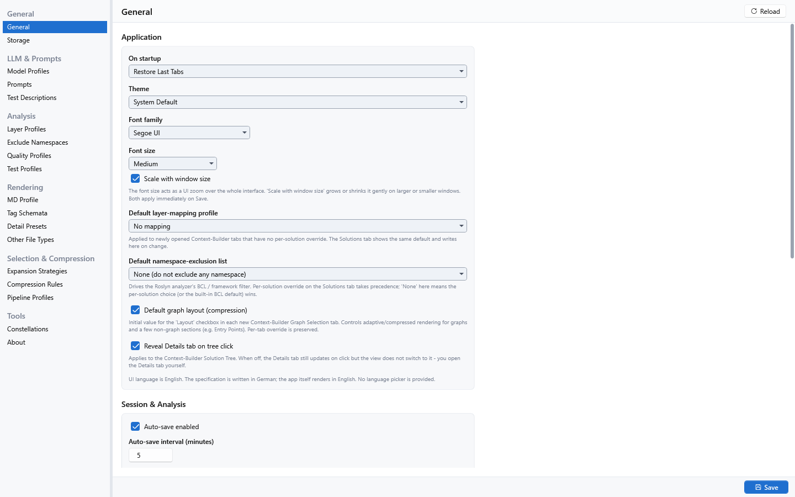

| Group | Page | Sidebar tooltip |
|---|---|---|
| **General** | `General` | "App-wide preferences (theme, layer-profile, graph-layout, auto-save)." |
| | `Storage` | "Database file location, backup settings, app-settings JSON path." |
| **LLM & Prompts** | `Model Profiles` | "LLM-Provider configurations (Anthropic / OpenAI / LocalLLM / Mock)." |
| | `Prompts` | "Reusable user-prompt presets." |
| | `Test Descriptions` | "Reusable acceptance-test descriptions for RunTemplates." |
| **Analysis** | `Layer Profiles` | "Namespace-pattern to Architecture-Layer mappings." |
| | `Exclude Namespaces` | "Glob patterns to skip in analysis (e.g. System.*)." |
| | `Quality Profiles` | "Code-quality producer toggles, metric thresholds (LOC + cyclomatic complexity) + debt/gate behaviour." |
| | `Test Profiles` | "Pin per-solution test detection: which projects are test projects + which method attributes mark a test case. Default replicates the built-in heuristic." |
| **Rendering** | `MD Profile` | "Markdown render-profiles (per Section-Slot)." |
| | `Tag Schemata` | "Per-tag rendering rules (Class / Method / Interface / Enum)." |
| | `Detail Presets` | "Per-section Detail-Level mappings (Compact/Normal/Detailed/Source)." |
| | `Other File Types` | "Read-only reference: recognized file types + the 4 detail stages. The compression stage is chosen per node in the Solution Tree." |
| **Selection & Compression** | `Expansion Strategies` | "Tree-walk strategies (Method-Depth + Type-Depth + Flags)." |
| | `Compression Rules` | "Auto-Compression heuristics (Caller-Count + Force-Flags)." |
| | `Pipeline Profiles` | "Token-Budget Trimming-Pipeline configurations." |
| **Tools** | `Constellations` | "Bundle Master-Entities + AppSettings as portable JSON." |
| | `About` | "App version, components, license, support." |

Behavior of the Settings tab:

- **The last page you used is remembered.** The next time you open Settings, that page is selected again. If the name of the page no longer exists, the selection quietly falls back to the first entry (`General`).
- **Four keyboard shortcuts work on every page.** They are routed to the page that is currently active: `Ctrl+S` = Save, `Ctrl+N` = new entry, `Ctrl+D` = duplicate, `F5` = reload. On a page that has no such action (the two form pages `General` and `Storage` have no Add or Duplicate), the key does nothing - that is intended.
- **Tooltips can be switched off globally.** The switches are on the `General` page in the `UX` section and take effect immediately, in the Settings tab and its sub-pages.
- The group captions cannot be clicked or focused; only the 18 page entries can.

Three further master-data pages are **not** part of the Settings tab. They are separate entries in the sidebar:

| Path | Tab | What it is |
|---|---|---|
| **Configuration → Templates** | `Templates` | The context templates: prompt, MD profile, detail presets per level, export content and profile overrides. |
| **MCP → MCP Profiles** | `MCP Profiles` | The MCP working environments: tool set, instructions, output notation and token budget. |
| **MCP → MCP Usage** | `MCP Usage` | The recorded MCP tool-call telemetry, with notes, export/import and a controlled clear. |

`MCP Usage` reloads its data every time the tab is activated, because the MCP server keeps writing into the same database while the app is running. Without that, a re-opened tab would still show the numbers from the first time you opened it.

## 8.2 Where a setting is stored and when it takes effect

Settings are kept in three places, and the split explains which ones can travel with a bundle and which cannot:

| What | Where |
|---|---|
| Storage settings (base path, database path, backup) and the recent-solution/recent-database lists | `%APPDATA%\AIContextBuilder\app-settings.json` |
| Everything else from the general settings, all active/default profile ids, and all master data (prompts, profiles, schemata, templates, MCP profiles, ...) | The SQLite database |
| API keys of model profiles | Windows Credential Manager |

Note: the `app-settings.json` file always lives at the default location `%APPDATA%\AIContextBuilder\app-settings.json`. Changing `Base path` on the Storage page does **not** move it - the Storage page therefore shows you the file's actual location in a read-only field. This is deliberate: the file must be readable before the database is open, so it cannot depend on a path that is stored inside it.

When a change takes effect:

| Effect | Examples |
|---|---|
| **Immediately on Save** | Font family, font size (UI zoom), theme for the standard controls, tooltips switch and delay |
| **On the next start of the app** | `Base path`, the LLM retry values, the theme in individual custom panels |
| **On the next start of the MCP server** | MCP tool set, MCP instructions, automatic re-analysis mode |
| **Live on every MCP call** | The context-template assignment of an MCP profile |
| **The next time a tab is opened** | Default layer profile, default namespace-exclusion list, default graph layout |

Note: the app and the standalone MCP server use the same database. A schema migration therefore applies to all running instances at the next start of each process - the desktop app and any MCP host included.

## 8.3 The master/detail pattern

Most settings pages are built from the same pattern: a list of entries on the left (the master), an editor for the selected entry on the right (the detail), and a fixed action bar at the bottom. The actions and their meaning are identical on every such page; only which of them are enabled and which badge a page uses differ.

### Page layout

From top to bottom, every master/detail page has the same three parts:

1. **The page header** - the page title on the left, the page-wide actions on the right.
2. **The two-column body** - the entry list on the left (280 pixels), the editor on the right.
3. **The action bar** - the entry-related actions on the right, the status line on the left.

The status line is the main feedback channel of these pages. Validation errors appear there, not in a dialog.

### Header actions

| Control | Label | Tooltip | Effect |
|---|---|---|---|
| Button | `Add` | Varies per page | Creates a new custom entry, saves it immediately and selects it. Status line: `New {Kind} created.` |
| CheckBox | `Show hidden` | "Show built-ins that were soft-deleted via Delete." | Shows built-ins that were soft-deleted with `Delete`. Default: off. Toggling reloads the list immediately. |
| Button | `Export...` | "Export master entities to JSON file" | Writes **all** entries of the list (built-ins *and* your own) to a JSON file. The suggested file name is `{EntityTypeIdentifier}-export-{yyyyMMdd-HHmm}.json`; characters that are not allowed in file names are replaced by `-`. |
| Button | `Import...` | "Import master entities from JSON file" | Reads a JSON file back in (see "Exporting and importing master data as JSON"). |
| Button | `Reload` | "Discard unsaved edits and reload all entries from the database. (F5)" | Discards unsaved edits. The selection is kept as long as the entry still exists. |

### Entry actions

| Control | Label | Tooltip | Effect |
|---|---|---|---|
| Button | `Save` | "Save: persist editor changes to the database. Editing a built-in sets the OVERRIDDEN flag. (Ctrl+S)" | Writes the editor values to the database (see "Saving an entry"). |
| Icon button | (Duplicate) | "Duplicate: create a custom copy of the selected entry as a starting point for tweaks. (Ctrl+D)" | Creates a copy with a new ID and the name suffix `(Copy)`. The copy is never a built-in, and it never inherits the active/default badge. |
| Icon button | (Delete) | "Delete: built-ins are soft-hidden (recoverable via Restore); custom entries are removed permanently." | See "Deleting an entry". |
| Icon button | (Restore) | "Restore Built-In: reset this built-in to its code defaults and clear the override/hidden flag." | See "Restoring a built-in". |
| Icon button | (Export as Built-In) | "Export as Built-In: show the C# snippet for this entity to paste into the BuiltIn*.cs source file - promotes the custom value to a permanent Built-In after build + restart." | See "Exporting an entry as built-in code". |
| Button | `Apply as Active` | Varies per page | Makes the selected entry the globally active (or default) one. Only visible on pages that have such a concept. Status line: `'{Name}' is now the active {Kind}.` or `'{Name}' is now the default {Kind}.` |

### The list and its badges

The list groups its entries by origin: built-ins first, then your own entries, each group sorted alphabetically by name. The group headers read `Built-in ({count})` and `Custom ({count})`. Long names wrap instead of being cut off - the list does not scroll horizontally.

A row can carry several badges:

| Badge | Meaning |
|---|---|
| `Built-in` | The entry ships with the app. |
| `Active` | This is the globally active entry of the page. |
| `Default` | This is the default entry of the page. |
| `Overridden` | A built-in that you saved and thereby overrode. |
| `Hidden` | A soft-deleted built-in (only visible when `Show hidden` is on). |
| `IN USE · {n}` | A reference counter: how often a custom entry is used elsewhere. |

Two pages deliberately build their own list instead: `Tag Schemata` (it has a filter box above the list and two-level group headers) and `Templates` (no grouping, its own hint block).

### Saving an entry

Saving always follows the same order, which is why a rejected input never arrives "half way":

1. The entry is fetched from the store.
2. The editor fields are written into it.
3. The entry is validated. If validation fails, the save is aborted, the message appears in the status line, and the rejected input is discarded - it does not stay alive in the background.
4. If the entry is a built-in, it is marked as `Overridden` *before* it is written. The list badge and the stored data stay in sync.
5. Then the write happens. If the store rejects the write (for example an invalid source path in `Tag Schemata`), the status line shows `Save failed: {message}` instead of crashing.
6. The list is reloaded, the selection is restored, and the status line reads `{Kind} '{Name}' saved.`

Built-ins are **not** read-only. The editor is active as soon as an entry is selected; saving a built-in turns it into an `Overridden` built-in, and `Restore` brings the code defaults back. "In use" states (a template that an open session references, a run template while a run is active) are advisory hint banners, not locks.

### Deleting an entry

The `Delete` button does two different things depending on what is selected:

- **A built-in** is only *hidden* (soft-deleted). It disappears from the list and can be brought back with `Show hidden` plus `Restore`. Status line: `{Kind} '{Name}' hidden (built-in). Use 'Show hidden' + Restore to bring back.`
- **Your own entry** is removed permanently. Status line: `{Kind} '{Name}' deleted.`

Note: this asymmetry is intentional. A built-in that was deleted for real would simply be re-created from the code seed on the next read, so the delete would look as if it did nothing.

### Restoring a built-in

`Restore Built-In` is only available when the selected entry is a built-in and carries the `Overridden` or `Hidden` badge. It clears the override flags and writes the code defaults back. Status line: `{Kind} '{Name}' restored to built-in defaults.`

### Exporting an entry as built-in code

`Export as Built-In` does **not** change anything by itself. It opens a dialog titled `Export as Built-In Code` with the generated C# snippet for the selected entry. The dialog contains: Note: this function is intended for the product's own development; the snippet only has an effect in AICB's source code, not in your installation.

- a banner: "The exported code snippet must be manually inserted into the BuiltIn*.cs source file and committed to git. The application does not modify source files automatically.",
- an extra banner when the entry is a built-in that you already overrode: exporting creates a new candidate built-in, and merging it into the original source file is your responsibility,
- an extra banner for layer profiles and exclusion lists: review the snippet before committing, because it may contain solution-specific paths or namespaces,
- the read-only snippet, the target file name and an insertion hint,
- the buttons `Close` and `Copy to Clipboard`.

The workflow is deliberately manual: copy the snippet, paste it into the named source file, commit, and rebuild. After the rebuild and a restart, the entry is a real built-in and ships with the app.

### Exporting and importing master data as JSON

`Export...` writes every entry of the current list - built-ins and your own - to a JSON file whose header names the entity type (for example `"Prompt"`, `"DetailPreset"` or `"MdProfile"`). The status line confirms: `Exported {n} item(s) to {file}.`

`Import...` checks that header against the page you are on. A Prompts file therefore cannot be loaded into the Detail Presets page by accident. The import runs in this order:

1. A preview is computed: new entries, conflicts, unchanged entries, and skipped built-ins.
2. If the header or the file itself is unusable, the import is aborted with `Import failed: {first error}`.
3. If there are conflicts (same ID, different data), a dialog appears with `Skip conflicts` (keep the existing entries) and `Replace conflicts`. Cancelling gives `Import cancelled.`
4. **Built-ins in the file are always skipped.**
5. The status line reads `Imported: {a} new, {b} replaced, {c} skipped.` - extended by `({n} error(s) - see log)` when individual entries could not be imported.

### Which pages have an active or default entry

Fifteen pages share the master/detail pattern. All of them offer `Add`, `Duplicate`, `Delete`, `Save`, `Reload`, `Import...` and `Export...`, and all of them support overriding built-ins and exporting a built-in snippet. The difference is the active/default concept:

| Pages | Badge | Meaning of `Apply as Active` |
|---|---|---|
| Compression Rules · Pipeline Profiles · Quality Profiles · Test Profiles · MCP Profiles · Templates | `Active` | Exactly one entry is globally active; the list shows an `Active` badge on it. |
| Detail Presets · Expansion Strategies · MD Profile · Model Profiles · Tag Schemata | `Default` | Exactly one entry is the default (for `Tag Schemata`: one per schema type). |
| Layer Profiles · Exclude Namespaces · Prompts · Test Descriptions | (none) | The `Apply as Active` button is not shown. |

For `Layer Profiles` and `Exclude Namespaces` the global default is set elsewhere, on the `General` page (`Default layer-mapping profile` and `Default namespace-exclusion list`).

### Hint banners

Some pages show an informational banner above the fields. It is display-only and never blocks editing. You will see it, for example:

- on `Layer Profiles` and `Exclude Namespaces` as a reminder that saving a built-in marks it as overridden,
- on `Tag Schemata` in the `Layout` tab, marking the layout fields as reserved for a future renderer,
- on `Constellations`, describing exactly what an import writes and what it skips.

## 8.4 General

**Where:** Settings → `General` group → `General` (the first entry, and the page that opens on the first start).

The header has a `Reload` button ("Reload all settings from disk, discarding unsaved edits in this panel."). The footer has the accent button `Save` ("Save all changes on this panel. Some values take effect immediately, others on restart.") and the status line.

### Application

| Field | Type | Default | Effect |
|---|---|---|---|
| `On startup` | Dropdown | `Restore Last Tabs` | Intended startup behavior: `Restore Last Tabs`, `Restore Last Session`, `Sessions Overview` or `Empty Session`. **Note:** the value is stored with the other settings, but the app does not act on it yet - it currently always opens on the welcome screen. The setting is prepared for a planned session-restore feature. |
| `Theme` | Dropdown | `System Default` | `Light`, `Dark` or `System Default` (follows the operating system). Standard controls switch immediately; individual custom panels apply the theme fully after a restart. |
| `Font family` | Dropdown | `Segoe UI` | Font family for the whole interface. Choices: `Segoe UI`, `Segoe UI Variable`, `Calibri`, `Verdana`, `Tahoma`, `Consolas`, `Cascadia Mono`. Applies immediately on Save. |
| `Font size` | Dropdown | `Medium` | `Small`, `Medium` or `Large`. Acts as a **UI zoom over the whole interface** - text, controls and spacing - not just the base font. Applies immediately on Save. |
| `Scale with window size` | Checkbox | on | The UI zoom additionally scales gently with the window size (clamped). |
| `Default layer-mapping profile` | Dropdown | `No mapping` (role heuristic only) | Applied as the fallback for Context Builder tabs whose solution has no override. The Solutions tab resolves this default for display, but changing its picker stores a per-solution override; only this General setting changes the application-wide default. |
| `Default namespace-exclusion list` | Dropdown | `None` | Drives the framework filter of the code analysis. A per-solution override on the Solutions tab takes precedence; `None` here means the per-solution choice (or the built-in BCL default) decides. |
| `Default graph layout (compression)` | Checkbox | on | Initial value for the `Layout` checkbox in each new Context Builder graph-selection tab. Controls adaptive/compressed rendering for graphs and a few non-graph sections (for example entry points). A per-tab override is preserved. |
| `Reveal Details tab on tree click` | Checkbox | on | A single click on a class or method in the Context Builder's solution tree switches to the Details tab so the code is shown right away. Folder, project and solution nodes never switch. When off, the Details tab still updates on click, but you open it yourself. |

The interface is in English; there is no language picker.

Note on the font size: `Ctrl+Plus` and `Ctrl+Minus` zoom the current session without changing this setting; `Ctrl+0` returns to the size stored here.

### Session & Analysis

| Field | Type | Default | Effect |
|---|---|---|---|
| `Auto-save enabled` | Checkbox | on | Periodically persists tabs that have a session ID. This includes an `Untitled ...` session created automatically by the first send; only a tab with no session is skipped. Changes to this setting take effect after the next application start. |
| `Auto-save interval (minutes)` | Number | `5` | How often auto-save runs. Only effective when auto-save is enabled. Values below 1 are raised to 1. Changes take effect after the next application start. |
| `Max snapshots per solution` | Number | `10` | How many automatic snapshots are kept per solution. One snapshot is written on every fresh analysis; older ones are deleted when the limit is exceeded. Snapshots you saved yourself are never deleted and do not count towards the limit. Values below 1 are raised to 1. |
| `Tab-close confirmation` | Checkbox | on | Asks before closing a tab with unsaved edits. When off, such a tab closes immediately and its unsaved edits are discarded. Closing the whole application always asks, regardless of this setting. |
| `Record solution-load performance timings` | Checkbox | on | Appends solution-load phase timings to `%APPDATA%\AIContextBuilder\load-perf.log`. This is separate from the rotating warning/error support log. |
| `Persist insights with session` | Checkbox | on | Analyzer insights are stored per solution and restored on the next load (no re-analysis needed). When off, insights stay transient - recomputed each time and never written to the database. |
| `Auto-trigger insights on solution load` | Checkbox | off | When on, the analyzer insights run automatically after every solution load. When off, use the `Analyze Solution` button in the Insights tab. |

### UX

| Field | Type | Default | Effect |
|---|---|---|---|
| `Tooltips enabled` | Checkbox | on | When off, all tooltips in the Settings sub-tabs are suppressed. |
| `Tooltip show delay (ms)` | Number | `400` | Delay before a tooltip appears on hover. 400 ms is the Windows standard; lower values feel snappier but can flicker. Values are limited to 0-5000 (0 = immediate). |

### Run Confirmation

| Field | Type | Default | Effect |
|---|---|---|---|
| `Confirm threshold (tokens)` | Number | `50000` | Before sending a run whose estimated prompt reaches this token count, the app asks you to confirm. The comparison is `>=`, so a value of `0` makes the app ask before **every** run - there is no value that switches the pre-flight off by itself; to do that, set a value no run will reach. |

Note: the cost pre-flight applies to `Iteration` and `Preselection` runs. A `Manual` run is sent without a cost estimate by design; only the context-window check below still applies to it, and only when the model profile has a `Context window` value.

The confirmation dialog itself names the number of nodes, the estimated input, output and total tokens, the estimated cost (when pricing is configured), the model name and, where relevant, a note that the expansion will stop at the configured node cap or that a single request exceeds the model's context window.

### LLM Retry

| Field | Type | Default | Effect |
|---|---|---|---|
| `Max attempts` | Number | `3` | Total attempts per LLM call. `1` means **no retry**. `3` means one initial call plus two retries. Applies to rate-limit (429) and transient 5xx/network errors. Values below 1 are raised to 1. |
| `Base backoff (seconds)` | Decimal | `1.0` | First retry delay; doubled on each further attempt (1 s → 2 s → 4 s ...). A `Retry-After` header from the provider overrides it. |
| `Max backoff (seconds)` | Decimal | `30.0` | Upper bound for the backoff; also caps a provider's `Retry-After` value. |

Below the section: "Auto-retry for LLM calls on rate-limit and transient errors. Changes take effect after an app restart."

### Empty numeric fields

An emptied or unreadable numeric field on the `General` and `Storage` pages falls back to the **default** of that setting - not to its minimum. The difference matters where the minimum has a special meaning: `Max attempts` = `1` means "no retry", and `Confirm threshold (tokens)` = `0` means "always ask". Clearing such a field restores the default (`3` and `50000` respectively).

## 8.5 Storage

**Where:** Settings → `General` group → `Storage`.


This page controls where the app keeps its data, which SQLite file is active, and the automatic backup.

### Active Database

Introductory text: "Switch to a different SQLite file at runtime. Background work (runs, analyses) must be idle."

| Field | Type | Notes |
|---|---|---|
| `Current file` | Read-only text | Full path of the currently active database. |
| `Switch Database...` | Button | Pick an existing SQLite file and make it active. Requires all background work (runs, analyses) to be idle. |
| `Create New DB...` | Button | Create a fresh, empty SQLite database at a chosen location and switch to it. Use `Switch Database...` for an existing file. |
| `Recent databases` | Dropdown | Recently used database paths, excluding the one that is currently active. |
| `Switch to Selected` | Button | Switches to the path selected in the dropdown. |

A separate status line next to the two switch buttons reports the outcome (`Switched to {path}.`, `Created and switched to {path}.`, `Switch cancelled.`, or an error message).

Two rules apply here:

- **The app's database file must end in `.acb`.** The default is `aicb.acb`. Any other extension is rejected both when switching and when creating - the file dialog only offers `AICB database (*.acb)`. Note: if the app no longer starts because of a wrong database path, correct it in `%APPDATA%\AIContextBuilder\app-settings.json` (the `DatabasePath` entry). A `dbPath` that you pass explicitly to the command-line or MCP tools is not affected by this rule.
- **Switching to an existing database checks its schema.** If migrations are pending, a dialog shows the current and latest schema version plus the pending migrations and asks you to confirm before the switch and the migrations are applied. A target that is not compatible with this app build is rejected.
- While a background task is active (a run or an analysis), the switch and create buttons refuse with `Cannot {action} while {N} background task(s) are active.` - the number tells you how many tasks are in the way.

### Paths

| Field | Type | Default | Notes |
|---|---|---|---|
| `Base path` | Text | `%APPDATA%\AIContextBuilder` | Root folder for app data. **Takes effect only after an app restart** and applies to the database, templates, node overrides and backups. Must not be empty and must be an absolute path; otherwise Save reports `BasePath must not be empty.` or `BasePath must be an absolute path (e.g. C:\AIBuilder).` |
| `App settings file` | Read-only text | `%APPDATA%\AIContextBuilder\app-settings.json` | The JSON file that stores the storage paths and the recent-path lists. This field is a display of the file's **actual** location: it does not move when you change `Base path`. |

Derived from the base path: the database (`{BasePath}\user-data\aicb.acb`), `{BasePath}\templates.json` and `{BasePath}\node-overrides.json`.

Note: saving a new `Base path` can change which database file is active, because the default database path is derived from the base path. In that case the app asks first ("Change data directory?"), naming the new database file, whether it already exists and how many migrations will be applied. The old database file is left untouched, and its content does not move - settings, sessions and solutions are read from the new file from then on.

### Auto-Backup

Introductory text: "Periodically zips the BasePath folder into BasePath\backups\. The backup folder itself is skipped, so archives never nest."

| Field | Type | Default | Notes |
|---|---|---|---|
| `Enable auto-backup on app start` | Checkbox | off | When on, the app zips the base path into `BasePath\backups\` at startup if the minimum interval has elapsed. |
| `Minimum interval (days)` | Number | `7` | Auto-backup only runs if at least this many days have passed since the last backup. Values below 1 are raised to 1. |
| `Keep at most (count)` | Number | `5` | Maximum number of backup archives that are kept. Older archives are pruned - except that the newest complete archive is never deleted. Values below 1 are raised to 1. |
| `Last backup` | Read-only text | `never` | Timestamp of the last successful backup. |
| `Backup Now` | Button | - | Runs a backup immediately, regardless of the configured interval. Refuses while a background task is active. |

The archive contains the whole base path (the `backups` folder itself is skipped), and it also contains the active database even when that file lives outside the base path - together with its `-wal` and `-shm` siblings. A file that could not be archived (typically the database, while another process holds it open) is listed in the result and the archive is renamed with the suffix `-partial`.

Note: the automatic backup runs at startup **before any window appears**, so a large base path can noticeably delay the start. If a run fails - for example because of an unreadable sub-folder - the failure is reported in the startup notice bar, and the run is retried at every start until the cause is fixed. If the automatic backup is not wanted, switch it off here.

## 8.6 Model Profiles

**What it is:** the LLM provider configurations. Exactly one entry is the `Default` profile, used by run templates that do not pin a specific profile.

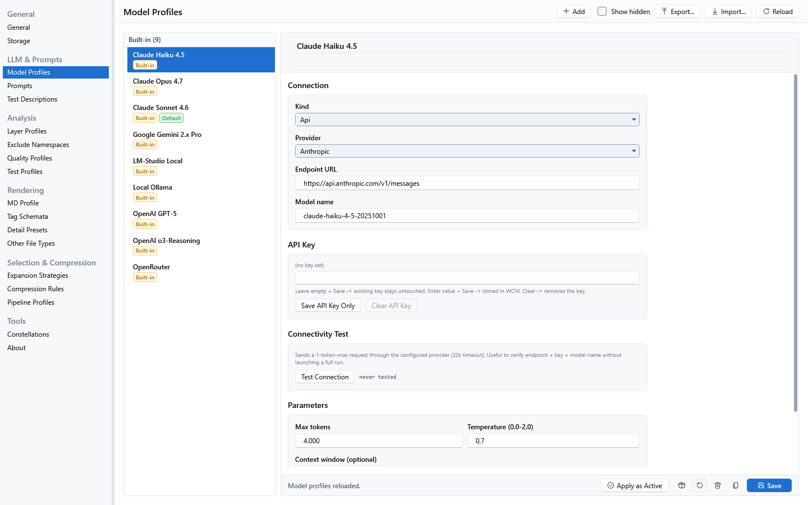

The editor has four sections:

- **`Connection`** - `Kind`, `Provider`, `Endpoint URL`, `Model name`.
  - `Kind`: `Api` for a remote cloud endpoint, `Local` for a local server (for example llama-server, vLLM or Ollama).
  - `Provider`: the request format and authentication scheme - `Anthropic`, `OpenAI` or `Custom`.
  - `Endpoint URL`: for example `https://api.anthropic.com`, or `http://localhost:8080` for a local llama-server / `http://localhost:11434` for Ollama.
  - `Model name`: the provider-specific model identifier that is sent in the request body (for example `claude-opus-4-5`, `gpt-4o`, `qwen2.5-coder-32b-instruct`).
- **`API Key`** - shown for `Api` and `Local`. The section reports whether a key is stored. Type a key and press `Save` (or `Save API Key Only`) to store it. The help text reads: "Leave empty + Save -> existing key stays untouched. Enter value + Save -> stored in WCM. Clear -> removes the key."
  - `Save API Key Only` stores only the key without saving the other editor fields.
  - `Clear API Key` removes the stored key; later runs fail until a new key is entered.
  - **The key is not part of the profile.** It is kept in the Windows Credential Manager and is never written to the database, to a master-data export or to a constellation file.
- **`Connectivity Test`** - `Test Connection` sends a probe request with a maximum of 16 output tokens through the configured provider and uses a 20-second timeout. The small allowance lets reasoning models begin their reasoning prefix while verifying endpoint, key and model name without starting a full run. The result is shown next to the button and stored on the profile, so it survives a restart. The probe uses the values currently in the editor, so you can test before saving.
- **`Parameters`** - `Max tokens` (maximum output tokens per request; default `8000`, minimum 1; provider limits apply), `Temperature (0.0-2.0)` (default `0.7`; `0.0` is deterministic, `2.0` creative; values are clamped to 0.0-2.0), `Context window (optional)` (total input + output tokens the model can handle; used by the pre-flight check to warn when a single request would exceed it; leave empty to skip the check), and `Pricing per 1M tokens (optional)` with the sub-fields `Input` and `Output` in USD (used by the cost estimator in the run summary).

Note: duplicating a profile copies its settings but deliberately **not** the API key and **not** the default badge - you have to enter the key for the copy yourself.

## 8.7 Prompts

**What it is:** reusable prompt presets. There is no active/default entry; a template picks the prompt it uses.

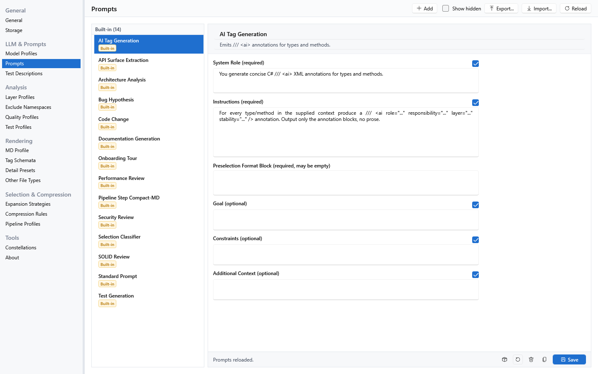

The editor fields:

| Field | Required | Notes |
|---|---|---|
| `System Role (required)` | yes | The system-role prompt sent to the LLM - persona, expertise, tone. |
| `Instructions (required)` | yes | The main task instructions: what to do with the provided context document. |
| `Preselection Format Block (required, may be empty)` | yes (may be empty) | Output-format directive for preselection runs (for example a JSON shape). May be empty for prompts that are not used for preselection. |
| `Goal (optional)` | no | A high-level goal, one or two sentences. Appended below the instructions when present. |
| `Constraints (optional)` | no | Guardrails, for example "do not invent APIs". Appended to the prompt when present. |
| `Additional Context (optional)` | no | Free-form context such as project conventions or domain hints. Appended last. |

Next to the labels of `System Role`, `Instructions`, `Goal`, `Constraints` and `Additional Context` there is a checkbox. It controls whether that area is **shown** on the Context Builder's `Prompt` tab while this prompt is active. Unchecking hides the area there, but the stored text is kept and still goes into the assembled prompt. All five checkboxes default to on. The `Preselection Format Block` has no such checkbox.

## 8.8 Test Descriptions

**What it is:** reusable acceptance-test descriptions. They can be attached to a template and are shipped into the context document, so the LLM knows the test contract. There is no active/default entry.

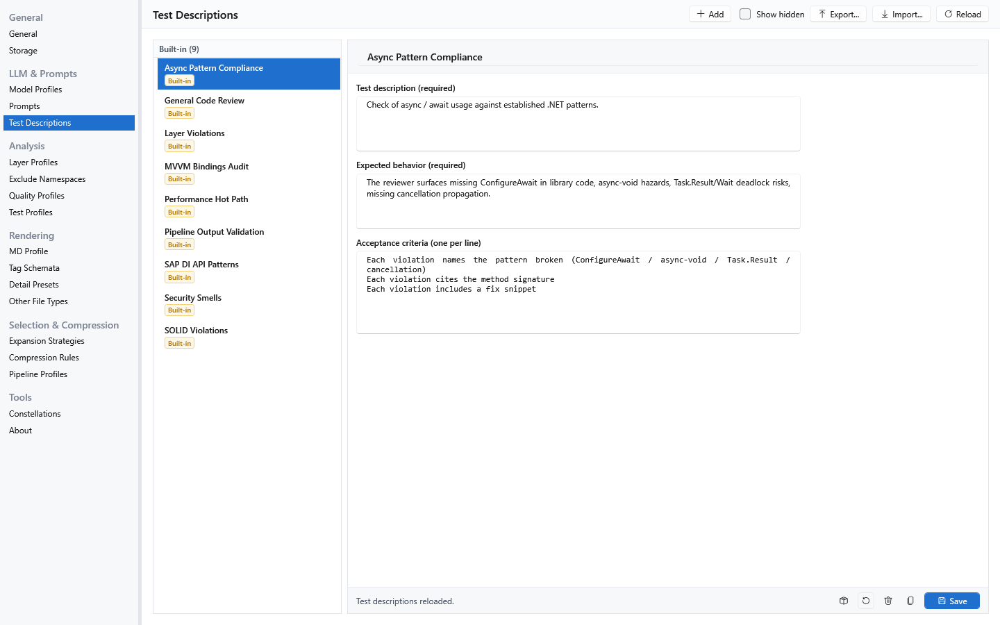

| Field | Required | Notes |
|---|---|---|
| `Test description (required)` | yes | Narrative description of what the test validates. The LLM uses it to understand the intent before generating or fixing code. |
| `Expected behavior (required)` | yes | What the system should do when the test runs successfully. Phrase it as observable behavior, not implementation details. |
| `Acceptance criteria (one per line)` | no | A checklist of pass conditions, one per line. The LLM treats them as a hard contract. |

The name in the header is a short identifier used in the picker when you attach the description to a template.

## 8.9 Layer Profiles

**What it is:** mappings from namespace patterns to architectural layers. There is no active/default entry here - the app-wide default is set on the `General` page, and a solution can pick its own profile in the Workspace.

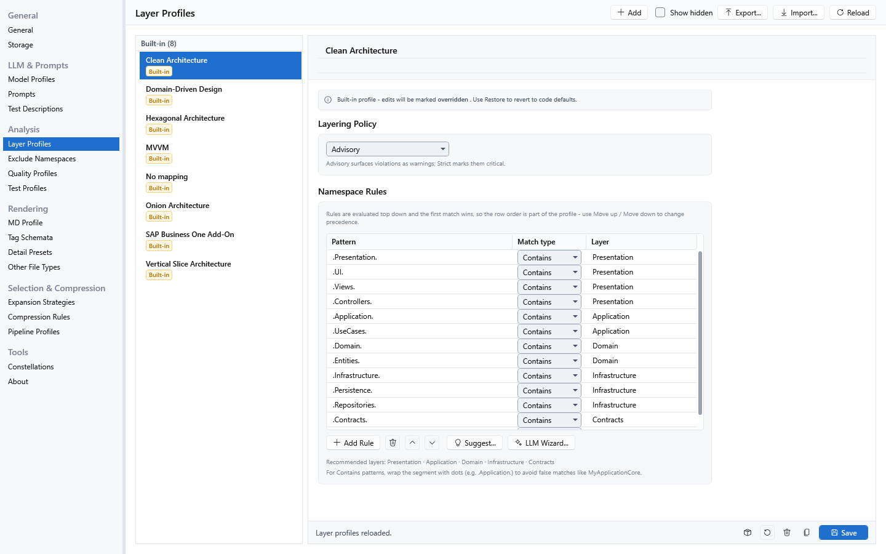

The editor has two sections:

- **`Layering Policy`** - `Advisory` (default): layer violations surface as warnings. `Strict`: layer violations are marked critical and act as a quality gate.
- **`Namespace Rules`** - a table with one row per rule:
  - `Pattern`: the namespace pattern to match, for example `MyApp.Application` or `.Infrastructure.`.
  - `Match type`: `Contains` (substring), `StartsWith` (prefix), `EndsWith` (suffix) or `Exact` (full namespace).
  - `Layer`: the architectural layer assigned when the pattern matches, for example `Presentation`, `Application`, `Domain`, `Infrastructure` or `Contracts`.

**Rules are evaluated from top to bottom and the first match wins**, so the row order is part of the profile. Use the arrow buttons (`Move up`, `Move down`) to change precedence - the table cannot be sorted, precisely because sorting would misrepresent the profile.

Row actions:

- `Add Rule` appends an empty row (default match type `Contains`).
- The delete icon removes the selected row.
- `Suggest...` lets you pick a `.sln` file, reads its declared namespaces, and lets you select the ones you want. Each pick is added as a new rule with the match type `StartsWith` and an empty layer - assign the layer per row afterwards.
- `LLM Wizard...` reads a solution's namespaces, asks you for a description of your architecture, and lets the **default model profile** propose layer rules (written into the grid, where you can fine-tune them) plus namespace exclusions (which you can optionally save as a new exclusion list). This needs a configured model profile; otherwise the wizard tells you to add one under `Settings > Model Profiles`.

Notes from the page:

- Recommended layers: `Presentation`, `Application`, `Domain`, `Infrastructure`, `Contracts`.
- For `Contains` patterns, wrap the segment with dots (for example `.Application.`) to avoid false matches such as `MyApplicationCore`.
- Saving requires a name and, for every rule, a pattern and a layer; otherwise the status line names the missing value (for example `Rule #2: Layer must not be empty.`).

## 8.10 Exclude Namespaces

**What it is:** lists of namespace patterns that the analysis skips, which reduces noise and token cost by filtering out framework or vendor code. There is no active/default entry here; the app-wide default is on the `General` page, and a solution can pick its own list.

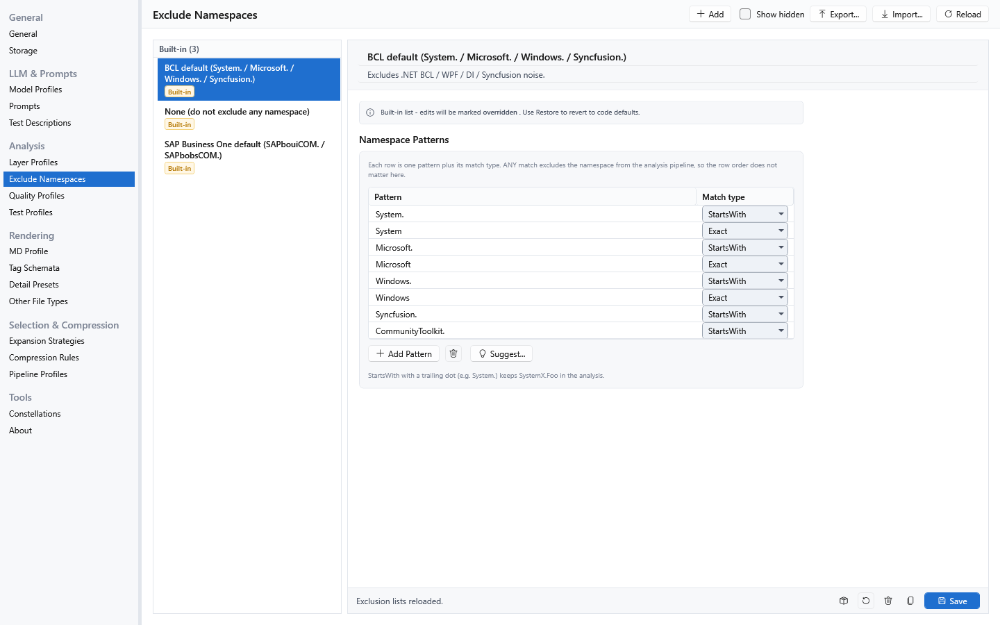

The editor has one section, `Namespace Patterns`, with a table of `Pattern` and `Match type` rows. `Match type` offers `Contains`, `StartsWith`, `EndsWith` and `Exact`. **Any** matching rule excludes the namespace, so unlike layer rules the row order does not matter here.

Row actions: `Add Pattern` appends an empty row (default match type `StartsWith`), the delete icon removes the selected row, and `Suggest...` reads a solution's namespaces and adds the ones you pick as `StartsWith` exclusions.

Rules:

- A name is required; the list may not contain more than 500 rules; a pattern must not be empty and must not exceed 500 characters. Violations appear in the status line.
- `StartsWith` with a trailing dot (for example `System.`) keeps a namespace such as `SystemX.Foo` in the analysis.

The built-in lists include `None (do not exclude any namespace)`, `BCL default (System. / Microsoft. / Windows. / Syncfusion.)` and `SAP Business One default (SAPbouiCOM. / SAPbobsCOM.)`.

## 8.11 Quality Profiles

**What it is:** the switches and thresholds of the code-quality checks, plus the behavior of the resulting insights. Exactly one profile is `Active`; a template can override it.

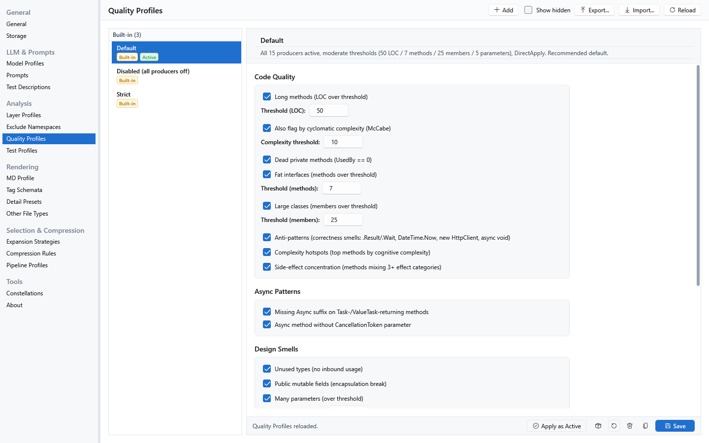

**`Code Quality`**

| Setting | Default | Notes |
|---|---|---|
| `Long methods (LOC over threshold)` | on | Emits an insight when a method exceeds the line threshold. |
| `Threshold (LOC):` | `50` | Above this line count a method counts as long. Typical values: 30-50. |
| `Also flag by cyclomatic complexity (McCabe)` | on | The long-method check additionally flags methods whose McCabe complexity exceeds the threshold below - even when they are short. |
| `Complexity threshold:` | `10` | Typical values: 10-15. Only effective when the checkbox above is on. |
| `Dead private methods (UsedBy == 0)` | on | Private methods with no detected inbound usage. Likely safe to delete. |
| `Fat interfaces (methods over threshold)` | on | Signals interface-segregation violations. |
| `Threshold (methods):` | `7` | Typical values: 8-15. |
| `Large classes (members over threshold)` | on | Signals single-responsibility violations. |
| `Threshold (members):` | `25` | Typical values: 20-30. |
| `Anti-patterns (correctness smells: .Result/.Wait, DateTime.Now, new HttpClient, async void)` | on | Aggregates the correctness smells found by the analyzer. Note: these smell flags are available for live sessions only; they are not persisted in snapshots. |
| `Complexity hotspots (top methods by cognitive complexity)` | on | Ranks the methods with the highest cognitive complexity (deep nesting, hard-to-follow branching). Complements the long-method check without double-reporting. |
| `Side-effect concentration (methods mixing 3+ effect categories)` | on | Methods whose body mixes three or more distinct side-effect categories (I/O, state mutation, logging, ...). |

**`Async Patterns`**

| Setting | Default | Notes |
|---|---|---|
| `Missing Async suffix on Task-/ValueTask-returning methods` | on | Improves call-site readability. |
| `Async method without CancellationToken parameter` | on | Important for cooperative cancellation in long-running operations. |

**`Design Smells`**

| Setting | Default | Notes |
|---|---|---|
| `Unused types (no inbound usage)` | on | Likely safe to delete; mind reflection-only consumers. |
| `Public mutable fields (encapsulation break)` | on | Non-readonly public fields; prefer properties or readonly fields. |
| `Many parameters (over threshold)` | on | Signals refactoring to a parameter object or builder. |
| `Threshold (parameters):` | `5` | Typical values: 4-6. |
| `Layer violations (inner layer depends on outer layer)` | on | Clean/Onion rule: dependencies must point inward. Layer resolution uses the namespace conventions (`.Domain.`, `.Application.`, `.Infrastructure.`, `.Contracts.`, `.Presentation.`) plus a role heuristic. |
| `Circular namespace dependencies (dependency cycles)` | on | Cycles in the namespace dependency graph (A to B to A). Marked critical when a cycle spans multiple projects. |

**`Behaviour`**

| Setting | Default | Notes |
|---|---|---|
| `Insights are dismissable (persist hidden per solution)` | on | When on, a dismissed insight stays dismissed for that solution. When off, insights reappear after dismissing until the check itself stops reporting them. |
| `Send-Template-Id override (optional)` | empty | A run-template ID used by the `Apply + Send to LLM` action. Empty means the active tab's run template. If the ID is not found, the app silently falls back to the active tab's run template. |
| `Action mode` | `Direct Apply` | `Direct Apply`: clicking Apply runs the action immediately. `Confirm Dialog`: a confirmation dialog with context information is shown first. A profile chosen on the run template takes precedence over this setting. |

The editor exposes 14 producer switches. The profile model also stores `EnableUnresolvedXamlBinding`, but the current desktop panel has no switch for it; the separate McCabe checkbox controls the long-method rule rather than a fifteenth producer.

Note: an emptied threshold field falls back to its default (`50` for LOC, `10` for complexity, `7` for fat interfaces, `25` for large classes, `5` for parameters).

## 8.12 Test Profiles

**What it is:** the test-detection configuration, pinnable per solution. It decides which projects count as test projects and which method attributes mark a test case. Exactly one profile is `Active`; a solution can override it.

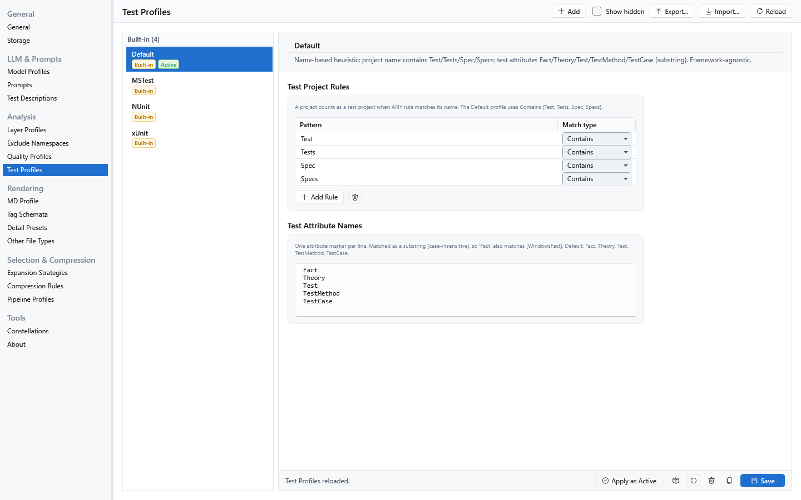

| Section | Content |
|---|---|
| `Test Project Rules` | A table of `Pattern` and `Match type` rows (`Contains`, `StartsWith`, `EndsWith`, `Exact`). A project counts as a test project when **any** rule matches its name. |
| `Test Attribute Names` | One attribute marker per line, matched as a case-insensitive substring - so `Fact` also matches `[WindowsFact]`. |

Built-in profiles ship with the app:

| Profile | Project name matches | Test attributes |
|---|---|---|
| `Default` | contains `Test`, `Tests`, `Spec`, `Specs` | `Fact`, `Theory`, `Test`, `TestMethod`, `TestCase` |
| `xUnit` | contains `Test`, `Tests` | `Fact`, `Theory` |
| `NUnit` | contains `Test`, `Tests` | `Test`, `TestCase`, `TestCaseSource`, `TestFixture` |
| `MSTest` | contains `Test`, `Tests` | `TestMethod`, `DataTestMethod`, `TestClass` |

The `Default` profile replicates the built-in heuristic exactly, so without an active custom profile the detection behavior is unchanged.

`Apply as Active` makes a profile the global default. The analyzer consumers use it unless a per-solution profile overrides it; the per-solution choice wins over the global one.

## 8.13 MD Profile

**What it is:** the mapping from section types to tag schemata, staged by detail level. Exactly one profile is the `Default`; a template picks the profile it uses.


The editor has four tabs:

- **`Overview`** - a read-only summary: `Stats` with `Total`, `Active`, `Empty`, `Non-graph` and `Graph` slot counts, plus the profile's description.
- **`Non-graph slots`** - two groups:
  - `Detail (Staged)` for the four code structure sections (class, method, interface, enum). Each row offers a schema for `Compact`, `Normal` and `Detailed`, a `Default level:` choice (`Compact`, `Normal`, `Detailed`, `Source`), and an `Allow Source` checkbox. `Source` as the default level requires `Allow Source` to be on. Clearing a sub-slot means that level falls through to the default level.
  - `Section (Single)` - one schema per remaining section. **An empty slot skips that section in the generated output.**
- **`Graph slots`** - one schema per dependency-graph section (Mermaid / DOT). The help text notes that layout/compression is controlled app-globally (`Settings > General > 'Default graph layout'`) with a per-tab override in the Context Builder.
- **`Referenced by`** - the templates that currently reference this profile. If none do, the page says so.

`Apply as Active` marks the profile as the default. Note: a newly created MD profile starts as a copy of the current default profile, so it behaves like the default until you change it - it does not start empty.

## 8.14 Tag Schemata

**What it is:** the rendering rules per tag type (class, method, interface, enum, sections and graphs). Exactly one schema per schema type is the `Default`.


The list on the left is grouped first by schema type, then by built-in/custom, and has a filter box above it: type to filter by name or schema type; `Ctrl+F` focuses the box, `Esc` clears it.

The editor has three tabs:

- **`Fields`** - the fields that are rendered for this schema. Each row has:
  - a `Field name`,
  - a `Source` path chosen from the list that is valid for this schema type (the accepted paths are deterministic facts and resolved values, for example `facts.TypeName` or `resolved.Layer`),
  - an `Active` checkbox: when unchecked, the field is kept in the schema but skipped when rendering,
  - a remove button.
  `Add Field` appends a new row. Fields can only be added or removed on custom schemas.
- **`Layout`** - only visible for graph schemata. **Note: this tab is reserved for a future renderer.** The four read-only fields (`Node label`, `Edge style`, `Clustering`, `Depth limit (1-10)`) are stored with the schema but are currently not used by any renderer. App-global compression on/off is on the `General` page instead.
- **`Used by`** - the MD profiles that currently reference this schema. If none do, the page says so.

`Apply as Active` marks the schema as the default **for its schema type**. That default is used wherever a render resolves a section without an explicit schema - for example a slot whose schema was deleted, an empty level in a staged slot, or a render that runs without an MD profile. (An empty single slot in an MD profile suppresses its section instead - see "MD Profile".)

## 8.15 Detail Presets

**What it is:** presets that control graph mode, expansion depths and source-code inclusion. Exactly one preset is the `Default`; a template assigns one preset per detail level.


| Field | Notes |
|---|---|
| `Method Graph Mode` | `Full`, `Semantic Only`, `With Signature` or `With Body`. |
| `Method Expansion Depth` | How many call-graph hops are expanded from the selected method. `1` = direct neighbors only; `2`-`3` = small clusters; higher values mean more context and more tokens. |
| `Type Expansion Depth` | How many type-dependency hops are expanded (uses / used-by). |
| `Show inferred values` | Includes inferred or resolved values in the output (for example const expressions and default parameter values). |
| `Show value source` | Annotates inferred values with their source for traceability. |
| `Include source code` | The renderer appends a source-code block for code nodes that resolve to this preset - typically the preset used for a template's source level. |
| `Detail Strategy` | One of `flow-heuristic` (= compact, adaptive), `aggressive` (= compact, no adaptive) or `none` (= full, no adaptive). |

## 8.16 Other File Types

**This page is a read-only reference and has no actions.** It lists the recognized non-code file types; selecting one shows which section of the context document it lands in, which compression pipeline it runs through, and what each of the four detail stages does for it.

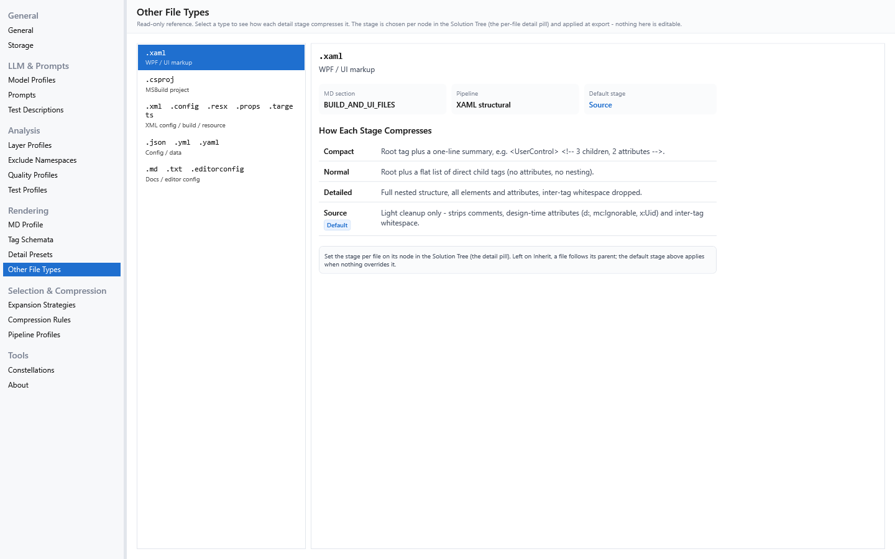

The stage itself is **not** configured here. It is chosen per file node in the solution tree (the detail pill on the node) and applied at export, exactly like code nodes. A file left on `Inherit` follows its parent; the default stage applies when nothing overrides it.

| Extensions | Category | Section | Pipeline | Default stage |
|---|---|---|---|---|
| `.xaml` | WPF / UI markup | `BUILD_AND_UI_FILES` | XAML structural | `Detailed` |
| `.csproj` | MSBuild project | `BUILD_AND_UI_FILES` | XML textual | `Normal` |
| `.xml` `.config` `.resx` `.props` `.targets` | XML config / build / resource | `AUXILIARY_FILES` | XML textual | `Source` |
| `.json` `.yml` `.yaml` | Config / data | `AUXILIARY_FILES` | Plain text | `Source` |
| `.md` `.txt` `.editorconfig` | Docs / editor config | `AUXILIARY_FILES` | Plain text | `Source` |

What the stages do, per pipeline:

- **XAML structural** (`.xaml`): `Compact` - root tag plus a one-line summary (for example `<UserControl> <!-- 3 children, 2 attributes -->`); `Normal` - root plus a flat list of direct child tags (no attributes, no nesting); `Detailed` - the full nested structure with all elements and attributes, inter-tag whitespace dropped; `Source` - the raw file content.
- **XML textual** (`.csproj`, `.xml`, `.config`, `.resx`, `.props`, `.targets`): `Compact` - drops comments, empty groups and non-package item groups; keeps the project root, `TargetFramework` and package references (plain XML gets the comment/whitespace strip); `Normal` - strips XML comments, drops empty groups, collapses inter-tag whitespace and blank lines; `Detailed` - keeps comments and empty groups and only trims inter-tag whitespace and blank lines; `Source` - raw, uncompressed.
- **Plain text** (`.json`, `.yml`, `.yaml`, `.md`, `.txt`, `.editorconfig`): `Compact` - the `Normal` result, then capped at 60 lines with a visible truncation marker (the only stage that drops content - from the tail); `Normal` - trailing whitespace trimmed and runs of blank lines collapsed to one; `Detailed` - trailing whitespace trimmed per line, structure and blank lines kept; `Source` - raw, uncompressed.

## 8.17 Expansion Strategies

**What it is:** strategies that define how deep and how wide the analysis walks the call/type graph from the selected entry points. Higher depth means richer context but more tokens. Exactly one strategy is the `Default`.

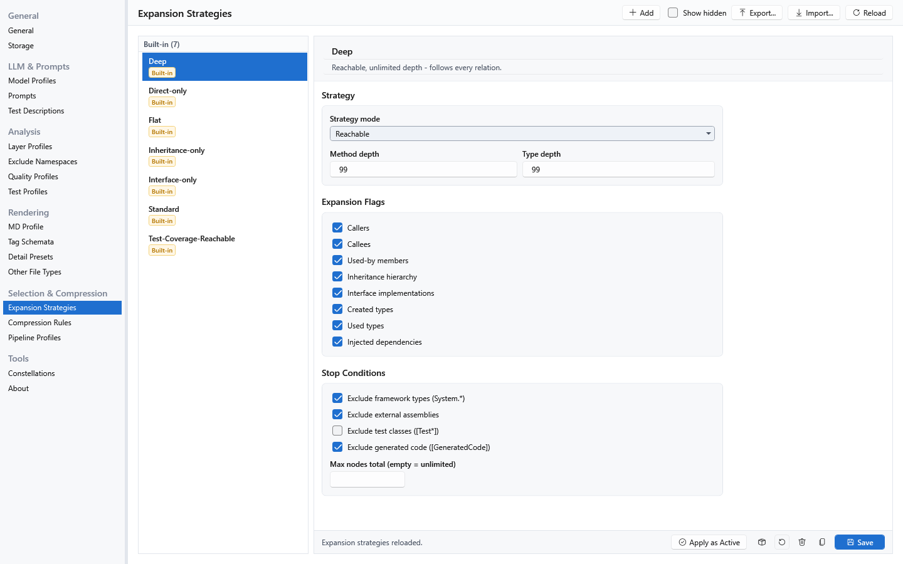

| Section | Field | Notes |
|---|---|---|
| `Strategy` | `Strategy mode` | `Reachable` - all reachable nodes from the selection root, bounded by depth limits and stop conditions. `Select` - only the explicitly selected methods/types, not transitively. `Frontier` - the direct neighbors of the selection without further expansion. |
| | `Method depth` | How many levels of called methods to include from the entry point. |
| | `Type depth` | How many levels of referenced types (parameters, fields, inheritance) to follow from each method. |
| `Expansion Flags` | `Callers` | Include methods that call the selected symbol (incoming call edges). |
| | `Callees` | Include methods called by the selected symbol (outgoing call edges). |
| | `Used-by members` | Include members that reference the selected symbol (reverse usage). |
| | `Inheritance hierarchy` | Include base and derived types along the inheritance chain. |
| | `Interface implementations` | Include the concrete types that implement a selected interface. |
| | `Created types` | Include types instantiated inside the selected method. |
| | `Used types` | Include types referenced as parameters, fields, locals or return values. |
| | `Injected dependencies` | Include constructor-injected dependencies of the selected type. |
| `Stop Conditions` | `Exclude framework types (System.*)` | Stop the walk at framework types. |
| | `Exclude external assemblies` | Stop the walk at types from external / NuGet assemblies - only solution code expands. |
| | `Exclude test classes ([Test*])` | Do not expand into test classes. |
| | `Exclude generated code ([GeneratedCode])` | Do not expand into generated code. |
| | `Max nodes total (empty = unlimited)` | Hard cap on the number of nodes the expansion may emit - a safety net against runaway graph walks. |

`Apply as Active` sets the selected strategy as the app-global default, used by tabs when no run- or template-specific strategy is set.

## 8.18 Compression Rules

**What it is:** the scoring rules behind compression and the one-click auto-compress. Exactly one profile is `Active`. The built-in profiles are `Default` (balanced), `Strict` (aggressive trimming) and `Lenient` (conservative trimming).


**`Accessibility Multipliers`** - score multipliers; higher means more likely to be kept detailed.

| Field | Default | Field | Default |
|---|---|---|---|
| `Public` | `2.0` | `Internal` | `1.0` |
| `Protected` | `0.7` | `Private` | `0.3` |

**`Priority / Role / Entry Point`**

| Field | Default | Notes |
|---|---|---|
| `Priority-High` | `3.0` | For nodes flagged with high AI priority - keeps them detailed. |
| `Priority-Low` | `0.2` | Demotes them toward compact. |
| `EntryPoint-Boost` | `5.0` | For entry-point methods (static `Main`, controller actions). |
| `Role-Controller` | `2.0` | For methods classified as controller (orchestration/dispatch role). |
| `Role-Helper` | `0.6` | For helper methods; typically below 1.0 to allow aggressive compression. |

**`Path Penalty + Dead Code + Single Caller`**

| Field | Default | Notes |
|---|---|---|
| `Path-Test` | `0.1` | Penalty for symbols in test paths - test code is compressed more aggressively. |
| `Path-Generated` | `0.05` | Penalty for generated code paths (`obj/`, `.Designer.cs`, `.g.cs`). |
| `Path-Migration` | `0.3` | Penalty for migration/scaffolding paths. |
| `Dead-Private` | `0.1` | Multiplier for private methods with no callers. |
| `Single-Caller-Private` | `0.4` | Multiplier for private methods called from exactly one place. |

**`Trimming Mode + Tiebreaker + User Hint`**

| Field | Notes |
|---|---|
| `Trimming-Mode` | `Greedy` (methods are reduced one at a time until the budget is met) or `Sweep` (all methods are reduced in waves). Default: `Greedy`. |
| `UserHint-Boost-Multiplier` | Score boost for nodes mentioned in the goal text / user hint. Default `10`. |
| `Tiebreaker order` | The order in which ties are broken. The default order is `Score`, `Loc`, `Name`, `Fqn`. Use the arrow buttons to reorder; `Score` must stay first, so the buttons keep it in place. |

**`Auto-Compression Heuristic (One-Click Auto-Compress)`**

| Field | Default | Notes |
|---|---|---|
| `Enabled (master toggle: One-Click button active when on)` | on | When off, the tree toolbar's `Auto-compress` is disabled. The corresponding Insights `Apply` path belongs to an unregistered producer and is not visible in the shipped app. |
| `Caller-Count-Threshold for Full:` | `3` | A public method with fewer than this many callers stays compact, otherwise it is rendered at a higher level. Typical choices: `3` (balanced), `8` (aggressive), `1` (conservative). |
| `Force AI-Priority 'high' to Detailed` | on | High-priority nodes are always rendered detailed, regardless of caller count. |
| `Force AI-Priority 'low' to Compact` | on | Low-priority nodes are always rendered compact, even with many callers. |
| `Force EntryPoints (static Main + Controllers) to Detailed` | on | Detected entry points are always detailed - useful for code-tour exports. |

`Apply as Active` sets the profile as the active one for node scoring and budget trimming.

## 8.19 Pipeline Profiles

**What it is:** the token-budget trimming pipeline plus the snapshot auto-reload behavior. Exactly one profile is `Active`; a template can override it.

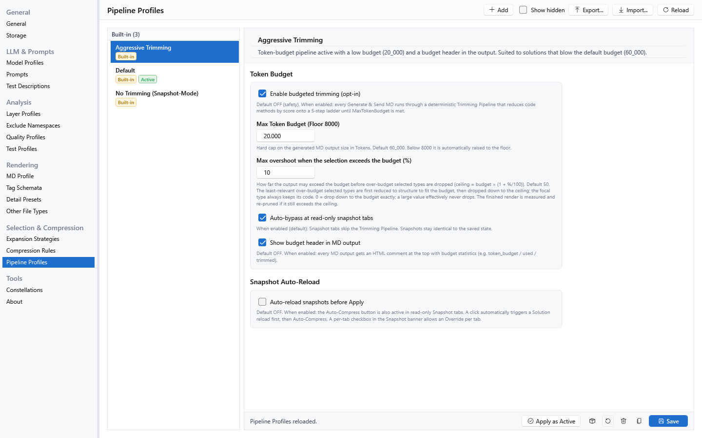

**`Token Budget`**

| Field | Default | Notes |
|---|---|---|
| `Enable budgeted trimming (opt-in)` | off | Master toggle. When on, every context document runs through a deterministic trimming pipeline before the LLM call, reducing code methods by score until the budget is met. |
| `Max Token Budget (Floor 8000)` | `60000` | Hard cap for the generated document size in tokens. Values below 8000 are raised to the floor. |
| `Max overshoot when the selection exceeds the budget (%)` | `50` | How far the output may exceed the budget before over-budget selected types are dropped. The ceiling is `budget × (1 + %/100)`. `0` means a hard cap (drop down to the budget exactly); a large value effectively never drops a selected type. Clamped to 0-1000. The least-relevant selected types are first reduced to structure, then dropped down to the ceiling; the focal type always keeps its code. The finished render is measured and pruned again if it still exceeds the ceiling. |
| `Auto-bypass at read-only snapshot tabs` | on | Snapshot tabs skip the trimming pipeline so they stay identical to the saved state. |
| `Show budget header in MD output` | off | Prefixes the output with an HTML comment containing budget statistics (token budget / used / trimmed). |

**`Snapshot Auto-Reload`**

| Field | Default | Notes |
|---|---|---|
| `Auto-reload snapshots before Apply` | off | When on, the auto-compress button is also active in read-only snapshot tabs. A click automatically triggers a solution reload first, then auto-compress. A per-tab checkbox in the snapshot banner lets you override it for one tab. |

## 8.20 Constellations

**What it is:** a constellation bundles master entities plus selected application settings into **one portable JSON file**, and reads such a file back in. It is the way to move a complete configuration from one machine to another.

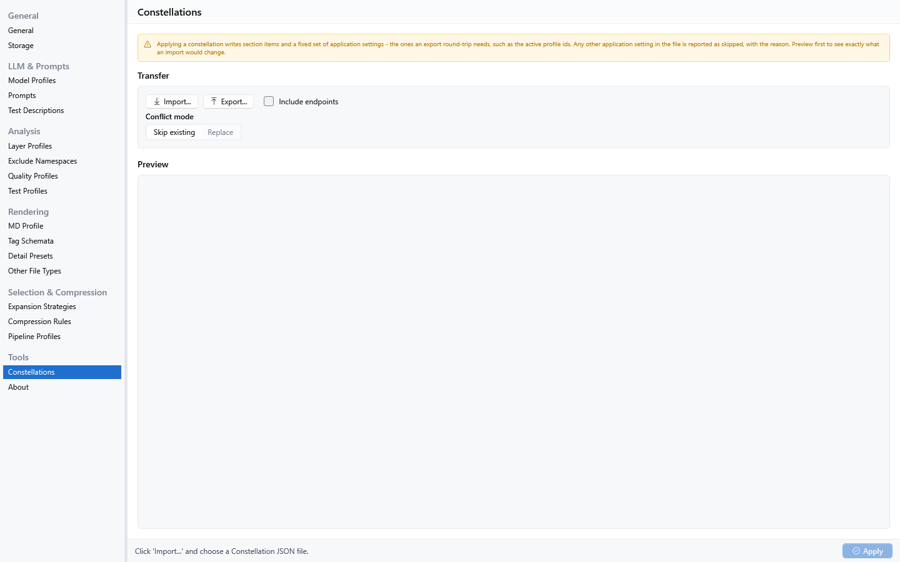

The header tooltip: "A constellation bundles your configuration - prompts, templates, model profiles and selected application settings - into one portable JSON file for sharing or backup."

The page shows an informational banner: "Applying a constellation writes section items and a fixed set of application settings - the ones an export round-trip needs, such as the active profile ids. Any other application setting in the file is reported as skipped, with the reason. Preview first to see exactly what an import would change."

**`Transfer`**

| Control | Notes |
|---|---|
| `Import...` | Choose a constellation JSON file. Header validation and preview run automatically. |
| `Export...` | Writes the current settings plus your custom master entities as a constellation JSON file. Built-ins are deliberately **not** exported - they come from the app. |
| `Include endpoints` | Default **off**. When off, model profile endpoint URLs are redacted from the exported file, so it is safe to share. When on, endpoints are included. API keys are never exported - they live in the Windows Credential Manager. |
| `Conflict mode` | `Skip existing` (default): existing entries with the same ID stay unchanged, new entries are saved. `Replace`: existing entries with the same ID are overwritten. |

Below the buttons, the last file used by an import or export is shown (`Last file: ...`, hover shows the full path). The `Preview` pane fills the rest of the page and shows exactly what applying the file would change.

The workflow is: `Import...` and choose a file → read the preview → `Apply`. The status line starts with "Click 'Import...' and choose a Constellation JSON file."

The preview names the bundle (name, description, minimum app version, export date), its origin and a trust label, then lists each section with its counts of new, conflicting, unchanged and skipped built-in entries, plus the application settings keys the file carries. A community-sourced file is labelled "Low trust - third-party source, inspect first!".

After `Apply`, the page reports `Applied: {n} Items.`, `Skipped: {n} Items.` and `AppSettings keys: {n} applied.`; when there are problems, a `Notes:` list is appended and an error dialog appears.

Supported entity types: `Prompt`, `MdProfile`, `TagSchema`, `DetailPreset`, `TestDescription`, `ModelProfile`, `ContextTemplate`, `ExpansionStrategy`, `RunTemplate`, `LayerMappingProfile`, `NamespaceExclusionList`, `CompressionRules`, `PipelineProfile`, `QualityProfile`, `McpProfile` and `TestProfile`. An unknown type is reported with that list.

Two more rules are worth knowing:

- **Application settings are applied through a fixed whitelist.** A key outside the list is rejected, and the message names the allowed keys. The list covers the settings a round-trip needs - the active profile ids, the general settings, the default profile choices and the plain preferences. Settings that are tied to one machine (storage paths, the recent lists, splitter positions) are deliberately never imported.
- **Built-ins are always skipped on import.** They come from the app, not from the file. An import is fault-tolerant by design: an unusable application-settings section does not abort the entity import.

Note: if a model profile was exported with `Include endpoints` off, the endpoint is missing from the file. On re-import on the same machine it is restored from the existing profile with the same ID; on a different machine it stays empty - exactly the intended "share without endpoints" behavior.

## 8.21 About

**What it shows:** version, the bundled third-party libraries, contact information and the license.

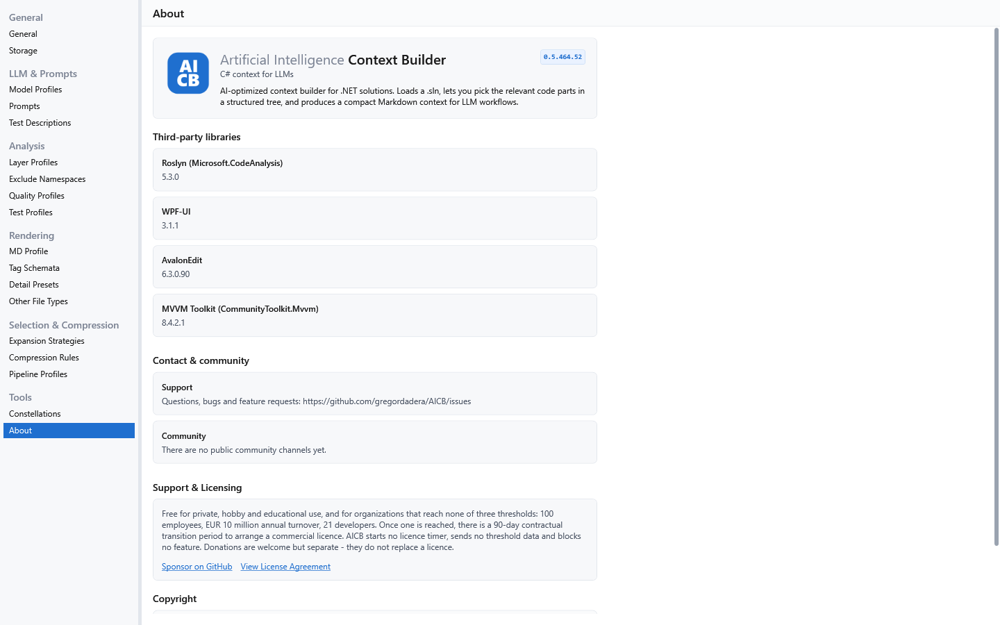

- **The hero card** shows the product name, the current version, the tagline `C# context for LLMs` and a short description.
- **`Third-party libraries`** lists the key libraries this build ships with, each with the version of the assembly actually loaded at runtime (never maintained by hand): Roslyn (`Microsoft.CodeAnalysis`), WPF-UI, AvalonEdit and MVVM Toolkit (`CommunityToolkit.Mvvm`).
- **`Contact & community`** lists `Support` ("Questions, bugs and feature requests: https://github.com/gregordadera/AICB/issues") and `Community` ("There are no public community channels yet.").
- **`Support & Licensing`** carries the license summary: "Free for private, hobby and educational use, and for organizations that reach none of three thresholds: 100 employees, EUR 10 million annual turnover, 21 developers. Once one is reached, there is a 90-day contractual transition period to arrange a commercial licence. AICB starts no licence timer, sends no threshold data and blocks no feature. Donations are welcome but separate - they do not replace a licence."
  - `Sponsor on GitHub` opens the project's GitHub Sponsors page in your browser.
  - `View License Agreement` opens the bundled full `EULA.md` from the distribution root in your default editor. A development build without that file falls back to the `LICENSE.txt` summary next to the executable.
- **`Copyright`** shows the copyright notice and product-name / third-party trademark attributions.

## 8.22 Configuring AICB for a team

This section is a practical order of work for setting up AICB on a team, from "nothing configured" to "shared configuration".

**Step 1 - Nothing to configure for the core workflow.** All analysis and rendering axes have built-in defaults that are already active. Open a solution and create a context document; you do not have to visit Settings at all.

**Step 2 - One model profile per machine.** For the LLM workflow, each user needs a model profile with an API key. The key is stored in the Windows Credential Manager and is tied to the Windows account, so it never travels in an export and every team member enters their own. If a key is missing, the app says where to add it: `API key for model '{Name}' is missing. Settings > Model Profiles.` The built-in model profiles can serve as starting points; use `Duplicate` to create your own entry and `Test Connection` to verify endpoint, key and model name before the first real run.

**Step 3 - Set the three per-solution axes where they belong.** The layer profile, the namespace-exclusion list and the test profile can each be chosen **per solution** in the Workspace's Solutions tab. The choice wins over the app-wide default from the `General` page; the resolution order is always per-solution → app-wide default → built-in default. Use the app-wide defaults for the common case and the per-solution override only for solutions that differ.

If you work headless or want the configuration in version control, write the solution configuration as a git-tracked sidecar file named `<SolutionName>.aicb.json` next to the `.sln` file. It carries rules rather than database IDs, so it is portable. The desktop app can restore its profile content; database-free headless analysis uses the layer/exclusion fallback and analysis scope, while test detection and suppressions follow their separately documented paths. Of the related MCP tools, `solution_config_status` only reads status and `init_solution_config` only gathers proposal material; `apply_solution_config` is the operation that writes the configuration database and sidecar.

One sidecar setting has no wizard and is written by hand:

```json
{ "analyzePreferredTfmOnly": true }
```

A multi-targeted project (`<TargetFrameworks>net8.0;netstandard2.0</...>`) is otherwise loaded once per target framework, so every source file is analyzed several times. With this key set, only the newest target framework's instance of each project is analyzed. The default is off, and on a solution without multi-targeting the setting does nothing. Note that it narrows the analysis: a fan-in edge whose only source is a non-preferred instance is lost, so "who uses this" queries can report a smaller blast radius.

**Step 4 - Share a complete configuration with a constellation.** To move prompts, templates, profiles, schemata and the accompanying application settings to another machine or another team member, use the `Constellations` page: `Export...` on the source machine, then `Import...` and `Apply` on the target. Leave `Include endpoints` off for anything you share outside your network - the file is then safe to pass around, and API keys are never in it. Choose `Skip existing` when the target already has entries you do not want to overwrite, or `Replace` when the file should win. Read the preview before applying; it lists every section and every application setting the file would change. The same file can be applied headless:

```sh
aicb import --file <constellation.json> --db-path <target-db> --mode SkipExisting --preview
```

**Step 5 - Know what does not travel.** Storage settings are machine-local by design: the base path, the database path and the recent lists are never part of a constellation. The splitter positions and the first-run marker are also excluded. So after moving a configuration, each user still sets their own `Base path` (a change that takes effect after an app restart) and enters their own API keys.

**Step 6 - Protect the shared state.** The desktop app and the MCP server write into the same database. If your team uses both, enable `Enable auto-backup on app start` on each machine and set an interval that matches your working rhythm - the archive also contains the active database file even when it lives outside the base path. Remember that the backup runs at startup before any window appears, so a very large base path delays the start; and if a run fails, it is retried at every start until the cause is fixed.

---

[&larr; 7 Runs and language models](07-runs-and-language-models.md) &middot; [Contents](README.md) &middot; [9 MCP Profiles, MCP Usage and Templates &rarr;](09-mcp-profiles-mcp-usage-and-templates.md)
