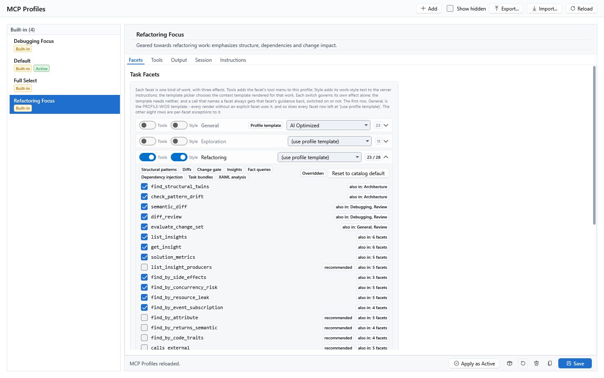
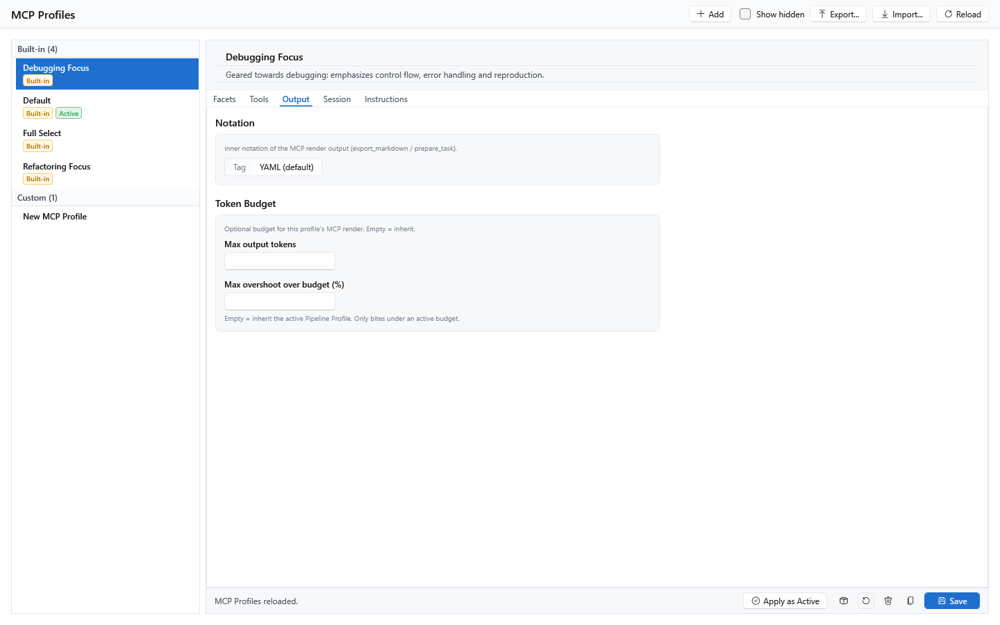
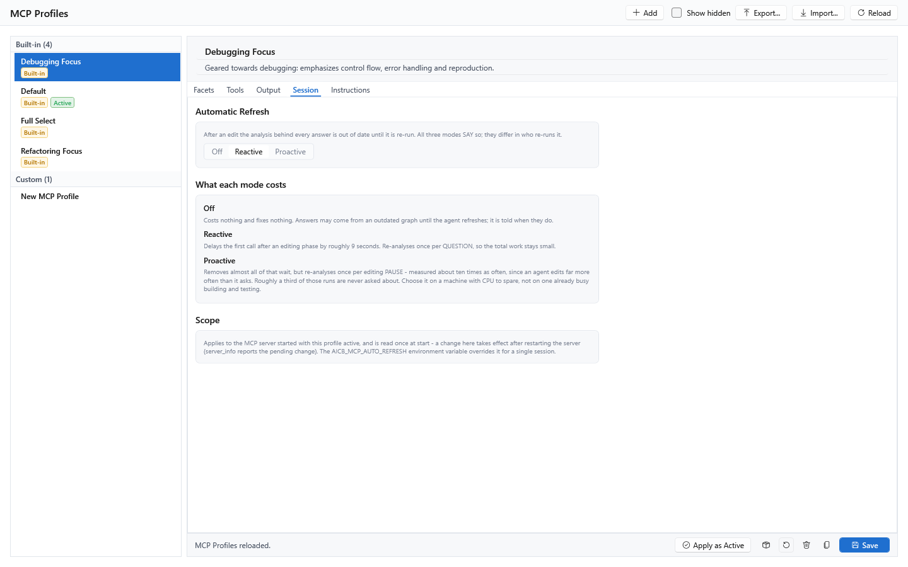
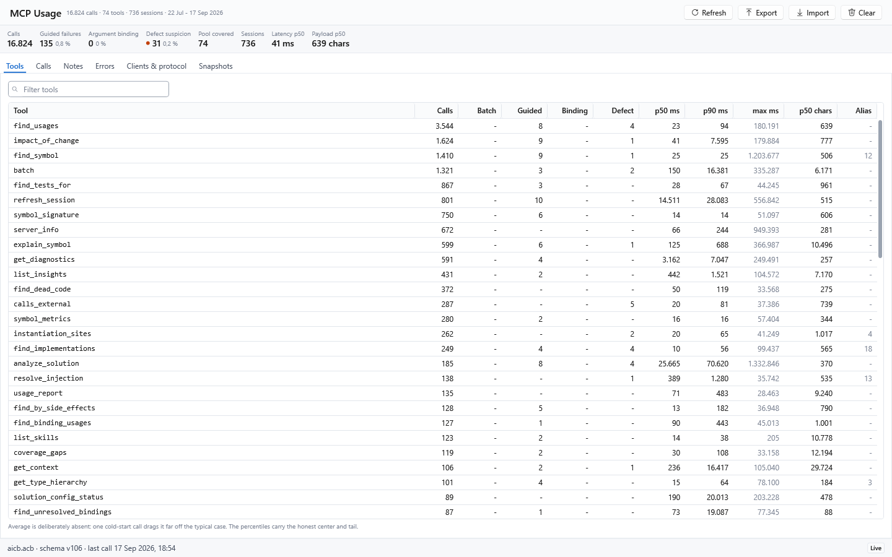
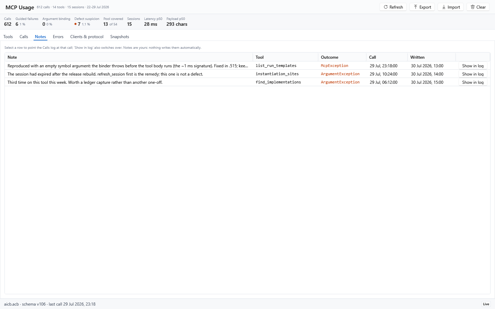
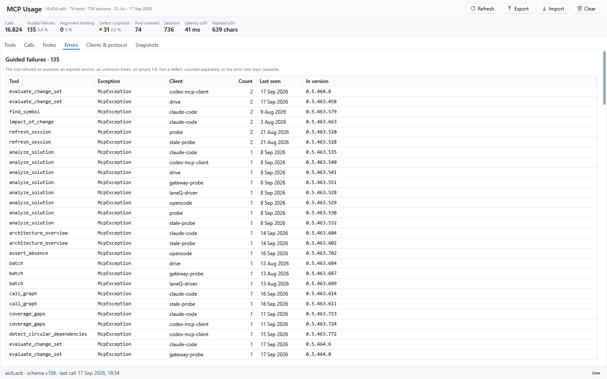
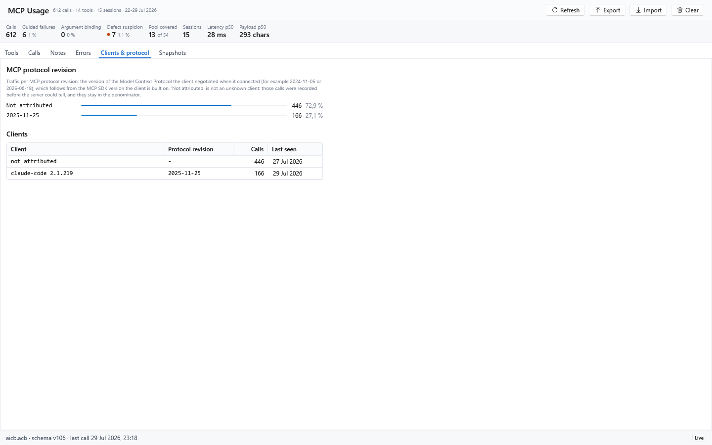
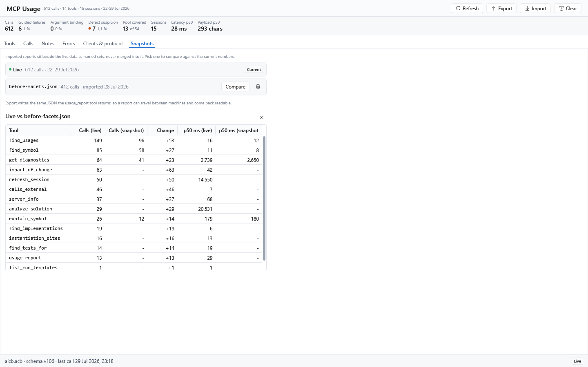
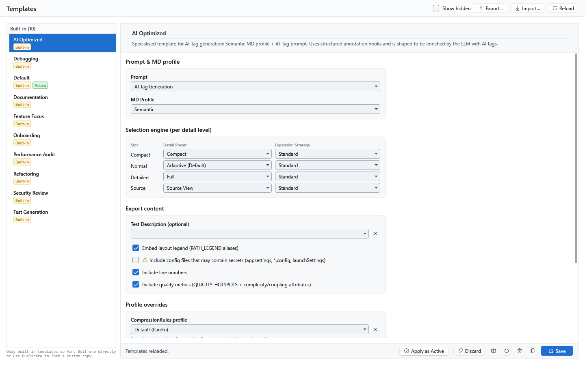

[AICB – Desktop Application](README.md) &middot; chapter 9 of 11

# 9 MCP Profiles, MCP Usage and Templates

This chapter covers the three pages that belong to the MCP feature and to context templates: **MCP Profiles** (the graphical face of the MCP server), **MCP Usage** (the telemetry the server records about itself) and **Templates** (the context-template library). The MCP manual explains the server side of these concepts — what a profile, a facet, a bundle or a tool does at runtime; this chapter describes what you see and set in the app.

## 9.1 MCP Profiles

**Where:** main menu → `MCP` → `MCP Profiles`.

An MCP profile bundles a complete MCP working environment: the task facets (per facet a tool menu and a context template), the guidance blocks, the opt-in tool bundles, the output notation, the token budget, and how the server keeps its analysis in step with your edits. Exactly one profile is active and drives the MCP server; the active one carries the `Active` pill in the list.

The page follows the master/detail layout used throughout the app: the list on the left, the editor on the right. Header tooltip:

> `An MCP profile bundles the task facets (tool menus + context templates), the guidance blocks, the opt-in tool bundles, the output notation and the token budget of one MCP working environment.`

The list groups entries into `Built-in` and `Custom` (built-ins first, alphabetical within each group) and shows these pills:

| Pill | Meaning |
|---|---|
| `Built-in` | Shipped with the product. |
| `Active` | The profile that currently drives the MCP server. |
| `Overridden` | A built-in you edited and saved; the built-in seed leaves the row alone from then on. |
| `Hidden` | A built-in you deleted. Tick `Show hidden` in the header to see it again and restore it. |

Header fields:

| Field | Tooltip |
|---|---|
| `Name` | `The display name of this MCP profile, shown in the profile list and reported by list_mcp_profiles.` |
| Description | `A short description of this profile's purpose, shown under its name in the list.` |

Header actions: `Add` (creates a new custom profile), `Show hidden`, `Export...`, `Import...`, `Reload` (discards unsaved editor edits). Footer actions: `Apply as Active`, `Save`, `Duplicate`, `Delete`, `Restore Built-In`, `Export as Built-In`.

Keyboard shortcuts: `Ctrl+S` saves, `Ctrl+N` creates a new profile, `Ctrl+D` duplicates the selected one, `F5` reloads from the database.

### The four built-in profiles

| Name | What it is | Auto-refresh |
|---|---|---|
| `Default` | The everyday tool set across all nine task facets, with 18 long-tail tools withheld from the facet menus. Its shipped description says `24 core + 30 extras = 54 tools`. | `Reactive` |
| `Full Select` | The complete tool set: all nine facets enabled without any menu narrowing. Its shipped description says `24 core + 48 extras = 72 tools`. The infrastructure and DB-entity tools stay opt-in via `AICB_MCP_TOOLS`. | `Reactive` |
| `Refactoring Focus` | `Geared towards refactoring work: emphasizes structure, dependencies and change impact.` Enables the `Refactoring` facet — tool menu and working style. | `Reactive` |
| `Debugging Focus` | `Geared towards debugging: emphasizes control flow, error handling and reproduction.` Enables the `Debugging` facet — tool menu and working style. | `Reactive` |

All four render every facet through the profile-wide `AI Optimized` context template in YAML notation and start with the auto-refresh mode `Reactive`.

The 18 tools that `Default` withholds from its menus stay registered. All nine facets are already enabled in `Default`; to restore one of the withheld tools, expand its facet and check the tool (marked with the `recommended` badge), or switch to `Full Select`.

Note: the tool counts in the two descriptions are literal text shipped with the profiles and age with the tool catalog. The reliable count for the profile you have selected is the `Effective tools/list` readout on the `Tools` tab; the reliable list of everything the server knows is the `list_skills` tool, which groups tools into `inPool` and `outOfPool`.

### The five editor tabs

| Tab | What it configures |
|---|---|
| `Facets` | The nine kinds of work: per facet its tool menu, its working style and its context template. |
| `Tools` | Everything outside the facet menus — the navigation core, the opt-in bundles — plus the effective tool list they add up to. |
| `Output` | Notation and token budget of this profile's MCP render. |
| `Session` | How the MCP server keeps its analysis current, and who pays for that. |
| `Instructions` | What the server sends the LLM on connect: guidance styles, free text, and a live preview of both. |

The editor remembers the tab you last had open; switching to another profile does not reset it.

### Facets tab — the nine kinds of work

Help text on the tab:

> `Each facet is one kind of work, with three effects. Tools adds the facet's tool menu to this profile; Style adds its work-style text to the server instructions; the template picker chooses the context template rendered for that work. Each switch governs its own effect alone: the template needs neither, and a call that names a facet always gets that facet's guidance back, switched on or not. The first row, General, is the PROFILE-WIDE template - every render without an explicit facet uses it, and so does every facet row left at '(use profile template)'. The other eight rows are per-facet exceptions to it.`

The nine facets, in catalog order:

| Facet | Covers |
|---|---|
| `General` | Balanced, task-neutral context work: navigate, read and verify. |
| `Exploration` | Understanding an unfamiliar codebase before changing it: start from the architecture and the public surface, then drill into symbols. |
| `Refactoring` | Structural clarity and dependency direction; minimal, behaviour-preserving edits; coupling and cohesion smells. |
| `Debugging` | Tracing control and data flow to the fault, fixing the root cause, reasoning about reproduction. |
| `Review` | Reviewing a change end to end: blast radius, introduced findings, test coverage. |
| `Testing` | Focused, deterministic unit tests; finding gaps and pinning invariants and edge cases. |
| `Documentation` | Explaining intent over mechanics; dense and accurate summaries against the real API surface. |
| `Architecture` | Clean/Onion layering: inward dependencies, layer violations, cycles and coupling. |
| `Performance` | Hot paths and complexity hotspots; avoid unnecessary allocations; measure before optimizing. |

Each row has three independent controls:

| Control | Effect |
|---|---|
| `Tools` switch | Adds this facet's tool menu to the profile's `tools/list`. Unfold the row to fine-tune which of its tools are included. |
| `Style` switch | Adds this facet's work-style text to what the server sends on connect, so it applies to every call. |
| Template picker | Chooses the context template rendered for this facet (for example `export_markdown` with facet `"refactoring"`). |

The two switches are deliberately separate: a user who wants only the working style should not have to widen `tools/list` as well. And the `Style` switch only decides the *standing* instruction sent at connect — a call that names a facet always gets that facet's guidance back, switched on or not.

**The `General` row is special.** Its template picker is the **profile-wide** context template: every render without an explicit facet uses it, and the MCP server also resolves the QualityProfile and PipelineProfile from it. The row is shown in bold with a `Profile template` pill. Because of this, the two empty values in the template pickers are labeled differently:

| Row | Empty value | Falls back to |
|---|---|---|
| `General` | `(use active context template)` | The globally active context template. |
| Any other facet | `(use profile template)` | The General row's profile-wide template. |

The counter in the row header reads `checked / available` while the facet is switched on, so you can see whether the menu has been tuned away from the catalog default. While the facet is switched off, the header shows only the menu size — an off facet contributes none of its tools, and `14 / 14` would claim tools the server does not serve. The counter is muted whenever the facet contributes no tools (because it is off or no menu item is checked), regardless of the `Style` switch. Only the row name waits for the stricter condition that the facet contributes nothing at all: neither tools nor working style.

Unfolding a row reveals:

- Chips naming the tool groups that feed this facet's menu; the `General` row shows `Curated menu (no tool classes)` because its menu is a hand-picked list.
- The `Overridden` pill and the `Reset to catalog default` button once the selection deviates from the catalog default. The button checks every tool on the menu again.
- One checkbox per tool function, with the tool's description as its tooltip. Each row can additionally carry:
  - `recommended` — this tool is on the facet's catalog menu but currently deselected.
  - `not in the menu` — this tool is not on the catalog menu; the stored selection brought it along, and `Reset to catalog default` removes it.
  - `also in: …` — the other facets whose menu also carries the tool. Each facet keeps its own selection; the server exposes the union of the enabled facets' menus.

When a change takes effect — tooltip:

> `Tool set and instructions are applied at server start - a change needs a server restart. The template assignment applies live per call.`

**To trim a facet's menu step by step:**

1. Select the profile in the list.
2. Open the `Facets` tab.
3. Unfold the facet row and clear the checkboxes you do not want.
4. Click `Save` in the footer.
5. Restart the MCP server (reconnect your client).

### Tools tab — navigation core, bundles and the result

**`Navigation Core`** — the tools every profile carries regardless of the work at hand:

> `The tools every profile carries regardless of the work at hand. Switch one off to keep it out of this profile; the task facets add their menus on top.`

| Group | Tools |
|---|---|
| Analyze & render | `analyze_solution`, `export_markdown`, `refresh_session`, `get_diagnostics` |
| Navigate symbols | `find_symbol`, `symbol_signature`, `find_usages`, `find_implementations`, `find_overrides`, `get_type_hierarchy`, `impact_of_change`, `find_tests_for`, `call_graph` |
| Context bundles | `get_context`, `explain_symbol`, `pack_for_task` |
| Service & discovery | `server_info`, `usage_report`, `batch`, `measure`, `list_mcp_profiles`, `list_skills`, `docs`, `install_agent_hooks` |

Each group header shows how many of its tools this profile exposes and stays readable when folded (the counter turns to the warning color if something in the group is switched off). `Select all` exposes every tool in the group again; `Clear` switches off every tool in the group that may be switched off. Unchecking a tool denies it for this profile.

`server_info` cannot be switched off and shows a lock instead of a checkbox — it is the tool that reports server state and configuration drift, so a profile that went wrong stays diagnosable from the client.

Facet menus never repeat a navigation-core tool, so the facet counters and these counters never overlap.

**Sparse-selection warning.** When the profile would expose five or fewer tools, a warning banner appears:

> `This profile would expose only N tools. An agent connecting to it has almost nothing to work with: switch core tools back on, or enable a task facet.`

The warning is counted on the *effective* tool list, not on how many checkboxes are cleared — an enabled facet adds tools back. It is a judgement, not a hard limit: there is no tool count at which a profile provably stops working, so the warning names the actual number and leaves the verdict to you.

**`Opt-in Tool Bundles`** — project-type extras outside the task facets:

> `Project-type extras outside the task facets. Enabling a bundle adds its tools on top of the facet menus.`

Each bundle has a switch and a pill naming the number of tools it adds. The current catalog contains one opt-in bundle: `Public API compatibility`, which adds `compare_public_api` (breaking public-API changes between two built assemblies). Bundles are applied at server start; if the `AICB_MCP_TOOLS` environment variable is set, it still overrides the whole profile composition.

**`Effective tools/list`** — a read-only preview:

> `What this profile exposes to the MCP server on connect. Read-only.`

It shows a summary (`N tools`) and the exact tool functions the server will list for this profile, one per line. The preview is computed from the navigation core minus the tools you switched off, plus the union of the enabled facets' menus, plus any enabled bundle tools. Note: it cannot show the effect of `AICB_MCP_TOOLS`, because that variable belongs to the server process and is not readable here.

### Output tab — notation and budget

**`Notation`** — the inner notation of the MCP render output (`export_markdown`, `prepare_task`):

| Option | Meaning |
|---|---|
| `Tag` | `Render the established AI-Builder tag markdown (<CLASS>...</CLASS>). Byte-identical to the previous output.` |
| `YAML (default)` | `Render the content as idiomatic YAML. Lossless - only the notation differs.` |

Both are two ways of writing the same content; pick whichever the model or tool that reads the file handles better. An explicit `export_markdown(format=…)` call parameter wins over this profile default. The `.md` file name is unchanged.

**`Token Budget`** — an optional budget for this profile's MCP render:

| Setting | Behavior |
|---|---|
| `Max output tokens` | Maximum output tokens for this profile's MCP render. Empty = inherit (the context template's budget, then the global one). Floored at 8000. A set value wins over the facet template's budget and forces trimming. Precedence: explicit call parameter > MCP profile > context template > global. |
| `Max overshoot over budget (%)` | How far the template render may exceed the budget before over-budget selected types are dropped, as a percentage of the budget (ceiling = budget × (1 + percent/100)). Empty = inherit the active Pipeline Profile's percent. `0` = a hard cap; a large value effectively never drops a selected type. Clamped to 0–1000. |

The overshoot setting applies to the `export_markdown` / `prepare_task` template render; the lean slice tools (`get_context`, `pack_for_task`, `explain_symbol`) keep their transport cap at the budget. Both settings affect the MCP render path only — GUI and CLI exports are unaffected. The panel adds: `Empty = inherit the active Pipeline Profile. Only bites under an active budget.`

### Session tab — how fresh the facts are

> `After an edit the analysis behind every answer is out of date until it is re-run. All three modes SAY so; they differ in who re-runs it.`

| Mode | Behavior | Cost |
|---|---|---|
| `Off` | `No automatic re-analysis. A drifted session is reported and left alone; the agent repairs it by calling refresh_session itself.` | `Costs nothing and fixes nothing. Answers may come from an outdated graph until the agent refreshes; it is told when they do.` |
| `Reactive` | `Repair when asked: the drift is noticed as a tool is about to answer, the re-analysis runs first, and the answer comes from the current graph. The caller waits for it - about 9 seconds on a solution this size.` | `Delays the first call after an editing phase by roughly 9 seconds. Re-analyses once per QUESTION, so the total work stays small.` |
| `Proactive` | `Repair ahead of the question: a file watcher starts the re-analysis once saving has gone quiet, so the next call usually finds a current graph and waits for nothing. The work does not disappear - it moves into the background, and there is measurably more of it.` | `Removes almost all of that wait, but re-analyses once per editing PAUSE - measured about ten times as often, since an agent edits far more often than it asks. Roughly a third of those runs are never asked about. Choose it on a machine with CPU to spare, not on one already busy building and testing.` |

`Reactive` is the shipped default: all four built-in profiles carry it, and every newly created profile starts with it. `Off` is what an absent value means — a profile that was written by a very old version or imported from one.

The panel lists all three costs at once on purpose: the choice is a trade-off between caller latency and background CPU, and you can only make it by comparing.

**`Scope`:**

> `Applies to the MCP server started with this profile active, and is read once at start - a change here takes effect after restarting the server (server_info reports the pending change). The AICB_MCP_AUTO_REFRESH environment variable overrides it for a single session.`

Accepted values of `AICB_MCP_AUTO_REFRESH`: `off` (also `0`, `false`, `no`), `reactive`, and `proactive` (also `1`, `on`, `true`, `yes`). An unrecognized value is ignored, so a typo cannot switch a mode on.

### Instructions tab — what the server sends on connect

The tab carries a warning banner:

> `A running MCP server keeps serving what it read at startup - a changed active profile applies only after a restart.`

**`Guidance Styles`** — working styles that cut across every kind of work:

> `Working styles that cut across every kind of work. Each adds its text to the server instructions; the tool set is unchanged. A style bound to ONE kind of work lives on its facet instead, as that row's Style switch.`

The two cross-cutting styles are `Async / concurrency correctness` and `Security review`. Hover a row to read its exact text. A style is guidance only: it never adds or removes tools — the `Facets` and `Tools` tabs do that. The six task-bound styles live on their facet rows, beside the tool menu and template of the same kind of work.

**`Additional custom instructions (optional)`** — a multi-line free-text field appended after the facet guidance and the checked styles. Write what they do not already say: a guidance text and a re-worded copy of it both reach the LLM, because only texts that match exactly are collapsed.

**`Server Instructions`** — a read-only preview of exactly what the MCP server sends for this profile, recomputed live as you change facets, styles, bundles or the free text:

> `Exactly what the MCP server sends for this profile, shown in two client-specific availability boundaries.`

The preview is split into three zones because different clients expose different amounts of it:

| Zone heading | Characters | Meaning |
|---|---|---|
| `Codex discovery zone - characters 0-511` | 0–511 | Self-contained identity and the symbol-vs-text rule for Codex before its deferred tool loading. A placement guideline, not a hard Codex cut; Codex receives the complete text after loading the tools. |
| `Behaviour zone - characters 512-2,047` | 512–2,047 | Behaviour-changing rules and the profile's working style inside the prefix Claude Code was measured to expose in prompt assembly. |
| `Post-prefix reference zone - from character 2,048` | from 2,048 | Reference and discovery material outside that measured prefix. It remains transported by the server and is available to Codex after tool loading. |

Where the text crosses the line, the panel draws a real boundary with this explanation:

> `Claude Code was measured to expose exactly the first 2,048 characters in prompt assembly. Text after this line remains available to Codex after its deferred MCP tool load; this is not a universal MCP-client limit.`

Below the zones, `Working style - this profile (facet guidance + styles + free text)` shows your profile's own contribution on its own: the facets whose `Style` switch is on, then the checked guidance styles, then the free text.

Two automatic notes belong to this tab:

1. **Is the working style being cut?** If part of the profile's working style falls below the line, the panel says so: `Part of this profile's working style falls below the line and is dropped by such a client. Exactly one guidance switch is guaranteed to arrive whole; beyond that it depends on their combined length, which the cut mark above shows.` Which blocks arrive is decided by composition order: facets first (in catalog order), then the cross-cutting styles, then the free text.
2. **Does the text name tools this profile does not offer?** Always shown, including the zero case: `Of the N tools named in the text above, this profile exposes M.` If names are withheld, the panel adds: `Not exposed here: <names>. An agent that follows these rules calls them and is refused, without being able to tell an unavailable tool from a wrong one.` Not necessarily a defect: a focus profile drops tools on purpose, and the rules describe the server in general. A block whose tools are *all* withheld is omitted from the sent text; a block backed by some exposed tools keeps its unreachable names.

The preview cannot mirror one thing: `AICB_MCP_TOOLS`. That is an override of the server process, which the GUI cannot read.

### Saving, activating and restoring

| Action | What it does |
|---|---|
| `Save` (`Ctrl+S`) | Persists the editor changes to the database. Editing a built-in sets its `Overridden` flag. |
| `Duplicate` (`Ctrl+D`) | Creates a custom copy of the selected profile (`<Name> (Copy)`) as a starting point for tweaks. |
| `Delete` | Built-ins are soft-hidden and recoverable via `Show hidden` + `Restore Built-In`; custom profiles are removed permanently. |
| `Restore Built-In` | Resets a built-in to its code defaults and clears the override and hidden flags. |
| `Export as Built-In` | Shows the entry as a C# snippet. Intended for the product's own development; it has no effect on your installation. |
| `Apply as Active` | Makes this profile the active MCP profile. The MCP server (render templates, guidance blocks, tool set) is driven by the active profile. A running server picks up the new tool set and instructions only after a restart. |
| `Add` (`Ctrl+N`) | Creates a new custom profile named `New MCP Profile`. |
| `Export...` / `Import...` | Writes or reads a JSON master-data file. Import skips built-ins contained in the file and asks how to resolve conflicts; the status line summarizes it as `Imported: n new, n replaced, n skipped.` |
| `Reload` (`F5`) | Discards unsaved edits and reloads all profiles from the database. |

Note: saving a built-in profile freezes its current facet menus into the stored row. For the `Default` profile this means the tool names it has today are pinned — a tool catalogued into a facet later no longer joins it by itself. If you want the `Default` profile to keep following the catalog, leave it untouched (or use `Restore Built-In`). Saving also marks the row `Overridden`, and the built-in seed then leaves it alone.

## 9.2 MCP Usage

**Where:** main menu → `MCP` → `MCP Usage`.

The page shows the telemetry the MCP server records for every handled call, read from the same database the app uses. It is not an editor: it is an evaluation view with a note function, export/import, and a controlled deletion path. The panel reloads whenever the tab is activated — the MCP server writes into the same database while the app runs, so a re-activated tab would otherwise keep showing the numbers from its first open.

If nothing has been recorded yet, the page shows:

> `No tool calls recorded yet. The MCP server records every handled call into this database; connect a client and this page fills up.`

### Header actions and statistics

| Action | Tooltip |
|---|---|
| `Refresh` (`F5`) | `Reload the usage data from the database (F5).` |
| `Export` | `Write the current usage report as JSON. The file carries exactly what the usage_report MCP tool returns, so it can be imported on another machine.` |
| `Import` | `Import an exported usage report as a named snapshot beside the live data. Imported sets are never merged into the live numbers.` |
| `Clear` | `Delete recorded calls (all, or older than a date). An export is saved first, and the deletion asks for a destructive confirmation.` |

Below the header, a statistics strip aggregates the **live** table:

| Tile | Meaning |
|---|---|
| `Calls` | Total recorded calls. |
| `Guided failures` | Calls that failed with `McpException`: the tool refused on purpose (an expired session, an unknown token). Not a defect. Shows a count and a share of all calls. |
| `Argument binding` | Calls the SDK's argument binding rejected because the caller named an argument the tool does not have. The call never reached the tool, so it is neither a defect nor a refusal. A count here means the argument surface confused somebody. |
| `Defect suspicion` | Calls that failed with any other exception type — a defect suspicion worth chasing. The `Errors` region breaks it down. |
| `Pool covered` | Tools of the active profile's pool with at least one recorded call, out of the pool's size (shown as a muted `of N`). Deliberately not the same figure as the header's tool count, which counts every tool the recording ever saw. Without an active profile the pool is unknown and the figure stands alone as the plain count of tools that were called. |
| `Sessions` | Number of distinct sessions that recorded calls. |
| `Latency p50` | Median latency over every call that recorded one. The median, not the average: one cold-start call drags an average far off the typical case. |
| `Payload p50` | Median result size over every call that recorded one. |

The strip is shown only while the live table holds at least one call. On a database that carries only an imported snapshot, every tile would aggregate an empty table, so the strip is hidden instead.

At the bottom, the status line names the database file, its schema version and the last recorded call (for example `aicb.acb · schema v105 · last call 30 Jul 2026, 18:41`); the full database path is its tooltip. A `Live` pill marks that the regions always show the live database — imported snapshots sit beside it in the `Snapshots` region.

### Tools tab

`Filter tools` filters the table by tool name (substring match); `Esc` clears the field. The table is sortable and lists every recorded tool, ranked by call count:

| Column | Meaning |
|---|---|
| `Tool` | The tool function name. Rows with no recorded call are muted. |
| `Calls` | How often the tool was called **directly**. Sub-queries inside a `batch` are not in here — they are the `Batch` column. A muted row ran neither way. |
| `Batch` | How often the tool was **dispatched as a sub-query inside a batch**. Those calls record no row of their own, so before this column a tool used only through `batch` read as never called. Read it as attempts, not runs: a sub-query the active profile refused, or one that failed on its arguments, is counted here too. `measure` is excluded — it runs the tool fully, but the caller consumes the size of the answer rather than the answer. |
| `Guided` | Failures the tool raised on purpose (`McpException`): an expired session, an unknown token. Not defects. |
| `Binding` | Calls rejected by argument binding: the caller named an argument this tool does not have, so the call never reached it. Counted out of `Defect`. |
| `Defect` | Failures with any other exception type: defect suspicions. The `Errors` region names each type. |
| `p50 ms`, `p90 ms` | Median and 90th-percentile latency. |
| `max ms` | The single worst call, usually a cold start. Muted on purpose: it is an outlier, not the typical case. |
| `p50 chars` | Median result size. |
| `Alias` | Calls that named a parameter by its accepted alias instead of its real name: how often the server silently corrected the caller. |

Columns with nothing to report show a dash rather than a `0`: `Guided`, `Binding`, `Defect` and `Alias` are blank when nothing happened. `Binding` is subtracted out of `Defect` — an argument-binding failure is the caller's mistake and must not keep suggesting the tool might be broken.

Below the table the panel states: `Average is deliberately absent: one cold-start call drags it far off the typical case. The percentiles carry the honest center and tail.`

A sentence below the table names the rows of the active profile's pool that have no recorded call, for example `3 of the 54 tools in the active profile's pool have no recorded call. Their rows carry 0 calls.` It can also name tools that were called but are not in today's pool. The sentence is not shown when no active profile resolves, when every tool in the pool has been called, or while a filter is active (it counts the whole pool, and would otherwise stand under a filtered table).

Note: the muted styling of an unused row and that sentence use slightly different evidence. A row counts as unused only when both its direct and its `Batch` count are zero. The sentence, however, counts direct calls only — so a tool that was used exclusively through `batch` can appear in that list without being muted, and it shows its `Batch` count. The two sources disagree deliberately; read the `Batch` column before treating such a name as unused.

The ranked part of the table is capped at the 200 most-used tools (the same cap the `usage_report` tool accepts). Tools beyond that appear only in the pool sentence or in the exported report.

### Calls tab

This is the raw protocol: the individual recorded calls, newest first. It is the drill-down under the aggregates and the only place a note can be attached.

- `Filter calls` filters by tool name (substring match); the filter is applied in the database, not on the visible slice, so you always see the newest matches of the whole table. `Esc` clears the field.
- `Failures only` restricts the log to calls that did not succeed: a thrown exception, or a result the tool itself flagged as an error.
- `Back to recent` appears only when a note-driven focus is active and drops it again, showing the most recent calls.

Columns:

| Column | Meaning |
|---|---|
| (marker) | A note is attached to this call. |
| `Time` | Local time, with seconds (`30 Jul, 18:41:07`). |
| `Tool` | The tool function name. |
| `Client` | The client that made the call, as it identified itself at connect time (name and version). A dash means the call was recorded before the server could tell. |
| `Outcome` | `ok`, or the exception type of a failure (shown in the error color). |
| `ms` | Duration, where recorded. |
| `chars` | Result size, where recorded. |
| `Message` | The failing exception's message, capped at 500 characters. Blank means either a successful call or one recorded before the server stored messages; the `Errors` region's `In version` column tells the two apart. |

If the log is longer than the window, a note says so, for example `Showing the 300 most recent of 1,029 matching calls.` The log always shows the 300 most recent matching calls. If no call matches the filter, the panel says `No recorded call matches this filter.`

Below the table is the note editor. Without a selection it reads: `Select a call above to write a note on it. Notes live beside the telemetry and are deleted with the call they belong to.` With a call selected, the heading names it in words — `Note on {tool} · {time} · call #{id}` — and you can write free text and use `Save note` or `Remove`. Saving again replaces the text and keeps the original date; removing deletes the note but keeps the call.

### Notes tab

`Select a row to point the Calls log at that call; 'Show in log' also switches over. Notes are yours: nothing writes them automatically.`

| Column | Meaning |
|---|---|
| `Note` | Your text. |
| `Tool` | The tool of the annotated call. |
| `Outcome` | `ok` or the failure type of that call. |
| `Call` | The call's time. |
| `Written` | When you wrote the note. |
| `Show in log` | Switches to the `Calls` region with this call selected. |

Selecting a row already points the call log at that call (and loads the call in if the window does not reach it), but deliberately does not switch regions — otherwise the note list would not be browsable. If the call had to be loaded on its own, the log says so: `The selected note's call is not part of this view (older than the window, or filtered out); it was loaded in on its own.` `Show in log` also clears the log's filters, because a call excluded by a filter would otherwise not be visible.

If no notes exist: `No notes yet. Pick a call in the Calls region and write one; it stays attached to that call and shows up here.`

### Errors tab

Errors are never shown as one bare rate. The tab splits them into three groups, each with its own table:

| Group | Explanation |
|---|---|
| `Guided failures` | `The tool refused on purpose: an expired session, an unknown token, an empty DB. Not a defect; counted separately so the error rate stays readable.` |
| `Argument-binding failures` | `The caller named an argument this tool does not have, so the call never reached it. That is neither a defect nor the tool refusing. Retrying unchanged fails identically; the error names the tool's real arguments. A count here means the argument surface confused somebody.` |
| `Defect suspicion` | `Any other exception type: a defect suspicion worth chasing. 'In version' names the server version of the LAST occurrence, so after a fix you can read off whether it still happens.` |

Each group's heading carries the total count, for example `Guided failures · 12`. Every table has the same columns:

| Column | Meaning |
|---|---|
| `Tool` | The tool function name. |
| `Exception` | The exception type. |
| `Client` | The client the errors came from, as it identified itself at connect time (name and version). A dash means the calls were recorded before the server could tell. |
| `Count` | How many times this combination occurred. |
| `Last seen` | Date of the last occurrence. |
| `In version` | The server version of the last occurrence. |

The client is part of the grouping: the same error from two clients is two rows.

Empty groups say so instead of showing an empty table: `No argument-binding failures recorded.` / `No defect suspicions recorded.` A corpus without defect suspicion is a good state, not a missing feature.

### Clients & protocol tab

The upper section `MCP protocol revision` shows a bar and a legend per protocol revision:

> `Traffic per MCP protocol revision: the version of the Model Context Protocol the client negotiated when it connected (for example 2024-11-05 or 2025-06-18), which follows from the MCP SDK version the client is built on. 'Not attributed' is not an unknown client: those calls were recorded before the server could tell, and they stay in the denominator.`

The lower section `Clients` lists `Client`, `Protocol revision`, `Calls` and `Last seen`. A client that did not identify itself appears as `not attributed`. `Last seen` sorts by the raw timestamp, because the displayed text does not sort chronologically. The table shows up to 50 client-and-revision groups; if there are more, a note says how many of how many are shown.

### Snapshots tab

> `Imported reports sit beside the live data as named sets, never merged into it. Pick one to compare against the current numbers.`

The first card is the live table, marked with the `Current` pill and a green dot; its summary names the number of calls and the recording period. Each imported snapshot is a card with its file name, its summary (`N calls · imported {date}`), a `Compare` button and a delete button. The delete confirmation says: `Remove the imported snapshot '{name}'? The source file is not touched, but this stored set cannot be restored without re-importing it.`

If nothing has been imported: `No imported reports yet. Import an exported usage-report JSON to keep it here as a named set.` The panel also states: `Export writes the same JSON the usage_report tool returns, so a report can travel between machines and come back readable.`

`Compare` opens a table titled `Live vs {snapshot name}` with the columns `Tool`, `Calls (live)`, `Calls (snapshot)`, `Change`, `p50 ms (live)` and `p50 ms (snapshot)`. A cross in the title closes the comparison again.

On a database whose live table is empty but which holds an imported snapshot, the page opens on the `Snapshots` region the first time, so you see the content that exists.

### Exporting, importing and clearing usage data

**Export** writes a fresh aggregate (not the cached view) with exactly the same content the MCP tool `usage_report` returns — one shared serializer for both sides. The save dialog is titled `Export Usage Report`, filters on `Usage report (*.json)|*.json|All files (*.*)|*.*` and suggests `usage-report-{yyyy-MM-dd}.json`. The file is written indented: same fields, same names, but a person opens this one. The `poolCoverage` block is included when an active profile resolves; otherwise it is omitted, exactly as on the server. The status line then shows `Exported to {file}`.

**Import** opens a file, validates it and stores it as a named usage snapshot (the name is the file name), then switches to the `Snapshots` region and reloads. The status line shows `Imported {name}`. Two rejection reasons exist:

- `This file is not valid JSON.`
- `This file is not an exported usage report (expected the JSON the usage_report tool returns, with available=true and totals).`

**Clear** is the destructive path and runs in a fixed order:

1. A scope dialog titled `Clear Usage Data` shows how many calls are recorded and over which period, and offers `Clear everything` or `Clear calls older than` with a date picker (pre-filled with 30 days ago). `Clear calls older than` deletes calls recorded strictly before the chosen day; that day itself and everything after it stays. If nothing is recorded: `There are no recorded calls to clear.`
2. If the chosen scope matches nothing: `No recorded call is older than the chosen date.`
3. An export is forced. If you cancel the file dialog, the whole operation is cancelled: `Clear cancelled: no export target was chosen.` If the export cannot be written: `The export could not be written, so nothing was cleared: …`
4. A destructive confirmation names the number of calls, the file — and the notes: `{n} notes written on those calls will be deleted with them, and the export does not contain them.` This warning matters: notes hang off the calls and are deleted with them, while the forced export contains only the aggregate. The notes are the one thing this operation destroys irrecoverably.
5. The calls are deleted and the status line shows `Cleared {n} calls (exported to {file} first)`.

## 9.3 Templates

**Where:** main menu → `Configuration` → `Templates`.

A context template is a reference container: it does not contain content itself, but selects the master data a context render uses. The page follows the master/detail layout; the list groups built-in and custom templates, and the editor on the right shows the selected template's selections, filled from the respective master-data lists.

The header offers `Reload`, `Import...`, `Export...` and `Show hidden`. The action bar offers `Apply as Active`, `Save`, `Duplicate`, `Delete`, `Restore Built-In`, `Export as Built-In` and `Discard`. Keyboard shortcuts: `Ctrl+S` saves, `Ctrl+D` duplicates, `Ctrl+N` creates a new, empty template, `F5` reloads.

Note: the header deliberately has no `Add` button, because a template carries a set of required selections. The hint under the list says: `Only built-in templates so far. Edit one directly or use Duplicate to fork a custom copy.` Use `Duplicate` to create a template: the copy is pre-filled with all values of the source.

Built-in templates are editable. Saving one sets the `Overridden` pill; `Restore Built-In` resets it to the code defaults. Deleting a built-in hides it softly (bring it back with `Show hidden` + `Restore Built-In`); custom templates are removed permanently. Deleting the active template repoints the active template to `default`. A custom template that other entries reference — run templates, an MCP profile's profile-wide template or one of its facet slots — shows an `IN USE · n` pill in the list. `Discard` reverts unsaved editor changes to the last saved values; it is available for custom templates.

If the selected template is used by one or more open sessions, a non-blocking hint banner appears: `1 open session uses this template. You can edit it - your changes take effect the next time that session runs.` (or the plural form for several sessions). The template stays fully editable.

The editor is organized into four sections:

**`Prompt & MD profile`**

| Field | Meaning |
|---|---|
| `Prompt` | The default prompt sent to the LLM when this template runs. The Context Builder tab can override it per run. |
| `MD Profile` | The MD profile defining which sections (FILE_INDEX, entry points, dependency graphs, and so on) appear in the export. |

**`Selection engine (per detail level)`** — a paired grid with one row per detail tier. The composer walker reads both columns per tree node according to the node's effective detail level:

| Slot | Detail Preset | Expansion Strategy |
|---|---|---|
| `Compact` | How much of each symbol (signature / members / body) is rendered for tree nodes of this tier. | How far the walker expands into neighbors (used types, callers, and so on) for tree nodes of this tier. |
| `Normal` | Same, for the Normal tier. | Same, for the Normal tier. |
| `Detailed` | Same, for the Detailed tier. | Same, for the Detailed tier. |
| `Source` | Same, for the Source tier. | Same, for the Source tier. |

The four slots are independent: you decide per tier which detail preset and which expansion strategy apply.

**`Export content`**

| Option | Meaning |
|---|---|
| `Test Description (optional)` | An optional benchmark/test description attached to runs. Useful when the template feeds the SCE benchmark framework. A cross button empties the slot again. |
| `Embed layout legend (PATH_LEGEND aliases)` | Off for refactoring-style runs where the layer map dominates and aliases add overhead; on for graph-heavy analyses such as architecture review or onboarding. |
| `Include config files that may contain secrets (appsettings, *.config, launchSettings)` | **Off by default.** When enabled, secret-bearing configuration files — `appsettings.json` / `appsettings.*.json`, `*.config` (web/app/nuget.config) and `launchSettings.json` — are emitted verbatim in the `AUXILIARY_FILES` section, including any connection strings and API keys. Only enable it for a solution whose configuration holds no secrets, or review the output before sharing it. |
| `Include line numbers` | When on, every method and type tag in the MD export gets an additional `lines="START-END"` attribute (1-based, IDE convention). Useful when the LLM needs to point at specific source locations or when comparing line spans across runs. |
| `Include quality metrics (QUALITY_HOTSPOTS + complexity/coupling attributes)` | When on, the MD export adds a `QUALITY_HOTSPOTS` section ranking the most complex and most coupled methods and types, and annotates each method/type tag with `complexity=""` and `ce=""` (efferent coupling) attributes. Gives the LLM a numeric map of where the risk concentrates. Default off, which keeps the export byte-identical. |

Note: XAML, `.csproj` and other supporting files are included automatically by relevance; only the secret-bearing configuration subset stays gated by the option above.

**`Profile overrides`** — optional per-template overrides. An empty slot means "use the globally active profile". The three profile fields (`CompressionRules profile`, `Pipeline profile`, `Insights profile`) each have a cross button that empties the slot. `Token budget (MCP render)` has no cross; clear its text field to remove that override.

| Field | Meaning |
|---|---|
| `CompressionRules profile` | Controls scoring and Auto-Compression. Empty = use the globally active profile. |
| `Pipeline profile` | Controls the token-budget pipeline and snapshot auto-reload. Empty = use the globally active profile. |
| `Token budget (MCP render)` | Optional maximum output tokens when the MCP server renders through this template (floored at 8000). Positive whole numbers only; empty = inherit the global pipeline-profile budget. When set it forces trimming; a set MCP-profile budget wins over it. Affects the MCP render path only — GUI and CLI exports are unaffected. |
| `Insights profile` | Controls producer toggles, thresholds and ActionMode. Empty = use the globally active profile. |

**Required selections and save validation.** `Prompt`, `MD Profile`, all four detail presets, all four expansion strategies and the name are required. Saving fails with a specific message, for example `Save failed: Prompt is required.`, `Save failed: Compact Detail Preset is required.`, `Save failed: Compact Expansion Strategy is required.` or `Save failed: Name is required.` The name must be unique among templates of the same kind (built-in vs custom), compared case-insensitively: `Save failed: A template with name '{name}' already exists.`

## 9.4 Layer Profiles, Exclude Namespaces and Test Profiles appear twice

Three pages exist under the same names in two places, and they do different things:

| | Settings page | Solutions page |
|---|---|---|
| **Role** | The library editor: create, edit, delete, import, export entries. | The picker per solution: choose which entry applies to the selected solution. |
| **Reachability** | Settings container (for example `Settings` → `Layer Profiles`). | The Solutions workspace, three pickers side by side. |
| **Without a selected solution** | Normally usable. | The picker is read-only and shows only the global default. |

The Settings pages write to the application settings; the Solutions pages write the per-solution choice into the solution record. The per-solution choice wins on all three axes:

| Axis | Resolution order |
|---|---|
| Test profile | Per-solution choice > global default (`AppSettings.ActiveTestProfileId`) > built-in default. |
| Exclusion list | Per-solution choice > global default (`AppSettings.DefaultExclusionListName`) > built-in `BclDefault` > empty. |
| Layer profile | Per-solution choice > app-global default; the configured name is matched by id **or** name, case-insensitively. |

The Solutions-side picker shows how many entries are available, points to the Settings library (`Manage profiles in Settings > Layer Profiles.` and equivalents), and offers `Initialize Now` to restore the solution's axis from its sidecar file — no LLM, no analysis; it does nothing if the axis is already configured or the sidecar does not cover it.

The sidecar file is a separate thing from the per-solution setting. It is written as `<directory>\<SolutionName>.aicb.json` next to the solution, carries the rules embedded (no database id references, so it is portable in version control), and exists for hosts that run without a database. The order one level up is: explicit call parameter > database > sidecar > nothing — each host consults the sidecar only for an axis that would otherwise be empty.

## 9.5 Where settings are stored and when they take effect

Storage is hybrid, and the boundary is not arbitrary: whatever is needed *before* the database is open must live in the JSON file.

| What | Where |
|---|---|
| Storage settings (base path, database path, backup) | JSON: `%APPDATA%\AIContextBuilder\app-settings.json` |
| Recent solutions and recent databases | The same JSON file |
| Everything else from the application and general settings | SQLite, key/value under `general/…` |
| All master data (prompts, profiles, schemas, templates, MCP profiles, and so on) | SQLite, in their own tables |
| MCP telemetry and notes | SQLite tables `tool_calls`, `tool_call_notes`, `usage_snapshots` |
| API keys of Model Profiles | Windows Credential Manager — not in the database, not in the JSON file, not in a master-data export |

The base path defaults to `%APPDATA%\AIContextBuilder`, and the database defaults to `{BasePath}\user-data\aicb.acb`.

Settings keys stored in the database include `general/settings` (the complete general-settings block), `general/active-context-template-id`, `general/default-layer-profile-name`, `general/default-exclusion-list-name`, `general/default-expansion-strategy-id`, `general/default-graph-layout-enabled`, `general/active-mcp-profile-id`, `general/active-pipeline-profile-id`, `general/active-quality-profile-id`, `general/active-compression-rules-profile-id`, `general/active-test-profile-id`, `general/tooltips-enabled`, `general/tooltip-show-delay`, `general/persist-insights-with-session`, `general/auto-trigger-insights-on-load`, `general/enable-load-perf-logging`, `general/has-run-first-analyze-once`, `general/last-selected-settings-sub-tab`, and `layout/settings` for the splitter positions.

When a change takes effect:

| Effect | Examples |
|---|---|
| Immediately on save | Font family, font size/zoom, theme, the tooltip switch and the tooltip delay. |
| At the next start of the app | Base path, LLM retry values, the theme in some individual panels. |
| At the next start of the MCP server | The MCP tool set, the MCP instructions, the auto-refresh mode. |
| Live per MCP call | A profile's context-template assignment. |
| The next time a tab is opened | Default layer profile, default exclusion list, default graph layout. |

Note: the application database is shared with the standalone MCP server. A schema update is applied by whichever host opens the database first after the update, and it applies to all instances that use that database at once. If you keep long-lived copies of the database, make sure they are backed up before you update.

---

[&larr; 8 Settings](08-settings.md) &middot; [Contents](README.md) &middot; [10 Dialogs &rarr;](10-dialogs.md)
