[AICB – Desktop Application](README.md) &middot; chapter 10 of 11

# 10 Dialogs

AIContextBuilder does not use the plain Windows message boxes. Every dialog is a themed window of the app itself, and this chapter describes each one: when it appears, what it shows, what each button does, and what happens to your data on each path.

## 10.1 How dialogs behave

All dialogs share the same behavior:

- **Modal.** While a dialog is open, the main window behind it does not accept input. You answer or close the dialog first.
- **Centered on the main window.** If a dialog appears before the main window exists - for example an error during startup - it is centered on the screen instead.
- **Themed title bar, no window management.** Dialogs have no minimize and no maximize button and never appear in the taskbar. The title bar carries only the close button (X).
- **Escape always closes a dialog** and answers with the dialog's dismiss value - the cancel answer wherever the dialog has a Cancel option.
- **Enter activates the default button** (the highlighted one) - the button the dialog expects you to choose.
- **The X behaves like Escape.** It returns the same dismiss value as Escape, so closing a dialog with the X never counts as a confirmation.

Most dialogs are fixed in size: they grow to fit their content and cap their height, so long messages and lists scroll inside them. These five open at a default size and can be resized with the mouse:

| Window | Default size |
|---|---|
| Diff window | 900 x 600 (minimum 640 x 420) |
| `Keyboard shortcuts` | 760 x 660 (minimum 520 x 360) |
| `Export as Built-In Code` | 720 x 600 (minimum 560 x 400) |
| `Pick namespaces` | 560 x 560 (minimum 420 x 360) |
| `Session opened - missing nodes` | 560 x 480 (minimum 520 x 360) |

The dialogs at a glance:

| Dialog | Appears when |
|---|---|
| Message dialog | The app reports something or asks a simple question |
| Text input | One short piece of text is needed, typically a name |
| `Save Session` | You save a session, or an unnamed session is saved while closing |
| `Relocate solution` | A stored solution file can no longer be found at its path |
| `Unsaved tabs` | You close the app while tabs still hold unsaved work |
| `Session opened - missing nodes` | A session refers to tree nodes that no longer exist |
| `Import master entities` | An imported file contains entries that already exist with different data |
| `Clear Usage Data` | You clear recorded MCP usage data |
| `Queue as work` | You queue an insight detail line as work to do |
| `Set node override` | You set, change or remove the overrides of one tree node |
| `Pick namespaces` | You ask an editor to suggest rules from a solution |
| `Export as Built-In Code` | You export an edited entry as built-in source code |
| `Keyboard shortcuts` | You press `F1` |
| Diff window | You compare two snapshots or review the result of a solution reload |

## 10.2 Message dialogs

### Message dialog

The message dialog replaces the native Windows message box. It shows a title, a message, a status icon and one to three buttons, and it is used wherever the app has something to report or needs a simple decision.

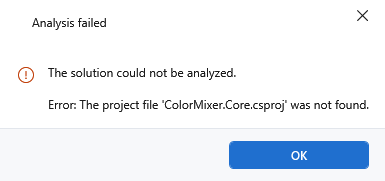

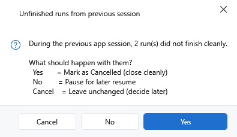

The icon depends on the kind of message:

| Kind | Icon |
|---|---|
| Information | Blue accent information circle |
| Question | Blue accent question mark circle |
| Warning | Amber warning triangle |
| Error | Red error circle |
| None | No icon |

Long messages scroll; the dialog grows to fit its content up to a maximum height.

The buttons depend on the question. Three slots exist - a primary button, an optional `No`, and an optional `Cancel` - and the following table shows which combination is used:

| Button set | Primary button | `No` visible | `Cancel` visible | Escape answers | X answers |
|---|---|---|---|---|---|
| OK | `OK` | no | no | `OK` | `OK` |
| OK / Cancel | `OK` | no | yes | `Cancel` | `Cancel` |
| Yes / No | `Yes` | yes | no | `No` | `No` |
| Yes / No / Cancel | `Yes` | yes | yes | `Cancel` | `Cancel` |

Normally the primary button holds the focus and answers Enter, so Enter confirms. **Destructive confirmations deliberately turn this around**: there `No` holds the focus and answers Enter, and the primary button is drawn in the red danger style. A reflexive Enter on a dialog that has just appeared therefore never deletes anything, and both Escape and the X answer `No`.

The app uses this destructive form only where something is actually lost. The actions behind it are: clearing recorded usage data, deleting a usage snapshot, closing a file with unsaved changes, discarding unsaved files, overwriting a file that someone else changed, resetting node overrides, deleting a session, deleting a snapshot, exporting a sidecar configuration, and removing a solution from the list.

Ordinary OK/Cancel questions appear, for example, before switching the database location, before an insight action whose active quality profile asks for a confirmation first, and for a run whose estimated size exceeds its budget.

Plain information, warning and error dialogs report the outcome of an action and carry a single `OK`. Errors that occur so early that the main window does not exist yet use the same dialog, centered on the screen.

## 10.3 Input dialogs

### Text input

The text input dialog is the smallest dialog: a title, a label and a single-line text field. It is used wherever the app needs one short piece of text, typically a name.

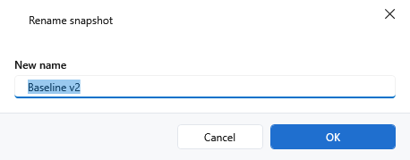

- The window title is `Input` unless the caller supplies its own.
- The label is supplied by the caller. The tooltip of the field reads `Input field - Enter confirms, Escape cancels.`
- When the dialog opens, the text field has the focus and its content is selected - typing replaces the suggestion.
- Buttons: `Cancel` (tooltip `Close the dialog without input (or press Escape).`) and `OK` (tooltip `Confirm the input and close the dialog (or press Enter).`). Enter inside the field is handled directly, so it works without leaving the field.
- There is **no validation** in the dialog. An empty text is an accepted answer and is returned as an empty string; whatever check exists belongs to the caller.

The places it is used, with the title and label each one supplies:

| Used for | Title | Label | Prefilled with |
|---|---|---|---|
| Create a manual snapshot (Snapshots tab) | `Create Manual Snapshot` | `Name for the snapshot:` | empty |
| Rename a snapshot (Snapshots tab) | `Rename Snapshot` | `New name:` | the current name |
| Pin a snapshot (Solutions tab) | `Pin Snapshot` | `Snapshot name (manual snapshots are kept longer):` | the latest snapshot's name, or `Pinned <date>` |
| Rename a snapshot (Solutions tab) | `Rename snapshot` | `New snapshot name:` | the current name |
| LLM Layer Wizard (Layer Profiles) | `LLM Layer Wizard` | `Describe your architecture (layers / conventions), or leave blank to let the model infer it:` | empty |

Note: `Cancel`, Escape and the X give the caller nothing, and the operation is abandoned. Confirming an empty field gives the caller an empty string: the first four flows above treat that as "no change", while the LLM Layer Wizard uses it as "no description - let the model infer the architecture".

### Save Session

This dialog collects the name and the notes for a session that is about to be saved. It opens when you save a session in the Context Builder (for example with `Ctrl+S`), and it also opens from the save-all that `Save and close` performs in the `Unsaved tabs` dialog when a session has no record yet.

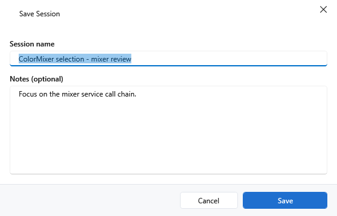

Fields:

| Field | Type | Tooltip |
|---|---|---|
| `Session name` | single line | `Unique display name for this Session. Appears in the Session list and the tab header.` |
| `Notes (optional)` | multi-line, wraps, scrolls | `Free-text notes about the Session (context, reason, findings). Appears in the Session list tooltip.` |

The dialog is prefilled: the name with the session's current name, or with `<solution file name> - <date time>` for a new session; the notes with the existing notes. The focus starts in the name field with the text selected.

Buttons:

- `Cancel` - tooltip `Close the dialog without saving the Session.`
- `Save` - default button, tooltip `Save the Session under the given name. Enabled as soon as the name is not empty.` It is disabled while the name is empty or contains only spaces. There is **no error text**; the button simply stays disabled.

What happens with your answer:

- `Save` stores the session under the trimmed name. You may keep the suggested name unchanged.
- `Cancel`, Escape and the X write nothing and abandon the save.
- If another session in the same solution already carries the name, the app asks again: `A session named "<name>" already exists in this solution (last modified: <date>). Save anyway? Both sessions will then appear with the same name in the list. Click 'No' to return to the save dialog and pick a different name.` (title `Duplicate Session Name`, warning icon). `Yes` saves the duplicate name; `No` abandons the save, and you can start it again to pick a different name.
- If the session's state is identical to the state at the last save, the app asks first: `Current state is identical to the last saved session "<name>" (same state hash). Overwrite anyway?` (title `Save Session`, question icon). `Yes` saves anyway, `No` abandons the save.
- In the close flows (`Save and close` on app shutdown, closing a Context Builder tab with unsaved sessions), sessions that already have a record are updated silently under their current name and notes. Only a session without a record opens this dialog. Cancelling that dialog aborts the whole close, so the app or the tab stays open.

## 10.4 Recovery and safety dialogs

### Relocate solution

This dialog restores a stored solution whose `.sln` file can no longer be found at its saved path - typically after the database was copied to another computer. It is shown when you open a session whose solution is missing, and after a failed attempt to open a solution.

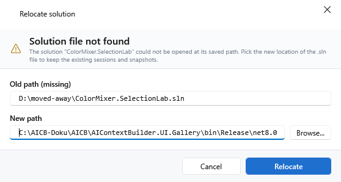

It shows a warning icon with the heading `Solution file not found` and the subtitle `The solution "<name>" could not be opened at its saved path. Pick the new location of the .sln file to keep the existing sessions and snapshots.`

Fields:

| Field | Behavior | Tooltip |
|---|---|---|
| `Old path (missing)` | read-only, monospace; selectable so you can copy it | `The saved path where the .sln is expected but currently missing (read-only; select to copy).` |
| `New path` | editable, monospace | `Full path to the new .sln file (type it or pick via Browse).` |

`Browse...` opens the Windows file picker titled `Select relocated solution` with the filter `Solution files (*.sln)` and `All files (*.*)`. It starts in the folder of the old path when that folder still exists. Choosing a file fills `New path`; cancelling the picker changes nothing. The focus starts in the `New path` field.

Buttons:

- `Cancel` - tooltip `Cancel the relocate operation - the Solution stays in the DB with the old (missing) path.`
- `Relocate` - default button, tooltip `Update the Solution path in the DB - all Sessions/Snapshots are preserved.` It stays disabled until the path is non-empty **and** the file actually exists on disk. Note: no message explains why it is disabled - it simply stays greyed out until the file is found.

What happens with your answer:

- `Relocate` updates only the stored path. **Sessions and snapshots are kept** - they belong to the solution entry, not to its path, which is the whole point of the dialog. If the stored path cannot be updated, an error dialog with the title `Relocate solution` appears and the operation stops.
- `Cancel`, Escape and the X change nothing: the solution keeps the old, missing path and the open is abandoned.
- If the freshly chosen file disappears between confirming and loading it, an error dialog says `Solution file still not accessible at: <path>`. The stored path has already been updated at that point.

### Unsaved tabs

This dialog guards the exit of the application. It appears when you close the app while tabs still hold unsaved work, and it lists one card per affected tab, each with the tab header and a bullet list of what changed. If no tab has unsaved changes, the dialog does not appear and the app closes directly.

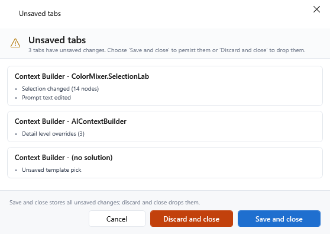

It shows a warning icon with the heading `Unsaved tabs` and a count-aware subtitle:

- One tab: `1 tab has unsaved changes. Choose 'Save and close' to persist them or 'Discard and close' to drop them.`
- Several tabs: `<n> tabs have unsaved changes. Choose 'Save and close' to persist them or 'Discard and close' to drop them.`

A footer hint reads `Save and close stores all unsaved changes; discard and close drops them.`

Buttons, from left to right:

| Button | Style | Tooltip | Effect |
|---|---|---|---|
| `Cancel` | secondary | `Cancel the close operation - tabs stay open with unsaved changes.` | The app stays open; every tab keeps its changes. |
| `Discard and close` | danger (red) | `DESTRUCTIVE: discard unsaved changes and close the tabs. Cannot be undone.` | The app closes and all unsaved changes are dropped, without a second confirmation - this dialog is the confirmation. |
| `Save and close` | accent, default | `Save all unsaved changes and close the tabs.` | Saves everything, then closes. |

Escape and the X both cancel - the safe answer is preselected, so a reflexive Escape or X keeps your work.

Note: `Save and close` performs a **quiet** save-all. Sessions that already have a record are updated without asking; only a session without a record opens the `Save Session` dialog for its name. If a tab remains unsaved afterwards - for example because you cancelled that name dialog - the close is cancelled and the app stays open. The button label promises the close, but keeping the app open protects your work; no additional message is shown in that case.

If the check for unsaved changes fails for any reason, the close is cancelled and an error dialog with the title `Close Application` appears: `Could not check for unsaved changes, so the app was kept open to protect your work: <message> Save your sessions manually, then close again.`

### Session opened - missing nodes

This window reports the result of opening a session whose saved tree selection refers to nodes that no longer exist in the freshly loaded solution - typically after a refactoring renamed or removed types.

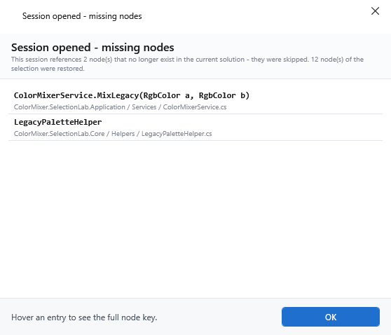

- Heading and title `Session opened - missing nodes`.
- Summary: `This session references <n> node(s) that no longer exist in the current solution - they were skipped. <m> node(s) of the selection were restored.`
- One row per missing node: a bold monospace line with the type or `Type.Method`, a muted second line with the project, folder and file, and the full node key as the row tooltip.
- Footer hint: `Hover an entry to see the full node key.`
- A single `OK` button, default and cancel at once, tooltip `Close the orphan list. Orphaned nodes are removed from the Session on the next Save.`

Data effect: the window only reports. The missing nodes were skipped when the session was applied, and because a save collects the selection from the tree as it is now, they are gone from the session after the next save. There is no way to keep them from this window.

## 10.5 Import and data dialogs

### Import master entities

This dialog resolves conflicts when an imported file contains entries whose ID already exists with different data. It is used by the master data imports and by the run template import. **It appears only when the import preview found conflicts** - a file without conflicts is imported directly, without any dialog.

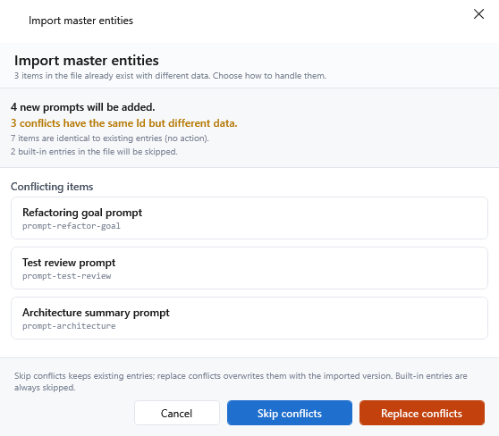

- Title and heading: `Import master entities`.
- Subtitle: `1 item in the file already exists with different data. Choose how to handle it.` or `<n> items in the file already exist with different data. Choose how to handle them.`
- Four summary lines:
  - `<n> new <entities> will be added.` (emphasized)
  - `<n> conflicts have the same Id but different data.` (warning color)
  - `<n> items are identical to existing entries (no action).` (muted)
  - `<n> built-in entries in the file will be skipped.` (muted)
- A scrollable `Conflicting items` list: one card per conflicting entry with its display name and, in monospace, its ID. Built-in entries are deliberately not listed because they are always skipped.
- Footer hint: `Skip conflicts keeps existing entries; replace conflicts overwrites them with the imported version. Built-in entries are always skipped.`

Buttons, from left to right:

| Button | Style | Tooltip | Effect |
|---|---|---|---|
| `Cancel` | secondary, Escape | `Cancel the import - no changes to the repository.` | Nothing is written; the status line reads `Import cancelled.` |
| `Skip conflicts` | accent, default | `Conflicting entries stay unchanged; only new entries are imported. Built-Ins are always skipped.` | New entries are added; every conflicting entry keeps its existing data. |
| `Replace conflicts` | danger (red) | `DESTRUCTIVE: existing entries are overwritten with the imported version. The provenance stamp is kept. Built-Ins are always skipped.` | New entries are added; every conflicting entry is overwritten with the version from the file. |

In both modes, entries that are identical to existing ones and built-in entries found in the file are counted as skipped and never written.

Note: `Replace conflicts` writes entry by entry without a transaction. If a write fails halfway through, the import reports the error and leaves the entries already written in place - there is no rollback and no undo. Afterwards the status line reads `Imported: <n> new, <n> replaced, <n> skipped`. Master-data imports add `(<n> error(s) - see log)` when something failed; the Run Templates import uses `(<n> error(s))` without `- see log`.

Errors found while reading the file (wrong format, unreadable JSON) are handled before the dialog: the import aborts with the status line `Import failed: <first error>` and no dialog appears. A file that contains only new entries is written without a confirmation dialog; the status line afterwards reports what was written.

### Clear Usage Data

This is the first step of clearing recorded MCP usage data. It only chooses the **scope** and is deliberately not the destructive confirmation. Open it with the `Clear` button in the `MCP Usage` panel (tooltip: `Delete recorded calls (all, or older than a date). An export is saved first, and the deletion asks for a destructive confirmation.`).

- Title `Clear Usage Data`.
- A figures line built from the current data: `<n> calls are recorded, spanning <period>.` (or `1 call is recorded, ...`). The period is written like `22-30 Jul 2026`, `22 Jun - 30 Jul 2026` or `28 Dec 2025 - 3 Jan 2026`.
- Two options in the `ClearScope` group:
  - `Clear everything` - selected by default. Tooltip: `Delete every recorded call.`
  - `Clear calls older than` - tooltip: `Keep the recent calls and delete only those older than the chosen date.` It is followed by a date picker (tooltip: `Calls recorded before this day are deleted; the day itself and everything after it stays.`). The picker starts at today minus 30 days and is disabled until this option is selected.
- Help text: `An export is saved before anything is deleted, and the deletion itself asks once more.`
- Buttons: `Cancel` (tooltip `Close without clearing anything (or press Escape).`) and `Continue` (accent, default; tooltip `Continue to the export step. Nothing is deleted yet.`). `Continue` is enabled when `Clear everything` is selected or a date has been chosen.

The date you pick is a local calendar day: "older than" means strictly before midnight at the start of that day, in your local time.

What happens after `Continue` - the full flow:

1. If no calls are recorded at all, an information dialog says `There are no recorded calls to clear.` and nothing happens.
2. The scope dialog returns your choice. Cancel, Escape or the X stop the flow.
3. The app counts the affected calls. If none are older than the chosen date, an information dialog says `No recorded call is older than the chosen date.` and nothing is deleted.
4. A save dialog titled `Export Before Clearing` appears (suggested file name `usage-report-<yyyy-MM-dd>.json`, filter `Usage report (*.json)` and `All files (*.*)`). The export is **forced**: cancelling the file choice aborts the whole flow, with the status line `Clear cancelled: no export target was chosen.` If the export cannot be written, an error dialog says `The export could not be written, so nothing was cleared: <message>`.
5. The destructive confirmation appears: `Delete all <n> recorded calls?` or `Delete the <n> recorded calls older than <date>?`, followed by `This cannot be undone. An export was saved to <file> first.` When notes are affected, it adds `<n> note(s) written on those calls will be deleted with them, and the export does not contain them.` As with every destructive confirmation, `No` holds the focus and answers Enter, and `Yes` is the red button. Anything other than `Yes` stops here.
6. The calls are deleted and the panel reloads. The status line reads `Cleared <n> calls (exported to <file> first)`.

Note: the only thing that cannot be recovered is the notes written on those calls. They are deleted together with the calls, and the export contains the aggregate report, not the notes - which is exactly what the confirmation tells you.

### Queue as work

This dialog picks a run template for one insight detail line. It chooses and nothing else: it does not start anything. Open it with `Queue as work` on a detail line (tooltip: `Queue as work - record this line as something to fix, with a run template of your choice. Nothing is started; the line stays visible and reports 'In progress'.`).

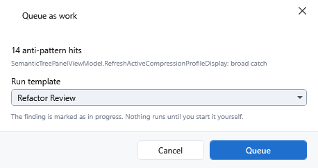

- Title `Queue as work`.
- The insight's title, then the line's own text in the help-text style.
- `Run template` - a dropdown listing the available run templates. Tooltip: `The run template this piece of work should be handled with. It is recorded with the item; nothing is started now.` The list opens on the send template configured by the active quality profile, or on the first template when that one is not in the list. The related card-level `Apply + send to LLM` path is not exposed by the shipped producers.
- Help text: `The finding is marked as in progress. Nothing runs until you start it yourself.`
- Buttons: `Cancel` (tooltip `Close without queueing anything (or press Escape).`) and `Queue` (default; tooltip `Record this finding as work to do, with the chosen run template.`), disabled while no template is selected.

Result:

- `Queue` records the line as work to do together with the chosen template's ID and name. The line stays visible and reports "in progress"; nothing is started automatically.
- If work is already queued for that line, the status line says `Work is already queued for this line.` - the existing entry is not replaced.
- On success the status line says `Queued as work to do.`; if the entry cannot be stored, `Could not queue the work item.` and the line keeps its previous state.
- `Cancel`, Escape and the X change nothing.

Note: if the database contains no run templates at all, the dialog does not open and a status message says `No run templates are available to queue against.`

## 10.6 Editors

### Set node override

This editor sets, changes or removes the overrides of exactly one tree node. Open it from the context menu of a tree row: `Set Node Override…`. Two preconditions apply:

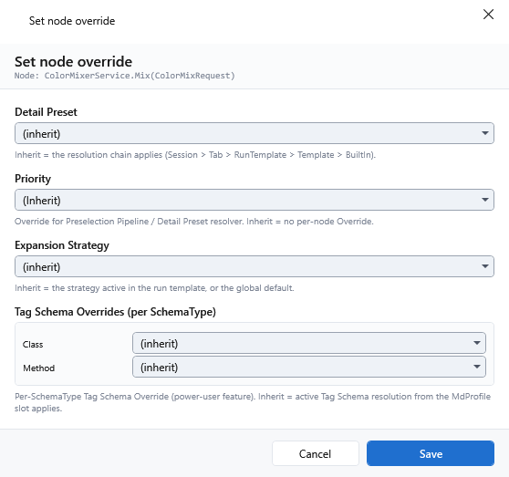

- The solution root cannot carry a per-node override. Selecting it shows an information dialog titled `Per-node override - not available here`: `The solution root cannot carry a per-node override. Settings that apply to everything belong in the active template; per-node overrides start at project level.`
- A saved session is required, because node overrides are stored per session and node. Without one, an information dialog titled `Per-node override - session required` explains this and points out that the tree's detail-level pill is available as a per-node setting that needs no session.

Content:

- Heading `Set node override`, subtitle `Node: <node name>` in monospace. The subtitle tooltip receives the node's display name, not its node key; the override editor itself is not given the key.
- Four slots:

| Slot | Label | Help text | What it overrides |
|---|---|---|---|
| 1 | `Detail Preset` | `Inherit = the resolution chain applies (Session > Tab > RunTemplate > Template > BuiltIn).` | The detail preset used for this node. |
| 2 | `Priority` | `Override for Preselection Pipeline / Detail Preset resolver. Inherit = no per-node Override.` | The node's priority for preselection scoring. The list offers `(Inherit)`, `High`, `Medium` and `Low`. |
| 3 | `Expansion Strategy` | `Inherit = the strategy active in the run template, or the global default.` | When this node is expanded while the tree is walked. |
| 4 | `Tag Schema Overrides (per SchemaType)` | `Per-SchemaType Tag Schema Override (power-user feature). Inherit = active Tag Schema resolution from the MdProfile slot applies.` | The tag schema used for one section type on this node. The pane shows one row per relevant schema type - in the shipped configuration `Class`, `Method`, `Interface`, `Enum`, `MethodGraph` and `FileIndex` - each with its own list. |

- The first entry of every list is `(Inherit)`, meaning "no override here - the normal resolution applies". 
- When the editor opens, the current values are preselected. If a referenced preset no longer exists (for example because it was deleted), that slot falls back to `(Inherit)` instead of showing a broken selection.
- Buttons: `Cancel` (tooltip `Close the editor without saving changes to the NodeOverrides.`) and `Save` (default; tooltip `Save the NodeOverrides for this node. All three slots set to Inherit at once = the Override set is deleted entirely from the DB.`). The focus starts on the detail preset list.

What `Save` does:

- If at least one slot has a value, the override is stored, and the node gets its override badge in the tree.
- If every slot is set to `(Inherit)`, the override is removed. Note: the button's tooltip speaks of "all three slots"; the editor has four, and the rule covers all of them including the tag schema rows. A tag schema override left in place therefore keeps the override alive.
- If the node also carries a detail level set with the tree's detail pill, that value is untouched: the row survives with its editor slots cleared instead of being deleted, and the node's override badge goes off.
- `Cancel`, Escape and the X leave everything unchanged.

### Pick namespaces

This dialog offers a filterable, checkable list of the namespaces found in a solution, and turns your selection into rules. It opens from `Suggest...` in the Layer Profiles editor and in the Namespace Exclusions editor. Both first ask for a solution file (title `Pick a solution to read namespaces from`, filter `Solution files (*.sln)` and `All files (*.*)`), read the namespaces, and then show this picker. Layer Profiles reads the namespaces the solution declares; Namespace Exclusions reads the namespaces the solution references.

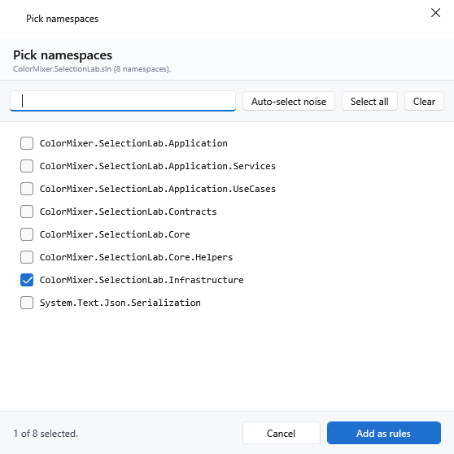

- Title and heading `Pick namespaces`.
- Subtitle: `<source> (<n> namespaces).` - or `<n> namespaces available.` when no source is supplied. The source label is `Namespaces in <file>` (Layer Profiles) or `Referenced namespaces in <file>` (Namespace Exclusions).
- Toolbar, right-aligned:
  - `Clear` - removes every checkmark, filtered or not. Tooltip: `Remove all selection checkmarks - no namespaces become rules.`
  - `Select all` - checks every namespace that passes the current filter. Tooltip: `Add all filtered namespaces to the selection.`
  - `Auto-select noise` - visible only in the Namespace Exclusions editor. Tooltip: `Check every namespace that matches the BCL / framework heuristic (System., Microsoft., Windows., Syncfusion., ...)`. It checks every matching entry regardless of the filter.
  - A filter field - tooltip: `Filter the list by Namespace prefix (live, case-insensitive).` The list is filtered as you type. Note: the match is a case-insensitive **substring** match, so `Core` also finds `MyApp.Core.Something` and `Foo.ScoreKeeper`.
- The list shows one checkbox per namespace, in monospace. Tooltip: `Check to turn this namespace into a new exclusion rule when you confirm.`
- A live status line at the bottom left reads `No namespaces selected.` or `<selected> of <total> selected.` The total is the whole list, not the filtered subset.
- Buttons: `Cancel` (tooltip `Close the dialog without changes to the exclusion rules.`) and `Add as rules` (default; tooltip `Create all selected namespaces as new NamespaceExclusion rules.`). The focus starts in the filter field, so you can type immediately.

Note: `Select all` and `Clear` are deliberately not symmetric - `Select all` respects the filter, `Clear` does not. If you filter, select all, filter differently and then clear, the earlier selection is cleared too. The tooltips state this.

What confirming does:

- Layer Profiles: every selected namespace becomes a new layer rule with the match type `StartsWith` and an empty layer; you assign the layer per row afterwards. The status line says `Added <n> suggested rule(s). Assign a layer per row.`
- Namespace Exclusions: every selected namespace becomes a new exclusion rule with the match type `StartsWith`. The status line says `Added <n> suggested exclusion(s).`
- The selection is returned in display order and includes entries the current filter hides - filtering never unchecks anything.
- `Cancel`, Escape and the X create no rules.
- Note: confirming without a single checkmark is a valid answer that creates nothing; the caller treats an empty selection like a cancel.

If no namespaces are found, the picker does not open. An information dialog says `No C# namespaces were found in the selected solution.` (Layer Profiles) or `No referenced namespaces were found in the selected solution.` (Namespace Exclusions). If the file cannot be read, an error dialog with the title `Suggest from Solution` reports the reason.

### Export as Built-In Code

This window shows the C# snippet that would turn your edited entry into a shipped built-in. Open it with the export-as-built-in icon in the action bar of a master data entry or a run template (tooltip: `Export as Built-In: show the C# snippet for this entity to paste into the BuiltIn*.cs source file - promotes the custom value to a permanent Built-In after build + restart.`). **The app never writes source files itself.** Note: this function is intended for the product's own development; the snippet only has an effect in AICB's source code, not in your installation.

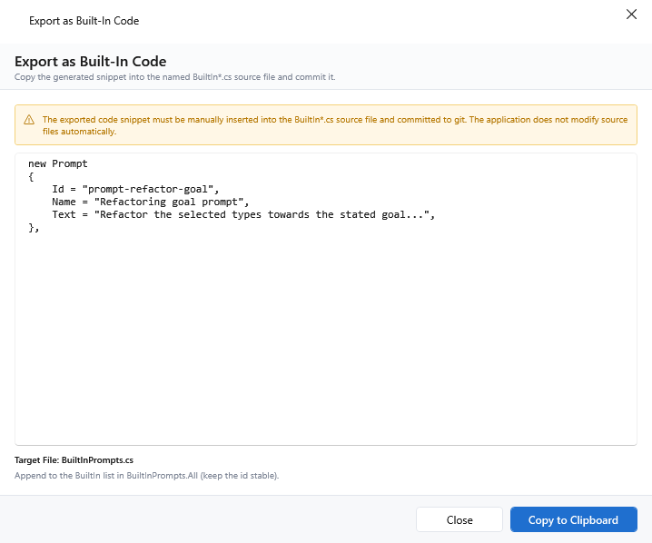

- Title and heading `Export as Built-In Code`; subtitle `Copy the generated snippet into the named BuiltIn*.cs source file and commit it.`
- A permanent warning banner: `The exported code snippet must be manually inserted into the BuiltIn*.cs source file and committed to git. The application does not modify source files automatically.`
- A red banner when the entry is already a built-in with an active override: `This item is already a Built-In with an active override. Exporting creates a new candidate Built-In; merging into the original source file is your responsibility.`
- A red banner when the entry may contain solution-specific data: `This entity may contain solution-specific paths or namespaces. Review the snippet before committing to ensure it generalizes correctly.`
- A read-only monospace text box with the snippet. It does not wrap and offers both scrollbars; tooltip: `Generated C# snippet (read-only). Copy it and paste into the target BuiltIn*.cs file - the app never writes source files itself.`
- `Target File: <name>`, or `Target File: (unknown)` when no file name is known.
- The insertion hint for the snippet (for example where in the file it belongs).
- Buttons: `Close` (tooltip `Close the dialog. The snippet was not written to the source file automatically.`) and `Copy to Clipboard` (accent, default; tooltip `Copy the C# snippet to the clipboard. Then paste it manually into the relevant BuiltIn*.cs file and commit.`).

Behavior of the buttons:

- `Copy to Clipboard` copies the snippet and **leaves the dialog open**. It shows no success or error message. Note: if another program is holding the clipboard at that moment, the copy can fail silently. Paste into a text editor first to check what is on the clipboard before you paste it into a source file.
- `Close`, Escape and the X close the window.
- Note: `Copy to Clipboard` is the default button, so Enter copies rather than closing the dialog.

Data effect: none on the database and none on disk. The only side effect is the clipboard.

## 10.7 Information windows

### Keyboard shortcuts

Press `F1` to open this read-only, scrollable overview of every keyboard shortcut, grouped by the surface it applies to. The app has no menu bar where a shortcut would surface on its own, so this window is the central place to discover them.

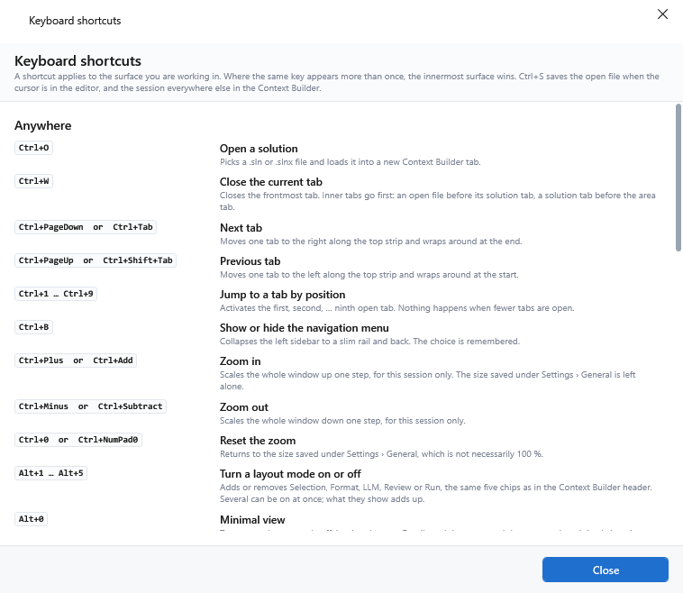

- Title and heading `Keyboard shortcuts`.
- Subtitle: `A shortcut applies to the surface you are working in. Where the same key appears more than once, the innermost surface wins. Ctrl+S saves the open file when the cursor is in the editor, and the session everywhere else in the Context Builder.`
- The content is generated from the app's own shortcut list, so the overview cannot describe a shortcut the app does not have.
- Groups appear in this order: `Anywhere`, `Context Builder`, `Code editor`, `Settings and master data`, `Lists`. Empty groups are omitted.
- Each line shows the gesture or gestures in a monospace pill, the action in bold and a short description. When an action has more than three gestures (for example `Ctrl+1` through `Ctrl+9`), the pill shows a range like `Ctrl+1 … Ctrl+9`; up to three gestures are listed as `A  or  B`.
- A single `Close` button (default and cancel at once; tooltip `Close this overview.`). The window is resizable.

### Diff window

One window serves two comparisons: snapshot against snapshot, and the previously loaded tree against a reloaded solution. It is resizable and opens at 900 x 600, with the list on the left and the details on the right separated by a splitter you can drag.

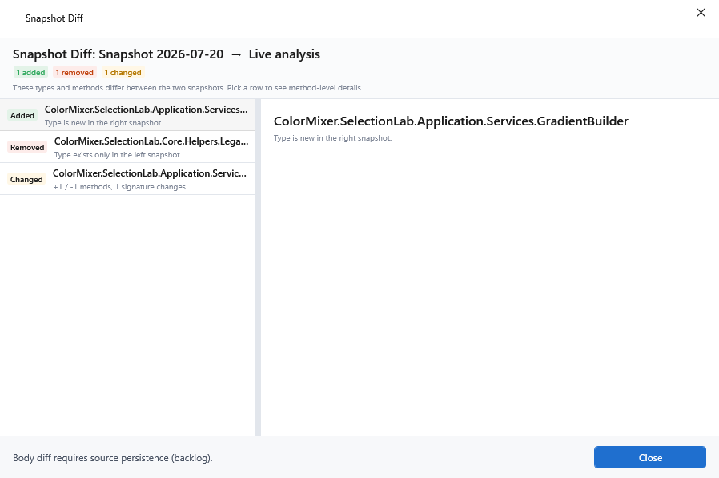

The two flows differ only in their texts:

| | Snapshot comparison | Solution reload |
|---|---|---|
| Window title | `Snapshot Diff` | `Solution reload - changes` |
| Heading | `Snapshot Diff: <left>  →  <right>` | `Solution reload - changes in <solution>` |
| Subtitle when nothing differs | `Both snapshots have identical class/method structure.` | `No changes detected. The reloaded tree is structurally identical to the previously loaded one.` |
| Subtitle when something differs | `These types and methods differ between the two snapshots. Pick a row to see method-level details.` | `These types and methods differ between the previously loaded tree and the freshly analyzed one. Pick a row to see method-level details.` |
| Summary for an added type | `Type is new in the right snapshot.` | `Type is new in the reloaded tree.` |
| Summary for a removed type | `Type exists only in the left snapshot.` | `Type existed only in the previously loaded tree.` |
| Footer hint | A note that comparing method bodies is not available. | `The tree above already reflects the new state. Close this window when you are done reviewing.` |

Content:

- Three count pills are always visible in the header: `<n> added` (green), `<n> removed` (red) and `<n> changed` (amber). Tooltips: `Number of added types in this diff.`, `Number of removed types in this diff.`, `Number of changed types in this diff (method/signature changes).`
- The list on the left is flat, in a fixed order: added types first, then removed types, then changed types. Each row carries a kind pill (`Added`, `Removed` or `Changed`), the type name and a summary. For a changed type the summary reads `+<n> / -<n> methods, <n> signature changes`. The first row is selected automatically. If the diff is identical, the list stays empty and the three pills all show `0`.
- The detail pane on the right shows up to three sections for the selected row: `Added methods` (each line `+ <name>`), `Removed methods` (each line `- <name>`) and `Changed signatures` (the method name plus the old and new signature as `-  <left>` and `+  <right>`; tooltip: `Methods with a changed signature - Left = previous state, Right = new state.`). With no row selected it reads `No diff entry selected.`
- A single `Close` button (default and cancel at once; tooltip `Close the diff window.`).

When a solution reload finds no changes at all, the app shows an information dialog instead of this window: `No structural changes detected. The reloaded tree is identical to the previously loaded one.` (title `Solution reload`).

Note: the comparison is structural. It reports types and methods that were added or removed and signatures that changed. Method bodies are not compared.

## 10.8 Native file dialogs

Where the app asks you for a file, it uses the standard Windows dialogs, owned by the main window so they cannot disappear behind it.

- Open dialogs take their title and their file type filter from the action that opened them. Where no filter is supplied, all files are offered. A starting folder is used when the action supplies one.
- Save dialogs take their title, filter and a suggested file name from the action. Windows asks before overwriting an existing file.
- Note: the app does not set a default file extension. If you type a bare name without an extension, the file may be saved without one unless the chosen filter adds it. Type the extension as part of the name if you are unsure.

Open dialogs you can meet:

| Opened from | Title | Filter |
|---|---|---|
| Open a solution (Welcome, Solutions, Context Builder) | `Open solution` | `Solution files (*.sln;*.slnx;*.slnf)` |
| Layer Profiles - `Suggest...` | `Pick a solution to read namespaces from` | `Solution files (*.sln)` and `All files (*.*)` |
| Namespace Exclusions - `Suggest...` | `Pick a solution to read namespaces from` | `Solution files (*.sln)` and `All files (*.*)` |
| Layer Profiles - LLM Layer Wizard | `Pick a solution for the LLM layer wizard` | `Solution files (*.sln;*.slnx)` |
| `MCP Usage` panel - `Import` | `Import Usage Report` | `Usage report (*.json)` |
| Run templates - import | `Import RunTemplates` | `JSON files (*.json)` |
| Master data - import | `Import <entities>` | `JSON files (*.json)` |
| Constellations - import | `Choose a constellation` | `JSON files (*.json)` |
| Solutions - import sidecar configuration | `Import solution config (sidecar)` | `AICB sidecar (*.aicb.json)`, `JSON files (*.json)`, `All files (*.*)` |
| Storage settings - switch database | `Select database to switch to` | `AICB database (*.acb)` |

Save dialogs you can meet:

| Opened from | Title | Filter | Suggested name |
|---|---|---|---|
| `MCP Usage` panel - export | `Export Usage Report` | `Usage report (*.json)` | `usage-report-<yyyy-MM-dd>.json` |
| `MCP Usage` panel - `Clear` (forced export) | `Export Before Clearing` | `Usage report (*.json)` | `usage-report-<yyyy-MM-dd>.json` |
| Run templates - export | `Export RunTemplates` | `JSON files (*.json)` | `RunTemplate-export-<yyyyMMdd-HHmm>.json`; the export contains the complete list, not only the selection |
| Sessions - export | `Export session` | `JSON files (*.json)` | a suggested name |
| Master data - export | `Export <entities>` | `JSON files (*.json)` | a default name |
| Constellations - export | `Export constellation` | `JSON files (*.json)` | `constellation-<yyyyMMdd-HHmm>.json` |
| Storage settings - `Create new database` | `Create new database` | `AICB database (*.acb)` | `aicb.acb` |
| Context Builder - save the context document | `Save context document` | `Markdown files (*.md)` | a name derived from the solution |

Cancelling any of these dialogs returns you to the app without a change.

---

[&larr; 9 MCP Profiles, MCP Usage and Templates](09-mcp-profiles-mcp-usage-and-templates.md) &middot; [Contents](README.md) &middot; [11 Troubleshooting the desktop app &rarr;](11-troubleshooting-the-desktop-app.md)
