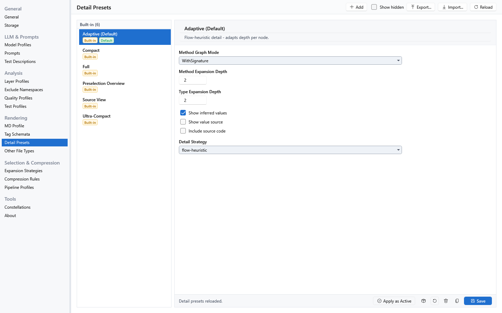
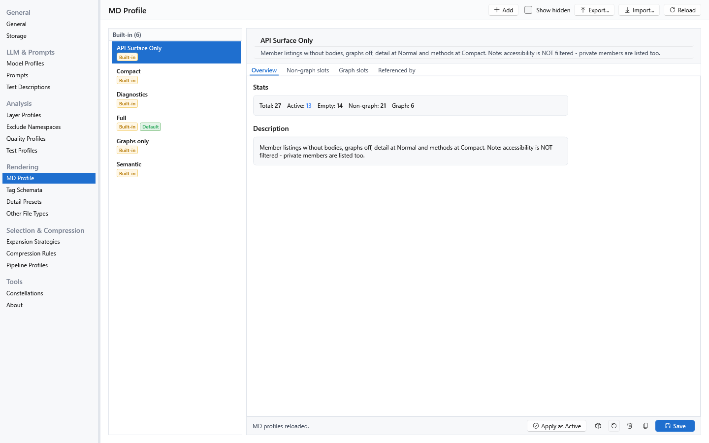
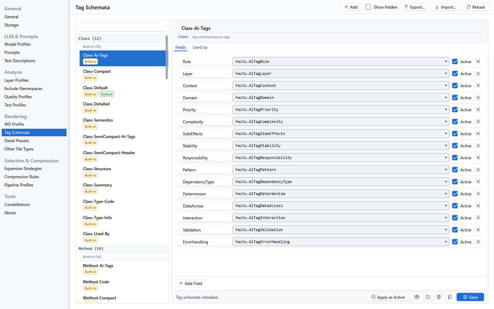
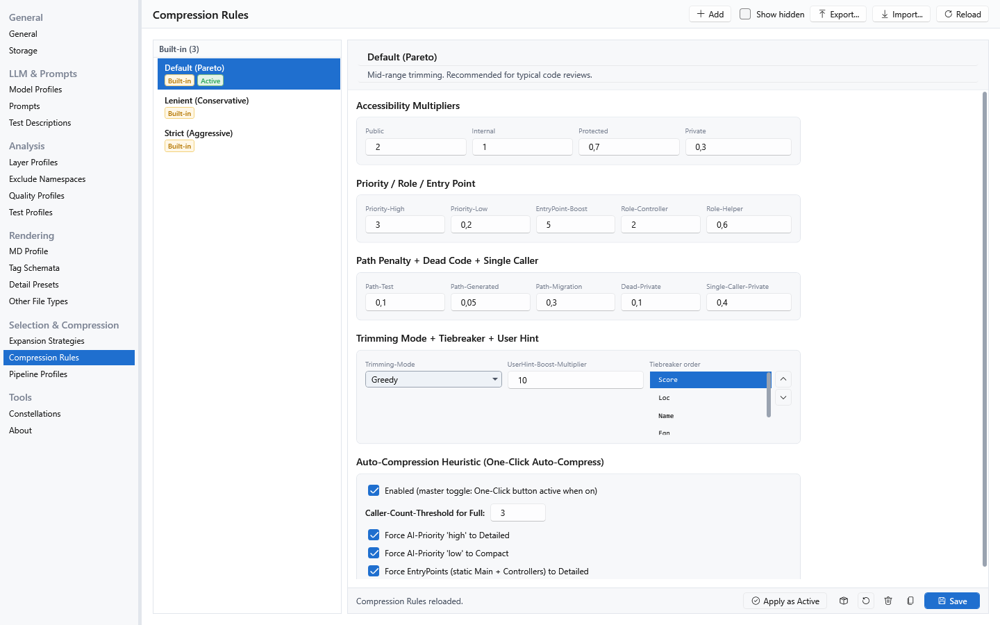

[AICB – General Documentation](README.md) &middot; chapter 6 of 12

# 6 Templates, rendering and markup analysis

A template is the configuration root of an export. It decides which prompt is used, which sections the Markdown document contains, how much detail each symbol gets, how far the selection walk expands, and which profiles govern scoring, token budget and quality findings. This chapter describes the template model, the built-in catalogs, how the document is assembled, and how AICB analyzes XAML and AXAML markup - the part of a solution that the C# symbol graph cannot see.

## 6.1 What a template controls

A template is a master entity: it has a name, an optional description, and a set of references to other master entities plus its own value settings. You maintain templates under Configuration → Templates.

| Slot | Refers to | Required | What it decides |
|---|---|---|---|
| `Prompt` | Prompt | yes | The prompt sent to the LLM when this template runs. The Context Builder can override it per run. |
| `MD Profile` | MD profile | yes | Which sections the Markdown document contains and which tag schema each of them uses. |
| `Compact`, `Normal`, `Detailed`, `Source` (Detail Preset) | Detail preset | yes | How much of each symbol is rendered at that detail level. |
| `Compact`, `Normal`, `Detailed`, `Source` (Expansion Strategy) | Expansion strategy | optional | How far the selection walk expands at that detail level. When all four slots are empty, the template's single legacy expansion reference applies. |
| `CompressionRules profile` | Compression rules | optional | Scoring multipliers and the auto-compression heuristic. Empty = use the globally active profile. |
| `Pipeline profile` | Pipeline profile | optional | Token-budget pipeline settings and snapshot auto-reload. Empty = use the globally active profile. |
| `Token budget (MCP render)` | - | optional | Maximum output tokens when the MCP server renders through this template. Floor 8,000. Affects the MCP render path only - GUI and CLI exports are unaffected. When set, it forces trimming; a token budget set on the MCP profile wins over it. |
| `Insights profile` | Quality profile | optional | Producer toggles and thresholds for quality findings. Empty = use the globally active profile. |
| `Test Description (optional)` | Test description | optional | A benchmark/test description attached to runs. |

The template's own switches:

| Setting (label in the editor) | Default | Effect |
|---|---|---|
| `Embed layout legend (PATH_LEGEND aliases)` | on | Applies the compact type-alias presentation to the graphs and several other sections, and emits the `PATH_LEGEND` decoding table. Off renders plain type names and drops the legend. Off suits refactoring-style runs where the layer map is the dominant signal and aliases add overhead. |
| `Include config files that may contain secrets (appsettings, *.config, launchSettings)` | off | Emits `appsettings.json`, `appsettings.*.json`, `*.config` (web/app/nuget.config) and `launchSettings.json` verbatim in `AUXILIARY_FILES`, including any connection strings and API keys. Only enable this for a solution whose configuration holds no secrets, or review the output before sharing it. |
| `Include line numbers` | off | Adds a `lines="START-END"` attribute (1-based) to every method and type tag. Useful when the model must point at source locations or when line spans are compared across runs. |
| `Include quality metrics (QUALITY_HOTSPOTS + complexity/coupling attributes)` | off | Adds the `QUALITY_HOTSPOTS` section and a `complexity=""` / `ce=""` attribute to method and type tags. |

An empty profile slot means "use the globally active profile". The global defaults are chosen with `Apply as Active` in the matching Settings panel. For the template itself, the MCP render path resolves: the facet slot of the active MCP profile, then the profile's profile-wide template, then the active context template.

Working with master entries:

- Saving an edited built-in marks it as overridden; `Restore Built-In` resets it to its code defaults and clears that flag.
- `Duplicate` creates a custom copy - the way to fork a built-in.
- `Delete` hides a built-in (recoverable via `Restore Built-In`); a custom entry is removed permanently.
- `Export as Built-In` shows the entry as a C# snippet; it is intended for the product's own development and has no effect on your installation.
- A custom entry that other entities reference shows an `IN USE` pill.

## 6.2 Built-in templates

Ten templates ship with the product.

| Template | Purpose | MD profile | Detail slots (Compact / Normal / Detailed / Source) | Expansion | Notable settings |
|---|---|---|---|---|---|
| `Default` | Balanced standard context generation; a good starting point when no specific task is in mind. | Full | Compact / Adaptive / Full / Source View | Standard | None - it states "use the global settings". |
| `Refactoring` | Architecture-focused work: CQRS migrations, SOLID review, layering audits. | Full | Compact / Adaptive / Full / Source View | Standard | Layout legend off; quality metrics on; Insights profile `Strict`. |
| `Debugging` | Bug hunting with full detail and deep call-chain expansion. | Full | Adaptive / Full / Full / Source View | Deep | Line numbers on; Compression rules `Lenient`. |
| `Feature Focus` | Targeted feature extensions with a minimal token footprint. | Compact | Compact / Compact / Adaptive / Source View | Direct-only | Compression rules `Strict`; Pipeline profile `Aggressive Trimming`. |
| `AI Optimized` | AI-tag generation: structured annotation hooks meant to be enriched by the model. | Semantic | Compact / Adaptive / Full / Source View | Standard | Line numbers and quality metrics on; pins the built-in Default compression, pipeline and insights profiles. Also the profile-wide template of the Default MCP profile. |
| `Onboarding` | Public API surface for code-reading tours and external integration review. | API Surface Only | Ultra-Compact / Adaptive / Full / Full | Standard | Insights profile `Disabled`. |
| `Test Generation` | Generates xUnit + FluentAssertions tests for the selected classes. | Compact | Compact / Source View / Source View / Source View | Direct-only | None; the complex-untested producer stays inherited because it targets test generation. |
| `Documentation` | Produces XmlDoc comments for the public API surface. | API Surface Only | Ultra-Compact / Adaptive / Full / Full | Direct-only | Insights profile `Disabled`. |
| `Performance Audit` | Hot-path identification, allocation hotspots, throughput-critical paths. | Diagnostics | Compact / Adaptive / Full / Source View | Standard | Line numbers and quality metrics on; Insights profile `Strict`. |
| `Security Review` | Input-validation gaps in public APIs, validation-bypass paths, threat hypotheses. | Full | Compact / Adaptive / Full / Source View | Standard | Line numbers and quality metrics on; Compression rules `Lenient`; Insights profile `Strict`. |

Note: `Onboarding` and `Documentation` use the `Full` preset in the Source slot instead of `Source View`, because the `API Surface Only` MD profile does not offer the Source level.

## 6.3 Detail presets

A detail preset controls how much of a symbol is written at one detail level. It is the axis for method-level reduction; the tag schemas (below) decide the line shape.

| Field (label in the editor) | Default for a new preset | What it does |
|---|---|---|
| `Method Graph Mode` | `WithSignature` | Render mode for method call graphs: `Full`, `SemanticOnly`, `WithSignature`, `WithBody`. |
| `Method Expansion Depth` | 2 | How many call-graph hops the walk expands from a node. 1 = direct neighbors only, 2-3 = small clusters, higher = larger context. Used when the active expansion strategy works in reachable mode. |
| `Type Expansion Depth` | 2 | How many type-dependency hops (uses / used-by) to expand - the breadth of type context around a selection. |
| `Show inferred values` | on | Include inferred / resolved values in the output, for example constant expressions and default parameter values. |
| `Show value source` | off | Annotate inferred values with where they came from, for traceability. |
| `Include source code` | off | Append a source-code block for code nodes that resolve to this preset. Typically on for the preset in the template's `Source` slot. |
| `Detail Strategy` | `flow-heuristic` | The reduction behavior. Only three values can be selected: `aggressive` = compact, no adaptive; `flow-heuristic` = compact where the flow heuristic allows it for the node; `none` = full detail. |

The six built-in presets:

| Preset | Method graph mode | Method depth | Type depth | Inferred values | Value source | Strategy | Source code |
|---|---|---|---|---|---|---|---|
| `Full` | `WithSignature` | 5 | 5 | yes | yes | `none` | - |
| `Adaptive (Default)` | `WithSignature` | 2 | 2 | yes | no | `flow-heuristic` | - |
| `Compact` | `SemanticOnly` | 1 | 1 | no | no | `aggressive` | - |
| `Source View` | `WithSignature` | 5 | 5 | yes | yes | `none` | yes |
| `Preselection Overview` | `WithSignature` | 0 | 0 | no | no | `aggressive` | - |
| `Ultra-Compact` | `SemanticOnly` | 0 | 0 | no | no | `aggressive` | - |

`Adaptive (Default)` carries the default marker; `Source View` is configured like `Full` plus `Include source code`; `Preselection Overview` (class list and signatures, no bodies) and `Ultra-Compact` (type names and tags only) are the two most token-efficient presets. Note: the two-stage preselection run type is not yet released; the `Preselection Overview` preset itself is selectable like any other.

How the slots reach the document: the solution tree resolves a detail level per node, and the template maps each level to its preset. An export that does not build a per-node selection - for example the whole-solution export - uses the `Normal` preset for everything.

## 6.4 MD profiles

An MD profile maps every section to a tag schema. It has exactly one slot per section type - 27 slots. The four code-structure slots (`Class`, `Method`, `Interface`, `Enum`) are staged; the other 23 are single.

A staged slot holds a schema per level plus two settings:

| Setting | Meaning |
|---|---|
| `Compact` / `Normal` / `Detailed` | The tag schema used when a node resolves to that level. The Source level renders the `Detailed` schema as well. |
| `Default level:` | The level that applies when neither a node override nor a session override applies. |
| `Allow Source` | Marks the slot as able to serve the Source level; nodes of this type can then be switched to Source in the solution tree. |

A single slot holds one schema. An empty single slot switches its section off. A staged slot with an empty rung does not switch anything off: it falls back to the built-in sub-block schema for that level. Graph slots are a special case - see below.

The six built-in profiles, with the descriptions you see in the product:

| Profile | Description | What it leaves in the document |
|---|---|---|
| `Full` | "Every slot filled with standard tag schemas. Source level allowed." | Everything the profile can control; code structure at Detailed. This is the initial global default. |
| `Semantic` | "Only semantically important slots filled. Detail slots at Normal level (Compact/Detailed empty → cascade)." | The semantic sections and code structure at Normal; `ENUM_SUMMARY`, `FILE_INDEX`, `PATH_LEGEND` and all graphs off. |
| `Compact` | "Minimal slot occupancy. Detail slots at Compact level. Graph slots empty." | Spec, Meta, AI prompt and the structure sections at Compact; most analysis sections and all graphs off. |
| `Graphs only` | "The 6 graph slots plus the Meta header; every other SLOTTED section off. Code structure and the slot-less sections (legend, build/UI + auxiliary files) still render; code structure at the Compact level its detail slots declare." | The six graph sections and the Meta header; code structure at Compact. |
| `API Surface Only` | "Member listings without bodies, graphs off, detail at Normal and methods at Compact. Note: accessibility is NOT filtered - private members are listed too." | Member listings without bodies; all graphs off. |
| `Diagnostics` | "Method info + dependencies + used-by + perf flags, no code. Graphs for architecture visualization. Performance and security audit profile." | Method info, dependencies, used-by and performance flags; five graphs; the role graph stays off. |

Note: `API Surface Only` does not filter by accessibility - private members are listed like any other.

The profile editor has four tabs: `Overview` (slot statistics: Total, Active, Empty, Non-graph, Graph, plus the description), `Non-graph slots` (the staged and single section slots), `Graph slots`, and `Referenced by` (which templates use this profile). Graph slots carry the hint that layout and compression are controlled globally under Settings → General → `Default graph layout (compression)` with a per-tab override in the Context Builder.

### Graph slots and graph selection

The renderer knows ten graphs. Six of them have an MD-profile slot:

| Graph section | Profile slot |
|---|---|
| `ARCHITECTURE_FLOW` | no |
| `INTERFACE_RELATIONS` | no |
| `ENTRY_POINTS` | no |
| `ENTRY_POINT_FLOW` | no |
| `SERVICE_DEPENDENCY_GRAPH` | yes |
| `LAYER_MAP` | yes |
| `CLASS_DEPENDENCY_GRAPH` | yes |
| `ROLE_GRAPH` | yes |
| `METHOD_GRAPH` | yes |
| `METHOD_USED_BY_GRAPH` | yes |

The four macro graphs have no slot: in renders without a Graph Selection (CLI, MCP) they are always included, and in the Context Builder you tick them in the `Graph Selection` panel. The six slotted graphs are seeded from the active profile - a slot that carries a schema means the graph is on by default. The checkboxes are yours to change per tab, so an empty graph slot in a profile does not force the graph off in the GUI; in renders that build their graph set from the profile (CLI, MCP), an empty slot leaves that graph out.

### Sections that no MD profile controls

Five rendered sections have no slot at all and cannot be switched off through a profile:

- `COMPRESSION_LEGEND` - always on.
- `BUILD_AND_UI_FILES` - always on, relevance-filtered.
- `AUXILIARY_FILES` - always on, relevance-filtered; the sensitive-config subset is the one opt-in (see the template switch above).
- `QUALITY_HOTSPOTS` - gated by the template's `Include quality metrics` switch.
- `QUALITY_FINDINGS` - rendered when the analysis produced findings.

## 6.5 Tag schemas

A tag schema decides which fields a block contains, in which order, and how each field is written. It belongs to exactly one schema type. There are 72 built-in schemas; per schema type exactly one carries the default marker (the `...-Default` entry). That default is used when no profile or slot resolves. An empty single-schema slot suppresses its section; an empty rung in a staged slot falls back to the built-in sub-block schema.

A schema is a list of fields. Each field row has:

| Column (label in the editor) | Meaning |
|---|---|
| Field name | The label written into the document, for example `TypeName` or `Layer`. |
| Source | The mapping onto analysis data. `facts.*` are deterministic Roslyn facts, `resolved.*` are values from the resolution chain; only paths from the built-in list are accepted. |
| `Active` | When unchecked, the field is kept in the schema but skipped during rendering. |

The field's render strategy decides the shape of the emitted line. The renderer provides twelve strategies; the built-in schemas use ten of them. `json` and `yaml` are available to custom fields but are not used by built-in schema fields:

| Strategy | Output form |
|---|---|
| `strong` | `**Field:** value` (bold label). |
| `plain` | `Field: value`. The fallback for an unknown or empty strategy. |
| `tag` | `[Field: value]`. |
| `quote` | `> Field: value`. |
| `list` | `Field:` followed by one `- item` line per value; a single scalar value renders as one bullet line, `- Field: value`. |
| `compact-list` | `Field: a, b, c` for multiple values; a single value behaves like `plain`. |
| `raw` | The value only - no label, no trimming. For fields whose surrounding section already provides the wrap. |
| `bullet-list` | `- item` lines without a field header, for sub-blocks such as `USED_BY`. |
| `flag` | Boolean flags: the field appears only when true. |
| `llm-natural-md` | Natural GFM for multi-line fields: a `### Field` heading plus a fenced code block with `csharp`/`xml` auto-detection. |
| `json` | A JSON object member, for machine-readable pipelines. |
| `yaml` | A YAML mapping entry; multi-line strings use the `|-` block literal. |

The 27 schema types and how they are slotted:

| Group | Schema types | Slot mode |
|---|---|---|
| Code structure | `Class`, `Method`, `Interface`, `Enum` | staged |
| Detail | `EntryPoint`, `Property`, `SideEffects` | single |
| Section | `Spec`, `Meta`, `AiPrompt`, `Domain`, `ArchitectureFlow`, `InterfaceRelations`, `EntryPoints`, `EntryPointFlow`, `EnumSummary`, `FileIndex`, `PathLegend`, `Solution`, `Project`, `File` | single |
| Graph | `MethodGraph`, `MethodUsedByGraph`, `ServiceDependencyGraph`, `LayerMap`, `ClassDependencyGraph`, `RoleGraph` | single |

The schema editor has three tabs: `Fields` (name, source, active, add and remove), `Layout`, and `Used by` (which MD profiles reference this schema).

Note: the `Layout` tab is reserved for future renderer wiring. Its four values - `Node label` (default `MethodSignature + DeclaringType`), `Edge style` (default `Arrow with caller→callee label`), `Clustering` (default `By layer`) and `Depth limit (1-10)` (default 3) - are persisted with the schema but are not consumed by any renderer yet; the fields are shown read-only. App-global compression on/off lives under Settings → General.

Note: a few MD-profile slots are stored but do not currently change the output: `SOLUTION`, `PROJECT` and `FILE` render a fixed header structure, and the `ENTRY_POINT`, `PROPERTY` and `SIDE_EFFECTS` slots have no consumer.

## 6.6 Expansion strategies

An expansion strategy controls how the selection walk follows the graph from the selected nodes: the mode, the depth, eight inclusion flags and four stop conditions. You maintain them under Settings → Selection & Compression → `Expansion Strategies`.

Editor fields: `Strategy mode`, `Method depth`, `Type depth`; the flags `Callers`, `Callees`, `Used-by members`, `Inheritance hierarchy`, `Interface implementations`, `Created types`, `Used types`, `Injected dependencies`; the stop conditions `Exclude framework types (System.*)`, `Exclude external assemblies`, `Exclude test classes ([Test*])`, `Exclude generated code ([GeneratedCode])` and `Max nodes total (empty = unlimited)`.

The seven built-ins:

| Strategy | Mode | Method depth | Type depth | What it walks | Notable |
|---|---|---|---|---|---|
| `Deep` | Reachable | 99 | 99 | Every relation, unlimited depth. | Includes test classes. |
| `Standard` | Select | 2 | 1 | Seeds only - no expansion. The neutral starting point. | Depths and flags are reserved for a custom copy promoted to Reachable. |
| `Flat` | Frontier | 1 | 1 | One-hop frontier: seeds plus their direct injected dependencies. | |
| `Direct-only` | Frontier | 1 | 0 | Direct callers and callees, one hop. | |
| `Inheritance-only` | Reachable | 0 | 5 | Only the inheritance hierarchy. | Use for class hierarchies, OO audits, Liskov checks. |
| `Interface-only` | Reachable | 0 | 5 | Only interface implementations. | Use for "all `IAuthenticator` implementations", polymorphism mapping. |
| `Test-Coverage-Reachable` | Reachable | 10 | 10 | Everything reachable from test classes - what tests actually touch. | Test classes stay as roots in the walk. |

All built-ins except `Deep` and `Test-Coverage-Reachable` stop at test classes, and all of them stop at framework types, external assemblies and generated code.

## 6.7 Compression rules and pipeline profiles

Two further profiles can be pinned to a template.

**Compression rules** hold the scoring multipliers and the auto-compression heuristic (accessibility multipliers, priority/role/entry-point boosts, path penalties, dead-code and single-caller weights, the caller-count threshold for full detail, trimming mode, tiebreaker order and the user-hint boost). Three ship with the product:

| Profile | Description |
|---|---|
| `Default (Pareto)` | Mid-range trimming. Recommended for typical code reviews. |
| `Strict (Aggressive)` | Aggressive token reduction; private and helper members get a strong penalty, tests and generated code even stronger. Suited to solutions that blow the budget. |
| `Lenient (Conservative)` | Conservative trimming; private and helper members stay relatively heavily weighted. Suited to solutions with a lot of custom logic in private helpers. |

**Pipeline profiles** control the token-budget pipeline and snapshot auto-reload:

| Profile | Budgeted trimming | Max token budget | Max overshoot | Auto-bypass snapshots | Budget header |
|---|---|---|---|---|---|
| `Default` | off | 60,000 | 50% | on | off |
| `Aggressive Trimming` | on | 20,000 | 10% | on | on |
| `No Trimming (Snapshot-Mode)` | off | 200,000 | 900% | off | off |

The profile fields in the editor:

| Field | Default | Meaning |
|---|---|---|
| `Budgeted Trimming` | off | Master switch. When on, every `Generate & Send MD` runs through the trimming pipeline. |
| `Max Token Budget (Floor 8000)` | 60,000 | Hard cap on the output size in tokens. Values below 8,000 are raised to the floor. |
| `Max overshoot when the selection exceeds the budget (%)` | 50 | How far the output may exceed the budget before over-budget selected types are dropped (ceiling = budget × (1 + percent / 100)). 0 = a hard cap; a large value effectively never drops a selected type. Clamped to 0-1000. The finished render is measured and pruned again if it still exceeds the ceiling; the most relevant type always keeps its code. |
| `Auto-bypass snapshots` | on | Snapshot tabs skip the pipeline so they stay identical to the saved state. |
| `Show budget header` | off | Prefixes the output with an HTML comment carrying budget statistics. |
| `Snapshot Auto-Reload` | off | When on, the auto-compress button is also active in read-only snapshot tabs; a click triggers a reload first. |

Note: the `Default` pipeline profile has trimming switched off, so the token-budget machinery runs only when you turn it on - either by activating a profile with trimming enabled, or by setting a token budget on the template or the MCP profile.

## 6.8 How a document is assembled

The renderer emits the sections in a fixed order. The `Sections:` block in the document head (`AI_CONTEXT_SPEC`) lists the sections **that document** contains - the full set is larger and depends on the template and the profile.

| Section | Controlled by |
|---|---|
| `SPEC` | slot `Spec` |
| `META` | slot `Meta` |
| `AI_PROMPT` | slot `AiPrompt` |
| `QUALITY_HOTSPOTS` | template switch `Include quality metrics` |
| `PATH_LEGEND` | non-empty `PathLegend` slot plus the layout legend toggle and a non-empty alias map |
| `COMPRESSION_LEGEND` | always on |
| `DOMAIN` | slot `Domain` |
| `ARCHITECTURE_FLOW`, `INTERFACE_RELATIONS`, `ENTRY_POINTS`, `ENTRY_POINT_FLOW` | graph selection |
| `SERVICE_DEPENDENCY_GRAPH`, `LAYER_MAP`, `CLASS_DEPENDENCY_GRAPH`, `ROLE_GRAPH`, `METHOD_GRAPH`, `METHOD_USED_BY_GRAPH` | their graph slots |
| `ENUM_SUMMARY` | slot `EnumSummary` |
| `FILE_INDEX` | slot `FileIndex` |
| `BUILD_AND_UI_FILES` | always on, relevance-filtered |
| `AUXILIARY_FILES` | always on, relevance-filtered |
| `SOLUTION`, `PROJECT`, `FILE` | fixed structure |
| `CLASS`, `INTERFACE`, `ENUM` | staged slots |
| `QUALITY_FINDINGS` | rendered when findings exist |

Two facts about the render step are worth knowing:

- **Detail reduction happens at render time, not during analysis.** The analysis always produces the full object graph; the renderer decides what reaches the Markdown. Changing a detail setting therefore only needs a new render, not a new analysis.
- **The document describes itself.** Besides the section list, the head carries the alias rules, the graph edge semantics (`A -> B` means "A depends on B", `A implements B`, `A <- B` means "A is used by B"), and the dependency confidence levels (`[high]`, `[medium]`, `[low]` are relative heuristics for the model, not formal proof levels).

### Type aliases and the path legend

When the layout legend is on, long type names are abbreviated and a `PATH_LEGEND` table decodes them:

- A type name longer than 12 characters is abbreviated to the initial letters of its capitalized words. At least two characters are used; a name with fewer than two capitals falls back to its first three characters, uppercased.
- A collision between two abbreviations gets a numeric suffix, so `CountingAnalyzer` may become `CA` and `CodeAnalyzer` `CA2`.
- Names of 12 characters or fewer are left unchanged.
- The map is keyed by the simple type name, so two types that share a simple name share one alias.

The aliases are substituted in ten sections: `DOMAIN`, `ARCHITECTURE_FLOW`, `INTERFACE_RELATIONS`, `ENTRY_POINTS`, `ENTRY_POINT_FLOW`, `SERVICE_DEPENDENCY_GRAPH`, `LAYER_MAP`, `CLASS_DEPENDENCY_GRAPH`, `METHOD_GRAPH` and `METHOD_USED_BY_GRAPH`. Source-code blocks are never rewritten - their contents are literal C#.

### The compression legend

Every document carries a `COMPRESSION_LEGEND` block that explains how methods are written:

- Full mode: all sub-blocks (`METHOD_INFO`, `DEPENDENCIES`, `USED_BY`, `SEMANTICS`, `SUMMARY`, `AI_TAGS`, `METHOD_CODE`).
- Compact mode (`compact="isolated"`): a single line with signature, return type, access and role. A missing `compact=` attribute means full mode.
- The selection rule: primary-flow methods render full, isolated-flow private helpers render compact; per-node overrides and auto-compression heuristics can shift any method.
- The provenance vocabulary of a `SEMANTICS` block: `Resolved` marks values from the resolved analysis (alone when no per-field provenance was recorded, or broken down as `Source: Resolved (field=token, ...)`), with the tokens `fact`, `ai`, `inferred` and `verified-absent`.
- A caveat on caller lists: they name only the callers this document renders, and they are statically resolved - reflection, DI containers, serializers and external assemblies stay invisible. Absence of callers is not proof of dead code.

### Line numbers, quality metrics and file content

With `Include line numbers` on, every method and type tag gets a `lines="START-END"` attribute (1-based, the same convention as the IDE status bar). With `Include quality metrics` on, the document gains the `QUALITY_HOTSPOTS` section (the most complex methods and most coupled types) and each method/type tag is annotated with `complexity=""` and `ce=""` (efferent coupling).

`BUILD_AND_UI_FILES` renders each included project's `.csproj` plus the XAML files tied to the included code slice. XAML is emitted in a compressed structural form; the detail level decides the form: at Compact only the root tag with a child/attribute summary, at Normal the root plus the direct child tag names, at Detailed the whole tree (comments removed), and at Source the file content as it stands. `AUXILIARY_FILES` renders project-wide structure files always and loose config/documentation files when the prompt names them.

## 6.9 Markup analysis: XAML and AXAML

WPF and Avalonia bindings and resource keys are strings resolved at runtime. The compiler does not check them, and the C# symbol graph cannot see them, so a member consumed only from markup looks unused. AICB scans the markup textually and records the edges it can prove.

### What is scanned

- Both dialects: WPF `.xaml` and Avalonia `.axaml`. The extraction patterns differ per dialect, because Avalonia accepts markup WPF does not (for example `{CompiledBinding}`).
- Discovery uses the same file walk as the analysis, with `bin`, `obj` and `.vs` excluded. Each file is parsed once and shared by all extraction passes.
- Every match is mapped to a 1-based line, and markup inside an XML comment is ignored - a commented-out binding must never produce a phantom fact or a false duplicate key.
- A view is labeled as a solution-relative path with a dialect suffix, for example `UI/Views/FooView.xaml (xaml)` or `MainWindow.axaml (axaml)`.

### Binding scopes: what is checked and what is skipped

A binding is only checked when the DataContext it resolves against can be typed with certainty. Four scopes exist:

| Scope | Meaning | Checked? |
|---|---|---|
| Page view-model | The file-level DataContext, resolved from `d:DesignInstance` or from the `FooView` → `FooViewModel` naming convention. | yes |
| Named type | A `DataTemplate` with a resolvable `DataType`; the binding targets that item type. | yes |
| Unknown | A context that cannot be typed from the text: a nested runtime DataContext, a `DataType`-less template, a `ControlTemplate` or a `Style`. | no - skipped, never reported |
| Collection item | A binding on the row object of an items host, recovered from the host's `ItemsSource={Binding Member}`. Two shapes: a DataGrid/GridView column value binding, and everything inside a `DataType`-less `*.ItemTemplate`. | yes, once the collection's element type resolves; otherwise treated like Unknown |

This is deliberate: a scope that cannot be typed is skipped silently rather than guessed. The result is a possible false negative, never a false report.

### Unresolved bindings

`find_unresolved_bindings` lists the silently broken bindings: a `{Binding X}` whose root member does not exist on the confidently resolved DataContext view-model - a typo, a removed or renamed member, or a wrong DataContext. The compiler does not catch this class of defect. Each report carries the view, the resolved view-model, the missing member, and the 1-based line of the attribute carrying the binding.

The same findings surface as the insight `design-unresolved-xaml-binding` (severity Warning, producer group Design Smells). The producer can be switched off in the active Insights profile.

Notes:

- The facts are computed during analysis and are live-only. A recalled database snapshot reports none; re-run the analysis first.
- Only view-models resolved with certainty and with a verifiable member surface (an in-solution base chain or a known MVVM base) are checked. Source-generated members (`[ObservableProperty]`, `[RelayCommand]`) and inherited members count as resolved.
- Read a hit as high-confidence evidence to verify at its file and line, not as proof: the residual risk is scope typing, not member lookup.
- A report is not a completeness claim about your markup. The answer carries the population it looked at - `markupFilesScanned` and `bindingSitesInMarkup` - so "no broken bindings among 1,021 sites in 164 markup files" and "no markup at all" are distinguishable.

### Avalonia: explicit data types only

On an `.axaml` view, the DataContext type is resolved **only** from `x:DataType` at scope level - never through the WPF naming convention, which would guess wrong under Avalonia's naming. A page without `x:DataType` is simply untyped: its bindings are skipped, never flagged. An `x:DataType`-less template, including a `TreeDataTemplate`, is always skipped.

### Markup type references and the member fan-in

Markup references types and members, and those references are folded into the symbol graph, so they show up in `find_usages` and `impact_of_change`:

- **Type references** are recorded in four forms: the `{x:Type ns:T}` form (a `Style` or `ControlTemplate` `TargetType`, a `DataType`, an `x:Type` setter value), the element-syntax form (`<controls:Arc/>` instantiation or a property-element owner), the attached-property owner form (`mah:SliderHelper.EnableMouseWheel` in a setter, an attribute or an `{x:Static}` owner) and the custom markup-extension form (`{prefix:Name}` → the type `NameExtension` or `Name`). This keeps a type that is referenced only from markup - a control whose default style lives in a theme dictionary, an attached-property helper, a markup extension - out of the dead-code report.
- **Member references** are recorded for `Click="Handler"` event wires, `{x:Static}` members, attached-property read accessors and `{TemplateBinding}` members (resolved against the enclosing template or style target; an unresolvable target, a parenthesized attached path and a prefixed path with an unresolved prefix are declined).
- Bindings are recorded as `{Binding}` root paths, attributed to the resolved view-model and tagged `(xaml)` as low confidence. A view-model reached only through a design hint or the naming convention records its member edges but not its type edge.
- **Safe direction:** a non-solution prefix and an unprefixed framework element produce no edge. The scan would rather miss a reference than invent one.

### Resource keys

`find_resource_usages` answers the resource-key question. With a key it reports where the key is defined (`x:Key`, with file and line), every reference site, and the reference kind:

| Kind | Meaning |
|---|---|
| `static` | `{StaticResource Key}` - resolved once, at load time. |
| `dynamic` | `{DynamicResource Key}` - re-resolved on every lookup, so it survives a theme swap. A theme-swapped brush must be dynamic. |
| `code` | A C# string literal whose text equals the key - the `TryFindResource("Key")` channel. Reported with file and line, because a matching literal is not by itself proof of a resource lookup. |

Without a key you get the audit view: every never-referenced key (a deletion candidate) plus same-file duplicate definitions. A same-named key in a different file is usually a legitimate theme pair and is not reported as a collision.

Notes:

- String keys only. A structural `x:Key="{x:Type ...}"` and the `{StaticResource ResourceKey=...}` long form are out of scope.
- A key assembled at runtime (interpolation, concatenation, a constant referenced by name) is invisible.
- In C# sources, comments are not excluded: over-reporting a quoted key inside a comment costs one visible line, while wrongly hiding a real literal could turn a live key into a deletion candidate.

### The markup tools

| Tool | Answers | Key arguments | Limits |
|---|---|---|---|
| `find_binding_usages` | Which markup sites bind a member path, and what each one resolves against. | `path` (omit for the inventory of all bound root members), `scope` (view-path substring), `form` (`dataContext`, `elementName`, `relativeSource`, `source`). | The `{Binding}` markup-extension form only - element syntax `<Binding Path="..."/>`, WinUI `{x:Bind}`, `{TemplateBinding}` and bindings built in code-behind are invisible. Lists are capped at 200. |
| `find_resource_usages` | Key definitions, reference sites and kinds; the never-referenced audit; same-file collisions. | `key` (omit for the audit view), `scope` (view-path substring). | String keys only; markup and C# literals; capped at 200. |
| `find_unresolved_bindings` | Broken `{Binding}` paths against a confidently resolved view-model. | none beyond the session. | Live analysis only; conservative skips; see above. |

Two behaviors of `find_binding_usages` are worth knowing:

- A path matches as the whole path **or** as its root segment. Asking for `Foo` finds `{Binding Foo}`, `{Binding Foo.Bar}` and `{Binding DataContext.Foo, RelativeSource=...}` - all three consume the member `Foo`. The `Bar` in `{Binding Foo.Bar}` does not match; those sites are reported separately as deeper-segment sites, because that `Bar` is a member of `Foo`'s type. Matching is case-sensitive.
- On an `ElementName` or `RelativeSource` redirect, a leading `DataContext.` is the hop to the element's view-model, not a member: `{Binding DataContext.Cmd, RelativeSource={RelativeSource AncestorType=UserControl}}` is a site of `Cmd`. A hop in the middle of a path (`PlacementTarget.DataContext.Cmd` in a context menu) is not followed.

Both scanning tools read the current files on disk on every call, so their answers are fresh after a markup edit and no refresh is needed; they also work on recalled sessions. The bindings they cannot see are listed in their own answers, and `find_binding_usages` reports the number of pathless bindings (an empty `{Binding}`, a parameters-only `{Binding Mode=OneWay}`, or an attached-property path) so the listed sites and the markup's binding count differ visibly rather than silently.

---

[&larr; 5 The context document (AI-Builder-MD)](05-the-context-document-ai-builder-md.md) &middot; [Contents](README.md) &middot; [7 Profiles, master data and solution configuration &rarr;](07-profiles-master-data-and-solution-configuration.md)
