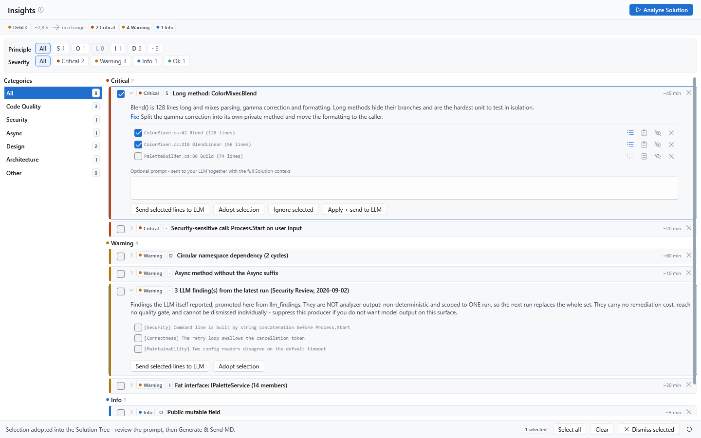

[AICB – General Documentation](README.md) &middot; chapter 8 of 12

# 8 Insights: the code quality catalog

AICB analyzes your solution and reports what it finds as **insights**: short, contextual hints about your C# code - a long method, an unused type, a broken XAML binding, a dependency that points the wrong way. Each insight names the affected code, explains what the rule looks for, suggests a fix, and estimates the remediation effort. This chapter describes where insights appear, every rule in the catalog, the quality profiles that control them, how to mark findings as reviewed, and the limits the analysis has by design.

## 8.1 What an insight is

An insight is produced by a **rule** (internally called a producer): one small heuristic that walks the analyzed solution and emits a finding when its condition matches. Every insight is a self-contained report with the same shape:

| Element | Meaning |
|---|---|
| Title | Short summary; usually carries the number of hits and the rule's unit (e.g. "12 methods over 50 LOC"). |
| Description | What the rule detected, why it matters, and any caveat specific to the rule. |
| `Fix:` line | A concrete, actionable suggestion. Some insights have none. |
| Detail lines | One line per affected code location, in a monospace font. A line that resolves to a symbol carries a **Reveal in the Solution Tree** button and can be selected, queued, suppressed, or dismissed individually. |
| Severity | `Info`, `Ok`, `Warning` or `Critical` - see "Severity levels". |
| Category | Where the card is grouped in the Insights tab - see "Categories". |
| SOLID badges | The design principle(s) the rule addresses (`S`, `O`, `L`, `I`, `D`, or `·` for "Other"). Hover a badge to read what the letter stands for. |
| Remediation cost | An order-of-magnitude estimate such as `~15 min`, when the rule can estimate one. It feeds the technical-debt rating. |

Findings are grouped per rule, not per code location: one insight aggregates every hit of its rule (for example all anti-pattern hits in the solution). The individual locations are the detail lines.

### Running the analysis

Insights are not computed while you type, and a solution load does not block on them:

1. Open a solution. AICB restores the last persisted insight run for that solution (when `Persist insights with session` is on) and starts a fresh analysis in the background. The fresh result replaces the restored one as soon as it is ready, so what you see matches the current state of the tree.
2. To re-evaluate on demand, click **Analyze Solution** in the Insights tab header, or press `Ctrl+Shift+A` from any sub-tab. The button is the single accent action of the tab; it runs all rules over the active solution.
3. On a fresh installation, the rules run once automatically on the first solution load so the tab is not empty. Afterwards the on-demand behaviour applies.
4. The optional setting `Auto-trigger insights on solution load` (Settings → General, section "Session & Analysis") starts the run directly as part of every solution load instead of the background preparation. `Persist insights with session` controls whether results are stored per solution and restored on the next load; with it off, insights are recomputed fresh every time and never written to the database.

A full run takes roughly 3-15 seconds depending on solution size. During the run the tab is dimmed by a spinner overlay; the analysis works on a read-only snapshot and cannot disturb your editing session.

If no solution of your own is loaded yet, the empty state offers **Open sample Solution**, which loads the bundled read-only sample `ColorMixer.SelectionLab.sln` for a trial run.

### The Insights tab

The tab has four regions:

- A **page header** with the `Insights` title, an info tooltip, and the `Analyze Solution` button.
- A **metrics strip** over all findings (it appears once a run has produced results): the technical-debt grade `Debt A` … `Debt E`, the estimated total remediation time (e.g. `~3.5 h`), a trend chip comparing the stamped debt with the previous analysis (`Worsened`, `Improved`, or no change; shown only when at least two stamped snapshots exist), and the counts `N Critical`, `N Warning`, `N Info`.
- Two **filter rows**, both multi-select toggle sets:
  - `Principle`: `All`, `S`, `O`, `L`, `I`, `D`, and `·` for "Other". Each chip shows how many findings it currently holds; a chip with count 0 is not clickable. `All` clears the axis.
  - `Severity`: `All`, `Critical`, `Warning`, `Info`, `Ok`. Several severities can be active at once.
- A **two-pane body**: a single-select category navigator on the left (with a running count per category) and the selected category's cards on the right, grouped under severity headers (`Critical`, `Warning`, `Info`, `Ok`) with a count each.

If the right pane is empty, it says: `No insights to show here - pick a category on the left, or relax the principle/severity filters.`

### Working with a card

A card starts collapsed as a one-line row: severity pill, SOLID badges, title, and the remediation cost. Click the row (or the chevron) to expand it into the description, the `Fix:` line, and the detail list. The list is height-capped and scrollable; the Insights tab shows every hit line.

- The checkbox at the left of a card selects it for a batch action (`Select for a batch action (Dismiss selected).`).
- The **Dismiss** button at the top right marks the whole card as seen (`Dismiss - marks the finding as seen; it will not come back`). It is hidden on findings that cannot be dismissed.
- With the card expanded, each detail line has its own checkbox and up to five small buttons:
  - **Reveal in Solution Tree** - selects and reveals the line's symbol in the tree.
  - **Queue as work** - opens a picker asking for a `Run template`, then records the line as work to do (`Queue`). Nothing is started; the line stays visible and reports `In progress`.
  - **Mark done** - closes the queued item. This records your claim; nothing re-scans to confirm it, and the line stays visible so a later run can contradict it. A closed line reports `Done`.
  - **Intentional here** - records a suppression scoped to the line's symbol. The tooltip is explicit about the scope: `Mark this finding as intentional - it stops being reported here and to the MCP. The quality gate (--fail-on / solution_metrics) still counts it. Export the solution config to share the decision via the .aicb.json sidecar.`
  - **Seen this one** - dismisses just this line, locally (`Dismiss just this line - it stops being reported here and to the MCP until you restore dismissed findings.`). It appears only when the line resolves to a scope narrower than the whole rule; to silence a whole rule deliberately, use the card-level Dismiss.
- Below the detail list, an optional prompt box appears (`Optional prompt - sent to your LLM together with the full Solution context`), and up to three action buttons:
  - **Send selected lines to LLM** - sends the checked detail lines, together with the full solution context, to the active LLM.
  - **Adopt selection** - selects the checked symbols (and pulls in their relevant neighbours) in the Solution Tree, replacing the current selection, and writes a fix task into the prompt. Review it, then use `Generate & Send MD`.
  - **Ignore selected** - dismisses the whole card, the same as the top-right Dismiss button.
  - The insight-card model has support for a rule-specific secondary action, but the only producer that supplies one is not registered in the released application. No shipped card currently shows that button.

The action bar at the bottom of the tab holds the batch actions: a selection summary pill, `Select all`, `Clear`, `Dismiss selected` (marks all checked findings as seen), and an icon button whose tooltip reads: `Reset what you hid - dismissed Insights and findings you marked intentional become visible again, and all sections are re-evaluated immediately. Suppressions declared in the committed .aicb.json sidecar stay in force.`

**Note:** A card's title count and its cost estimate are computed from the full hit list *before* triage. On a card whose lines you have partly hidden, the title can therefore still name the original total while the list shows only the remainder. The MCP answer carries a `suppressed` field reporting how many lines were removed by triage.

**Note:** The Insights tab lists every hit line. `list_insights` returns summary fields, including `detailsCount`, but no detail lines. `get_insight` returns detail lines, caps them at 20 by default, appends `(... and N more)` when truncated, and accepts `maxDetails` to raise the cap for a drill-down.

## 8.2 Severity levels

Every insight carries one of four severities. They are used for the card ribbon, the grouping headers, the filter chips, the header counts, and the quality gate.

| Severity | Meaning | Weight used for sorting and scoring |
|---|---|---|
| `Critical` | A structural problem that should be addressed before release (e.g. a namespace cycle spanning assemblies). | 10 |
| `Warning` | A defect or convention break with a practical consequence (broken binding, resource leak, blocking async call). | 3 |
| `Info` | A heuristic hint or refactoring suggestion. The majority of the catalog. | 0.5 |
| `Ok` | Neutral/no action needed. Present in the model and offered as a filter chip; no built-in rule currently emits it. | 0 |

The weights are deliberately not proportional to the order of the levels; they are what the debt and gate scoring use. On the wire and in persisted data the levels travel as the lowercase tokens `info`, `ok`, `warning`, `critical`; unknown or legacy tokens read back as `Info` rather than failing.

## 8.3 Categories

Each rule belongs to exactly one category, which decides where its card is sorted in the left navigator. The navigator always lists `All` plus `Code Quality`, `Security`, `Async`, `Design`, `Architecture`, and `Other`; further categories appear only when a finding actually maps to them.

| Category | What it collects |
|---|---|
| `Code Quality` | Quality heuristics, correctness smells, dead-code suspicion, complexity, size and parameter checks, side-effect concentration, deprecated APIs, resource leaks, reflection and LINQ-in-loop usage. |
| `Design` | Design weaknesses: unused types, public mutable fields, many parameters, layer violations, concentrated event subscriptions, unresolved XAML bindings. |
| `Async` | .NET async-convention checks: missing `Async` suffix, missing `CancellationToken`. |
| `Architecture` | Circular namespace dependencies and public-contract breaking changes. |
| `Security` | Call sites of security-sensitive external APIs. |
| `Other` | Findings without a category mapping (currently used as a fallback only). |
| `Compression` | Reserved for the auto-compression tips; no active rule reports into it (see "Not yet released"). |

The category is independent of the SOLID badge: the category says where a card is sorted, the badge says which design rule it addresses.

## 8.4 The insight catalog

The catalog lists 27 entries: 24 analyzer rules, the LLM findings, and one pair of auto-compression tips that is not yet released (see "Not yet released").

| Insight id | Category | Severity | Enabled by | What it reports |
|---|---|---|---|---|
| `quality-long-methods` | Code Quality | Info | `Long methods (LOC over threshold)` | Methods longer than the LOC threshold, or - when the complexity option is on - methods whose cyclomatic complexity exceeds the complexity threshold. |
| `quality-dead-code-private` | Code Quality | Warning | `Dead private methods (UsedBy == 0)` | Private methods with no detected caller. |
| `quality-fat-interfaces` | Code Quality | Info | `Fat interfaces (methods over threshold)` | Interfaces with more methods than the threshold (suspected ISP violation). |
| `quality-large-classes` | Code Quality | Info | `Large classes (members over threshold)` | Classes with more members (methods + properties + fields) than the threshold (suspected SRP violation). |
| `quality-anti-patterns` | Code Quality | Warning | `Anti-patterns (correctness smells: …)` | Correctness and convention smells: blocking on async (`.Result`/`.Wait`), direct clock reads, `new HttpClient()`, `async void`, dropped fire-and-forget tasks, broad `catch (Exception)`, `Thread.Sleep`, missing `ConfigureAwait(false)`, and a constant `new Regex()` that could be `[GeneratedRegex]`. |
| `quality-complexity-hotspots` | Code Quality | Info | `Complexity hotspots (top methods by cognitive complexity)` | Methods ranked by cognitive complexity, worst first. |
| `quality-complex-untested` | Code Quality | Warning | `Complexity hotspots` | Complex methods with no direct test, from the intersection of the complexity ranking and the coverage-gap analysis. |
| `quality-multi-concern-hotspots` | Code Quality | Info | `Complexity hotspots` + `Side-effect concentration` + `Anti-patterns` | Methods flagged by two or more quality dimensions at once - the highest-priority refactor targets. |
| `quality-side-effect-concentration` | Code Quality | Info | `Side-effect concentration (methods mixing 3+ effect categories)` | Methods mixing three or more distinct side-effect categories (I/O, network, database, serialization, logging, cache, messaging). |
| `quality-linq-in-loop` | Code Quality | Info | `Anti-patterns` | Methods evaluating a LINQ operator inside a loop body. |
| `quality-reflection-usage` | Code Quality | Info | `Anti-patterns` | Methods whose resolved external calls or reads name reflection infrastructure. |
| `quality-resource-leaks` | Code Quality | Warning | `Anti-patterns` | Disposables created with `new` whose ownership is neither transferred nor disposed. |
| `quality-deprecated-referenced` | Code Quality | Info | `Anti-patterns` | Types or methods marked `[Obsolete]` that still have an intra-solution reference. |
| `quality-event-subscription-concentration` | Design | Info | `Side-effect concentration` | Types subscribing to three or more events without a matching unsubscribe. |
| `design-unused-type` | Design | Info | `Unused types (no inbound usage)` | Types with no inbound reference, after the structural exemptions described under "Known limits of the analysis". |
| `design-public-mutable-field` | Design | Warning | `Public mutable fields (encapsulation break)` | Public fields without `readonly`/`const`. |
| `design-many-parameters` | Design | Info | `Many parameters (over threshold)` | Methods with more parameters than the threshold. Constructors are excluded. |
| `quality-layer-violations` | Design | Warning (Info for the coverage note; `Critical` under a Strict layer policy) | `Layer violations (inner layer depends on outer layer)` | Dependencies that contradict the Clean/Onion rule: a type in an inner layer depends on a type in an outer layer. |
| `design-unresolved-xaml-binding` | Design | Warning | `Unresolved XAML bindings` | WPF/Avalonia `{Binding X}` bindings whose root member does not exist on the confidently resolved DataContext view-model. |
| `async-missing-suffix` | Async | Warning | `Missing Async suffix on Task-/ValueTask-returning methods` | Task/ValueTask methods whose name does not end in `Async`. |
| `async-no-cancellation-token` | Async | Warning | `Async method without CancellationToken parameter` | Task/ValueTask methods without a `CancellationToken` parameter. |
| `quality-circular-dependencies` | Architecture | Warning; `Critical` when a cycle spans several assemblies | `Circular namespace dependencies (dependency cycles)` | Namespaces that reference each other in a cycle (`A → B → A` or a larger tangle). |
| `quality-breaking-changes` | Architecture | Warning | `Circular namespace dependencies` | Public API removals or signature changes compared with the latest saved snapshot. Needs a saved snapshot; without a baseline there is no finding. |
| `security-sensitive-calls` | Security | Warning | `Anti-patterns` | Methods calling security-sensitive external APIs: insecure deserializers (`BinaryFormatter`, `SoapFormatter`, `NetDataContractSerializer`, `LosFormatter`), `Process.Start`, or `Assembly.Load`. |
| `llm-findings` | Code Quality | Taken from the category the model itself declared | - (always on) | Findings the LLM reported in the latest run, promoted from the run's findings. |
| `autocompression-firstuse` | Compression | Info | - | Not yet released; see below. |
| `autocompression-reminder` | Compression | Info | - | Not yet released; see below. |

### Notes on individual rules

- **Long methods.** LOC counts only the lines that carry code - blank and comment-only lines are not counted, so documenting a method does not make it "long". By default the rule *also* sharpens on cyclomatic complexity, so a short but heavily branched method is flagged too. Both thresholds are editable in the quality profile.
- **Anti-patterns.** The rule aggregates every hit of its kind into one card and shows the per-kind distribution in the description; the detail list is sorted alphabetically by `Type.Method`, so a capped list shows the first entries, not a sample per kind. The convention smells (broad catch, `Thread.Sleep`, `ConfigureAwait`, `Regex`) are recall-safe - they also work on a restored session. The remaining smells are detected on live sessions only.
- **Complex, untested.** "Untested" here is a one-hop index: a method that no test invokes *directly* is listed even when a test drives it through intermediate calls. Entries marked as reaching no test at all are listed first, and only those count towards the cost estimate. The rule is a prioritisation signal, not a coverage measurement; for a real coverage view use `coverage_gaps`.
- **Complexity hotspots** ranks by *cognitive* complexity (nesting and comprehension load), using the same threshold number as the cyclomatic axis. It complements the long-method rule, which thresholds cyclomatically, so the two do not double-report.
- **Multi-concern hotspots** is a prioritisation ranking over the other rules, not a separate finding: it counts a method once per dimension that flags it (complexity, side-effect concentration, reflection, concurrency, resource leaks, security-sensitive calls), and only dimensions whose switches are on are counted. It deliberately carries no remediation cost, because the underlying concerns already carry theirs.
- **Side-effect concentration** counts *real* effect categories; an unanalyzable external call is not counted as a category, so it cannot inflate the number.
- **Event-subscription concentration** lists types that subscribe to three or more C# events with `+=` and declare no matching `-=`. An event-heavy type is a coupling smell and a lifetime risk; types that release everything they wire are not listed.
- **LINQ in a loop** is detected strictly: only real `System.Linq` operators count (not a same-named instance method such as `HashSet.Contains`), and only inside the loop body - a `foreach` source runs once and is not flagged. The finding is often benign on a small local collection.
- **Reflection usage** matches on the receiver type (`System.Reflection.*`, `Type.*`, `Activator`, `AppDomain`, `object.GetType()`, expression trees), never on a bare member name, so a `DependencyObject.GetValue` accessor or a `typeof(...)` in an attribute does not count. It is informational: much reflection is intentional, but it defeats the IL trimmer and can break under NativeAOT.
- **Resource leaks** is deliberately conservative: it reports only a bare `new X();` statement or a local that is never referenced again, so a false positive is effectively ruled out. Each hit is estimated at 15 minutes. A leaked disposable is treated as a correctness smell like the other anti-patterns, which is why it shares their switch.
- **Deprecated APIs still referenced** omits deprecated symbols with no detected reference (those are safe to delete, not debt). Two limits: "still referenced" uses the reverse type fan-in for types and the caller list for methods, so a symbol reached only via reflection or DI shows no reference; and the type fan-in is keyed by simple name, so two solution types sharing a name share one count. Only the deprecated side is restricted to production code - a reference from a test project still counts.
- **Layer violations.** The rule resolves layers from namespace conventions plus a role heuristic, and the severity follows the layer profile's policy: `Advisory` → `Warning`, `Strict` → `Critical`. When the check could not classify every production type, the description names how many types were checked and which were skipped, so a clean result over a partly unchecked solution is not mistaken for a clean solution.
- **Circular namespace dependencies.** Granularity is the namespace (type-level cycles are usually benign in C#). A cycle that spans assemblies is the more serious case and raises the severity to `Critical`. The detail line anchors on a concrete witness type so `Reveal in Solution Tree` and `Adopt selection` work.
- **Public-contract breaking changes.** Compares the current public/protected surface against the latest saved snapshot with identical options. A removed public type or member, or a changed member signature, is breaking; a pure accessibility widening is conservatively reported as a change too (over-warning is the safe direction). Additive changes are not listed. Save a snapshot (see the Sessions and snapshots documentation) to establish a baseline.
- **Unresolved XAML bindings.** The compiler does not catch this class of defect: a binding to a member that does not exist fails silently at runtime. Only view-models resolved with certainty are checked (WPF: `d:DesignInstance` or a unique `FooView` → `FooViewModel` convention; Avalonia `.axaml`: `x:DataType`), and only when their member surface is verifiable. Source-generated members (`[ObservableProperty]`, `[RelayCommand]`) and inherited members count as resolved; a view-model with an unknown external base is skipped, not flagged. Live-only: re-run the analysis after edits.
- **LLM findings** are not analyzer output. They are parsed from the latest run's output, are non-deterministic, and are scoped to that one run: the next run replaces the whole set and may not repeat any of it. A multi-step run contributes the findings of every reasoning step, so an earlier step can contradict a later one. They carry no remediation cost and cannot be dismissed.

### Not yet released

The auto-compression tips (`autocompression-firstuse`, `autocompression-reminder`, category `Compression`) are planned and not yet released: they do not appear in the Insights tab or in an MCP answer, and the category `Compression` stays empty until they are.

## 8.5 Quality profiles

A **quality profile** is a bundle of rule switches and thresholds. It decides which rules run, how strict their limits are, and how their actions behave.

### The three built-in profiles

| Id | Name | Description as shown in the picker |
|---|---|---|
| `quality-profile/default` | `Default` | `All 15 producers active, moderate thresholds (50 LOC / 7 methods / 25 members / 5 parameters), DirectApply. Recommended default.` |
| `quality-profile/strict` | `Strict` | `Stricter thresholds (30 LOC / 5 methods / 15 members / 3 parameters), ConfirmDialog. Suited to code-review sessions on legacy code.` |
| `quality-profile/disabled` | `Disabled (all producers off)` | `All 15 producers turned off. For users who want to disable findings entirely without hiding the tab.` |

**Note:** The profile model contains 15 producer switches, but the desktop editor exposes only 14 of them; `Unresolved XAML bindings` is currently not editable in the UI. The editor's fifteenth checkbox is the separate McCabe option. The catalog contains 24 analyzer rules, and several producer switches control more than one rule (see the table below).

### Selecting and editing a profile

Open **Settings → Quality Profiles**. The panel is a master-detail editor:

- The list on the left shows the built-in and custom profiles; the detail pane shows the selected profile's name, description, and all settings.
- **Apply as Active** makes the selected profile the global default: `Apply as Active: make this profile the global default. Every insight heuristic uses it unless a template overrides it.`
- The active profile is resolved in this order: the active context template's quality-profile slot (when set) → the globally active profile → the `Default` built-in. A profile chosen on a run template therefore takes precedence over the global choice.
- Built-ins can be edited; saving marks the built-in as overridden. **Restore Built-In** resets it to its code defaults and clears the override. **Duplicate** creates a custom copy to tweak; **Delete** hides a built-in (recoverable via Restore) or removes a custom profile permanently. **Export as Built-In** shows the entry as a C# snippet; it is intended for the product's own development and has no effect on your installation.
- `Save` persists editor changes (`Ctrl+S`), `Duplicate` is `Ctrl+D`.

### Producer switches and thresholds

The profile model contains 15 producer switches and 5 numeric thresholds. The desktop editor exposes 14 producer switches (all rows below except `Unresolved XAML bindings`) plus its separate McCabe checkbox. Defaults are shown in the tables; the `Strict` profile changes the numeric values as noted.

| Switch | Default | Rules it controls |
|---|---|---|
| `Long methods (LOC over threshold)` | on | `quality-long-methods` |
| `Dead private methods (UsedBy == 0)` | on | `quality-dead-code-private` |
| `Fat interfaces (methods over threshold)` | on | `quality-fat-interfaces` |
| `Large classes (members over threshold)` | on | `quality-large-classes` |
| `Anti-patterns (correctness smells: .Result/.Wait, DateTime.Now, new HttpClient, async void)` | on | `quality-anti-patterns`, `quality-deprecated-referenced`, `quality-linq-in-loop`, `quality-reflection-usage`, `quality-resource-leaks`, `security-sensitive-calls` |
| `Complexity hotspots (top methods by cognitive complexity)` | on | `quality-complexity-hotspots`, `quality-complex-untested`, `quality-multi-concern-hotspots` |
| `Side-effect concentration (methods mixing 3+ effect categories)` | on | `quality-side-effect-concentration`, `quality-event-subscription-concentration` |
| `Missing Async suffix on Task-/ValueTask-returning methods` | on | `async-missing-suffix` |
| `Async method without CancellationToken parameter` | on | `async-no-cancellation-token` |
| `Unused types (no inbound usage)` | on | `design-unused-type` |
| `Public mutable fields (encapsulation break)` | on | `design-public-mutable-field` |
| `Many parameters (over threshold)` | on | `design-many-parameters` |
| `Layer violations (inner layer depends on outer layer)` | on | `quality-layer-violations` |
| `Circular namespace dependencies (dependency cycles)` | on | `quality-circular-dependencies`, `quality-breaking-changes` |
| `Unresolved XAML bindings` | on | `design-unresolved-xaml-binding` |

| Threshold | Default | Strict | Used by |
|---|---|---|---|
| `Threshold (LOC):` | 50 | 30 | Long methods |
| `Complexity threshold:` | 10 | 7 | Long-method complexity sharpening, complexity hotspots, complex-untested, multi-concern hotspots |
| `Threshold (methods):` | 7 | 5 | Fat interfaces |
| `Threshold (members):` | 25 | 15 | Large classes |
| `Threshold (parameters):` | 5 | 3 | Many parameters |

**Note:** Some switches are broader than their label suggests. `Anti-patterns` also controls the security-sensitive-call rule and the deprecated-API rule; `Circular namespace dependencies` also controls the public-contract breaking-change rule. If you switch one of these off, the coupled rules stop reporting as well. Two rules (`llm-findings` and the not-yet-released auto-compression tips) have no switch at all.

### Behaviour settings

| Setting | Meaning |
|---|---|
| `Insights are dismissable (persist hidden per solution)` | Default on. When on, you can dismiss individual insights per solution. When off, all insights are persistent and come back after dismissing until the rule itself stops reporting them. |
| `Send-Template-Id override (optional)` | Stored support for the rule-specific `Apply + send to LLM` path. Empty uses the active tab's run template; an unknown id falls back to it. The only producer that supplies this secondary action is not registered in the released application, so the setting currently has no visible card to act on. |
| `Action mode` | Stored mode for that same unreleased secondary-action path: `DirectApply` or `ConfirmDialog`. It currently has no effect on shipped insight cards. |

## 8.6 Suppressing and dismissing findings

Triage has two separate axes, and the distinction matters when you share your decisions with a team:

| | **Intentional** (suppression) | **Seen** (dismissal) |
|---|---|---|
| Means | "This hit is by design." | "I have read this." |
| Scope | A member, a type, or a whole rule. | A member, a type, or a whole rule. |
| Stored in | The database, and - once exported - the git-tracked `<Solution>.aicb.json` sidecar next to your solution file. | The solution record in the local database, not in the sidecar. |
| Shared with the team | Yes, through the sidecar. | No, it is local. |

Both axes are applied on the **reading surfaces**: the Insights tab and the MCP tools `list_insights` and `get_insight`. The quality gate is deliberately *not* filtered - see "What the triage affects".

### Silencing a single line

1. Run `Analyze Solution` and expand the card.
2. To record a decision the team should see, click **Intentional here** on the line. AICB records a suppression scoped to that line's symbol.
3. To simply stop seeing the line locally, click **Seen this one**. AICB records a dismissal scoped to that line's symbol.
4. Export the solution configuration from the Solutions tab to write the suppressions into the `.aicb.json` sidecar. Commit the file so the decision travels with the repository; entries declared there stay in force even when you reset your local triage.

Lines that carry no resolvable symbol (relation or marker lines) cannot be suppressed or dismissed individually; there is nothing stable to key them on.

### Silencing a whole rule or a whole type

- **Whole card / whole rule:** click the Dismiss button at the top right of the card, or check the card and use `Dismiss selected` in the action bar, or expand the card and click `Ignore selected`.
- **A whole type:** suppress or dismiss a line whose scope covers the type; the recorded scope is as narrow as the line allows. Silencing a whole rule from a per-line button is deliberately not offered, because one click must not claim every hit of the rule.

### Restoring what you hid

The icon button in the action bar resets what you hid: dismissed insights and findings you marked intentional become visible again, and all sections are re-evaluated immediately. Suppressions declared in the committed `.aicb.json` sidecar stay in force - they are a team decision, not a local one, and are not dropped by a panel button.

Findings that are not dismissable (for example `llm-findings`, or every insight while `Insights are dismissable` is off) show no Dismiss button. Such a card stays visible until the rule itself stops reporting it.

### What the triage affects

- **Affected:** the Insights tab, and the MCP tools `list_insights` / `get_insight`. An insight whose detail lines are all filtered out does not appear at all. A partially filtered insight reports the number of removed lines as `suppressed` in `list_insights` and as `suppressedDetailCount` in `get_insight`; that number covers both axes together and is not a count of sidecar entries.
- **Not affected:** the quality gate - the CLI `aicb analyze --fail-on "<expression>"` and the MCP `solution_metrics` rollup. A gate that the gated party can silence is a weaker gate, so suppressions and dismissals never flip a gate result. The gate aggregates the analyzer rules only; it does not include the LLM findings or the snapshot-based public-contract check.

## 8.7 The technical debt estimate

Insights that can estimate their remediation effort carry a `~N min` label. The estimates are deliberately coarse (order of magnitude, not precision). The tab sums them into a solution-wide debt and maps it onto a coarse A-E grade.

| Rule | Estimate per hit |
|---|---|
| Long method | 5 min + 1 min per 10 LOC over the threshold |
| Fat interface | 10 min + 3 min per method over the threshold |
| Large class | 10 min + 1 min per 5 members over the threshold |
| Many parameters | 10 min |
| Dead private method | 5 min |
| Unused type | 10 min |
| Public mutable field | 10 min |
| Missing `Async` suffix | 5 min |
| Async without `CancellationToken` | 5 min |
| Layer violation | 20 min |
| Circular namespace dependency | 20 min |
| Side-effect concentration | 12 min |
| Unresolved XAML binding | 8 min |
| Complex but untested | 8 min + 1 min per cyclomatic-complexity point |
| Deprecated API still referenced | 10 min |
| Public-contract breaking change | 15 min |
| Anti-pattern hit | 12 min |
| Resource leak | 15 min |
| Security-sensitive call | 15 min per method |
| Event-subscription concentration, complexity hotspots, multi-concern hotspots, LINQ in a loop, reflection usage, LLM findings | no estimate (rankings and informational findings) |

| Rating | Summed remediation time |
|---|---|
| `A` | under 30 minutes - very low debt |
| `B` | from 30 minutes |
| `C` | from 2 hours |
| `D` | from 1 working day (8 hours) |
| `E` | from 3 working days (24 hours) - high debt |

The header shows the estimate in coarse buckets (`min`, `h`, or working days) and never as an exact number; treat it as an order of magnitude.

## 8.8 Known limits of the analysis

The analysis is heuristic. This section states what it does not see, so you can judge a finding instead of trusting or distrusting it blindly.

### How the analysis errs

The guiding rule is **under-report rather than over-report**: a missed finding is cheaper than a false alarm in a tool you use for trust and deletion decisions. The one deliberate exception is input validation: a misspelled token that would otherwise produce a plausible but wrong result is rejected outright rather than silently treated as a lenient default.

### Structural exemptions

Some code is alive but structurally invisible to the signal that looks for inbound references. AICB recognises four families and excludes them from the unused-type check rather than reporting a false positive. The public-mutable-field check has its own narrower exemptions: structs and runner-activated types.

| Family | Why the code is invisible | Examples |
|---|---|---|
| Kind or shape | Interfaces are resolved polymorphically via DI; a static class is reached only as `TypeName.Member`, and a member access is not a type reference. | Interfaces, static classes, `*Extensions` containers. |
| Test or benchmark scaffolding | Instantiated reflectively by a test or benchmark runner, or living in test infrastructure. | Test projects, `*Tests`/`*Fixture` names, test/benchmark attributes. |
| Framework-, reflection- or DI-activated | Plugged into an abstraction or a host convention and instantiated by the framework. | EF migrations, ASP.NET Core middleware and MVC controllers, entry points with `static Main`, Blazor pages, source-generator hosts. |
| Markup-referenced | Referenced from XAML rather than from C#. | Code-behind types, converters, `*View`/`*Window`/`*Dialog`/`*Page` naming, `*.xaml.cs` files. |

A remaining caveat is stated with the finding itself: further reflection or plug-in patterns may still produce a false positive, so cross-check an unused-type hit with `find_usages` before deleting.

### Heuristic calibration

- **Name conventions** are the basis for several role, layer and return-value classifications. They are matched on structural patterns (for example `On<Upper>` for event handlers, `*Result` for result types), not on bare substrings, so ordinary words do not latch.
- **Pure versus impure** types in effect namespaces are carved out: types such as `Path`, `MemoryStream`, `StringReader`, `StringWriter` and the value/message types of the network namespace are treated as benign, so a pure helper in `System.IO` or `System.Net` is not reported as a side effect. A mis-classified external symbol would propagate through the call graph, which is why these carve-outs are precision-critical.
- **Similarity anchors:** similarity tools require a real structural anchor (a base type or a non-ubiquitous interface) and ignore ubiquitous ones such as `IEquatable`; otherwise generic skeletons would flood the result.
- **Production focus versus discovery.** Several aggregate and orientation tools hide test projects by default and offer an opt-in `includeTests` parameter - this applies to `find_by_side_effects`, the `symbol_metrics` ranking, `architecture_overview`, `find_dead_code` and `calls_external`. `coverage_gaps` has no `includeTests` parameter and always excludes test projects; the quality-rule reading tools likewise expose no such parameter. Discovering tools deliberately do *not* hide tests: `find_by_attribute` (for example with `Fact`), `find_usages` and `instantiation_sites` want to see test code. Interpret each tool according to its own signature rather than assuming a shared switch.
- **Namespace normalization** strips `global::` qualifiers and separates framework/generated namespaces from your own architecture, so configuration tools compare the right namespace sets.
- **Layer inference from project names** lets an outermost-ring host segment dominate an inner layer word: a project named like a web/api/cli/mcp/composition/benchmark host is classified as `Presentation` even when its name also contains `Application` or `Domain`. This is correct for a host and a known false positive when "Api" means the public surface of a library.

### Input validation

- **Did-you-mean on empty:** when a token produces no hits, the answer lists the values that actually exist in the scope - for example `availableEffects`, `availableReturnsSemantics`, or `availableAxisValues`. A typo therefore returns a self-explaining empty answer rather than a bare zero. The successful path is unchanged.
- **Strict rejection:** when a wrong token would fall into a populated but wrong result, the tool rejects it at the boundary with an error instead of silently degrading to a more lenient value. This applies, for example, to an unknown policy value, an unknown `matchType`, or an unknown `minConfidence` / `purity` token.

### Limits you should know

- **Caller lists are statically resolved.** Reflection, DI containers, serializers, and external assemblies stay invisible. The absence of callers is not proof of dead code. The compression legend in every generated document states this, and it applies to the insights as well.
- **Resolution completeness is not the same as a successful restore.** A run reports its projects as resolved when they bound their core references; a project that bound `System.Object` from the base framework but is missing its own package assets still counts as resolved, so treat "all resolved" as a statement about a wholly unbuilt tree, not as a build guarantee.
- **Afferent coupling (Ca) is 0 on live analyses.** The live surfaces (the gate's `ca-max`, the `QUALITY_HOTSPOTS` section, the `ca=""` tag) compute the reverse fan-in from the dependency data instead, so the displayed value is meaningful; only a stored field in hand-built models and older snapshots carries 0.
- **Effect, leak and external-call statements need a built tree.** On an unbuilt working tree, fan-in statements can partly survive, but effect statements do not - `find_by_side_effects` can report 0 effects for a solution whose built form has hundreds. Build (or restore) the solution before trusting an effect answer.
- **Two complexity axes, two result sets.** The default ranking uses cyclomatic complexity; ranking by cognitive complexity can produce a different set of methods, not just a different order. `symbol_metrics` discloses this when the sets differ, not when the order merely changes.
- **Two complexity thresholds, two boundaries.** The solution rollup counts methods *strictly above* the threshold; `symbol_metrics`' `minComplexity` filter and the complex-untested insight include methods *at* the threshold. At the same number, the rollup's count is therefore smaller by exactly the methods on the boundary.
- **The layer check has two deliberate blind spots.** Dependency strings that name a generic (for example `IRepository<Order>` against the index key `IRepository`) are not matched, and edges inside one assembly without an authoritative layer assignment are not checked. The coverage note on the insight names how many types were checked.
- **The XAML binding check skips silently.** A binding whose DataContext cannot be typed with certainty - a nested runtime `DataContext`, a template without a `DataType`, a `ControlTemplate` or `Style` - is never checked and never reported. An empty `find_unresolved_bindings` result therefore means "nothing broken among the bindings that could be checked", not "all bindings are good".
- **Snapshot-based checks need a snapshot.** The public-contract breaking-change rule compares against the latest saved snapshot; without one it reports nothing. Save a snapshot before a refactoring wave to get a meaningful baseline.
- **LLM findings are non-deterministic.** They are scoped to one run and replaced wholesale by the next run; they are not a trend and not a stable baseline.

---

[&larr; 7 Profiles, master data and solution configuration](07-profiles-master-data-and-solution-configuration.md) &middot; [Contents](README.md) &middot; [9 Command-line reference &rarr;](09-command-line-reference.md)
