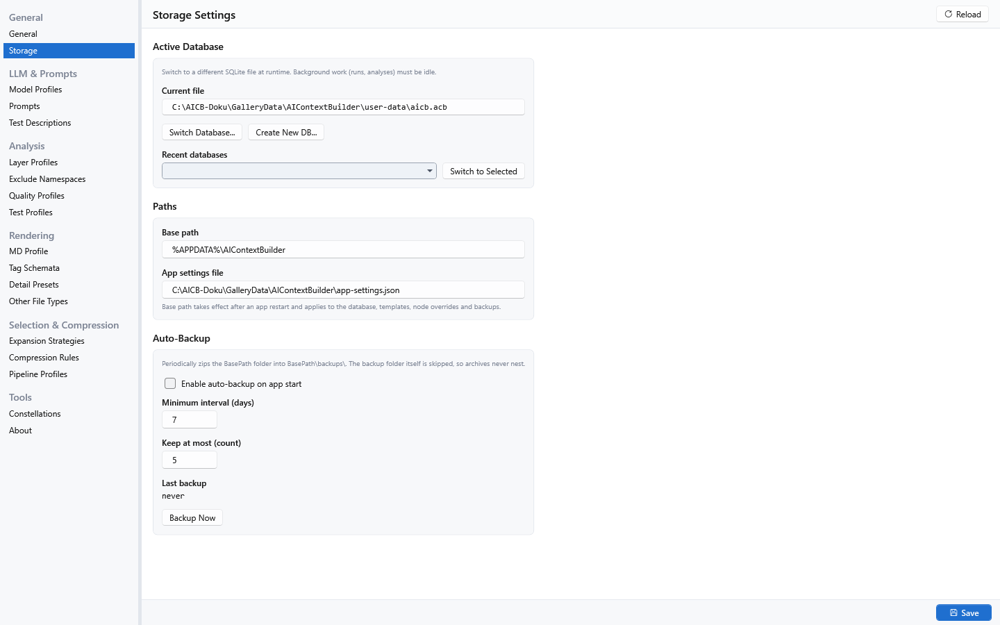

[AICB – General Documentation](README.md) &middot; chapter 10 of 12

# 10 Data, storage and privacy

AIContextBuilder keeps everything it knows in a local SQLite database and a small number of files around it. Nothing is transmitted anywhere unless you send it yourself. This chapter describes what is stored, where it lives, how to move it to another machine, how to remove it, and what the product does — and deliberately does not do — with your information.

## 10.1 Sessions and snapshots

### What a session stores

A session is a saved working state of the Context Builder for one solution. It holds:

- a name and the solution it belongs to,
- creation and last-modified timestamps,
- an optional pinned snapshot (if none is pinned, the session is not fixed to a particular analysis state),
- the active context template (`default` unless you chose another),
- a by-value copy of all master-data values as they were when the session was created — so reopening an old session does not silently change under a later profile edit,
- the tree selection: the list of nodes whose state is not `Inherit`,
- the last user prompt you entered, so it is reproduced when you reopen the session,
- free-text notes for the session,
- an archive flag, and
- per-session picker overrides from the detail and sections panels (if you never touched them, the normal resolution chain applies).

Node-level overrides are stored separately and belong to the session.

Archiving is **non-destructive**: runs, snapshots and evaluations are kept, and the session simply leaves the default filter. The Sessions tab offers the filters `Active`, `Archived` and `All`. In the session's action area you can `Open in New Tab`, `Export` it as a JSON file (`As JSON file`), `Duplicate` it (`Copy with snapshot`), or `Delete` it (`Permanent - confirms`). Deleting a session is permanent and asks for confirmation first. For the session workflow itself, see "Workspace, sessions and snapshots" in the desktop app manual.

### Missing nodes when you open a session

If part of the stored selection or of the per-node detail overrides no longer exists in the current tree — typical after a refactoring — the application shows a window titled `Session opened - missing nodes`. Its summary says how many nodes the session references that no longer exist and how many nodes of the selection were restored, and it lists the missing node keys; hovering an entry shows the full node key. The window has a single `OK` button and is a report, not a question: orphaned nodes are removed from the session on the next save.

### What a snapshot stores

A snapshot is a complete analyzed solution, stored as JSON together with metadata: its name, its type, the creation time, a hash of the analyzed file set, the format stamp of the stored payload, and quality figures (technical-debt total and rating, code metrics). Snapshots are what make a comparison against an earlier state possible without re-analyzing the solution.

- **Automatic snapshots.** One is written on every fresh analysis. The setting `Max snapshots per solution` (Settings → General, default `10`) limits how many automatic snapshots are kept; when the limit is exceeded, the oldest ones are deleted. Snapshots you saved yourself are never deleted and do not count toward the limit.
- **Manual snapshots.** In the Snapshots tab, `Create Manual Snapshot` saves one with the name entered in the dialog for the solution currently opened in the Context Builder. Snapshots do not have a notes field. The icon buttons next to it rename and permanently delete the selected snapshot.
- **Comparison.** `Diff Two Snapshots` opens the diff window when exactly two rows are selected — Ctrl-click a second row to enable it. The window shows added and removed types, and per changed type the added and removed methods plus signature changes (return type, visibility, `static` flag, parameter list).

The MCP tools `save_session` and `compare_with_previous` do the same from an agent. `save_session` persists the current session as a named manual snapshot and returns its id. `compare_with_previous` diffs the current session against a previously saved snapshot of the same solution — the newest by default, or the N-th previous via `snapshotsBack` (`0` = newest saved, `1` = the one before it, and so on) — optionally narrowed to a single type and/or method.

What a comparison does **not** do: it is name-based and syntactic. It reports types and method signatures; it does not diff method bodies, so it cannot tell you which lines inside a method changed.

Note: snapshots lose their line numbers when they go through the database. A comparison against a saved snapshot therefore has no line references. This is also stated in the description of the `save_session` tool.

A snapshot records the format it was written in. If a snapshot cannot be read back — an older or damaged payload — it is treated as unusable and the solution is analyzed again instead of returning a half-read result.

## 10.2 The database file

### Name, location and path rules

The application's own database ends in `.acb` — not `.db`, not `.sqlite`. Both the start-up path and the `Switch Database...` / `Create New DB...` actions refuse any other extension, and the file picker offers only `AICB database (*.acb)|*.acb`, deliberately without an "All files" entry, so an extension the application rejects cannot be selected in the first place.

The default location is:

```
%APPDATA%\AIContextBuilder\user-data\aicb.acb
```

The Storage page's `Paths` section exposes the base path and shows the app-settings file path. The database path is not an editable UI field; change `Storage.DatabasePath` by hand in `%APPDATA%\AIContextBuilder\app-settings.json` while the application is stopped:

| Setting | Default | Meaning |
|---|---|---|
| Base path | `%APPDATA%\AIContextBuilder` | Root folder for application data — database, backups, exports. |
| Database path (`Storage.DatabasePath` in JSON only) | `{BasePath}\user-data\aicb.acb` | The database file itself. |

The database path is resolved as follows:

1. If the database path is empty, `<BasePath>/user-data/aicb.acb` is used.
2. Otherwise, environment variables are expanded, then the `{BasePath}` token is replaced (case-insensitively).
3. An absolute path is used as it is; a relative path is resolved relative to the base path.
4. The result must end in `.acb`. A different extension is refused with an error naming the offending path, rather than silently falling back to the default.

The path is re-read on every database open, so a change takes effect without restarting the application. The base path itself takes effect after an application restart. Environment variables in both settings are expanded on Windows as `%VAR%`; on Linux and macOS every `%VAR%` notation is expanded as well and backslashes are rewritten to the platform separator.

If the application does not start because of a database-path problem: open `%APPDATA%\AIContextBuilder\app-settings.json`, check `Storage.DatabasePath`, rename the file if necessary and correct the path.

### What the database contains

One file holds the complete state of the product. It has 35 tables, which fall into these areas:

| Area | What it holds for you |
|---|---|
| Solutions and snapshots | The registered solutions and their saved analyses. |
| Sessions | Your saved working states and the per-node overrides that belong to them. |
| Runs | Every executed run, its complete settings snapshot, and every LLM call that belongs to it. |
| Reasoning | Parsed reasoning steps, findings (`Critical` / `Warning` / `OK` / `Info`), and your evaluation of a run. |
| Master data and profiles | Your own and the built-in prompts, templates, run templates, Markdown profiles and their slots, tag schemata, detail presets, expansion strategies, model profiles, layer profiles, namespace exclusions, compression rules, pipeline profiles, quality profiles, MCP profiles, test profiles and test descriptions. |
| Insights | Insight results per solution, triage decisions (suppressions) with their history, and queued follow-ups. |
| Settings and usage | Application settings, the MCP usage recording (see below), your free-text notes on recorded calls, and imported usage reports. |

The stored payload of every LLM interaction contains the model's **complete response text**. It contains no API key; of your prompt, only its first line (the goal) is stored with the run. If you pass the database file on or put it into a backup, those model responses travel with it.

Two facts worth knowing about the file itself:

- It is a SQLite database in WAL journal mode, so while it is open two companion files exist next to it: `aicb.acb-wal` and `aicb.acb-shm`. They belong to the database and are archived together with it (see "Backups").
- Runs, sessions, snapshots and evaluations hang off a solution. Removing a solution in the application therefore removes its dependent data too, and the confirmation names what that is: the sessions, the snapshots, and "all related runs, run snapshots, LLM interactions, reasoning entries". This cannot be undone.

Note: the database stores runs of the types `Manual`, `Iteration`, `Preselection` and `Pipeline`. Only **Manual** runs can currently be selected in the interface; `Iteration` and `Preselection` are not released yet, and `Pipeline` is a placeholder — it is accepted by the stored data and the repositories, but nothing executes it.

### Schema version and migrations

The database carries a schema version. On start-up the application compares it with the version the running build knows and applies the pending migrations automatically. Details:

- Migrations are **forward-only**; there is no down-migration.
- Each step runs in its own transaction. A step that fails leaves the database at its previous version with the change rolled back, so a corrected retry is safe.
- A migration takes effect immediately, not when instances are merged: the first start after an update migrates the shared database **for all running instances at once**. Older builds report a mismatch afterwards; this is expected.
- A database written by a **newer** build than the running one must not be opened by it. The desktop application detects this before migrating and exits with a message naming the database schema version and the version this build knows, rather than writing the older shape back. The standalone MCP server tolerates the state, reports the schema deviation through its `server_info` tool, and keeps working. The stderr breadcrumb belongs to the separate configuration-drift check and appears only when `server_info` runs. `Switch Database...` refuses a file with a higher schema version as well.
- If the schema cannot be updated, the desktop application shows the error and exits; the database is left unchanged.

## 10.3 Backups

Automatic backup is **off by default**. Its four settings live in Settings → Storage, section `Auto-Backup`:

| Setting | Default | Meaning |
|---|---|---|
| `Enable auto-backup on app start` | off | Master switch. |
| `Minimum interval (days)` | `7` | Auto-backup only runs if at least this many days have passed since the last backup. |
| `Keep at most (count)` | `5` | Maximum number of backup archives retained; the oldest are pruned beyond it. |
| `Last backup` | — | Timestamp of the last successful backup; written by the service, read-only in the interface. |

`Backup Now` runs a backup immediately, regardless of the configured interval — useful before risky operations. The interval is clamped to a minimum of one day, so the shortest effective interval is one day.

A backup is a ZIP archive of the **entire base-path hierarchy**, written to `{BasePath}\backups\` with a name of the form `backup-<yyyyMMdd-HHmmss>.zip`. The `backups\` folder itself is skipped while collecting, so an archive never contains older archives. The configured database is added explicitly, even when it lives outside the base path (the usual case for an absolute database path), together with its `-wal` and `-shm` companions.

Two properties of the archive matter in practice:

- **A backup can be incomplete.** A file that cannot be read — and the database is locked while a GUI or an MCP host has it open — is skipped, and the run reports the status **PARTIAL** instead of success. The archive is still written; its file name carries the suffix `-partial` so the verdict stays visible even after the result message is gone. The retention rule never prunes the newest complete archive, so a series of partial runs cannot evict the last backup that still contained the database.
- **An incomplete run still advances the last-backup timestamp**, so it is not retried at every start.

To obtain a complete backup, make sure no other process has the database open — stop any running MCP server or host and any second instance of the application — and then run `Backup Now`. The result message names up to five skipped files, summarizes any further skipped files as `and N more`, and, if applicable, states that the database was not archived. If you want certainty, copy the database file together with its `-wal` and `-shm` companions by hand while nothing is running.

## 10.4 Switching and creating databases

The `Active Database` section of Settings → Storage lets you work with more than one database file:



- `Current file` shows the full path of the active database; it is read-only there.
- `Switch Database...` picks an existing `.acb` file and makes it active.
- `Create New DB...` creates a fresh, empty database at a location you choose and switches to it — useful for separating projects or starting clean.
- `Recent databases` keeps the recently used paths (the active one excluded); pick one and click `Switch to Selected`.

Rules that apply to both actions:

- All background work — runs and analyses — must be idle. A running run blocks the switch.
- The file must carry the `.acb` extension. A wrong extension is rejected before anything is read or written.
- A file whose schema version is **newer** than the running build is rejected.
- `Create New DB...` refuses a path where a file already exists; use `Switch Database...` for an existing database.
- If the target needs migrations, they are applied as part of the switch, after a confirmation. If a migration fails, the previously active database path is restored.
- After a switch, the settings are read freshly from the new file, and the path is remembered in the recent list.

## 10.5 Import and export

### Configuration bundles ("constellations")

A constellation is a JSON file that carries the **portable** half of your configuration — your own master-data entities plus the application settings that make sense on another machine. The use case is "take my configuration to a new PC", or sharing a setup.

You find it in Settings → `Constellations`. The panel offers `Import...`, `Export...`, an `Include endpoints` checkbox, a conflict mode, a read-only `Preview` of what an import would write, and the `Apply` button. A `Last file:` line names the file the last import or export used.


**What an export contains.** Sixteen groups of master data, in this order: prompts, Markdown profiles, tag schemata, detail presets, test descriptions, model profiles, context templates, expansion strategies, run templates, layer profiles, namespace exclusions, compression rules, pipeline profiles, quality profiles, MCP profiles and test profiles. **Built-in entries are skipped** — only your own entries travel. Model profile endpoints are written only if you tick `Include endpoints`; by default they are redacted so the file is safe to share. **API keys are never exported** — they live in the Windows Credential Manager (see "API keys").

**Which application settings travel.** Only these keys may be written by a bundle file; any other key in the file is reported as skipped, with the reason:

```
ActiveCompressionRulesProfileId   ActivePipelineProfileId
ActiveQualityProfileId            ActiveMcpProfileId
ActiveTestProfileId               LastSelectedSettingsSubTabLabel
DefaultLayerProfileName           General
ActiveContextTemplateId           DefaultExclusionListName
DefaultExpansionStrategyId        DefaultGraphLayoutEnabled
AutoTriggerInsightsOnLoad         PersistInsightsWithSession
TooltipsEnabled                   TooltipShowDelay
EnableLoadPerfLogging
```

Note: `General` travels as one block. Setting this key **replaces all four of its sections**, so a hand-written bundle that names only one of them resets the other three to their code defaults.

**What never travels.** These settings are machine-local and are deliberately excluded:

| Setting | Why it does not travel |
|---|---|
| `Storage` | Absolute paths; on the target machine they point at nothing, and the running process has already resolved its database path. |
| `RecentSolutionPaths`, `RecentDatabasePaths` | Absolute paths. |
| `Layout`, `ModeProfiles` | Splitter positions in pixels; a layout tuned for one monitor is wrong on the next. |
| `HasRunFirstAnalyzeOnce` | The first-run marker of *this* installation; an imported `true` would rob a fresh installation of its one automatic insights run. |

**Version checks on import.** Two conditions must hold, or the file is rejected:

1. The schema URL must match exactly: `https://aicontextbuilder.dev/schemas/constellation-v1.json`. A different URL is rejected even if the JSON structure would be compatible.
2. `MinAppVersion` must not be higher than the running application version.

**Conflicts.** For constellation import, the conflict mode is an always-visible radio group in the panel:

| Choice | Effect |
|---|---|
| `Skip existing` | Existing ids stay untouched; new entries are saved. |
| `Replace` | Existing ids are overwritten (upsert). |

There is no separate constellation conflict dialog or Cancel choice. The dialog with `Skip conflicts`, `Replace conflicts` and `Cancel` belongs to the individual master-data import workflow.

The rule is "the id exists, the mode decides" — not "is the content equal".

**No rollback.** An import has neither a rollback per entry nor across the run. Each entity group is written through its own connection, and errors are collected and reported at the end. What is guaranteed is the write order: entities first, then the settings that refer to them. A cancelled or failed import can therefore leave a partial state. **Take a backup before importing.**

Older bundle files that still carry the retired keys `FindingActionMode` or `CodeQuality` are read without error: those keys are skipped silently and noted in the log, so old backups remain usable.

The same import is available headless:

```sh
aicb import --file my-config.json --mode SkipExisting --db-path "C:/data/aicb.acb"
```

`--file` is required. `--mode` is `SkipExisting` (default) or `Replace`. `--preview` is a dry run: it prints the per-section preview (new / conflict / unchanged / built-in) and writes nothing.

### Usage reports

The `MCP Usage` page in the main navigation group `MCP` can export and import usage reports as JSON:

- `Export` writes the current aggregate to a file you choose (suggested name `usage-report-<yyyy-MM-dd>.json`). The file carries exactly what the `usage_report` MCP tool returns, so it can be imported on another machine.
- `Import` reads such a file and stores it as a **named snapshot beside the live data** — the name is the file name. Imported reports are never merged into the live numbers; the `Snapshots` region lists them next to the `Current` row.
- `Compare` puts an imported report's tool table beside the live one.
- The delete icon removes an imported snapshot; the source file is not touched.

The intended use is the foreign machine: export a report there, import it here, and look at both sets side by side.

### Sessions

A session can be exported as a JSON file from the Sessions tab (`Export` → `As JSON file`). There is no matching import.

### What cannot be exported

- **API keys** — by construction, they are not part of any export.
- **Sessions, runs, snapshots and reasoning data** — they belong to a concrete solution on a concrete machine. To move them, take the **database file** with you.
- The machine-local settings listed above.

## 10.6 Where everything lives on disk

`{BasePath}` is `%APPDATA%\AIContextBuilder` by default. On Linux and macOS, `%APPDATA%` resolves to the platform's application-data folder, with `~/.config` as the last fallback.

| Location | What it holds | Survives uninstall | Safe to delete |
|---|---|---|---|
| `{BasePath}\user-data\aicb.acb` | The database: solutions, sessions, snapshots, runs, LLM interactions, reasoning, master data, settings, MCP usage recording. | yes | yes — you lose everything in it |
| `{BasePath}\user-data\aicb.acb-wal`, `aicb.acb-shm` | SQLite companion files, present while the database is open. | yes | only while nothing has the database open |
| `{BasePath}\app-settings.json` | Only the storage section (base path, database path, backup settings) plus the most recently used solutions and databases. | yes | yes — it is recreated with defaults on the next start; recent paths and a custom database path are lost |
| `{BasePath}\app-settings.json.<random>.tmp` | Staging file of a settings write. Removed automatically; leftovers from a killed process are swept at the next start. | — | yes |
| `{BasePath}\app-settings.json.corrupt-<timestamp>` | A preserved copy of a settings file that could not be read. | yes | only once you no longer need it |
| `{BasePath}\backups\backup-*.zip` | Automatic backups of the base-path hierarchy plus the database; only with auto-backup enabled. A `...-partial.zip` may not contain the database. | yes | yes, if you do not need the backups |
| `%APPDATA%\AIContextBuilder\aicb.mcp.json` | Optional MCP server configuration. It is **only read**, never written by the application. | yes | yes — the built-in defaults then apply |
| `%APPDATA%\AIContextBuilder\aicb.log` | Support log: warnings and errors from the desktop application. Rotating: 1 MiB per file, 3 older files retained (`aicb.log.1` … `aicb.log.3`). | yes | yes |
| `%APPDATA%\AIContextBuilder\load-perf.log` | Solution-load phase timings; one line per load, written by the desktop application only. | yes | yes |
| Windows Credential Manager, entries `AIContextBuilder.ApiKey:<profile id>` | Your API keys. | yes (operating-system store, per user) | yes, if you want to enter the keys again |
| `<solution folder>\<Name>.aicb.json` | Per-solution configuration: layer rules, namespace exclusions, test detection, layering policy, suppressed findings, analysis scope. | — (lives with your source code; usually committed) | yes — `Export Config` writes it again from the database |
| Files written by `aicb init` in your project | The `.mcp.json` entry, `.claude/skills/…`, the hook file `.claude/hooks/aicb-symbol-guard.mjs` (or the Codex/OpenCode equivalent) and the guard entry in the harness configuration. | — | they must be **edited**, not simply deleted |

Two notes on this table:

- `app-settings.json` always stays at the default location, no matter how `BasePath` is set. If you moved the base path, you have **two** directories to look at.
- The fields for `templates.json` and `node-overrides.json` still exist in `app-settings.json`, but nothing reads or writes them — the corresponding entities live in the database. The effective storage entries are the base path, `Storage.DatabasePath`, and the backup settings. `Storage.AppSettingsPath` is currently inert: the application settings file remains at its default location.

### The per-solution configuration file

The file `<SolutionName>.aicb.json` sits next to your `.sln`. It is meant to be committed with your repository. A database-free headless MCP server or CLI run auto-discovers its layer and exclusion fallbacks and its analysis scope; other fields have the consumer-specific behavior documented in the configuration chapter. It can contain:

- `layerRules` — the layer mapping (pattern, match type, layer),
- `exclusions` — namespace exclusion patterns,
- `layeringPolicy` — only written when it is not `Advisory`,
- `testProjectRules` and `testAttributeNames` — the test detection,
- `autoInit` — the opt-in flags that let a fresh clone initialize the corresponding axes automatically,
- `suppressions` — triage decisions (producer, type, member, reason),
- `analyzePreferredTfmOnly` — the analysis-scope opt-in (see "Profiles, master data and solution configuration"; it has no database counterpart and is edited by hand).

The file is written atomically through a temporary file (`<name>.aicb.json.tmp`); a failed move can leave that temporary file behind. It is hand-editable: comments, trailing commas and case-insensitive keys are accepted, and an invalid value fails the whole file rather than silently dropping one axis — with one exception: a malformed entry in `suppressions` costs only that entry. In the Solutions tab, `Export Config` writes the active layer profile, exclusion list, test profile, triage decisions and the analysis-scope value into the sidecar. `Import Config` reads only the layer and exclusion axes into the desktop database; the remaining fields keep their separate reading paths.

## 10.7 Removing your data

The product offers exactly **two** delete functions, both in the desktop application:

| Function | Where | What it does |
|---|---|---|
| `Clear Usage Data` | MCP Usage panel, button `Clear` | Deletes the recorded MCP calls, either all of them or those older than a date you pick. The flow is deliberate: you first pick the scope, then an **export is written before anything is deleted** (cancelling the file picker aborts the whole flow), then a confirmation names the number of calls and warns that notes written on those calls are deleted with them and are not part of the export, and only then are the rows deleted. |
| `Clear API Key` | Model profiles panel | Removes the stored API key from the Windows Credential Manager. Subsequent runs fail until you enter a new key. |

What does **not** exist:

- **No CLI verb deletes anything.** The complete verb list is `init`, `analyze`, `export`, `import`, `list`, `mcp`, `call`. There is no `clean`, `reset`, `uninstall` or `purge`.
- **No MCP tool deletes the usage recording.** `usage_report` is read-only.
- **No global "delete all my data" button.**
- **No automatic undo of `aicb init`.** The command merges its entries into files that are yours; removing them is a manual edit.

A complete manual removal therefore means:

1. Delete the whole `%APPDATA%\AIContextBuilder\` directory. This covers `app-settings.json`, the database and its companions, `backups\*.zip`, `aicb.mcp.json`, `aicb.log` and `load-perf.log` in one step.
2. Remove all entries whose target starts with `AIContextBuilder.` from the Windows Credential Manager. The API keys live **outside** the directory and are not removed with it.
3. If you changed `BasePath` or `DatabasePath`, delete the second location as well.
4. For every analyzed solution, delete `<solution folder>\<Name>.aicb.json` — and a possibly orphaned `<Name>.aicb.json.tmp`.
5. In every project where `aicb init` ran, edit the harness files by hand: remove the aicb entry from `.mcp.json`, delete `.claude/skills/…` and the guard file `.claude/hooks/aicb-symbol-guard.mjs` (or the Codex/OpenCode equivalents) and remove the aicb hook entry from `.claude/settings.json`, `.codex/hooks.json` or `opencode.json`.
6. Delete any exports you created yourself: context documents (`--output`), copied source files, usage reports, run templates, session exports, master-data exports and constellations.

If you work only with the CLI or the MCP server, you have **no** built-in way to delete the usage recording. Your only option would be to delete the `.acb` file — which also carries every session, every snapshot and every profile.

## 10.8 What the product does with your data

### The network surface

**Nothing leaves your machine except through an LLM action or armed desktop auto-initialization that you configure.** The product's entire outgoing network capability consists of its three LLM clients. There is no update check, no version ping, no crash or error reporting, no analytics — and no other component that could transmit anything:

- The desktop application is the only part that owns an HTTP client. In the CLI and in the MCP server the capability is **absent**, not switched off: the MCP server composes no LLM client at all, so no code path exists that could open a connection.
- No client sends a credential over unencrypted HTTP to a remote host. All three refuse plain `http://` to a non-localhost address instead of sending. Plain HTTP to `localhost` remains allowed — that is Ollama or LM Studio on your own machine.

### The LLM calls

There are exactly three entry points that can contact a model:

1. **A run** — triggered from the workspace.
2. **The connection test** — the `Test Connection` button in the model profile settings. It sends a ping of 16 tokens with a 20-second budget.
3. **First-load solution setup** — when `Auto-initialize via LLM on next load` is armed for Layer Profile or Exclude Namespaces, loading an unconfigured solution sends one request containing its declared and referenced namespace lists. The returned proposal is shown for confirmation before it is applied. Declining prevents the configuration change, but the request has already been sent. Freshly registered solutions start with these flags armed; clear them before the next Context Builder load if you do not want this call.

All three paths stop *before* a socket is opened if the selected profile is incomplete: the remote clients require their model and credential fields, while a local client requires a model name and endpoint.

The built-in model profiles come with pre-filled endpoints — Anthropic (`https://api.anthropic.com/v1/messages`), OpenAI (`https://api.openai.com/v1/chat/completions`), Google Gemini (`https://generativelanguage.googleapis.com/v1beta`), OpenRouter (`https://openrouter.ai/api/v1`), and the local ones Ollama (`http://localhost:11434/v1`) and LM Studio (`http://localhost:1234/v1`). A profile entry is a **template**: it carries an address but no key. Nothing is contacted until you select the profile, store a key and start a run or the connection test.

### Process launches

The product starts a small number of external programs, and none of them is steered by the code it analyzes:

- `vswhere.exe`, at start-up, to locate an MSBuild the locator does not know.
- `dotnet apicompat`, only through the opt-in `compare_public_api` tool, with assembly paths you supply.
- `git rev-list`, from `server_info`, to report how far the running binary lags your checkout; the analyzed solution's folder is used as the working directory.
- In the desktop application: your default browser for the sponsor link, your default text editor for the licence file, and Explorer on a selected solution.

The CLI and MCP process launches build argument lists without a shell and without concatenating analyzed file names, namespaces or symbols into command text. The desktop application's Explorer integration is a separate shell-executed exception: it interpolates the selected solution path into Explorer's `/select` argument.

### The one caveat: MSBuild

Opening a solution runs its MSBuild build logic to resolve references and determine what to compile — exactly like Visual Studio or `dotnet build`. A deliberately malicious project could therefore run code at solution-open time. This is inherent to every MSBuild-based tool; the trust boundary is the same as "clone this repository and run `dotnet build`". **Only analyze solutions you trust.**

Two things the product does *not* do while analyzing: it does not load or run your solution's third-party Roslyn analyzers, and it does not run your solution's source generators. The `get_diagnostics` tool returns compiler diagnostics only.

## 10.9 API keys

API keys are **not** stored in the database and **not** stored in any file the application writes. They are handed to the Windows Credential Manager, which stores them per user under the target name `AIContextBuilder.ApiKey:<model profile id>`. The application does not encrypt them itself; it stores them in the operating-system credential store, which is a better place than a database column and keeps them out of every backup and export.

Consequences you should know:

- The keys survive restarts and are stored per Windows user account.
- They are **not** part of the database, **not** part of a backup and **not** part of a constellation export.
- A constellation imported through the CLI or an MCP tool arrives **without keys**, because the headless composition has no access to the credential store. That is intentional — if a run then fails with a missing key, this is the reason.
- In the model profile panel, `Clear API Key` removes the stored key, and `Save API Key Only` persists a changed key without saving the other editor fields. Writing an empty secret is the same as deleting.

## 10.10 Local MCP usage recording

The MCP server records every tool call it handles into the table `tool_calls` of the **same database the GUI uses**. There is no separate telemetry database and nothing is transmitted: the only writer is the local database, and the only readers are the `usage_report` tool and the `MCP Usage` panel of the desktop application.

The recording is **on by default** as soon as the server starts with a usable configuration database — which is the standard case. The server names the database it uses on its error output at start-up: `No --db-path given; using the standard config DB (same as the GUI): <path>`.

What one row contains:

| Field | Content |
|---|---|
| Timestamp | UTC time of the call, ISO 8601. |
| Tool name | The tool that was called, or `(unknown)`. |
| Session reference | A SHA-256 hash (the first 12 hex characters) of the session reference — never the `.sln` path. |
| Success / error | Whether the call succeeded, and for failures the exception **type** name. |
| Result size | The summed length of the returned text blocks. |
| Duration | The call duration in milliseconds. |
| Client name, client version, protocol version | What the MCP handshake reported; empty when a client does not identify itself. |
| Server version | The version of the server that recorded the row. |
| Alias applied | Which parameter alias was rewritten, if the server accepted an alternative parameter name. |
| Facet | The resolved task facet the call addressed, or the literal `(unresolved)` for an unknown spelling — never the caller's raw text. |
| Error message | The failing exception's message, capped at 500 characters. This is the **only** free-text field. |
| Child calls | For `batch` / `measure`: a JSON tally of the sub-queries the call dispatched. |
| Solution size | Project count and file count of the solution the call was answered against; empty when the call resolved no session. |

**Never recorded:** source code, argument *values*, or raw session paths. The recording is deliberately limited to shapes.

Reading it:

- The MCP tool `usage_report` returns the aggregate: total calls, error count and rate, distinct tools and sessions, first and last timestamp, the clients and server versions seen, and a per-tool breakdown with error classes, latency and result-size percentiles. Note that its counts are a **lower bound**: a sub-query inside `batch` or `measure` is recorded on the parent row only, and a one-shot `aicb call` invocation is not recorded at all.
- The `MCP Usage` panel shows the same data in the desktop application: `Refresh`, `Export`, `Import` and `Clear` at the top, and the regions `Tools`, `Calls`, `Notes`, `Errors`, `Clients & protocol` and `Snapshots`. In the `Calls` region you can attach a free-text note to an individual call; notes cascade with the call they belong to.

Turning it off, in three steps:

1. **Completely off** — if the server starts without a usable configuration database, nothing is recorded at all. Note that this also costs the stored MCP profiles, so it is not a convenient switch.
2. **Free text off, shapes remain** — set the environment variable `AICB_MCP_ERROR_TEXT=off`. The error message is then not recorded; only the exception type name remains. This is meant for a configuration database that is shared rather than local.
3. **Delete afterwards** — the `Clear` button (dialog `Clear Usage Data`) on the `MCP Usage` page (desktop application only), as described under "Removing your data".

There is no opt-out per tool and none per MCP session.

## 10.11 Third-party components and licenses

AIContextBuilder is closed source and ships third-party libraries as compiled binaries. The product is distributed in three forms — as a `dotnet tool` NuGet package, as a Windows installer, and as a portable ZIP — and all three carry the file `THIRD-PARTY-NOTICES.txt`, which is the attribution those libraries require.

The list in that file is generated from the resolved dependency graph of the two projects that reach a user, so it is the set of components that actually ship. Its summary:

| Licence | Components |
|---|---|
| MIT | 72 |
| Apache-2.0 | 6 |
| BSD-3-Clause | 1 |
| Declared by URL (no SPDX expression) | 1 |
| **Total listed** | **80** |

Of these 80 components, 76 ship a binary; 4 are metapackages or are supplied by the target framework and are listed because the product is built against them, not because they are redistributed. Each entry names the licence, the copyright, the authors and the project, and states which distribution it reaches (CLI/MCP, GUI, or both).

The largest parts of that surface are the Roslyn compiler and workspace assemblies (which do the analysis), the MSBuild integration, the MCP SDK (Apache-2.0), and SQLite — including the **native** SQLite binaries for many platforms, which is why the attribution covers machine code and not only managed assemblies. The file also carries the copyright notices and the licence texts of the components that require them.

The product's own licence is separate and sits beside the notices file as `LICENSE.txt`, with the full bilingual EULA referenced from it.

## 10.12 What the product promises and requires

The license terms (the three thresholds, the always-free cases, the restrictions and the liability rules) are described in "License, installation and updates"; the prerequisites and the one-installation-per-machine rule are described there as well.

One statement belongs here, because it is about data: the software contains **no technical verification** of the license — no license server, no activation token, no watermark mechanism and no telemetry. This is about what is transmitted and about enforcement; it does not mean that nothing is recorded locally. The one thing the product records locally is the MCP usage table described above, which never leaves your machine.

Questions, bugs and feature requests go to the project's GitHub Issues; please include `aicb --version` and — for the MCP server — the output of the `server_info` tool. Security issues go through the private route described in `SECURITY.md` (email `aicb@dadera.de`, or GitHub's private "Report a vulnerability").

---

[&larr; 9 Command-line reference](09-command-line-reference.md) &middot; [Contents](README.md) &middot; [11 Troubleshooting &rarr;](11-troubleshooting.md)
