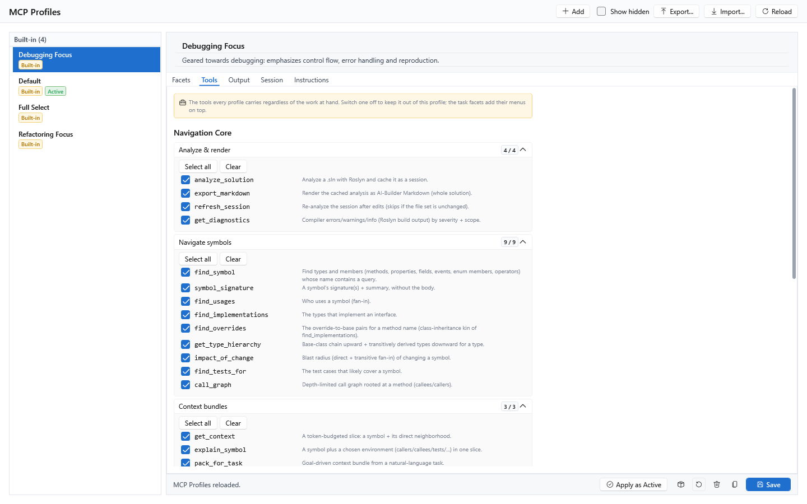
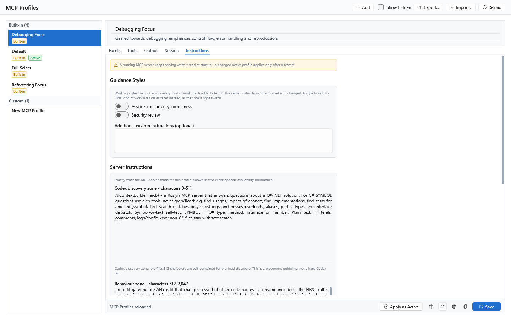

[AICB – MCP Server](README.md) &middot; chapter 4 of 12

# 4 Profiles, pools and facets

An MCP profile is one self-contained MCP working environment. It decides four things:

| Axis | What it controls | Where you set it |
|---|---|---|
| Tools | which tools `tools/list` shows and `tools/call` accepts | `Facets` and `Tools` tabs of the profile editor |
| Instructions | the working style the server sends to the model on connect | `Style` switches on the `Facets` tab, `Instructions` tab |
| Rendering | the context template per kind of work, plus output notation, token budget and overshoot tolerance | template pickers on the `Facets` tab, `Output` tab |
| Session freshness | whether and when the server re-analyzes after your edits | `Session` tab |

Exactly one profile is active, and only the active profile drives the server. The active profile is fixed for the lifetime of a server process — there is no runtime switch tool, and `list_mcp_profiles` is read-only. All profiles live in the config DB, by default `%APPDATA%\AIContextBuilder\user-data\aicb.acb`, which is the same database the GUI uses. A normal `aicb mcp` start resolves that database automatically, so the profile you activated in the GUI applies without any argument; pass `--db-path <db>` to work against a different database.

Four profiles ship with the product; everything else is a custom profile you create, duplicate or fine-tune in the GUI.

## 4.1 Pools: what the server registers and what it delivers

The server registers **82 tools** in **28 tool classes**. Registration is wholesale; what you actually see is the **active pool**, applied on every request by two filters that read the same name source. The active profile behind it is fixed at server start:

- **Listed** — `tools/list` is narrowed to the active pool.
- **Callable** — a call guard refuses every tool the listing hides, with this message:

```
Tool '<name>' is not in the active profile - call list_mcp_profiles to see the profiles and
their tools, then restart the server with 'aicb mcp --mcp-profile <id>' to run under a
different one.
```

`batch` and `measure` apply the same check per sub-query, so a sub-query naming a tool outside the active pool is refused item by item rather than silently executed.

### The three pool states

`list_skills` groups every registered tool into exactly one of three lists. Under the shipped `Default` profile:

| Group | Count | Meaning |
|---|---|---|
| `inPool.core` | 24 | the navigation core exposed by the shipped Default profile; core tools appear in no facet menu |
| `inPool.extras` | 30 | the rest of the active pool |
| `outOfPool` | 28 | registered, but the active pool does not expose it |

The `outOfPool` list mixes three causes, and the way out differs per cause:

1. **18 tools the `Default` profile withholds.** They stay in the lean core and in facet menus, so switching to `Full Select` is enough.
2. **One bundle tool, `compare_public_api`.** It reaches no facet menu at all; it becomes available through the `api-surface` bundle (see "Opt-in bundles") or through `AICB_MCP_TOOLS`.
3. **Nine tools that no facet menu and no bundle names.** Only `AICB_MCP_TOOLS` exposes them — not even `batch`/`measure` can reach them: `import_constellation`, `inspect_session`, `list_constellations`, `list_remembered`, `list_run_templates`, `list_sessions`, `recall_codebase`, `refresh_remembered`, `remember_codebase`. `list_skills` names them in its own `uncatalogued` section and states why: they are session and memory plumbing plus aicb database browsing, not tools about the analyzed solution.

### The navigation core

The core is the profile's starting surface before per-profile exclusions. Its 24 tools, grouped the way the `Tools` tab shows them:

| Group | Tools |
|---|---|
| Analyze & render | `analyze_solution`, `export_markdown`, `refresh_session`, `get_diagnostics` |
| Navigate symbols | `find_symbol`, `symbol_signature`, `find_usages`, `find_implementations`, `find_overrides`, `get_type_hierarchy`, `impact_of_change`, `find_tests_for`, `call_graph` |
| Context bundles | `get_context`, `explain_symbol`, `pack_for_task` |
| Service & discovery | `server_info`, `usage_report`, `batch`, `measure`, `list_mcp_profiles`, `list_skills`, `docs`, `install_agent_hooks` |

The core is never part of a facet menu — the two are added up, not merged, so a facet counter never counts a core tool twice. Every profile composes its tool set as: the core, plus the union of the enabled facets' menus, plus any opt-in bundle tools, minus the core tools you switched off on the `Tools` tab.

### What the `Default` profile withholds

`Default` enables all nine facets but narrows every facet menu by one shared list of 18 tools:

| Tool | Why it is withheld |
|---|---|
| `find_production_dead` | the least reliable of its family; `find_dead_code` stays available |
| `find_structural_twins` | reports similarity, not equivalence |
| `find_by_resource_leak` | low call volume, weak precision |
| `find_by_concurrency_risk` | its signal direction changed repeatedly |
| `check_doc_drift`, `check_pattern_drift`, `confidence_map`, `find_by_code_traits`, `find_by_complexity_and_coverage`, `find_by_returns_semantic`, `find_god_objects`, `lifecycle_of`, `list_insight_producers`, `trace_flow`, `type_dependency_path` | long tail: called too rarely to earn a schema in every prompt |
| `diff_public_contract`, `diff_review`, `semantic_diff` | two-session comparisons: each needs a snapshot booked by an earlier call, so none can be reached in a single exchange with a cold session |

A withheld tool is not a denial. It stays registered, `list_skills` reports it under `outOfPool` as proof that it exists, and a profile switch to `Full Select` — or the `AICB_MCP_TOOLS` override — reaches it.

### Reading the pool

`list_skills` is the authoritative map, not the tool list your agent harness displays. The harness shows only the active pool (54 tools under `Default`) while the registered set is 82; a reference derived from a harness list would lose 28 tools without a warning.

- `list_skills` (or `detail: "lean"`, the default) returns the tool index as bare names in their pool groups, plus the `core`, `facets`, `styles`, `bundles` and `uncatalogued` sections.
- `list_skills(detail: "full")` adds each tool's one-line description. An unknown `detail` value is rejected with the two valid spellings.

## 4.2 The four built-in profiles

| Id | Name | Tools | Shape |
|---|---|---|---|
| `mcp-profile/default` | `Default` | 54 | all nine facets enabled; every facet menu narrowed by the shared 18-tool list; instructions-neutral |
| `mcp-profile/full` | `Full Select` | 72 | all nine facets enabled with their complete menus — the whole lean core |
| `mcp-profile/refactoring-focus` | `Refactoring Focus` | 47 | only the `Refactoring` facet, with a curated menu and its working style switched on |
| `mcp-profile/debugging-focus` | `Debugging Focus` | 43 | only the `Debugging` facet, with a curated menu and its working style switched on |

All four render every facet through the profile-wide `ai-optimized` context template in `YAML` notation, and none of them carries free-text instructions of its own. The two focus profiles send their facet's guidance as standing instructions; `Default` and `Full Select` stay instructions-neutral, so they add nothing to what the server already sends.

`Default` is the everyday pool: 24 core tools plus 30 from the nine facet menus, so every kind of work has its tools available without configuration. It is what an unconfigured server delivers.

`Full Select` is the complete lean core: 24 core plus 48 facet-menu tools. It exists so that the narrowing of `Default` never costs you a tool — one profile switch brings back all 18 withheld ones. Choose it when you want flow tracing (`trace_flow`), the two-session comparisons (`diff_review`, `semantic_diff`, `diff_public_contract`), the confidence map (`confidence_map`), or the refactor-prioritization queries.

`Refactoring Focus` enables the `Refactoring` facet only, curated to 23 non-core tools (plus the 24 core = 47), and sends that facet's guidance as the working style. It keeps structure, diff, smell, refactor-list and dependency-injection tools — including `find_structural_twins`, `find_by_complexity_and_coverage`, `semantic_diff`, `resolve_injection`, `prepare_task`, `solution_metrics`, `find_god_objects`, `find_by_concurrency_risk`, `find_by_resource_leak`, `find_by_event_subscription` and the three markup tools. It drops:

- `list_insight_producers` — a static meta catalogue, not a refactoring step
- `find_by_attribute` — generic attribute search
- `find_by_returns_semantic` — return-role classification
- `find_by_code_traits` — LINQ/reflection/throws audit
- `calls_external` — external-API audit

`Debugging Focus` enables the `Debugging` facet only, curated to 19 non-core tools (plus the core = 43), and sends that facet's guidance as the working style. It keeps the fault-tracing set, among them `trace_flow`, `type_dependency_path`, `lifecycle_of`, `verify_claim`, `review_context`, `find_by_code_traits`, `find_by_side_effects`, `find_by_concurrency_risk`, `find_by_resource_leak`, `describe_api_surface` and `find_by_event_subscription`. It drops the meta catalogue, the generic name searches (`find_by_attribute`, `find_by_returns_semantic`), the audit and refactor lists (`find_dead_code`, `find_production_dead`, `find_god_objects`, `find_by_complexity_and_coverage`, `solution_metrics`, `detect_circular_dependencies`, `calls_external`) and the three database/history-bound snapshot tools (`save_session`, `compare_with_previous`, `diff_public_contract`).

## 4.3 Selecting a profile

### In the GUI

1. Open `MCP Profiles` in the settings tree.
2. Select the profile in the list on the left.
3. Press `Apply as Active` in the footer.

Exactly one profile is active; the `Active` pill in the list marks it. `Save` persists your edits, `Duplicate` (`Ctrl+D`) creates a custom copy as a starting point, `Delete` removes a custom profile permanently and hides a built-in (recoverable with `Restore Built-In`), and `Export as Built-In` shows the profile as a C# snippet (intended for the product's own development; it has no effect on your installation). `Ctrl+N` creates a new profile, `F5` reloads the list.

### At server start (pin)

```
aicb mcp --mcp-profile mcp-profile/full
```

`--mcp-profile <id>` pins the active profile for this server process. The pin is process-local and writes nothing back: a second server process, and the GUI, keep their own active profile. Without the option, the persisted active profile applies. Get the ids from `list_mcp_profiles` or from the profile list in the GUI.

- An unknown id aborts the start, with the valid ids listed on stderr — a typo never silently serves a different profile.
- Hidden profiles are rejected as pin targets. They are not listed, so pinning one would be an invisible configuration.
- The pin needs a config DB. The standard database is used automatically unless you pass `--db-path`.

`list_mcp_profiles` still shows the whole catalogue, with the pinned profile flagged `isActive` — not the one persisted in the database.

### What a running server follows — and what needs a restart

| Change | When it takes effect |
|---|---|
| A facet's template assignment | live, per call |
| Active profile changed in the GUI | at the next server start; until then `server_info` reports it as config drift and asks for a restart |
| Tool set and server instructions of the active profile | at server start — a running server keeps what it read at startup |
| `AICB_MCP_TOOLS` | at server start, resolved once |

Note: the server does not send `tools/list_changed` notifications. A profile change therefore reaches a client's tool list only when the client re-reads it; the server marks its tool list cacheable for 15 minutes with a private cache scope, and that expiry is the only invalidation it offers.

## 4.4 Overriding the tool set

### `AICB_MCP_TOOLS`

This environment variable replaces the profile composition wholesale for the process. It accepts:

| Value | Result |
|---|---|
| `all` | every registered tool — 82 |
| `lean` | the complete lean core — 72, the same set as `Full Select` |
| empty or unset | no environment override; `aicb.mcp.json`, then the active profile (Default: 54), decides |
| a comma-separated list of tool-class names | only the tools of those classes, e.g. `SymbolTools,MemoryTools` |
| `methods:<tool>,<tool>,…` | exactly the named tool functions |

Class names are matched case-insensitively, and unknown names are ignored. If the list matches no class at all, the server falls back to the lean core rather than exposing nothing. Because the override is meant to be an operator decision, the set is resolved once at start and does not move when the active profile changes. A class list *replaces* the profile pool — it is not added to it — so name every class you want.

### `aicb.mcp.json`

The server reads an optional, hand-written config file at `%APPDATA%\AIContextBuilder\aicb.mcp.json` (`<ApplicationData>/AIContextBuilder/aicb.mcp.json` on Linux and macOS). It is read-only for the server: you edit it by hand. All fields are optional.

| Field | Meaning |
|---|---|
| `ToolSpec` | the same tool-set spec `AICB_MCP_TOOLS` accepts |
| `SessionCache.TtlMinutes` | session time-to-live in minutes; default 90 |
| `SessionCache.MaxSessions` | upper bound on concurrently held sessions; default 8 |
| `SessionCache.SweepMinutes` | interval of the background sweep in minutes; default 5 |

A missing file means "no override". A broken file is reported on stderr and the server starts on the defaults instead of failing. Property names are case-insensitive, and comments and trailing commas are tolerated.

### Precedence

```
AICB_MCP_TOOLS  >  aicb.mcp.json  >  the active profile  >  the Default profile's pool
```

When neither the variable nor the file is set, the active profile decides. It is fixed at server start, so an edit in the GUI reaches the server only after a restart (`server_info` reports it as config drift until then). If reading the profile fails (a locked database, for example), the server falls back to the `Default` profile's pool instead of exposing nothing.

A profile begins with the navigation core, but every core tool except `server_info` can be switched off on the `Tools` tab. A heavily narrowed profile can therefore omit `list_mcp_profiles` and `list_skills`; `server_info` is the one core tool that cannot be switched off and carries a lock instead of a checkbox.

## 4.5 The nine facets

A facet is one kind of work. It is the axis that ties together a context template, a tool menu and a working style, and it is a call parameter, never server state: naming a facet in a call never changes `tools/list`. Every facet id is also the name of its render slot, and a call that names a facet receives that facet's guidance back whether or not the profile switched its style on.

| Facet (`id`) | Title | Guidance | `Next:` hints |
|---|---|---|---|
| `general` | General | Balanced context work: navigate, read and verify with a broad, task-neutral selection. | `find_usages`, `get_context`, `get_diagnostics` |
| `exploration` | Exploration | Understand an unfamiliar codebase before changing it: start from the architecture and the public surface, then drill into specific symbols. | `architecture_overview`, `explain_symbol`, `get_context` |
| `refactoring` | Refactoring | Prioritise structural clarity and dependency direction. Prefer minimal, behaviour-preserving edits; surface coupling/cohesion smells before restructuring. | `impact_of_change`, `evaluate_change_set`, `find_structural_twins` |
| `debugging` | Debugging | Trace control and data flow to the fault. Fix the root cause, not the symptom, with the smallest edit, and reason explicitly about reproduction steps. | `trace_flow`, `find_by_side_effects`, `get_diagnostics` |
| `review` | Review | Review a change end-to-end: blast radius, introduced findings and test coverage before it lands. | `review_context`, `diff_review`, `evaluate_change_set` |
| `testing` | Testing | Cover behaviour with focused, deterministic unit tests; find the gaps and pin invariants and edge cases. Keep production code and test code clearly separated. | `find_tests_for`, `coverage_gaps`, `prepare_task` |
| `documentation` | Documentation | Explain intent over mechanics. Keep summaries dense and accurate, and document the non-obvious 'why' against the real API surface. | `describe_api_surface`, `explain_symbol`, `confidence_map` |
| `architecture` | Architecture | Respect Clean/Onion layering: dependencies point inward, and Core/Contracts depend on nothing above them. Surface layer violations, cycles and coupling. | `architecture_overview`, `detect_circular_dependencies`, `resolve_injection` |
| `performance` | Performance | Identify hot paths and complexity hotspots. Avoid unnecessary allocations and LINQ in tight loops, and measure before optimising. | `symbol_metrics`, `find_by_complexity_and_coverage`, `calls_external` |

Each facet has three independent effects:

1. **Context template** — through its render slot (see "Template resolution" below).
2. **Tool menu** — the facet's tools join the profile's tool set when the facet's `Tools` switch is on. Unfolding the facet row lets you fine-tune the individual functions.
3. **Guidance trailer** — when a call names the facet, the answer ends with a block in this form:

```
---
facet:<id> (<Title>): <Guidance>
Next: <tool>, <tool>, <tool>
```

If one of the suggested `Next:` tools is not exposed by the active profile, the block is followed by a note that repeats the unreachable names and names both remedies:

```
Not exposed by this server's active tool profile: <names> - a direct call is refused.
Enable this facet's tool menu in your MCP profile (list_mcp_profiles), or set AICB_MCP_TOOLS.
```

The facet block itself stays byte-identical whether or not the style is switched on. `general` is the one facet whose menu is a hand-picked list of 23 tools rather than a group of tool classes; measured, it contributes no tool the other eight facets do not also carry. It stays for two reasons: it is the menu a "General only" profile shows, and it is the default template slot — a call without a facet resolves to `general`.

### The `facet` call parameter

Three tools accept an optional `facet` parameter: `prepare_task`, `pack_for_task` and `export_markdown`. It is stateless and costs nothing; the legacy spelling `slot` is accepted for it as well. For `prepare_task` and `export_markdown`, a call without a facet uses the profile-wide template and a call with a facet selects that facet's template and adds the guidance block. `pack_for_task` always renders its template-free lean bundle; its facet changes only the appended guidance block.

### Template resolution

Each facet resolves its context template through this chain:

```
populated facet slot  >  the profile-wide template  >  the globally active context template
```

In all four built-in profiles the profile-wide template is `ai-optimized` and every other slot is unset, which the editor shows as `(use profile template)`. On the `general` row the unset sentinel reads `(use active context template)`. A template id that no longer resolves falls back gracefully to the `default` context template instead of failing the render.

Note: because every facet inherits the profile-wide template, structural facets such as `Architecture` and `Review` render without the full dependency graphs that a dedicated structural template would carry. If you want those graphs, assign `refactoring` to the `Architecture` and `Review` rows as a slot override.

## 4.6 Styles and bundles

### Guidance styles

Two working styles cut across every kind of work. Each adds its text to the server instructions and never changes the tool set. They live on the `Instructions` tab.

| Id | Title | Guidance |
|---|---|---|
| `async-correctness` | Async / concurrency correctness | Watch for async pitfalls: sync-over-async (.Result/.Wait()), missing CancellationToken, ConfigureAwait(false) in library code, and unobserved exceptions in async void. |
| `security` | Security review | Check for injection, unvalidated input, secret handling and unsafe deserialization. Prefer least privilege and fail-closed defaults. |

The other six working styles are bound to a single facet and live on that facet's row as its `Style` switch — `Refactoring`, `Debugging`, `Architecture`, `Testing`, `Documentation` and `Performance`.

### Opt-in bundles

A bundle groups tools by project type rather than by kind of work. On the `Tools` tab, `Opt-in Tool Bundles` lists the bundles that are not part of the standard pool. There is one: `Public API compatibility` (`api-surface`), whose tool is `compare_public_api`. Enabling it adds its tools on top of the facet menus, and it works on every composition path, including a profile with no facet selection at all. `AICB_MCP_TOOLS`, if set, overrides the whole composition.

The remaining bundles (`Quality & smells`, `Architecture & structure`, `Change impact & refactoring`, `Tests & coverage`, `UI / XAML markup`) are a legacy discovery grouping. Their tools are all reachable through the navigation core or a facet menu, and their ids have no effect as opt-in entries. `list_skills` therefore shows only the opt-in bundles in its `bundles` section.

## 4.7 The profile editor

The `MCP Profiles` panel is a master-detail editor: the profile list on the left, the selected profile on the right, with five tabs — `Facets`, `Tools`, `Output`, `Session` and `Instructions`. The header edits the profile's name and description. The footer carries the actions described under "In the GUI".


### The `Facets` tab

`Task Facets` shows one row per facet, each with two switches, a template picker, a counter and an unfoldable function list:

- `Tools` — adds the facet's tool menu to this profile's `tools/list`. Unfold the row to check or uncheck individual functions.
- `Style` — adds the facet's working style to the server instructions. It is independent of the tools switch and never adds or removes a tool.
- **Template picker** — the context template for this facet. The `general` row sets the profile-wide template (marked with a `Profile template` pill) and reads `(use active context template)` when unset; the other eight rows are exceptions to it and read `(use profile template)` when unset.
- **Counter** — checked versus available tools on the facet's menu, for example `12 / 14`. While `Tools` is off, the counter names the menu size alone, because the facet contributes none of them. The navigation core is never part of this count.
- **Function list** — one checkbox per tool with its description, plus chips naming the tool classes that feed the menu and the other facets that also carry the tool. When your selection deviates from the catalog default, an `Overridden` pill appears next to `Reset to catalog default`.

Each switch governs its own effect alone: a facet can send its working style with its tool menu switched off, and the template needs neither.

### The `Tools` tab

`Navigation Core` lists the core tools in four groups (`Analyze & render`, `Navigate symbols`, `Context bundles`, `Service & discovery`), one checkbox per tool. Unchecking a tool removes it from this profile; `Select all` and `Clear` work per group. `server_info` has no checkbox — it is locked, so a mis-curated profile can always be diagnosed from the client side. The counter next to a group reads "exposed / total" and turns into a warning color while something in the group is switched off.

At five or fewer effective tools the panel shows a warning naming the actual count; the profile still composes, it is simply not worth connecting to.

`Opt-in Tool Bundles` follows, then `Effective tools/list`: the exact tool functions this profile exposes to the server on connect, as a read-only list. It is what the two sections above add up to.



### The `Output` tab

| Setting | Values | Notes |
|---|---|---|
| `Notation` | `Tag` or `YAML (default)` | inner notation of the MCP render (`export_markdown`, `prepare_task`); an explicit `format=` argument on the call wins over the profile default; the `.md` file name is unchanged |
| `Max output tokens` | integer, empty = inherit | floored at 8000; when set it wins over the template budget; precedence: explicit call parameter > MCP profile > template > global |
| `Max overshoot over budget (%)` | integer 0–1000, empty = inherit | how far the template render may exceed the budget before over-budget selected types are dropped; `0` is a hard cap, a large value effectively never drops a selected type; empty inherits the active pipeline profile's percentage |

The token budget and the overshoot tolerance affect the MCP render path only; GUI and CLI exports are unaffected. The token-budgeted single-symbol tools (`get_context`, `pack_for_task`, `explain_symbol`) keep their own transport cap and ignore the overshoot percentage.


### The `Session` tab

`Automatic Refresh` decides how the server keeps its analysis in step with the code on disk. All three modes disclose drift — a stale answer carries a note saying how old its graph is; the modes differ in who repairs it.

| Mode | Behavior | Cost |
|---|---|---|
| `Off` | no automatic re-analysis; a drifted session is reported and left alone, and the agent repairs it by calling `refresh_session` | nothing — and it fixes nothing |
| `Reactive` | repair when asked: the drift is noticed as a tool is about to answer, the re-analysis runs first, and the answer comes from the current graph | the caller waits for the re-analysis |
| `Proactive` | repair ahead of the question: a file watcher starts the re-analysis once saving has gone quiet, so the next call usually finds a current graph | the work moves into the background and there is measurably more of it — roughly ten times as many runs, about a third of them never asked about; choose it on a machine with CPU to spare |

All four built-in profiles, and every newly created custom profile, start on `Reactive`. The setting is read once at server start; a change takes effect after restarting the server, and `server_info` reports the pending change. The `AICB_MCP_AUTO_REFRESH` environment variable overrides the mode for a single process. It accepts `off` (also `0`, `false`, `no`), `reactive`, and `proactive` (also `1`, `on`, `true`, `yes`); an unrecognized value is ignored, so a typo cannot switch a mode on.

The `Scope` note on the tab summarizes this: the setting applies to the server started with this profile active, and the environment variable overrides it for one session. See "Sessions and staleness" for the full behavior of the freshness modes.


### The `Instructions` tab

`Guidance Styles` carries the two cross-cutting styles as switches. `Additional custom instructions (optional)` is a free-text box appended after the facet guidance and the checked styles; write only what they do not already say, because a guidance text and a re-worded copy of it both reach the model — only exact duplicates are collapsed.

`Server Instructions` is a read-only preview of exactly what the server sends for this profile, split into three zones:

- `Codex discovery zone - characters 0-511` — self-contained identity and the C# symbol-versus-text switch for Codex before deferred tool loading.
- `Behaviour zone - characters 512-2,047` — the remaining behavior-changing rules and the profile working style inside Claude Code's measured prompt prefix.
- `Post-prefix reference zone - from character 2,048` — reference and discovery material outside that prefix; it is still transported by the server and available to Codex after tool loading.

A delivery cut mark appears when the text runs past the prefix, and the working style is shown on its own as well. The tab also counts how many of the tools the delivered text names this profile actually exposes, and names any that it withholds. None of this is a transport limit: switching on more guidance can push the later blocks past the client's prefix, and the order they compose in decides which ones arrive — facets first in catalog order, then the cross-cutting styles, then the free text.



### Saving, restoring and the built-in freeze

`Save` (`Ctrl+S`) persists the editor's state to the database. Saving a built-in profile marks its row as overridden, and from that moment the built-in seed leaves the row alone.

Note: this has a lasting effect on `Default`. Its nine facet menus are stored as explicit lists derived from the 18-tool drop list, so the moment you press `Save` on `Default`, today's 54 tool names are frozen into that row and a tool catalogued into a facet by a later version no longer joins it. If you want the shipped default to keep growing with the product, do not save it. `Restore Built-In` clears the override and writes the current code default back; `Duplicate` leaves the built-in untouched and creates a custom copy you can edit freely.

## 4.8 Step-by-step

### Switch to the complete tool set

1. Start the server with the pin: `aicb mcp --mcp-profile mcp-profile/full`, or open `MCP Profiles`, select `Full Select` and press `Apply as Active`.
2. Restart the client so it re-reads the tool list and the instructions.
3. Verify with `list_skills`: `inPool.core` plus `inPool.extras` should now total 72, and the 18 withheld tools should appear under `inPool.extras`.

### Create a custom profile

1. Open `MCP Profiles` and press `Ctrl+N` (or select an existing profile and press `Ctrl+D` to start from a copy).
2. Give it a name and description.
3. On the `Facets` tab, switch on the kinds of work you want; unfold a facet to fine-tune its individual tools, and pick a context template per facet if the profile-wide one does not fit.
4. On the `Tools` tab, switch off any core tools you do not want, and enable the `Public API compatibility` bundle if you need `compare_public_api`.
5. On the `Output` tab, choose the notation and, if you need one, a token budget.
6. On the `Session` tab, choose the automatic refresh mode.
7. On the `Instructions` tab, switch on working styles and add free text if needed.
8. Press `Save`, then `Apply as Active`, then restart the server and reconnect the client.
9. Verify with `list_mcp_profiles` — your profile should be flagged `isActive` — and with `list_skills` for the effective pool.

---

[&larr; 3 Sessions and staleness](03-sessions-and-staleness.md) &middot; [Contents](README.md) &middot; [5 Calling tools: conventions, batch and aicb call &rarr;](05-calling-tools-conventions-batch-and-aicb-call.md)
