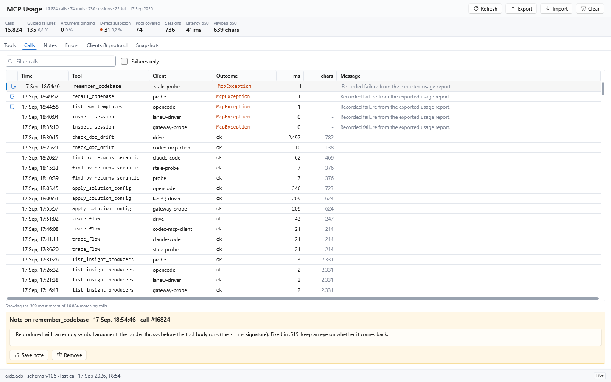
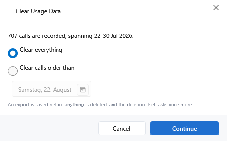

[AICB – MCP Server](README.md) &middot; chapter 11 of 12

# 11 Configuration, drift and usage recording

This chapter covers the surfaces that surround the MCP tools: how an `aicb mcp` process is configured, how you find out whether the running server still matches that configuration, what the server records about the calls it serves, and how to read or delete that record. It closes with the two surfaces a client can use besides `tools/call`: the agent-wiring tool and the MCP resources.

## 11.1 Server configuration

An MCP server process takes its settings from three sources, in this order of precedence:

**built-in defaults < `aicb.mcp.json` < environment variables**

The cascade applies to both configurable axes: which tools the server exposes, and how long it keeps analyzed solutions in memory.

### The configuration file `aicb.mcp.json`

The file lives in your user configuration directory: `<ApplicationData>/AIContextBuilder/aicb.mcp.json` - on Windows that is `%APPDATA%\AIContextBuilder\aicb.mcp.json`. It is optional and **read-only for the server**: you edit it by hand, and the server never writes it.

```json
{
  "toolSpec": "lean",
  "sessionCache": { "ttlMinutes": 90, "maxSessions": 8, "sweepMinutes": 5 }
}
```

| Field | Values | Default | Effect |
|---|---|---|---|
| `toolSpec` | `"lean"`, `"all"`, or a comma-separated list of tool-group names | not set - the active profile's pool applies | Which tools the server exposes |
| `sessionCache.ttlMinutes` | positive integer | `90` | Session lifetime in minutes, counted from the last access |
| `sessionCache.maxSessions` | positive integer | `8` | Maximum number of analyzed solutions held at the same time |
| `sessionCache.sweepMinutes` | positive integer | `5` | Interval of the background sweep that frees idle sessions, in minutes |

The session cache holds the analyzed solutions a server process has opened. Each held session pins an MSBuild workspace and the analyzed graph, so the cache is memory-intensive: at `maxSessions` the least recently used session is evicted, and the background sweep releases sessions that have expired even when no tool is called.

About the file's behavior:

- **Unset fields keep their default.** An invalid or non-positive value is ignored, and the field stays at its default.
- The file is hand-written-friendly: keys are case-insensitive, and both comments and trailing commas are tolerated.
- **Missing, unreadable or broken means "no override".** The server then starts on the built-in defaults and writes a warning to its error stream. That warning is the only difference between a broken file and an absent one, so if you believe the file is in effect but nothing changes, check the server log of your client - a file the server could not parse looks exactly like a file that is not there.

The `toolSpec` values in detail:

| Value | Meaning |
|---|---|
| `"lean"` | The complete 72-tool lean core, the same set as `Full Select` |
| `"all"` | Every tool this binary registers, including the long-tail tools that no built-in profile routes to |
| comma-separated tool-group names | Only the tools of the named groups, for example `DbEntityTools,MemoryTools` |

An explicit spec - from the file or from `AICB_MCP_TOOLS` - makes the exposed set **static**: it no longer follows the active MCP profile. Without an explicit spec, the active profile is resolved when the server starts; profile edits require a restart.

A `methods:`-prefixed, comma-separated list of tool function names (for example `methods:find_usages,get_context`) is also accepted by the same setting, if you want to select individual tools rather than whole groups.

### Environment variables

Every environment variable the MCP server reads, with its default:

| Variable | Default | Effect |
|---|---|---|
| `AICB_MCP_TOOLS` | - | Tool-set spec: `all`, `lean`, or a comma-separated list of tool-group names. Overrides `toolSpec` from the file and makes the exposed set static |
| `AICB_MCP_SESSION` | - | Session cache as a comma-separated `key=value` list, for example `maxSessions=4,ttlMinutes=120`. Keys: `ttlMinutes`, `maxSessions`, `sweepMinutes` |
| `AICB_MCP_AUTO_REFRESH` | the active profile's mode (built-in profiles: `reactive`; without a config DB: `off`) | `off`, `reactive` or `proactive`; overrides the profile's mode for this process only |
| `AICB_MCP_DEBOUNCE_MS` | `15000` | Quiet window of the file watcher, in milliseconds |
| `AICB_MCP_STALENESS_WINDOW_MS` | `5000` | Throttle window of the staleness check, in milliseconds |
| `AICB_MCP_LOAD_WAIT_MS` | `45000` | How long a tool call waits at the load gate before it is told what is currently loading, in milliseconds |
| `AICB_MCP_ERROR_TEXT` | on | `off` records only the exception **type**, no message (see "Privacy and what leaves your machine") |
| `AICB_DESIGN_TIME_BUILD_CACHE` | on at `%LOCALAPPDATA%\AIContextBuilder\design-time-build-cache` | `0`, `off` or `false` disables the persisted design-time-build cache; an absolute path relocates it |
| `AICB_ANALYZE_PROFILE_PATH` | - | A path arms the opt-in analysis wall-clock profiler and selects its report file |
| `AICB_ANALYZE_PROFILE_BIND_FIRST` | off | With the profiler armed, `1`, `true`, `yes` or `y` forces full semantic binding before the document loop |
| `AICB_ANALYZE_PREFETCH_DEPTH` | half the logical processors, clamped to 1–16 | Non-negative number of compilation builds to keep ahead; `0` disables prefetch and values above 16 are capped |
| `AICB_ANALYZE_NULLABLE_FLOW` | off | `1`, `true`, `yes` or `y` retains nullable-flow analysis in semantic models |

Details that matter in practice:

- **`AICB_MCP_SESSION`** accepts the three keys above in any order; an unknown key or a non-positive value is ignored and the corresponding field keeps its current value (the file's value if set, otherwise the default).
- **`AICB_MCP_AUTO_REFRESH`** also accepts the spellings `0`, `false`, `no` for `off` and `1`, `on`, `true`, `yes` for `proactive`. An unrecognized value is ignored rather than treated as `off`, so a typo can neither switch the mode on nor silently undo a configured mode. The modes are: `off` only discloses a drifted session in the answer; `reactive` repairs it before the tool answers; `proactive` additionally watches the solution folder for file changes. The mode is read once at server start.
- The three timing variables are positive integers in milliseconds. Zero, negative and unparsable values fall back to the built-in value; there is no upper bound. A zero debounce or a zero throttle would fire work on every keystroke or every call, which is why zero is refused rather than honored.
- Environment variables are per process: set them where your client launches the server, not in a shell you use for something else.

### Starting the server with a specific database or profile

```sh
aicb mcp --db-path "D:\work\aicb.acb"
aicb mcp --mcp-profile mcp-profile/full
```

- `--db-path` names the configuration database for this process. An explicit path may name any existing SQLite file regardless of extension (empty paths and directories are rejected). Only the application-resolved standard database path is subject to the `.acb` extension check.
- Without `--db-path`, the server resolves the standard configuration database (the same one the desktop application uses, see below) and creates it on first start. If that resolution fails, the server starts **without a database** and says so on its error stream.
- `--mcp-profile` pins which MCP profile this process serves, for this process only. If the pin cannot be applied - no config DB, unknown id, failed migration - the server **refuses to start** instead of silently serving a different profile.

### Which database the server uses

The server has one process-wide default database, resolved once at startup:

**explicit `dbPath` argument > process default > no database**

The process default is the DB given with `--db-path`, or the standard configuration database: `%APPDATA%\AIContextBuilder\user-data\aicb.acb`. The `dbPath` parameter of the following tools is optional; when you omit it, the process default applies:

`analyze_solution`, `list_insights`, `get_insight`, `solution_metrics`, `evaluate_change_set`, `diff_review`, `save_session`, `compare_with_previous`, `diff_public_contract`, `solution_config_status`, `apply_solution_config`, `check_solution_config_drift`, `list_run_templates`, `list_constellations`.

`semantic_diff` and `init_solution_config` declare no `dbPath` parameter. `import_constellation` requires an explicit target `dbPath`; it never falls back to the process default.

This is what makes the desktop application's settings apply automatically when an agent works on the same solution: the per-solution namespace exclusions, test detection and layer profile, the active quality profile, and your custom entities are all read from the same database, with no path to pass.

A server without a usable database is not broken, but it is **profile-blind**: it falls back to the built-in default profile's pool, and tools that genuinely need a database answer with `dbPath is required (...)` naming what the path was for. `usage_report` answers `available: false` in that state.

### The per-solution sidecar

Alongside the database, a solution can carry its own configuration as a git-tracked file next to the `.sln`: `<SolutionName>.aicb.json`. Of the guided setup tools, only `apply_solution_config` persists the proposed configuration into the database and sidecar; `solution_config_status` reads status (while ensuring the solution record exists) and `init_solution_config` only gathers proposal material. `apply_solution_config` returns the written path as `sidecarPath`; commit it to version the portable configuration. The file can contain all three profile definitions, but not every headless resolution path consumes every axis from it.

For the MCP analysis itself, resolution is per axis:

| Axis | MCP analysis resolution |
|---|---|
| Layer profile | explicit profile argument where offered > database (per-solution, then global) > sidecar > role-based heuristic |
| Namespace exclusions | database, as soon as a usable database exists > sidecar > none |
| Test profile | database (per-solution, then global) > built-in default; the sidecar's test definition is not in this chain |
| Analysis scope | sidecar |
| Suppressions | not part of the semantic analysis configuration; suppression-aware reading tools combine their documented database and sidecar sources |
| Auto-init flags | reported as setup state where applicable, not evaluated by headless analysis |

A repository with only a sidecar can therefore supply layer rules, exclusions and analysis scope to a database-free headless analysis, but it is not accurate to call every axis fully configured from that file alone.

`solution_config_status` reports, per axis, which source is currently active: `db`, `sidecar` or `none`.

Note: a session keeps the configuration it was analyzed with. `refresh_session` re-analyzes the source with that same configuration - it deliberately does not re-read the sidecar, because a silent configuration switch under an unchanged session id would be invisible. If you have edited the sidecar and want the new values to apply, call `analyze_solution` again (or restart the server or wait for the cached session to expire). Passing the same `.sln` path to another tool reuses a non-expired cached session and does not re-read the sidecar.

### What the desktop application writes and what the server reads

| Setting | Stored in | When the MCP server reads it |
|---|---|---|
| Per-solution configuration (layer, exclusions, test detection) | config DB and the git-tracked `.aicb.json` sidecar | at analysis time, according to the per-axis matrix above; layer/exclusion sidecar fallback needs no `dbPath`, while headless test detection does not consume the sidecar test axis |
| Active MCP profile (tools, instructions, token budget) | config DB | once at server start: tool list, callability, instructions and auto-refresh mode |
| Session cache (TTL, max sessions, sweep) | `aicb.mcp.json` / `AICB_MCP_SESSION` only - there is no editor in the desktop application | at server start |
| Tool-set spec (`lean` / `all` / list) | `aicb.mcp.json` / `AICB_MCP_TOOLS` only | at server start (static once set) |
| Token budget of the active profile | config DB | per call, by every tool that renders a document |
| LLM settings (model profiles, retry) | config DB | not at all - the MCP server makes no LLM calls |

Worth knowing: an edit to the active profile in the desktop application does not reach a running server - neither its tool list nor its instructions (sent once when the client connected) nor its auto-refresh mode (fixed at start). `server_info` reports that state as CONFIG DRIFT until you restart the server - see the next section.

## 11.2 Telling whether the server still matches your configuration

`server_info` is more than a reachability check. It answers the question an MCP client otherwise cannot ask: *does this answer describe my current state?* It needs no session, so it is safe to call at any time.

The answer is assembled from four parts:

```text
aicb MCP server (AIContextBuilder) v<version> (commit <sha>) - Roslyn-based .NET context generator. (c) Gregor Dadera - free for individuals and small organizations; see LICENSE.txt for the thresholds.
Config DB schema: user_version=<n> (<path to the config DB>).
<analyzer drift line>

<version drift block>

⚠️ CONFIG DRIFT: <message>
```

- The **version** is followed immediately by the **build commit**. That placement is deliberate: the failure it exists for is a version number that reads correctly while the binary is not the one you think. A version number can be identical across two different builds - a parallel build that packed the same number first wins, and a package update then skips the newer one as "already installed". The commit is the only field that shows this; compare it with `git rev-parse HEAD` of your checkout. A build without a resolvable revision omits the commit rather than guessing.
- The **Config DB schema** line is the `user_version` of the resolved configuration database, read directly. It is omitted when no database is resolved or the database is unreadable.
- The **analyzer drift** line follows immediately, because it qualifies the commit printed above.
- The **version drift block** and the **CONFIG DRIFT** line are only present when something is wrong.

### CONFIG DRIFT

The probe compares a fingerprint of what the server hands your harness - the composed instruction suffix, the effective tool-set spec, and the session auto-refresh mode - as captured at server start against a fresh read of the active profile. A change that does not alter what the harness receives (a profile name, or switching to a profile that composes an identical configuration) does not fire.

When it fires, the message is:

```text
⚠️ CONFIG DRIFT: the active MCP profile changed since this server started - restart/reconnect the aicb MCP server to load the current configuration (tools, instructions, session auto-refresh mode). In-session the skill-derived instructions never refresh, the auto-refresh mode is fixed at start, and a GUI edit does not update the tool list until restart.
```

The server also writes this message once to its error stream the first time it observes the drift. **What to do:** restart or reconnect the client. The protocol has no "instructions changed" notification, so the instructions a client received at the handshake cannot be replaced while the connection lives; the client's tool list is cached too, and no list-changed notification is sent.

### VERSION DRIFT

This probe compares the binary against the configuration database and reports two independent findings:

- **Schema drift.** The database schema is newer than the highest migration this binary knows: a newer build migrated the database, and this binary lags it - rebuild or reinstall the standalone tool. The opposite case is reported as a pending migration: the database is older than this binary's migrations, and running the application, the GUI or a `--db-path` start migrates it.
- **Tool pool drift.** The active profile persists tool names this binary does not register. The message names up to ten of them (quoted, with `and N more` beyond that), because two causes look identical and their fixes are opposite:
  - the profile was written by a **newer build** - rebuild or reinstall the standalone tool;
  - the tool was **retired** and the profile still names it - re-save the profile in the GUI's `MCP Profiles` panel, which rewrites the selection without it. A rebuild would only repeat the message.

  The stale entry is inert either way: an unknown name is ignored when the tool set is resolved.

Detection is on **tool-name level**. A new parameter added to an existing tool is not detected by this check - the build commit is the finer-grained signal for that. The version drift block is output-only, so it appears without reconnecting.

### ANALYZER DRIFT

The third probe answers the axis the other two cannot see: this binary's build commit against the HEAD of the repository that holds the solution you asked it to analyze. A fact producer that got smarter since this build shows up here even though tool names and source files are unchanged. The probe reports all four outcomes, not only the bad one:

| Report | Meaning | What to do |
|---|---|---|
| `Analyzer: IN SYNC with the analyzed repo` | The binary was built from the current HEAD | Nothing - this is a proof of currency |
| `Analyzer: this binary is N commits AHEAD of the analyzed repo's HEAD` | Built from work the repository does not have yet; the analyzer is newer, not older | Nothing |
| `Analyzer: this binary was built from a commit N commits BEHIND ... but NOT ONE of the commits behind touches an analyzer project` | The binary is behind, but the analyzer's own code is unchanged across that distance | Nothing - the gap is no reason to rebuild |
| `⚠️ ANALYZER DRIFT: ... N of them touch an analyzer project` | The analyzer's code moved since this build; facts it produces - fan-in, dead code, side effects - may be the older analyzer's, including a zero that the newer one fills | Rebuild or reinstall the standalone tool |

If the distance cannot be characterized - for example the second measurement failed - the warning is kept without the qualifier, so a distance that cannot be judged stays as loud as before. The probe is silent when there is no analyzed session, when a repository does not know this build commit (any foreign solution), and whenever the binary carries no commit id. Public installer, ZIP and dotnet-tool release builds deliberately omit that id, so analyzer-drift output is unavailable there.

The measurement is a local, read-only `git rev-list --count` query in the solution's directory, with a two-second ceiling and fail-open behavior on any error. It probes at most four distinct solution directories and stops at the first repository that can resolve the commit.

Besides these three drift signals, every session-bound answer carries a **staleness** note when source files changed after the analysis - that is a different signal with a different remedy; see "Sessions and staleness".

## 11.3 What the server records about tool calls

The server records one row per tool invocation into the local configuration database. The purpose is to improve the tool surface on measured usage rather than on assumptions; the recording is deliberately limited to shapes and contains no code.

### The recorded row

| Field | Content |
|---|---|
| Timestamp | UTC time of the call |
| Tool name | The tool that was called, `(unknown)` when it could not be determined |
| Session reference | **12 hexadecimal characters** from a SHA-256 hash of the session reference - never the raw path or id |
| Success / error | Whether the call succeeded, and whether it failed |
| Error class | The exception **type** name |
| Result size | The summed length of the text blocks of the answer; empty when the answer carried no text |
| Duration | Latency in milliseconds |
| Client name / version | Taken from the protocol, as the client identified itself at connect time |
| Server version | The version of the server that served the call |
| Protocol version | The negotiated protocol revision |
| Alias applied | Set when the server accepted an alternative parameter name in place of the tool's real one |
| Facet | The resolved facet id the call addressed, or `(unresolved)` for a spelling the catalog does not know; empty when no facet was given |
| Error message | The failing exception's own message - the one free-text field (see below) |
| Child calls | For a `batch` or `measure` call: a per-tool tally of what it dispatched, for example `{"find_usages":{"n":3,"e":0}}` |
| Solution size | The number of projects and files of the solution the call was answered against; empty when the call resolved no session |

What is **not** recorded: argument values, source code, file paths, and the content of any answer. The session reference is only read in order to be hashed; a `facet` value is only read in order to be mapped to a fixed catalog id.

The row is written for **every** call on the `tools/call` pipeline, including calls the active profile refuses. A refused call is a curation signal, not noise, so it is recorded like any other.

Recording is **fail-open in both directions**: a telemetry defect can never break a tool call. On the error path the row is written first and the error is then re-thrown - the recording never swallows a tool error.

### Where the data lives

The rows go into the `tool_calls` table of the configuration database - the same file the desktop application uses, at `%APPDATA%\AIContextBuilder\user-data\aicb.acb` unless `--db-path` says otherwise. The table carries an index on the tool name and one on the timestamp.

For ad-hoc queries, the columns are: `id`, `ts`, `tool_name`, `session_hash`, `ok`, `is_error`, `error_class`, `result_chars`, `duration_ms`, `client`, `server_ver`, `protocol_version`, `client_name`, `client_version`, `alias_applied`, `facet`, `error_message`, `child_calls`, `solution_projects`, `solution_files`. The legacy `client` column is no longer written - the protocol identity replaces it.

A server **without** a usable database records nothing at all: it gets a no-op sink, no file is created, and `usage_report` answers `available: false` with a note.

### Reading the record: `usage_report`

`usage_report` reports the server-side telemetry of every `tools/call` invocation - cross-client, not just this client's transcript.

| Parameter | Default | Meaning |
|---|---|---|
| `topTools` | `30` | Cap on the per-tool breakdown, ranked by call count. Clamped to 1..200 |
| `sinceDays` | not set | Only count calls from the last N days. Clamped to 1..3650; without it the whole log is read |

The answer contains overall totals (total calls, error count and rate, distinct tools and sessions, first and last timestamp, the clients and server versions seen) and a per-tool breakdown ranked by call count:

| Field | Meaning |
|---|---|
| `calls`, `errors`, `errorRatePct` | Call count, error count and error rate of the tool |
| `avgDurationMs`, `p50DurationMs`, `p90DurationMs`, `maxDurationMs` | Latency distribution. The percentiles are nearest-rank; they are the honest read for a right-skewed distribution that a single slow call drags upward |
| `avgResultChars`, `p50ResultChars`, `p90ResultChars`, `maxResultChars` | Response size distribution in characters |
| `errorClasses` | Histogram of the exception types behind the errors. A guided `McpException` is a failure the tool raised on purpose (an expired session, an unknown token); any other type is a defect suspicion |
| `argumentBindingErrors` | The subset of errors where the caller named an argument the tool does not have - the call never reached the tool. Neither a defect nor a refusal; a value here means the argument surface confused somebody |
| `aliasApplied` | How often the tool was called with a parameter's accepted alias instead of its real name, i.e. how often the server silently corrected the caller |
| `poolCoverage` | How much of the active tool pool this traffic covers: `poolSize`, `poolToolsFired`, the named `poolToolsNeverCalled`, plus `outOfPoolCallsIncluded` and `outOfPoolTools` |
| `protocolVersions` | Share of calls per protocol revision, with `preInstrumentationCalls` for rows recorded before the instrumentation existed |
| `clientEras` | Cross-tab of protocol revision against client name and version, with `clientEraGroupsTotal` and `clientErasTruncated` when the list is capped |
| `facets` | How often each facet was addressed; omitted until a call has addressed one |
| `subQueries` | The per-tool tally of sub-queries dispatched through `batch` (see below); uncapped |
| `windowSinceIso` | The cutoff actually applied when `sinceDays` was given, so an empty window is never mistaken for an empty table |
| `recordedVia` | The scope of every figure in the answer |

**Read the scope before the numbers.** It is repeated in the `recordedVia` field of the answer because a client caches the tool description until it reconnects:

- The recording sits on the **`tools/call` pipeline only**.
- A sub-query inside `batch` or `measure` does **not** get a row of its own; a recent-enough parent row carries the per-tool tally instead, reported under `subQueries`. Two boundaries of that block: a `measure` sub-query is left out (it runs the tool fully, but the caller consumes the size of the answer, not the answer), and a sub-query naming a tool the dispatch registry does not know is counted under the single literal `(unknown)` - a typo cannot grow the key space.
- A one-shot `aicb call` invocation records nothing at all.

So **every count is a lower bound**, and a tool reported at 0 was "not called through this door" rather than "not called". Read pool coverage from `poolCoverage`, not from `distinctTools`: the latter counts every tool that was called, including ones outside the current pool, so holding it against the pool size overstates coverage. A name in `poolToolsNeverCalled` carries its own note: it was never called *top-level*, and the list does not subtract the `subQueries` - a tool can appear in both.

`usage_report` is **not available inside `batch` or `measure`**. It is a read-only tool, but it is deliberately not part of the dispatch registry those two serve.

When there is nothing to report, the answer says which case applies: `available: false` with a note when the server is running without a database or the table is not readable; `available: true` with "No tool calls recorded yet." when the table is empty.

### The MCP Usage panel in the desktop application

The desktop application shows the same data under `MCP Usage`. The `Tools` tab is the aggregate: one row per recorded tool with its call count, the `Batch` sub-query count, guided refusals and suspected defects kept apart, the p50/p90 latency and response size, and an `Alias` count.


The `Calls` tab is the raw log under the aggregates: one row per recorded call with time, tool, client, outcome, duration, response size and the captured message. It is also the only region whose rows carry an id, which is what the `Notes` tab refers to - a note you write on a call points the log at it.



The `Errors` tab separates guided refusals from suspected defects. It has three groups: **Guided**, **Defect**, and **Binding**. Binding failures are a separately displayed subset counted out of Defect: the caller named an argument the tool does not have, so the call never reached it. Each group shows tool, exception type, client, count, when it was last seen, and the server version it was last seen in.


`Export` writes the current report as JSON. The file carries exactly what the `usage_report` tool returns - the same serializer produces both, only the file form is indented because a person opens it - so a report can travel between machines and be imported again. `Import` adds an exported report as a named snapshot beside the live data; imported sets are never merged into the live numbers. `Refresh` (or `F5`) reloads from the database.

### Deleting recorded data

Deleting telemetry is a desktop-application action, deliberately: the MCP server is read-only by contract and exposes no delete verb, and there is no CLI verb for it either. In a headless setup the only way to remove the data is to replace the database file.

In the application, `Clear` on the `MCP Usage` panel runs this sequence:

1. A scope dialog asks what should be deleted - everything, or calls older than a date.
2. An **export is forced**: you choose a file, and if you cancel the file dialog the whole deletion is cancelled. Nothing is deleted before a report has been written.
3. A destructive confirmation names how many calls will be deleted, the export file name, and the notes that are lost with them.
4. The calls are deleted and the panel reloads.




Notes die with their calls: a note is attached to one recorded call, and deleting calls deletes their notes. The export contains the aggregate and therefore **not** the notes - the confirmation says so when any are affected.

### Privacy and what leaves your machine

The recording is built to be safe even if the database is shared or public:

| Measure | Effect |
|---|---|
| The session reference is hashed | SHA-256 over the UTF-8 value, first six bytes - 12 hexadecimal characters. The raw `.sln` path or session id never reaches the database |
| The facet is normalized | Stored as a resolved catalog id or the one literal `(unresolved)`, never as the caller's free text |
| The sub-query keys are bounded | Only names the dispatch registry knows; everything else falls back to `(unknown)` |
| The error message is the only free-text field | Capped at **500 characters including the truncation marker** `…`, enforced twice - when the row is shaped and again at the write boundary. A whitespace-only message becomes empty, which is deliberately different from an empty string |
| Only the outermost exception message | Never an inner one; an aggregated chain would blow past any cap and bury the actionable sentence |
| `AICB_MCP_ERROR_TEXT=off` | Records only the exception **type** - the pre-message contract, intended for a database that is shared rather than local. Case-insensitive, and read per call, so it can be flipped without restarting the server |
| No sink without a database | A server without a usable configuration database writes nothing |

The child-call tally is not capped; its bound is the 16 sub-queries a `batch` call may carry.

**There is no environment variable and no setting that turns the recording off.** The only state in which nothing is recorded is a server running without a usable configuration database - which also costs you the profile-aware behavior, the stored per-solution configuration and the report itself. `AICB_MCP_TELEMETRY` is not read by the MCP server and has no effect on this recording.

What leaves your machine: **nothing**. The server registers the stdio transport only - there is no HTTP or SSE transport - and it references no analytics, crash-reporting or HTTP package. Its four outputs are the stdio JSON-RPC channel back to the client that made the call, diagnostics on the error stream, local SQLite writes, and a local read-only `git` query for the analyzer drift probe (see above). There is no telemetry upload, no analytics endpoint, and no configuration that could enable one: the capability is not in the assembly.

Note: this describes the aicb server itself, as shipped. The Model Context Protocol package it uses is a third-party dependency and is not audited here.

## 11.4 Installing the symbol guard into your agent harness: `install_agent_hooks`

`install_agent_hooks` is the one MCP tool that writes into the configuration of the **calling harness**. It installs the symbol guard, which refuses a C# symbol question aimed at a text search and redirects the caller to the tool that answers it properly.

It is part of the navigation core in every profile, and that is deliberate: the session hint that offers this tool reaches every client, so a tool the default profile could not call would be an offer that fails when accepted.

Because it writes, it is **not** reachable through `batch` or `measure`: a call you believe is a read can never perform an installation.

| Parameter | Required | Meaning |
|---|---|---|
| `sessionId` | yes | A session id, or the absolute path of a `.sln`, `.slnx` or `.slnf` file (self-init) |
| `harness` | no | `claude-code`, `codex` or `opencode`. Omit it to install for the harness the calling MCP client belongs to |
| `force` | no, default `false` | Overwrite an existing guard script and rewrite an existing wiring entry |

What is installed per harness:

| Harness | Files written | Wiring file | Merge |
|---|---|---|---|
| `claude-code` | `.claude/hooks/aicb-symbol-guard.mjs` | `.claude/settings.json` | Hook list entry with matcher `Grep\|Bash\|Edit\|Write\|MultiEdit\|Read`; the command uses `$CLAUDE_PROJECT_DIR` |
| `codex` | `.codex/hooks/aicb-symbol-guard.mjs` | `.codex/hooks.json` | Hook list entry with matcher `Bash\|apply_patch`; the command uses an **absolute** path (Codex has no project-directory variable, so it becomes invalid if the checkout moves) |
| `opencode` | `.opencode/plugins/aicb-symbol-guard.ts`, `.opencode/plugins/guard-wiring.mjs`, `.opencode/plugins/aicb-symbol-guard.mjs` | `opencode.json` in the project root | Plugin list entry |

Behavior worth knowing:

- **The harness is resolved before the session.** A bad `harness` name is answered without loading a solution. If you omit `harness` and the client announced no name, or a name aicb has no wiring for, the tool **refuses** rather than guessing - a default would write a working-looking configuration into a harness that never reads it.
- **It is idempotent by default.** An existing guard script or wiring entry is kept (`Unchanged`, "already there - left untouched") unless `force=true`. Your edited exemption list is the obvious thing to lose here, which is why the default is conservative.
- **It writes only inside the directory of the session's solution.** There is no path parameter, and the segments come from fixed lists. Because a `sessionId` may itself be a solution path, the reachable set is "any directory holding a loadable solution" - not only the project the caller was already working in.
- **It never writes `.mcp.json`** (that is the file the server is currently being served from) and never writes the agent skills (that is `aicb init`'s decision).
- **Order and atomicity.** All hook scripts are written first, then all wiring entries, so a configuration can never point at a file that did not appear. Files are written atomically (temporary file, then move). An I/O error on one artifact degrades to a `Refused` line instead of aborting the whole run.
- **Consent is structural.** The tool asks no question: you (or your agent) must call it explicitly, an existing guard or wiring is preserved without `force=true`, and the write surface is fixed.
- **Nothing takes effect until the client reconnects.** The guard runs in the client, which read its configuration at startup. The answer says so in its `nextStep` field.

The answer is a JSON object with `harness`, `harnessName`, `projectDirectory`, `succeeded` (false when any artifact was refused), `artefacts` (one entry per file with `path`, `outcome` and `detail`), and `nextStep`. The outcomes are `Created`, `Updated`, `Unchanged` and `Refused`. After a successful install, restart or reconnect the client, then call `refresh_session` so the session stops reporting the guard as missing.

If you prefer to install the guard from the command line, `aicb init` writes the same artifacts; `aicb init --hooks none` installs no enforcement, and `--hooks claude-code|codex|opencode|all` installs it deliberately.

## 11.5 MCP resources

Besides the tools, the server registers **resources**: content a client fetches with `resources/list`, `resources/templates/list` and `resources/read` instead of a tool call. There are ten, in three groups.

| URI | Name | MIME type | Parameter | What it returns |
|---|---|---|---|---|
| `acb://remembered` | `remembered_codebases` | `application/json` | - | The remembered codebases with their latest-snapshot timestamp, file-set hash and whether a model payload is present. An empty array without a default config DB |
| `acb://templates` | `run_templates` | `application/json` | - | The run templates available in the default config DB (built-ins plus custom ones) with id, name and flags. Built-ins only without a default DB |
| `acb://snapshots/{hash}` | `snapshot_by_hash` | `application/json` | `hash` | Metadata of the remembered-codebase snapshot with that file-set hash - id, solution id and path, name, type, creation time, file-set hash, payload version, whether a model payload is present, and the debt figures. **Metadata only, no payload blobs.** Errors on an empty hash, without a default DB, and when nothing matches |
| `acb://schema/constellation-v1.json` | `constellation_schema` | `application/json` | - | The embedded JSON schema (Draft 2020-12) for constellation files. Static, independent of any database |
| `acb://docs` | `aicb_manual` | `text/markdown` | - | The operating manual's directory: every page with a one-line summary, a token estimate and the reading routes |
| `acb://docs/{topic}` | `aicb_manual_page` | `text/markdown` | `topic` | One manual page or a resolved route. Page ids: `overview`, `install`, `first-context`, `navigation`, `solution-config`, `glossary`; route: `init` |
| `acb://sessions/{id}/markdown` | `session_markdown` | `text/markdown` | `id` | The rendered context document of an analyzed session |
| `acb://sessions/{id}/insights` | `session_insights` | `application/json` | `id` | The insights of an analyzed session - the same content `list_insights` returns |
| `acb://sessions/{id}/architecture` | `living_architecture` | `text/markdown` | `id` | The structural-only overview of the whole solution, with the format preamble and without per-type source; test projects excluded |
| `acb://quality-profiles` | `quality_profiles` | `application/json` | - | The built-in insights profiles (default, strict, disabled) with their thresholds and producer toggles |

Three properties to know when you build a client or an integration:

- **Resources are not tool-curated.** The active MCP profile narrows `tools/list` and `tools/call`; it does not narrow `resources/*`. Every resource is served regardless of the active pool.
- **The URIs live in two lists.** The five resources with a fixed URI - `acb://remembered`, `acb://templates`, `acb://schema/constellation-v1.json`, `acb://docs`, `acb://quality-profiles` - appear in `resources/list`. The five templated ones - `acb://snapshots/{hash}`, `acb://docs/{topic}` and the three `acb://sessions/{id}/…` - are readable but do **not** appear in `resources/list`; they are exposed through `resources/templates/list`. All ten are therefore discoverable, but a client that only asks `resources/list` sees five of them. That is why `acb://docs` exists as a static entry beside its own URI template: it is what makes the manual reachable for a client that has not seen the template.
- **The database-bound resources read the default configuration database** (the same one the DB-bound tools default to) and build a short-lived provider per call. Without a default DB they return an empty array or the built-ins; `acb://snapshots/{hash}` errors instead of guessing. The session-bound resources need a live session id.

A deliberate difference from the tools: the resources carry no tool-reachability note. A resource is fetched once and cached by the client, so content that varies with the live tool pool would freeze a claim that becomes wrong after the next profile change.

---

[&larr; 10 Tool reference: snapshots, configuration, memory and wiring](10-tool-reference-snapshots-configuration-memory-and-wiring.md) &middot; [Contents](README.md) &middot; [12 Troubleshooting the MCP server &rarr;](12-troubleshooting-the-mcp-server.md)
